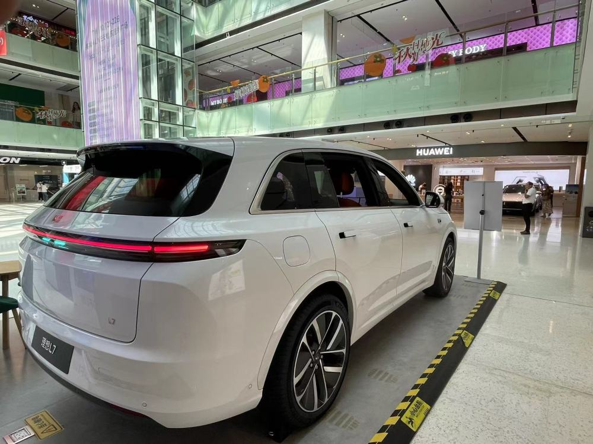

# 问界、理想终端互掐，L7“开”到华为门口，专家：两家将有更激烈一战

腾讯新闻《远光灯》特约作者 余悦

谁也猜不到，李想6月份在微博发出“问界M7直接把理想ONE打残了”的“小作文”时，到底是怎样的心态。这种针对对手指名道姓的直抒胸臆，在过去的汽车行业并不常见，也打响了增程车之战的第一枪。

问界M7和理想ONE是比较突出的两个同类项：都是增程式电动车，都是三排六座的中大型SUV，是贴身搏杀的高度竞品。按照李想口中交付的节点，从去年7月份到当年底，问界M7的确在一定程度上压制住了理想ONE。

但彼时，理想ONE已经接近生命末期。在他看来，理想的驱动力表现在成长所带来的产品驱动结果，理想ONE被打得“提前停产”，实际上是在为新车L8让路。

但他可能没预料到的是，前不久刚上市的新问界M7，带来了比老款更大的市场影响力：官方累计订单数据超过了6万辆，这已经相当于问界去年的整体销量了，也标志着华为在汽车领域的布局进入快速扩张通道。

10月25日，据“AITO汽车”官微消息，还未上市的问界M9预订已突破15000台。

理想与问界之间的增程式混动之战，才刚刚拉开序幕。业界更关注的是，问界能否成为理想杀手，在接下来的市场运作上，撬动一度在新势力车企中“遥遥领先”的理想的地盘？

“不论是技术还是产品定位，这两个车（新问界M7与理想L7）太像了，它俩的互掐只是一个开始，华为与理想在接下来的市场互相渗透中，必定会有更激烈的一战。”知名汽车评论张志勇表示。

终端互掐，理想L7“开”到了华为门口

“之前一直是关注理想L7的，看到最近新M7呼声也挺高的，就过来看看，让家人体验和比较一下。”在位于广州美林天地一楼的华为门店，前来看车的阿勇（化名）对腾讯新闻《远光灯》表示。

作为广州天河区人流比较密集的综合型商场之一，美林天地A座一楼汇聚了不少的汽车展示店，在这个华为门店周边还有特斯拉、蔚来、小鹏、魏牌、智己等品牌的车型展示区域，唯独没有理想。但就在这个周末，腾讯新闻《远光灯》留意到，华为门店正对着的区域，已见缝插针的新辟出了一块展示台，上面赫然摆放着一台理想L7展示车。

 _（理想L7展示车正对着华为门店，图片为作者拍摄）_

“这下看车和对比就更方便了。”阿勇说，“这两个车都是增程技术，理想的配置很适合家用，但听说华为的智能技术更厉害，所以还是想好好对比一下再做决定。”

在华为门店，与阿勇抱有同样心理的消费者不在少数，而理想L7与新问界M7在终端商超贴脸互掐，似乎也是理想与问界在增程式电动车这个领域掰手腕的一个缩影。过去一年多，理想依托L7、L8、L9三款中大型SUV的热销，在新势力阵营一骑绝尘，但随着新问界M7的发布，消费者的关注度和市场热度也在逐渐往华为这边倾斜，理想显然有点急了。

此前几天，坊间就流传出疑似理想员工抨击问界产品的长文，随后问界线上渠道也作出了“无惧诋毁”的官方回应，包括了华为与赛力斯合作模式、净推荐值、车内空间，5亿投入等六个角度。

无论如何，问界与理想在终端的对抗激烈程度可见一斑。伴随华为新问界M7的爆单，理想汽车的交付量也在一路狂飙。理想官方数据显示，在刚刚过去的2023年第42周（10.9-10.15），理想汽车周销量达1.05万辆。而接下来，理想将挑战月销4万辆。

“一个是擂主，一个是新跳上擂台的挑战者。新问界M7前期投入比较大，所以现在能够得到市场认可也算是正常的状态。理想之前也一直是中大型增程式SUV的销量大户，所以新M7带来的压力肯定是存在的。”全国乘用车市场信息联席会秘书长崔东树对腾讯新闻《远光灯》表示。

有未经证实的消息称，近期理想内部进行了一次为期四天的中高层闭门会议，其中一个重点议题就是理想该如何应对华为（问界）。此前，理想甚至将华为锁定为最强对手，战略竞争地位甚至超过了特斯拉和比亚迪。

这不禁让人想起李想在6月那篇微博“小作文”中透露的一个信息：去年在被问界“打残了”后，理想也在2022年9月底的雁栖湖开了一次战略会，并达成一个重要共识，“全面学习HW，学习最先进的企业，且尽快升级为矩阵型组织（人因为痛苦而改变，人因为受益而坚持，所以后面开展的大规模组织升级大家都积极配合），能够打阵地战，彻底告别游击战”。

“问界M7从去年开始就蚕食了一部分理想的份额，新M7（订单爆火）只不过是将这种竞争进一步扩大化了，或者说是把它俩之间的这种竞争摆上桌面了。”汽车行业分析师钟师对腾讯新闻《远光灯》表示。

问界理想打架，最受伤的是谁？

虽然问界M7在2022年的确给理想ONE带来了一定的市场压力，但从全年的整体销量来看，问界M7的销量相对于理想的大盘而言，依旧差距较大。

相关统计数据显示，2022年，问界整体销量为78081辆，其中72%销量来自于问界M5，问界M7年度销量仅为21226辆。而按照此前理想公布的财报数据，2022年理想全年交付量为13.32万辆，同比增长47.2%。

为了改变问界M7“存在感不强”的局面，今年问界斥资5亿元，在安全、空间设计、智能、续航等各方面对问界M7进行了全方位的升级。在智能驾驶以及智能座舱上，问界新
M7 更是新增了华为 ADS 2.0 高阶智能驾驶系统，这也让新M7这个年度小改款，看起来更像是一次车型换代。

而除开产品层面的改进，在终端销售政策层面，问界新M7也花了更多的心思。从官方定价的角度，问界新M7比起老款28.98
万元的起售价直接降了4万元，低至24.98 万元，比理想L7的31.98万元起售价更是低了7万元。这还不包括上市后，问界针对新M7额外提供的 3
万元左右礼包。

也正因于此，新问界M7上市后，其与理想L7的终端缠斗也呈愈演愈烈之势头。而在战略层面，华为智能汽车解决方案BU董事长余承东与理想汽车创始人李想的隔空喊话，也让这两个品牌之间的竞争愈发戏剧化。

“我认为2025年可能会做到100万辆，这也是自己主动给公司提的目标，希望2025年能够盈利。”余承东此前表示。而李想近期也公开表示，理想汽车需要在2025年前实现全球销量达到160万辆的目标，才能在牌桌上留下位置。

在这样的战略交锋之下，双方也在快速部署各自的产品“弹药库”。今年底，华为和奇瑞合作的轿车智界S7、以及问界旗舰SUV
M9都将正式推出，后续产品规划中，与江淮合作的一款百万级MPV以及与北汽合作的新车型也即将出炉。而理想这一边，除开年底的旗舰MPV
MEGA，还有一款50万元级别的旗舰MPV也在酝酿之中。

可以预见的是，在今年底以及后续两年，华为与理想还会在更多的产品和细分市场上“短兵相接”。而不论是产品布局，抑或终端销售政策，还是双方在技术层面的革新、产能方面的拓展和调控，都会对各自未来的发展产生深远的影响。

“现在市场的整体消费能力并不强，大家都是在有限的存量里面抢用户，又都在走高端化，所以问界对原属理想市场的渗透是肯定的。”崔东树表示，“但它们两个一打架，增程式电动车市场以及这两个品牌的热度就都起来了，反而很大的提升了这个领域的热度，挤压了插电式混动车等其他细分领域的市场。”

在崔东树看来，问界与理想的互掐在一定程度上吸引了市场热度，将更多用户的目光都吸引过来了。“接下来的一段时间可能会形成的局面是，新能源汽车市场的聚光灯下，就问界和理想两个主角，它俩看似打的不可开交，实际上有点携手言欢的意思。”

