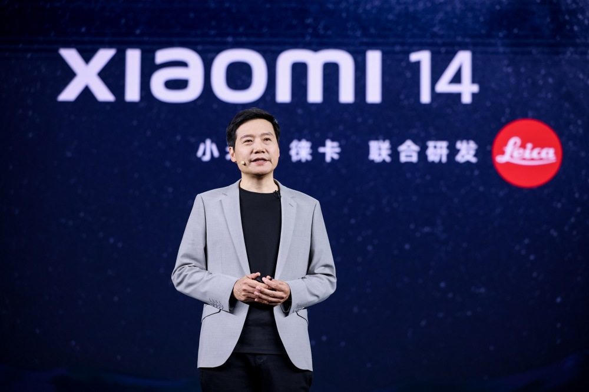
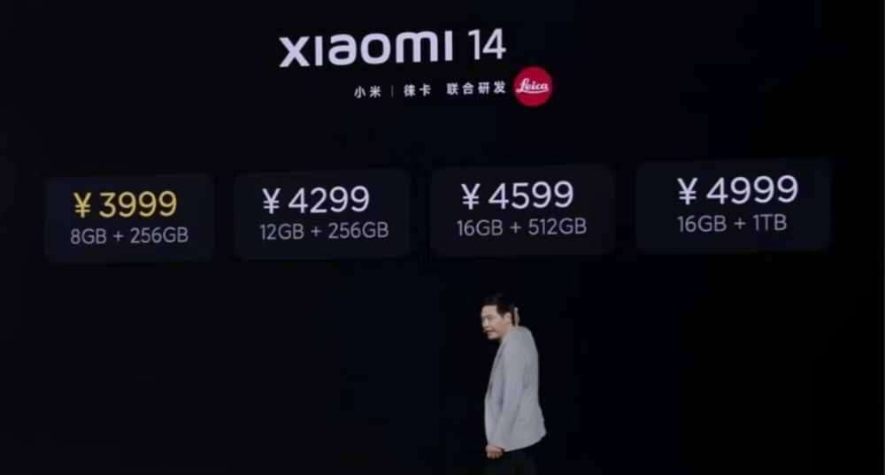

# 雷军：小米14正式发布，售价3999元起

腾讯科技讯 10月26日消息，小米董事长兼CEO雷军宣布小米14系列正式发布，售价3999元起。

核心硬件配置方面，小米14搭载第三代骁龙8移动平台，配备6.36英寸1.5K超视感屏，徕卡光学Summilux镜头，定制光影猎人900影像传感器。

小米14还拥有4610mAh电池，支持90W有线快充。有黑色、白色、岩石青、雪山粉四种颜色可供选择。

