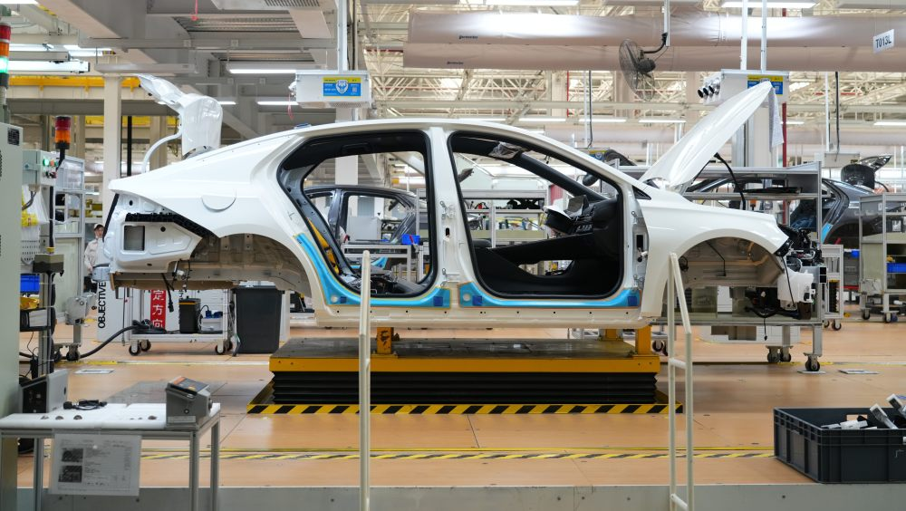
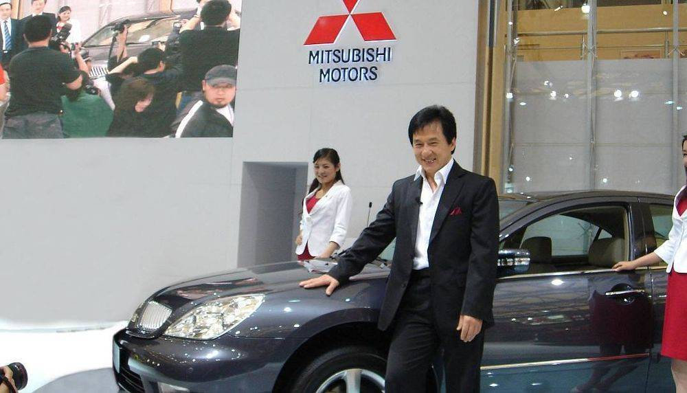
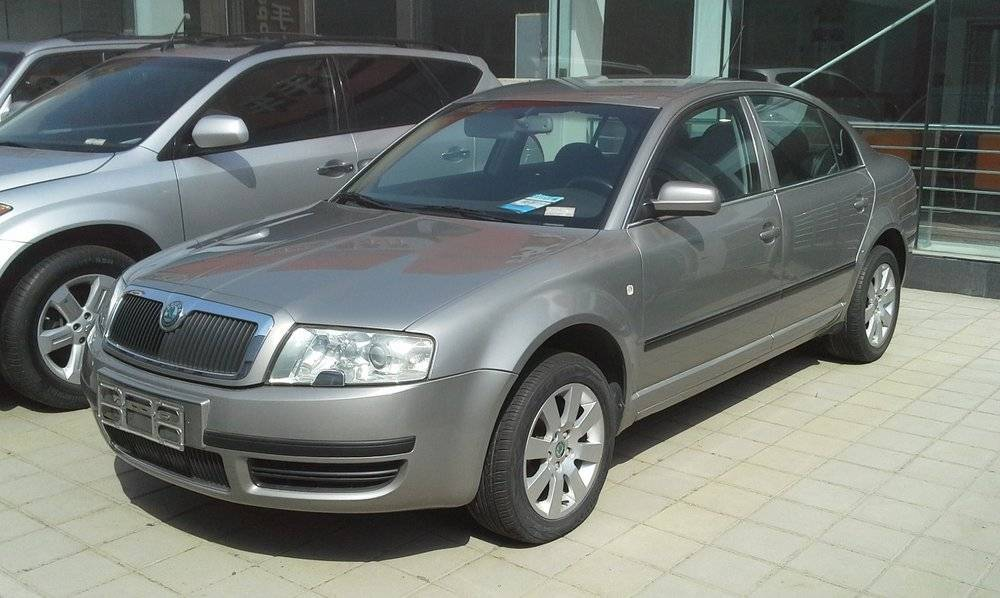
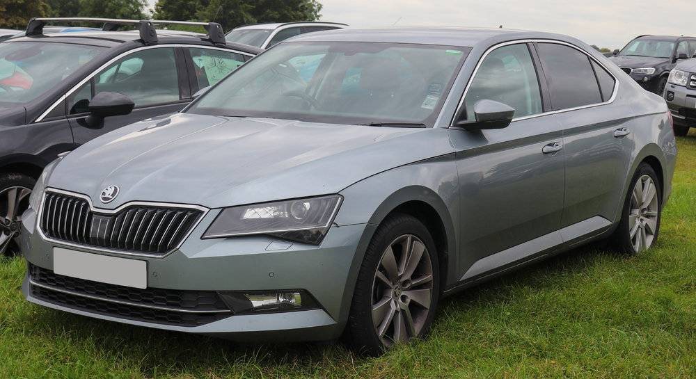
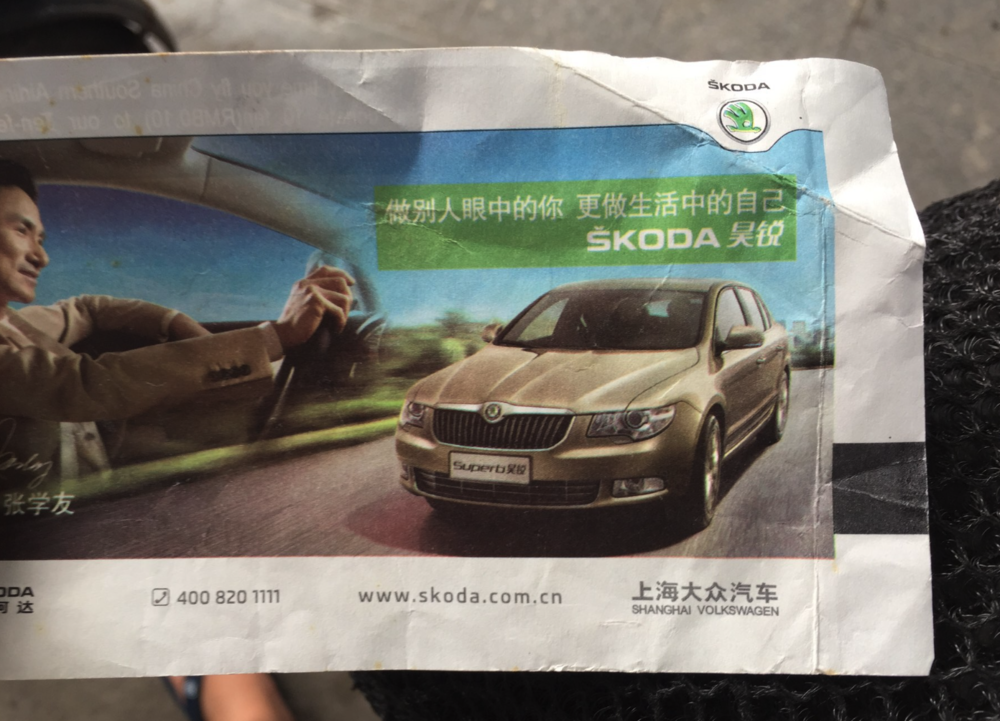
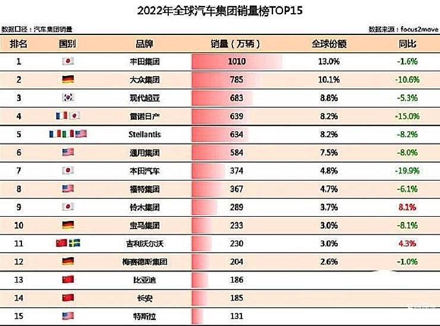
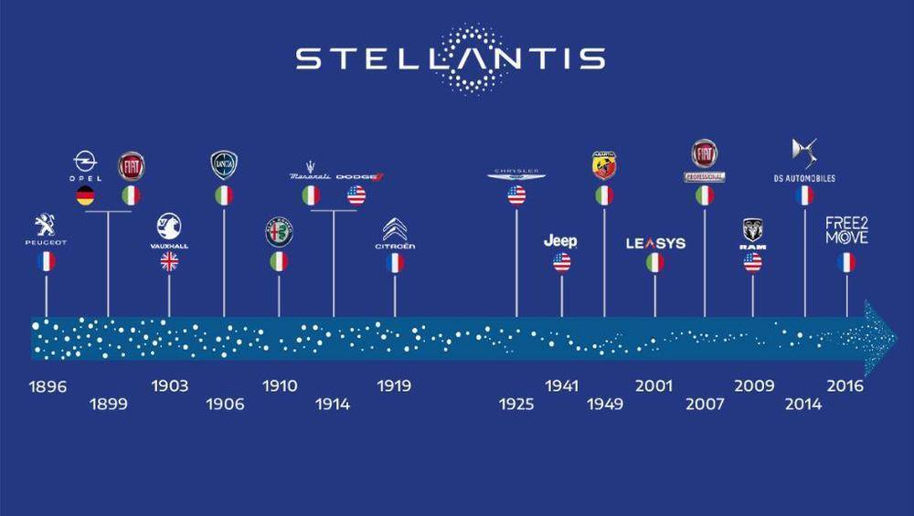
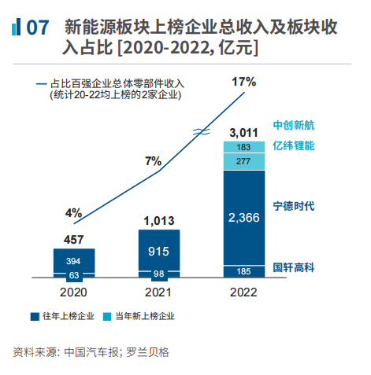
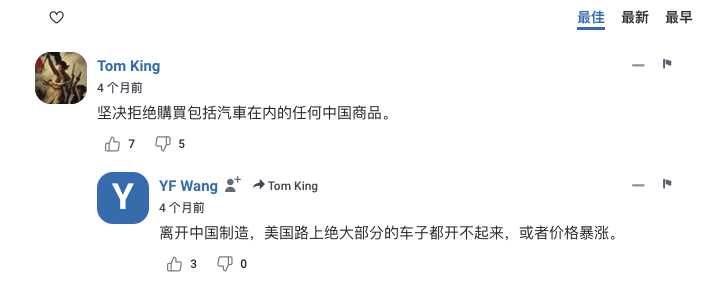
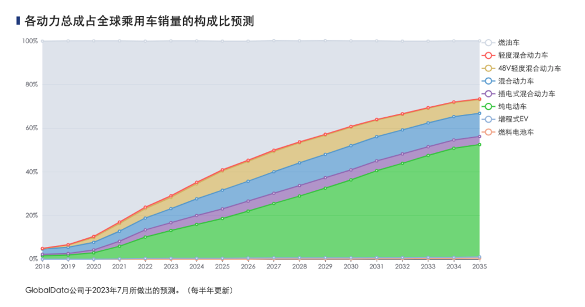

# 一退出中国，跨国车企就支棱起来了？新能源车时代他们绕不开中国车企

出品｜虎嗅汽车组

作者｜李文博

编辑｜周到

头图｜视觉中国

“曾经30万排队买，如今10万无人问。”

这，就是广汽三菱——这家成立于2012年的跨国合资汽车公司在中国划下的命运弧线。

10月24日，这条弧线终于轰然坠地：广汽集团分别以1元对价受让三菱自动车工业株式会社、三菱商事株式会社持有的广汽三菱30%、20%股权，受让完成后，广汽三菱将成为广汽集团全资子公司。

这意味着，继铃木、讴歌之后， **又一日系合资品牌，从中国汽车牌桌上，黯淡离场。**

与两位先烈一样，三菱也在中国市场创造过属于自己的“巅峰时刻”：2017年到2019年间，广汽三菱的年销量分别为11.73万台、14.4万台和13.3万台。这样的成绩，对一家只生产SUV的中等规模汽车制造商来说，已经是爆表级的表现了。

不过，从2020年开始，广汽三菱就进入了下行通道，过去三年在中国的销量分别只有：7.5万台、6.6万台、3.36万台。今年上半年，只卖掉了1.2万台。

与中国市场惨烈表现形成鲜明对比的是，三菱在亚洲、欧洲以及北美市场，都实现了产量增长：在除中国之外的亚洲地区，三菱2022年产量为101万台；在全球范围内，三菱2022年的出口总量为35万台。两者加起来，三菱去年的全球总产量近140万台。

单从数据维度看，退出中国市场，对三菱来说，是一件大幸事： **今后再也不用为了这点醋，专门包顿饺子了。**

和三菱不想专门给中国市场包饺子的，还有总部位于捷克，世界上历史最悠久的四家汽车品牌之一的斯柯达。

2005年，斯柯达进入中国。2007年，推出第一款国产车型明锐（Octavia）。半年不到，这部起售价要12.49万的紧凑型轿车，就卖出去3.18万台。要知道，当年中国城镇居民的人均可支配收入只有1.38万元。

**要买一台最便宜的明锐，一个单身汉少说也得9个月不吃不喝不消费。**

那个年代开一台明锐，虽然算不上正儿八经的“有钱人”，但“混得不错”，绝对是没跑了。

明锐让斯柯达见识到了中国人在汽车上惊人的消费能力。很快，它们就把更贵更大的中级轿车昊锐（Superb，之后的速派）搬进国内。不错的产品力，合理的定价策略，再加上张学友的号召力，让斯柯达一时间风头无两。

2013年，第一百万台国产斯柯达下线。从2016年到2018年，斯柯达连续三年在中国卖出超过30万台新车。体量上的急速膨胀，让斯柯达一边忙着数钱，一边忙着进一步夯实“大众平替”的公众形象。

但谁也没有想到的是，斯柯达的好日子，很快就到头了。

从2019年开始，斯柯达受中国人欢迎的程度，开始进入断崖式下降期。2022年，斯柯达在中国只卖出去4.46万台，是2018年销量的13%。中国也从斯柯达全球最大的单一市场，跌至第六。

面对颓势，斯柯达CEO Klaus Zellmer坐不住了，他表示，中国市场竞争太激烈了，我们将与中国合资伙伴一起考虑，只在中国销售汽车，而不生产汽车。

翻译成人话就是： **以前，斯柯达在中国，是大众的“平替”。现在，大众本身就是“平替”，谁会去多瞧一眼“平替的平替”呢？**

像三菱和斯柯达这样，在中国市场，从顶峰跌落谷底的跨国汽车品牌，还有很多：雷诺、铃木、讴歌、马自达、DS、Jeep、菲亚特、现代、起亚等。

据不完全统计，2018年至2022年的五年时间里，已有6家跨国汽车公司，彻底退出中国市场。剩下没退出的弱势车企，要么半死不活，要么魂不守舍。

赫赫有名的跨国汽车公司，密集地从中国卷铺盖离场，不免让人产生一种感觉：

**它们，是不是真的快关门了？**

其实过得挺滋润

事实上，对跨国汽车品牌来说，无论是已经退出中国，还是在中国苟延残喘，确实是正在经历着的重伤。但这道伤口，不会像许多中国人想象的那样，让这些跨国汽车公司，瞬间毙命。

因为，这些品牌的车， **中国人不喜欢，有人喜欢。**

以斯柯达为例，去年全球市场的销量是73.13万台，相比历史销量巅峰的125.37万台，属实跌掉了50万台。

但一年能卖出去70多万台的汽车公司，怎么样都跟“倒闭”挂不上钩。如果这个销售体量都无法继续生存，那一年连20万台都卖不掉的中国造车新势力，理应吃不上今年圣诞节的火鸡。

对斯柯达来说，印度就是下一个中国：2022年，印度为斯柯达贡献了5.19万台新车销量，仅次于德国和捷克，是全球第三大市场。而斯柯达也将印度升级为推进国际化战略的重要市场。

再比如“小车之王”日本铃木，2018年离开中国市场后，不仅没颓废，反而风生水起：去年全年累计销量为296.9万台，以3.7%的成绩稳居2022年全球汽车市场份额前十。在印度，铃木是当仁不让的神车，一年可以卖掉160多万台，占当地市场份额的约50%。

**这意味着，在印度街面上，每两台新车中，就有一台是铃木。**

都快从中国人记忆中消退完毕的法国雷诺，在全球市场，存在感依然很强：2022年，在没有俄罗斯市场支撑的情况下，卖掉了146.67万台新车。其中有23万台是新能源车，在欧洲市场，雷诺新能源车的畅销程度，仅次于丰田和特斯拉。

今年上半年，雷诺的全球销量为77.2万台，重回欧洲第二大汽车品牌宝座。

而且，这些在中国人眼中，“快完蛋”的跨国车企，挣起全世界人民的钱来，是一点也不手软。

2022年，雷诺集团累计收入417亿欧元，营业利润率5.6%，比2021年的2.8%翻了一倍。铃木净销售额357亿美元，比2021年多了40亿美元。

如果将视野拓展到丰田、本田、大众、通用、福特这些在中国市场愈发萎靡的品牌的全球表现上时，会发现它们 **在中国市场失掉的血，早就通过其它市场补回来了。**

以今年上半年的情况为例：丰田还是全球最畅销的汽车品牌，541万台的总成绩，甩开第二名的大众近100万台的差距。现代起亚、雷诺-日产-
三菱、Stellantis、通用集团、福特、本田、铃木分列三到九，比亚迪以126万台的成绩，首次进入“全球前十大车企”序列，距离丰田的差距是415万台。

没太把中国市场当回事，似乎并不影响日、德、美、法汽车公司们，把自家小日子过得像以前一样热气腾腾。

基于这样的背景，一个疑惑旋即升起： **中国在跨国车企的全球战略中，还有多少权重？**

**不是不报，时候未到**

从赚进口袋里的钱这个角度看，失去中国市场这碗饭，跨国车企根本不会饿死，反而越吃越胖。

比如在中国只能当背景板的Stellantis集团，上半年就实现了984亿欧元的净营收和109亿欧元的净利润，超越大众和丰田，是全球最赚钱的汽车公司。

对Stellantis集团来说，中国不过就是一个市场，既不是重要市场，更不是唯一市场。

当然，Stellantis集团本就是个例，不具备普世性。对丰田、大众、本田、通用这样进入中国许久、仰仗中国多年的跨国车企来说，中国依然是极具吸引力的关键市场，唯一的差别是，核心程度没有之前那么高了。

因为，跨国车企在技术全面落后中国品牌的情况下，完全吃不到中国汽车新能源转型的红利，只能一边继续在传统燃油车的盘子里刨食，一边耐心等待翻盘的机会。

短期看，新能源车抢走的份额，不会动摇跨国车企的基盘，这对应了他们当下新能源转型迟缓的实际表现：

**既然不怎么影响赚钱，干嘛自找苦吃。**

可一旦把时间拉长，跨国车企就会发现，自己马上就要经历中国车企过去二十年，在中国市场遭受的待遇：

**被反向合资，按头输出。**

我们知道，燃油车时代，中国的策略是“市场换技术”，希望跨国车企在挣钱的同时，能同步拉升中国整体汽车产业的技术水平。可惜的是，大市场给出去了，换回来的核心技术，却少得可怜。

但新能源车时代，跨国车企在燃油车领域挖下的技术护城河，基本就是个摆设，不具备任何实际防御能力。想赶上进度，必须拿全球市场，换中国技术。

你会看到，为了保留最后的尊严与体面，传统汽车强国可谓“花招”百出：

欧盟正式对中国制造的电动汽车发起反补贴调查。其实在调查前，欧盟先后出台了《净零工业法案》《关键原材料法案》《新电池法》《外国补贴条例》以及碳边境调节机制等，且等着中国车企进套收网。

法国欧洲事务部长布恩曾公开表态，“我们绝不允许电动车的过度补贴冲击我们的市场，威胁到我们的企业，就像太阳能板行业那样。”

法国财政暨经济部长勒麦尔更是公开表态，对冯德莱恩就中国企业受益的补贴发起调查表示欢迎。

美国则在8月16日正式通过了《降低通货膨胀法案》，要求2023年，电动汽车电池中至少有50%的部件来自北美才能获得税收抵免。到2028年后，这一比例将上升到100%。

很明显，这是在针对电动汽车零部件和关键材料的全球最大生产国——中国。

正如上海梅努托咨询公司汽车分析师冯世明所言，对汽车制造商的补贴大多数条款都规定了新能源汽车的组装地点，但在全球范围内，将电池矿物和电池单元的加工地点也包括在内的情况
**很少见。**

这些招数一定程度上，的确能有效延缓中国车企靠技术武器，打到百年汽车工业强国家门口的速度。但无法改变的是，跨国车企，倘若还想在中国继续卖车，
**就必须加大与中国本土公司在新能源车领域的合作力度的事实。**

因为在智能新能源汽车的关键零件领域，比如电池、电子电气架构、智能驾驶、智能座舱、智驾芯片、激光雷达等，都是中国企业率先实现了技术突破、产品量产和规模降本。比如大家熟知的“宁王”宁德时代，做边缘人工智能芯片的地平线，搞激光雷达研发与制造的禾赛科技等。

所以你会看到，丰田找了小马智行；大众先找了地平线，又拉来小鹏；Stellantis掏出15亿欧元入股零跑，成为战略股东；奥迪曾传出求助比亚迪，不过最终还是找了智己。

跨国车企过去习惯的“外资主导产品规划、技术研发，中方负责生产制造及营销、渠道”的合资1.0模式，正在逐步转向“中方主导产品定义及智能电动相关技术，外方提供品牌造型、机械硬件开发”的合资2.0模式。

这代表着， **跨国车企的角色，正从技术的主动输出方，转换为被动接收方。**

厘清了角色的互换，“中国在跨国车企的全球战略中，还有多少权重”这个问题就很容易回答了：

在销量层面，跨国车企可以依靠其它国家市场燃油车销量的增长，一定程度上弥补中国市场燃油车销量的萎缩。

但在技术层面，尤其是锚定未来的新能源技术方面，跨国车企现阶段可选的学习与合作对象，绕不开中国车企。

就我看来，与其日后被中国车企用巨炮轰开大门，跨国车企还不如早点放下傲慢，主动示好，找条活路。

**写在最后**

随着中国市场新能源车渗透率的快速增长，那些没赶上趟的跨国车企，被中国车企赶下正面竞争的舞台，只是时间问题。

退出中国，对这些拥有全球市场广泛布局的跨国车企来说，的确是伤了筋动了骨。可大家距离关门倒闭，还很遥远。毕竟，从其它市场拆下来的西墙，是可以补上中国市场这面东墙的。

但，当跨国车企的新能源造车技术，大部分都来自中国车企的反向输出时，他们想离开中国，就没那么容易了。

因为，那时的跨国车企会发现，技术的东墙和西墙都倒了， **自己手里，竟然连一块完整的砖，都没有。**

