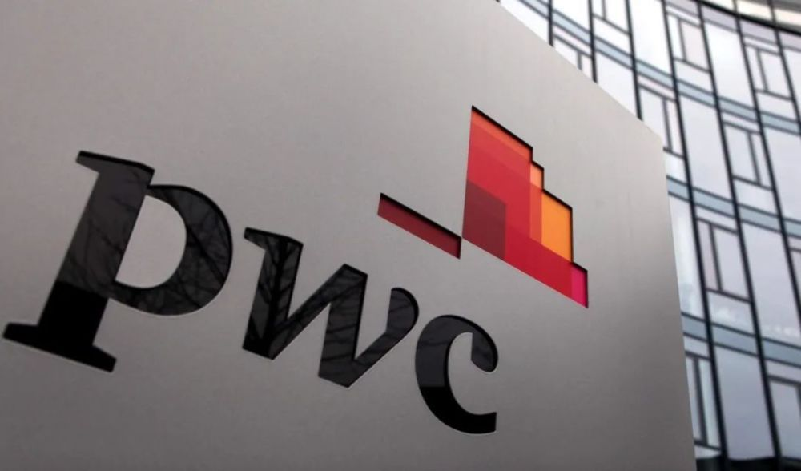
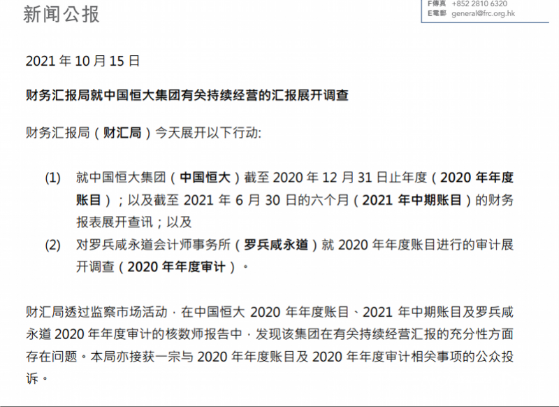
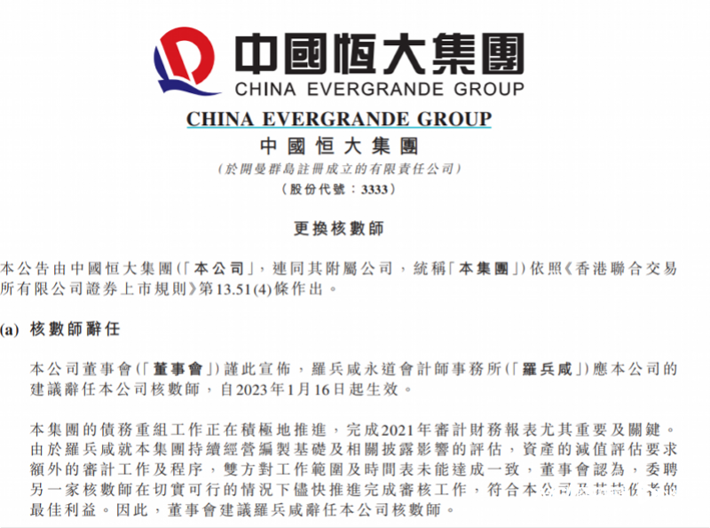
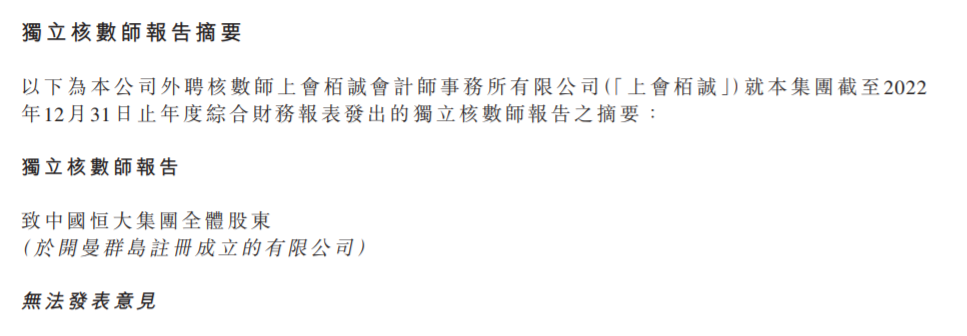
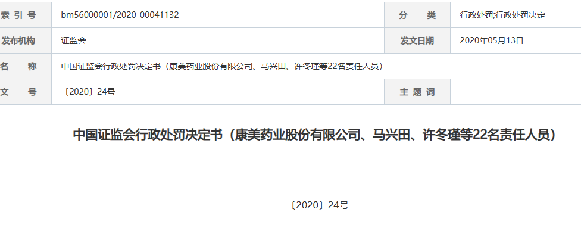

# 为中国恒大出具无保留意见的背后，普华永道审计失灵了吗？

**本文自南都·湾财社。**

采写 | 南都·湾财社记者 王玉凤

一则公告，令身为全球四大会计师事务所之一的普华永道再度陷入了舆论的旋涡。

近日，中国恒大在港交所公告称，公司执行董事及董事会主席许家印因涉嫌违法犯罪，已被依法采取强制措施。

虽然今年年初，普华永道与恒大的合作就已走到了尽头，但此前普华永道作为后者的审计机构为其提供服务长达14年之久，在恒大被香港监管机构调查之前却一直出具无保留意见的审计报告。这一点，广为投资者诟病。

那么，恒大事件中，普华永道究竟是否应该担责？南都湾财社记者采访中，法律和审计界资深人士大多认为，是否勤勉尽责是中介机构责任认定的核心，但大型房地产集团业务类型多样，情况颇为复杂，“审计没有想象的那么简单”，普华永道是否担责最终要看相关机构的调查结果。10月23日，湾财社记者就此事采访普华永道相关人士，截至发稿前尚未收到回复。

**继任者揭开了财务黑匣子**

2021年10月，香港财务汇报局（下称“财汇局”）公告，就中国恒大2020年年度账目、2021年中期账目的财务报表展开查讯，对罗兵咸永道会计师事务所（即普华永道）为中国恒大出具的2020年年度账目进行的审计展开调查。

普华永道与恒大合作已久。2009年，中国恒大赴港上市时，普华永道便是其合作会计所，此后多年，中国恒大的审计报告均由普华永道出具。

关于调查原因，香港财汇局称，“透过监察市场活动，在中国恒大 2020 年年度账目、2021 年中期账目及罗兵咸永道 2020
年年度审计的核数师报告（即审计报告）中，发现该集团在有关持续经营汇报的充分性方面存在问题。本局亦接获一宗与2020 年年度账目及2020
年年度审计相关事项的公众投诉。”

实际上，早在2020年，中国恒大的资金链就已十分紧张。根据香港财汇局公布的数据，截至 2020 年 12 月 31 日，中国恒大所报告的现金及现金等价物为
1,590 亿元（人民币，下同），但未涵盖其流动负债 15,070 亿元，于 2022 年到期的借款达 1,670 亿元。在 2020
年年度账目中，中国恒大也未就实施缓解计划的影响之前或之后是否会出现持续经营的重大不确定性作出明确声明。

与此同时，关于恒大的危机也早有公开报道。2020年8月，为控制房企有息债务的增长，监管机构针对房地产企业设置了“三道红线”：剔除预收款后的资产负债率大于70%、净负债率大于100%、现金短债比小于1倍。彼时，有多家媒体报道，恒大三条红线全部踩中。

2022年8月，香港财汇局再次宣布，已展开就恒大物业2020年年度账目和截至2021年6月30日止六个月的财务报表的查讯，以及罗兵咸永道对恒大物业2020年年度账目进行的审计的调查。同时，宣布扩大了针对上述“中国恒大2020年年度账目、2021年中期账目的财务报表，对罗兵咸永道为中国恒大出具的2020年年度账目进行的审计”的调查范围。

约5个月后，中国恒大的一则公告，宣告了普华永道的离开。2023年1月，该司公告称，罗兵咸永道应本公司的建议辞任本公司核数师，自2023年1月16日起生效，同时委任上会栢诚会计师事务所有限公司（下称“上会栢诚”）为本公司新核数师，以填补罗兵咸辞任后之临时空缺，任期直至本公司下届股东周年大会结束为止。

上会栢诚为上会会计师事务所（特殊普通合伙）于香港的成员所。它的到来，揭开了恒大财务危机的黑匣子。

2023年8月，中国恒大修订后的2021年年报、2022年年报得以公布，上会栢诚出具了无法发表意见的报告。尽管上会栢诚表示由于中国恒大人员流失导致他们在获取期初结余相关的完整及适时数据和记录方面遇到困难，但其公布的财务数据已足以令外界咋舌。

财报显示，中国恒大2021年的净亏损高达6,862亿元，净负债及净流动负债分别约 4,731亿元及
6,273亿元。加上中国恒大因各种原因涉及多起诉讼和仲裁案件，综合多种情况之下，上会栢诚表示，中国恒大在持续经营的能力上可能存在重大不确定因素，可能无法在正常业务过程中变现其资产和清偿其负债。

**为何出具 “无保留意见”报告**

在普华永道站上风口浪尖之际，很多投资者也好奇，审计机构具体是审核什么？如何审核的？

上海交通大学教授、会计审计行业研究团队负责人夏立军教授对南都湾财社记者表示，无论是A股还是其他市场，对上市公司年报通常都有强制审计的要求。但年报审计不是指对年度报告里所有内容的审计，而是对年报里的财务报告进行审计，对非财务信息并不进行审计。

那么，具体是审计财务报告的什么内容？夏立军解释：“主要是看报表和附注，是否按照会计准则要求，真实公允地反映了上市公司的年度财务状况、经营成果与现金流量。”

值得注意的是，审计机构开展审计工作时，需要遵循审计准则，也就是按照审计准则的要求，对被审计对象的财务报告是否符合会计准则进行审计鉴证，在此基础上出具审计报告。

那么，哪些情况下，审计机构会对上市公司的财务报告出具非“无保留意见”的审计报告，也就是通常说的非标准审计意见呢？

夏立军介绍：“由于上市公司拿到非标准审计意见会带来一系列后果，大部分情况下上市公司都会按照审计师的意见对公开披露前的财报中错报进行会计调整，最终获得标准的无保留审计意见。但是有一种情况是，上市公司如果持续经营能力存在重大不确定性，审计师也需要出具非标准审计意见。在很多市场，上市公司拿到的非标准意见报告均和持续经营有关，这一般意味着审计机构有充分证据表明企业的持续经营存在重大风险。比如说，审计机构在审计ST公司时，如果发现企业的主营业务不能正常开展，出现了严重亏损，资不抵债，或者资产被冻结，等等，那么这些证据和信号就提醒审计机构企业的持续经营可能出现了重大问题。”

也就是说，如果普华永道认为恒大在持续经营上存在重大风险，那么应该在审计报告中出具非标准意见的报告，及时对公众警示风险。这也通常是投资者对审计机构寄予的希望所在。

但普华永道在为中国恒大出具的2020年度审计报告中发表了无保留意见，并未提及该司持续经营的重大不确定性。这令投资者疑窦丛生：普华永道是否故意对风险视而不见？

“没这么简单！”夏立军解释，审计师开展工作时所有职业行为都需要遵守审计准则，以此来判断企业持续经营是否有重大风险。审计准则里，包含了评估持续经营重大风险的基本原则和指南。审计师的责任是，就被审计单位管理层在编制财务报告时运用持续经营假设的适当性获取充分、适当的审计证据并得出结论，在此基础上就被审计单位持续经营能力是否存在重大不确定性得出结论，出具相应类型的审计意见。

夏立军表示，审计机构需要关注被审计的上市公司的经营风险，对上市公司的持续经营能力保持警觉。如果财务报告按照持续经营假设编制，但审计师根据审计准则的要求判断公司管理层在财务报告中运用持续经营假设是不适当的，审计师应当出具否定意见的审计报告。

他补充道，如果判断公司管理层运用持续经营假设是适当的，但存在重大不确定性，且财务报告对重大不确定性已作充分披露，审计师应当发表无保留意见，并在审计报告中增加以“与持续经营相关的重大不确定性”为标题的单独部分以警示财务报告使用者。如果判断公司管理层运用持续经营假设是适当的，但存在重大不确定性，且财务报告对重大不确定性未作出充分披露，审计师应当按照审计准则要求恰当发表保留意见或否定意见。

**担责与否，主要看是否勤勉尽责？**

那么，在恒大事件中，普华永道究竟应不应该承担责任？如果需要，又该承担什么样的责任？

安然事件，是投资者屡次拿出来对比的一个案例：2001年，当时美国最大的能源公司安然宣告破产，成为美国当时所谓的“史上最大破产案”。破产前，安然公司承认做了假账，虚报数字令人瞠目结舌。

与此同时，曾是全球五大会计师事务所之一的安达信因帮助安然公司造假，被判处妨碍司法罪后终至倒闭，全球五大会计师事务所也由此变成“四大”。

中国证券法学研究会副会长、浙江大学经济法教授博导李有星对南都湾财社记者表示，从法律层面来说，会计师事务所是否需要担责分两种情况，一是审计结果是否符合企业真实情况，比如说营收、成本、利润、负债等数据是否真实；二是，审计是否勤勉尽责，是否按照审计相关的规范、程序和职业操守履行职责，从而导致应该发现的公司财务造假和虚假陈述未被发现。

“如果是第二种情况，又分为两个类型：一是审计机构故意为之，与企业联手作案，那么按照上市地相关的规定应该承担相应的责任；二是公司财务造假，作案手段隐蔽，虽然审计机构已经勤勉尽责，但未能发现，也可以不承担责任。”
李有星补充道，中国恒大账目本身的真实程度和普华永道审计核查的履职程度，是界定普华永道法律责任的关键。

在接受南都湾财社记者采访时，上海明伦律师事务所律师王智斌也认为，对资本市场中介机构职责认定的核心就是是否勤勉尽责。“如果勤勉尽责了，但未能发现造假，出具的是无保留意见报告，那么可以不担责；但如果未勤勉尽责，就需要担责。后者也分故意还是过失，这两种情况承担的法律责任也不相同。”

那么，如何界定勤勉尽责？王智斌解释：“要看财务造假里的具体情节。假如说，企业的合同是虚假的，但审计机构没有认真核实，没有调查是否有真实的发货单之类的细节。如果是这种明显的瑕疵，当然就是未勤勉尽责。但如果企业是深层次的舞弊，那么审计机构可能就很难发现。”

关于可能存在的财务舞弊，湾财社记者注意到，不少人认为，房地产公司如果造假，不难被审计机构发现，因为在建楼盘多少，贷款多少，交付了多少，完工了多少，这些数据都是可查的。

夏立军认为，这种说法过于笼统，房地产企业涉及到的项目很多。如果造假，要看在哪些会计科目上造假，不同会计科目的造假难度是不一样的，尤其是大型房地产公司流程多、环节多，实际情况很复杂。

“比如说，商品楼销售涉及到营收，这个看起来容易审计和核算，因为最终购房者交了多少钱，每一套房子多少价格，一栋楼多少套房子等，都很清晰。但是收入确认的时点和稳健程度，比如是在竣工时、交房时，还是签订销售合同、预先收到购房款时确认收入，存在调节空间，企业也可能通过构造交易安排调整这些关键时间节点来调节收入。在成本的结算上，则涉及到材料、人工、机器设备的折旧费等，建筑工程施工成本、完工成本核算也很复杂，并且还有大量预计售后费用等等。在存货的跌价损失计提上，则涉及到对在建、在售商品房的跌价风险的估计和判断，这在房地产价格存在下行风险时也很复杂。此外，房地产企业还可能涉及大量复杂的投融资和交易安排。因此有些环节造假或调节就很难发现或判断，房地产企业的审计并没有我们想得那么简单。”
夏立军说。

**究竟是否担责？**

一直以来，作为全球四大会计师事务所之一，普华永道的专业能力受到广泛的认可。从正常逻辑出发，对于一家审计机构而言，无论是因为职业操守还是法律风险，审计人员自然希望如实揭示企业重要错报或持续经营能力问题，但有时可能不得不在勤勉尽责上打个折扣，以在降低审计风险与满足企业需求之间寻找平衡。这也是众多投资者担心的一个焦点。

那么，未勤勉尽责的后果如何？夏立军解释：“未勤勉尽责可以分成故意造假、重大过失和一般过失。其中，故意造假是指与企业串通或者明知企业财务舞弊不予以揭示，这种情形最严重，审计机构和审计师个人一般要承担行政责任和民事责任，比如说罚款和赔钱，严重时甚至审计师个人要承担刑事责任，但实践中刑事责任相对少见；重大过失是指审计机构未能遵循审计准则发现并揭示被审计单位财务报告中的重大错报，且情节严重；一般过失是指审计机构未能按照审计准则要求开展审计工作并发表恰当审计意见，但情节较轻。”

在A股，2020年新《证券法》加大了对证券违法行为的处罚力度，上市公司高管和中介机构的罚款额度大幅提高。

以曾经震动A股资本市场的康美药业案为例：2021年，康美药业原董事长马兴田因操纵证券市场罪、违规披露、不披露重要信息罪以及单位行贿罪数罪并罚，被判处有期徒刑12年，并处罚金人民币120万元；康美药业原副董事长、常务副总经理许冬瑾及其他责任人员11人，因参与相关证券犯罪被分别判处有期徒刑并处罚金。

而因在康美药业审计业务中涉嫌违反相关法律法规，广东正中珠江会计师事务所被证监会责令改正，并遭罚没5700万元。又被卷入康美药业证券集体诉讼，一审判决康美药业作为上市公司承担24.59亿元的赔偿责任，正中珠江承担100%的连带赔偿责任。

回归到恒大事件本身，从更清晰的脉络来看，王智斌认为，恒大年报存在虚假记载是审计机构承担责任的前提，在此前提下，普华永道是否担责以及承担什么样的责任，大致可以分为以下几种情形:

一是，审计机构未尽审慎核查的义务，导致理应能发现问题被忽略，此种情况下一般会判定为过失，并可能涉及民事赔偿。

二是，如果普华永道配合企业造假，那么将承担连带赔偿责任，甚至可能涉及刑事处罚。

三是，审计机构已尽了符合行业标准的审慎核查义务，但仍未能发现管理层的舞弊行为，此时，即便年报存在虚假记载，审计机构也未必需要承担民事赔偿责任。

当然，普华永道在恒大事件中是否需要承担责任，以及承担何种责任，最终结果有待监管机构按照有关法律和审计准则标准调查定论。

