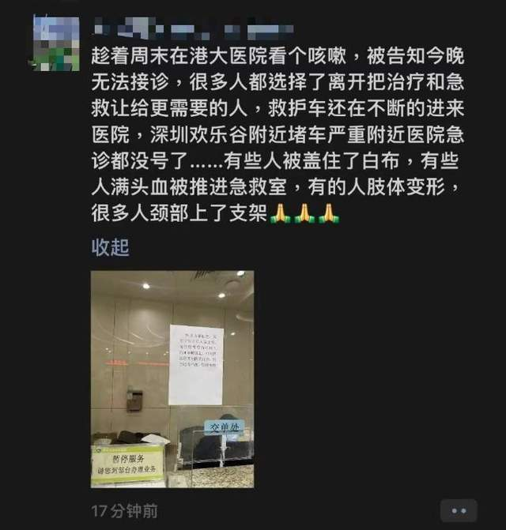
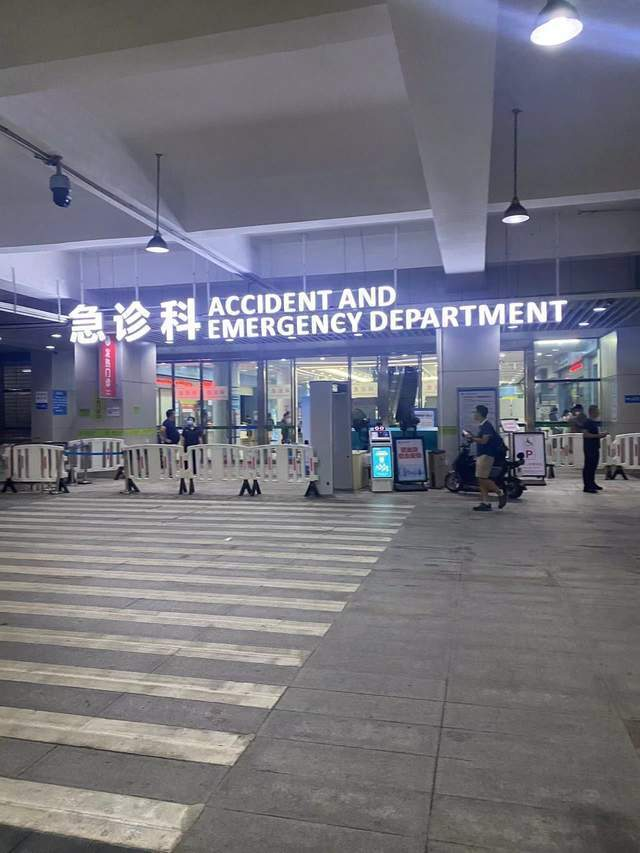

# 突发！港大医院急诊贴公告，称过山车追尾

10月27日晚，据微博网传，港大医院急诊告急，贴出公告称因深圳欢乐谷大型游乐设施过山车出现“追尾”，所以急诊室有多人在抢救。

22时35分左右，读特记者赶到港大医院，经和医院方核实确认确有此事。

_读特记者 严偲偲摄_

有网友发朋友圈描述具体现场事故发生的过程，称有人好像因为事故“失去意识”。

有网友表示，自己就是伤员之一，“撞头了有点皮外伤”“后两排比较严重”。

22时10分，记者试图拨打欢乐谷官方电话求证，未接通。读特记者正在了解最新情况，将持续更新。

来源：深圳特区报

