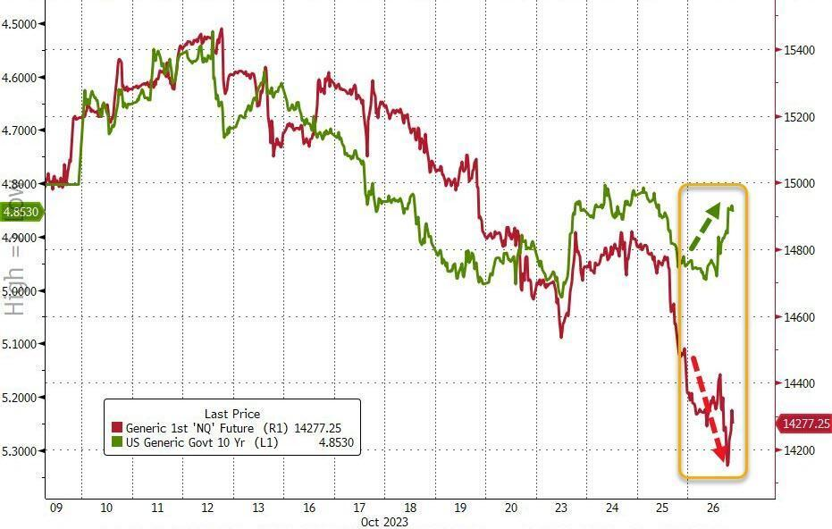
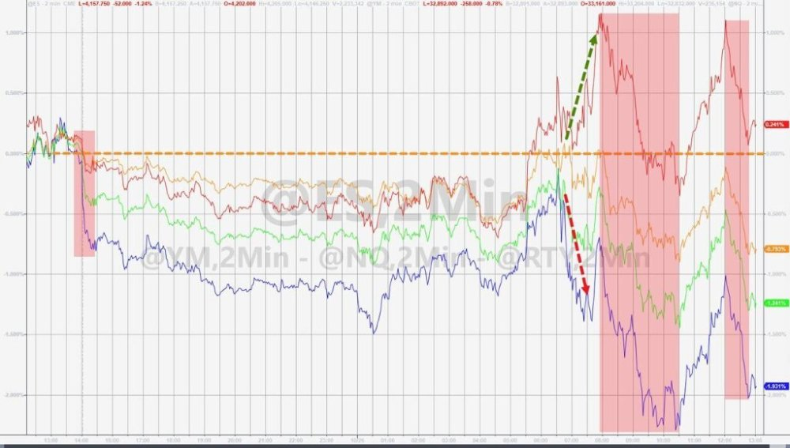
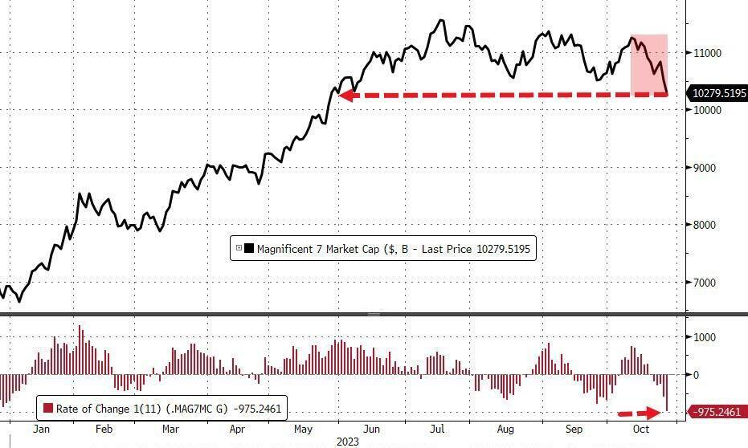
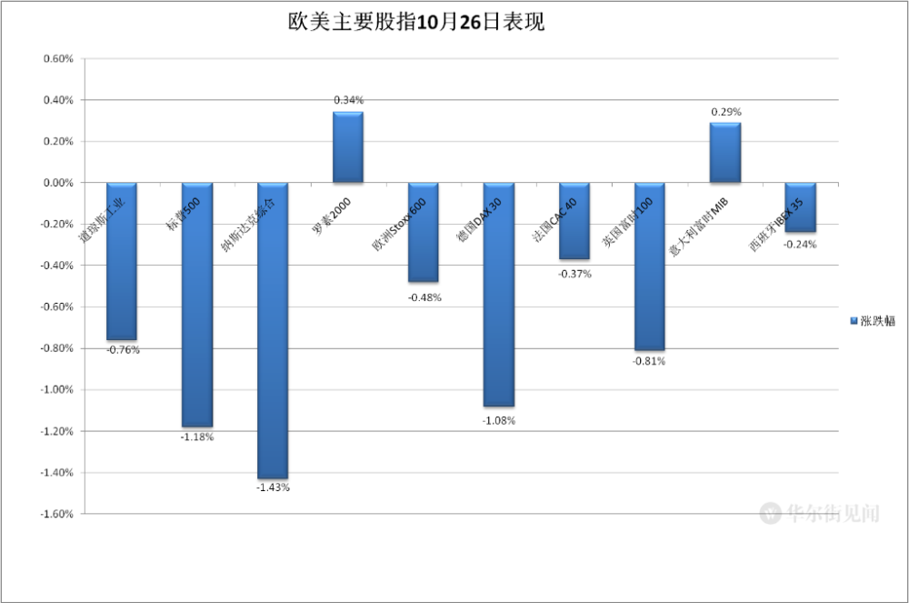
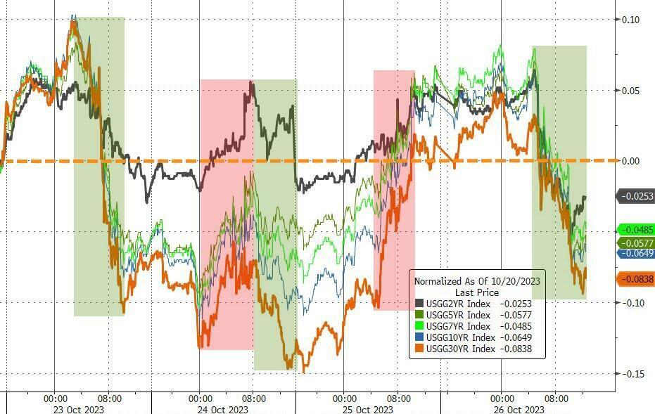
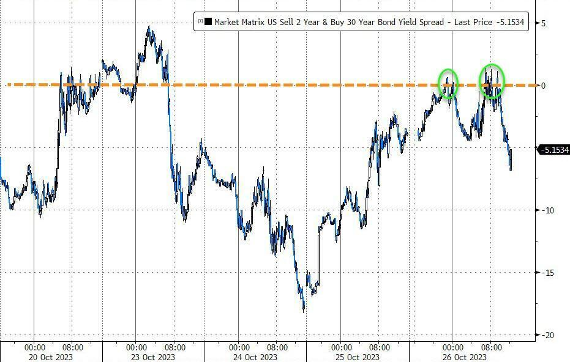
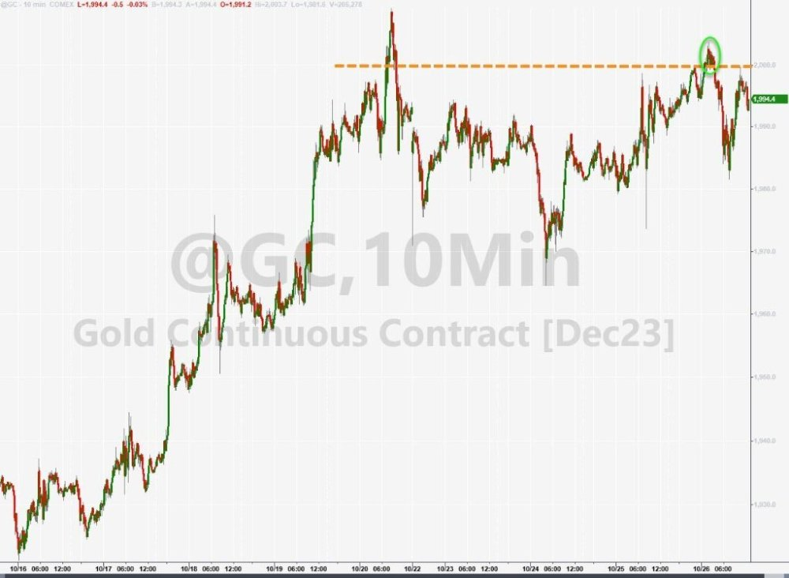

# 美债盘中跳涨，Meta施压，纳指连日盘中跌超2%，中概逆市反弹

继云业务收入超预期放缓的谷歌母公司后，行业龙头企业继续打击美股。警告核心业务广告易受宏观经济冲击的科技巨头Meta一度跌近7%。被视为经济晴雨表的快递巨头UPS不到三个月二度下调全年利润指引，体现新的劳资合同在美国生效后劳动力成本增加、以及一些国家地区经济放缓的影响，UPS股价盘中曾跌6%。盘后亚马逊和英特尔三季度利润和收入均优于预期，四季度营收指引较逊预期的亚马逊拉升后曾转跌，给出强劲指引的英特尔股价暴拉。

如市场所料，欧洲央行会后决定保持利率不变，在连续十次加息后按下暂停键。欧美国债价格转涨、收益率盘中转降，美国GDP公布后，国债收益率加速回落，基准十年期美债收益率盘中降幅超过10个基点，对利率敏感的两年期美债收益率降至两周来低位。有评论称，经济数据显示通胀上行的压力继续消减，尽管经济增长稳健促使交易者押注下周美联储会继续暂停加息。

欧洲央行行长拉加德强调，现在讨论降息为时尚早。评论称，和9月的上次货币政策会议类似，欧央行不得不承认通胀在放缓，但又试图展示一些鹰派的论调，称通胀仍太高。

欧央行会后，欧元汇率总体继续下行，跌至一周低位，主要源于美元在美国GDP公布后走强。相比本周二欧元区和英国PMI逊色，美国的经济表现相对更好，美元指数进一步上涨，近三周来首次盘中逼近106.90。日元兑美元进一步走软，刷新周三跌破150.00后所创的一年来低位。

投资者密切关注，日本政府是否会像去年那样在日元失守150后干预汇市。评论称，日美息差扩大是日元持续走低的推手，日本收益率偏低让日元容易成为卖空者和融资交易的目标。日本政府的任何干预都不仅取决于日元的交易水平，也要看日元的波动多大。

大宗商品中，尽管美国经济数据向好，黄金仍在中东冲突的助推下继续走高，纽约期金逼近2000美元关口，两日刷新7月末以来收盘高位。不过，分析指出，欧美央行将高利率保持更久的前景削弱了金价涨势。

国际原油期货回落，美油盘中曾跌超3%。市场对巴以冲突扩大化进而干扰油市供应的担忧有所减弱。美国等多国敦促以色列推迟在加沙地带开展全面进攻；沙特、阿联酋等九个阿拉伯国家发表联合声明，呼吁联合国安理会立即通过有关在加沙地带实行人道主义停火的决议草案。

中东供油并无立即受干扰的迹象，加之美国能源部公布的上周美国EIA原油和汽油库存均意外不降反增，都给了投资者抛售原油的机会。此外，美国能源部公布的上周美国EIA天然气库存增幅低于预期，助推美国天然气加速上涨、成为周四商品中的大赢家。

三大美股指齐创四个月新低 财报后Meta、UPS大跌、亚马逊盘后冲高 英特尔盘后暴拉

三大美国股指集体低开。早盘纳斯达克综合指数和标普500指数曾分别跌超1.3%和近0.8%，后均收窄约半数跌幅，道琼斯工业平均指数早盘不止一次转涨，开盘不到半小时曾涨近70点，早盘尾声时跌幅再度扩大，午盘刷新日低时纳指跌近2.2%，连续两日盘中跌超2%，标普跌1.4%，道指跌超290点、跌近0.9%，尾盘跌幅收窄。

 _周四纳指和十年期美债收益率的走势背离_

三大指数连续两日集体收跌，纳指和标普的跌幅均不及周三。周三收跌2.43%创八个月最大跌幅的纳指收跌1.76%，报12595.60点，在周三收创5月25日以来新低后，刷新5月25日以来收盘低位。周三收跌1.43%的标普收跌1.18%，报4137.23点，在周三收创5月31日以来新低后，刷新5月24日以来低位。道指收跌251.63点，跌幅0.76%，报32784.3点，刷新5月25日以来低位。

科技股为重的纳斯达克100指数收跌1.89%，连跌两日至5月25日以来低位，跌幅不及周三跌2.47%所创的去年12月以来最大跌幅，但连续两日跑输大盘，较7月高位跌去约11%，跌入调整区间。价值股为主的小盘股指罗素2000收涨0.34%，跑赢大盘，暂别周三回落所创的去年6月16日以来低位。

_主要美股指周四大多继续受收跌，科技股为主的纳斯达克100和纳指领跌，小盘股指罗素2000独涨_

标普500各大板块中，周四只有三个收涨，对利率敏感的房产涨超2%，公用事业涨近0.9%，材料涨0.7%。收跌的九个板块中，Meta所在的通信服务跌近2.6%。连续两日领跌，跌幅仍较周三缓和，周三跌近5.9%创2月3日以来最大跌幅，英伟达和微软所在的IT跌近2.2%，特斯拉所在的非必需消费品跌近1.6%，其他板块跌不足1%。

龙头科技股继续集体收跌。特斯拉收跌3.1%，连跌两日至5月31日以来低位。FAANMG六大科技股中，周三盘后公布财报的Facebook母公司Meta一度跌6.7%，收跌3.7%，连跌三日至8月25日以来低位；公布财报后周三跌9.5%创2020年3月以来最大跌幅的谷歌母公司Alphabet收跌近2.7%，连跌两日，两日刷新7月25日以来低位；财报后周三逆市收涨超3%的微软收跌近3.8%，跌落连涨三日刷新的7月25日以来高位
；苹果收跌近2.5%，连跌两日至5月4日以来低位；奈飞收跌近1.9%，继续跌离周二所创的9月12日以来高位；周三跌超5%的亚马逊收跌1.5%，盘后公布三季度营收和利润均高于预期，但四季度营收指引中位值低于预期，盘后先迅速转涨，一度涨5%，转跌后又反弹，目前盘后涨近5%。

周三总体大幅回落的芯片股未能成功反弹。费城半导体指数和半导体行业ETF SOXX盘初均曾涨超1%，后持续回落，分别收跌约0.5%和0.6%，两日
刷新周一所创的5月24日以来低位。到收盘，英伟达跌近3.5%，博通、AMD跌超2%，而周三公布财报后逊色后跌超3%的德州仪器涨超1%，Arm也涨超1%；英特尔收跌1.5%，盘后公布三季度EPS盈利和营收、四季度ESP指引和营收区间均高于预期，英特尔盘后不但转涨，而且盘后一度涨8%。

AI概念股总体连跌两日，继续追随大盘下挫。到收盘，SoundHound.ai（SOUN）跌超2%，Palantir（PLTR）跌近2%，BigBear.ai（BBAI）和Adobe（ADBE）跌超1%，而C3.ai（AI）涨超3%。

过去两周，包括苹果、微软、Alphabet、Meta、亚马逊、特斯拉、英伟达在内的七大美国科技股市值合计蒸发约1万亿美元。

_过去两周，七大科技股市值合计蒸发约1万亿美元_

周三回落的热门中概股总体反弹，本周第三日跑赢大盘。纳斯达克金龙中国指数（HXC）早盘曾涨超1%，收涨近0.5%。中概ETF
KWEB和CQQQ约0.2%。收盘时，京东、小鹏汽车涨超3%，理想汽车涨近2%，阿里巴巴、B站涨超1%，百度涨0.6%，蔚来汽车涨约0.4%，腾讯粉单涨逾0.2%，网易涨近0.2%，拼多多涨不足0.1%。

总体连跌六日的银行股指数反弹。 连续三日刷新5月4日以来低位的整体银行业指标KBW银行指数（BKX）收涨近1.6%；
连续三日刷新5月31日以来收盘低位的地区银行指数KBW Nasdaq Regional Banking
Index（KRX）收涨3.4%，连续三日刷新5月16日以来低位的地区银行股ETF SPDR标普地区银行ETF（KRE）收涨近3%。

公布财报的个股中，三季度EPS盈利同比剧减47%、营收下降13%、且下调全年营收和利润指引的UPS（UPS）早盘曾跌约6%，收跌5.9%；三季度营收低于预期且四季度营收指引也疲软的牙科医疗设备生产商Align
Technology（ALGN）收跌24.9%；公布年度EPS盈利指引低于预期的家用电器生产商惠而浦（WHR）收跌15.8%；三季度EPS盈利和营收均低于预期的玩具巨头孩之宝（HAS）收跌11.7%；三季度高速快带订阅用户数意外不增反而减少1.8万的有线电视和互联网服务商、传媒巨头康卡斯特（CMCSA）收跌8.4%；公布因仿制药竞争导致旗下畅销血癌药物Revlimid销售下滑后，百时美施贵宝（BMY）收跌6.4%。

而三季度营收超预期增长4.6%、软件业务收入增约8%的IBM（IBM）收涨约4.9%；上调截至明年3月一财年指引的电子产品生产商Flex（FLEX）盘收涨约11%；三季度利润高于预期且上调全年指引的粮食交易商Bunge（BG）收涨4.1%；因旗下抗癌药、HPV疫苗和新冠肺炎药销售强劲而营收和盈利高于预期的默沙东（MRK）收涨近1.9%；三季度营收高于预期、四季度订阅收入指引也高于预期的工作流软件公司ServiceNow（NOW）收涨3.9%。

此外，与全美汽车业工会UAW达成临时劳资协议、有望结束持续六周的大罢工后，福特汽车（F）盘初曾涨超3%，但早盘转跌，收跌近1.7%。盘后福特公布的三季度营收和EPS盈利均低于分析师预期，称六周罢工给公司带来13亿美元成本，盘后股价一度跌近5%。

欧股方面，周三大致收平的泛欧股指重启跌势，欧央行宣布暂停加息后跌幅收窄。欧洲斯托克600指数收盘逼近周一刷新的去年12月30日以来低位。主要欧洲国家股指多数下跌，德法英西股指均回落，而周三回落的意大利股指反弹。

各板块中，汽车收跌超2.1%，主要源于三季度盈利下降的奔驰跌5.8%，以及沃尔沃跌9.5%，医疗板块跌1.2%，受累于美国同行Align
Technolog下调全年指引后，瑞士牙科器械公司Straumann跌近10%。公布财报的个股中，三季度税前利润锐减33%的渣打银行跌12.4%；而三季度毛利高于预期的芯片股BE
Semiconductor大涨13%，在斯托克600成份股中涨幅居首。

十年期美债收益率盘中降超10个基点 两年期收益率创两周新低

欧洲国债价格反弹，和美债基本保持的收益率回落势头，在欧洲央行公布决议后转降，美国GDP公布后降幅扩大。到债市尾盘，英国10年期基准国债收益率收报4.60%，日内降1个基点；2年期英债收益率收报4.80%，日内降1个基点；基准10年期德国国债收益率收报2.86%，日内降3个基点；2年期德债收益率收报3.06%，日内降5个基点。

周三大幅回升超10个基点的美国10年期基准国债收益率在欧市盘初曾逼近4.99%刷新日高，欧洲央行公布决议前曾接近4.98%，公布决议后迅速抹平升幅转降，美国GDP公布后进一步下行，美股午盘下测4.84%，到债市尾盘时约为4.84%，日内降逾11个基点，靠近周二下破4.80%刷新的10月17日以来盘中低位，在周三止住三日连降后回落。

_各期限美债收益率周四全线回落_

对利率前景更敏感的2年期美债收益率在欧股盘中曾接近5.15%刷新日高，欧洲央行公布决议后迅速下破5.10%、抹平日内升幅转降，美国GDP公布后，美股盘中曾下破5.03%靠近5.02%，刷新10月12日以来盘中低位，日内降约10个基点，到债市尾盘时约为5.04%，日内降约8个基点，在连升两日后回落，最近六个交易日内第四日下降。

_2年和30年期美债收益率曲线周四盘中曾扭转倒挂之势，但最终重回倒挂_

美元指数三连涨至近三周高位 日元连创一年新低

追踪美元兑欧元等六种主要货币一篮子汇价的ICE美元指数（DXY）周四全天保持涨势，稳处106.50上方，美股午盘曾逼近106.90，刷新10月6日以来盘中高位，日内涨超0.3%，较周二跌破105.40刷新的9月22日以来盘中低位回涨将近1.5%。

到周四美股收盘时，美元指数略低于106.70，日内涨逾0.1%；追踪美元兑其他十种货币汇率的彭博美元现货指数涨不足0.1%，连续两日刷新10月3日以来同时段高位，和美元指数均在连跌三日后连涨三日。

非美货币中，日元连续两日盘中跌破可能触发日本政府干预的门槛150.00，美元兑日元在周四欧股盘前曾逼近150.80，刷新周三所创的去年10月以来高位，日内涨近0.4%，美股早盘曾短线转跌，美股收盘时处于150.40一线；周二盘中转跌的欧元兑美元连跌两日，在欧洲央行会后曾靠近1.0520，刷新10月18日以来低位，日内跌近0.4%；而英镑兑美元反弹，在美股早盘曾涨破1.2130刷新日高，日内涨0.2%，未继续跌离周二逼近1.2290所创的10月12日以来高位。

离岸人民币（CNH）兑美元周四总体小幅波动，盘中曾不止一次转跌，亚市早盘刷新日低至7.3336，美股早盘曾刷新日高至7.3231，未进一步靠近上周四跌破7.34关口至7.3470刷新的9月11日跌至7.3637以来盘中低位。北京时间10月27日4点59分，离岸人民币兑美元报7.3247元，较周三纽约尾盘涨52点，在连跌两日后反弹。

比特币（BTC）在亚市早盘曾涨破3.48万美元刷新日高，欧美时段保持下行，美股午盘曾跌破3.38万美元刷新日低，日内跌超1000美元、跌超3%，后收窄跌幅，美股收盘时处于3.41万美元上方，最近24小时跌超1%，未能继续逼近周二盘中接近3.52万美元所创的将近一年半高位，最近三日首度盘中未涨破3.5万美元。

原油回落至两周低位 美油盘中曾跌超3% 美国天然气涨6.8%

国际原油期货未能延续周三的反弹势头，周四多数时间保持跌势。美股盘前刷新日低时，美国WTI原油跌至82.56美元，日内跌3.3%，布伦特原油跌至87.53美元，日内跌近2.9%。

最终，原油最近五个交易日内第四日收跌。WTI
12月原油期货收跌2.55%，报83.21美元/桶；布伦特12月原油期货收跌2.20美元，跌幅2.44%，报87.93美元/桶，和美油均刷新周二所创的10月12日以来收盘低位。

_美油周四下测82美元，仍高于本轮巴以冲突前水平_

美国汽油和天然气期货涨跌互见。周三结束两连跌的NYMEX 11月汽油期货收跌1.23%，报2.2561美元/加仑，刷新10月12日以来低位；NYMEX
11月天然气期货收涨6.78%，报3.2140美元/百万英热单位，刷新10月13日以来高位，连涨四日。

伦铜连日跌离两周高位 伦镍本周二度创两年新低 黄金连创近三个月新高

伦敦基本金属期货周四多数下跌。伦铜连跌两日，最近三日首次收盘跌破8000美元，继续跌离周二所创的两周来收盘高位。

连涨两日的伦锡、伦铝、伦镍和伦锌回落，伦锡跌至两周来低位，伦镍刷新周一所创的两年来低位，伦铝和伦锌告别两周高位。而周三回落的伦铅反弹，逼近周二所创的两周高位。

纽约黄金期货在连续两日回落后连涨两日。COMEX 12月黄金期货收涨0.13%，报1997.4美元/盎司，连续两日刷新7月31日以来收盘高位。‘

_纽约期金周四盘中曾上测2000美元关口_

