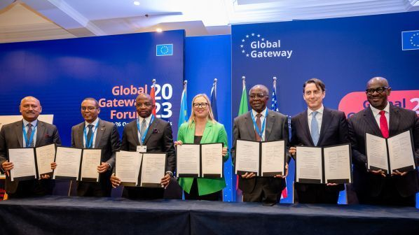

# 美欧与非洲签署三份备忘录，美媒：欲与中国争夺关键矿产资源

（观察者网讯）综合美国国务院、欧盟委员会官网信息，当地时间26日，在比利时布鲁塞尔举办的欧盟首届“全球门户”论坛上，欧盟和美国与刚果（金）、赞比亚、安哥拉等多个非洲国家和金融机构签署了三份谅解备忘录，宣称就“开发关键原材料价值链”和“促进交通运输互联互通”上展开合作。

彭博社25日报道中曾提到，欧盟和美国将启动一条战略走廊的基础工作，通过安哥拉将钴、锂和铜资源丰富的刚果（金）、赞比亚与大西洋相连，意在“与中国争夺关键矿产资源”。

_图自非洲金融公司（AFC）_

据官方介绍，26日的“全球门户”论坛上，欧盟国际伙伴关系专员尤塔·乌尔皮莱宁（Jutta
Urpilainen）与刚果（金）交通部长签署了关键和战略原材料价值链伙伴关系谅解备忘录，并与赞比亚财政部长签署了可持续原材料价值链战略伙伴关系谅解备忘录。

此外，作为9月二十国集团（G20）峰会的后续行动，同一天，欧盟与美国、刚果（金）、赞比亚、安哥拉、非洲开发银行（AfDB）和非洲金融公司（AFC），就开发“洛比托走廊”（Lobito
Corridor）和新的“赞比亚-洛比托线路”（Zambia - Lobito line），签署谅解备忘录。

英媒《国际铁路杂志》（International Railway Journal，IRJ）
报道称，拟议中的这条运输走廊将通过安哥拉洛比托港，将刚果（金）南部和赞比亚西北部与区域和全球贸易市场相连。美国国务院声称，这条新线路将推动实现从大西洋到印度洋铁路连通、开放的共同愿景。

欧盟委员会称，在签署谅解备忘录之后，各方将制定各自的路线图，并在2030年之前采取具体的联合行动，该项目预计将于今年年底前启动。

美媒彭博社对此指出，得益于近年来中国投资激增，刚果（金）成为世界上最大的钴生产国，并与秘鲁竞争第二大铜生产国的地位。与此同时，赞比亚也是重要的铜生产国。正与中国争夺关键矿产的西方，一直寻求与这两个国家结盟，以挑战中国在关键矿产供应链中的主导地位。

随着欧洲和美国加速向绿色能源和绿色经济的转型，对锂、镍、铜、钴和稀土等关键矿物的需求将激增。为减少对中国在关键矿物供应上的依赖，增加供应弹性，欧美国家一方面实施“组团”战略，共同着手建立除中国之外的供应基地，另一方面，则是加大财政激励力度，试图以产业保护政策在本土建立有效的关键矿物供应。

据《纽约时报》早前报道，美国正急于与矿产资源丰富的国家达成一系列协议，以扩大美国关键矿产获取来源，实现关键矿产供应链“去风险”。这些协议所涉关键矿产包括用于电动汽车电池制造的锂、镍、钴、锰和石墨，用于风力涡轮机和电动汽车电机永磁体的稀土元素以及电力网络所需的铜和铝等。

美国政府在去年与澳大利亚、英国、法国、德国、日本、韩国等伙伴国家建立了“矿产安全伙伴关系”，这项倡议即由美国国务院负责经济增长和环境事务的副国务卿何塞·费尔南德斯（Jose
Fernandez）领导，旨在加强美国的关键供应链。

彭博社称，美国政府想要通过倡议将外国投资和西方专业知识引入发展中国家的采矿业，帮助美国获取锂、锰和钴等关键原材料的供应。

然而，美方逆潮流而动，强行拉拢“小圈子”、建立“买方集团”，实际得不偿失。9月底，费尔南德斯在纽约出席新闻发布会时坦言，尽管华盛顿正寻求实现产品原材料来源“多元化”，但美国不可能将中国排除在关键的矿产供应链之外，需要继续与中国合作。

_美国国务院副国务卿何塞·费尔南德斯 资料图_

而欧盟用以对标中国“一带一路”倡议的“全球门户”论坛，其野心勃勃推出的基础设施计划又被认为还处于早期阶段，前景不明朗。

彭博社援引一份来自欧洲议会的报告指出，“‘全球门户’的这些举措是在一个仍在进行中的治理结构中推出的，该战略实际提供了什么，其实际优先事项是什么，以及它有多大能力取得成果，都存在相当大的不确定性。在这种情况下，大多数合作伙伴仍然不清楚‘全球门户’会如何运作，以及他们如何参与其中。”

有关“关键矿产领域对华依赖”的说法，中国外交部此前表示，中方一贯认为，关键矿产资源国都应该为保障相关产业链供应链安全稳定发挥积极作用，共同承担全球相关矿产供应的责任，确保相关经贸合作正常开展。同时，不应将世界经济政治化、工具化、武器化，破坏全球产业链供应链稳定，冲击现有世界经济体系。中方将继续深度参与全球产业分工和合作，维护多元稳定的国际经济格局和经贸关系。

**本文系观察者网独家稿件，未经授权，不得转载。**

