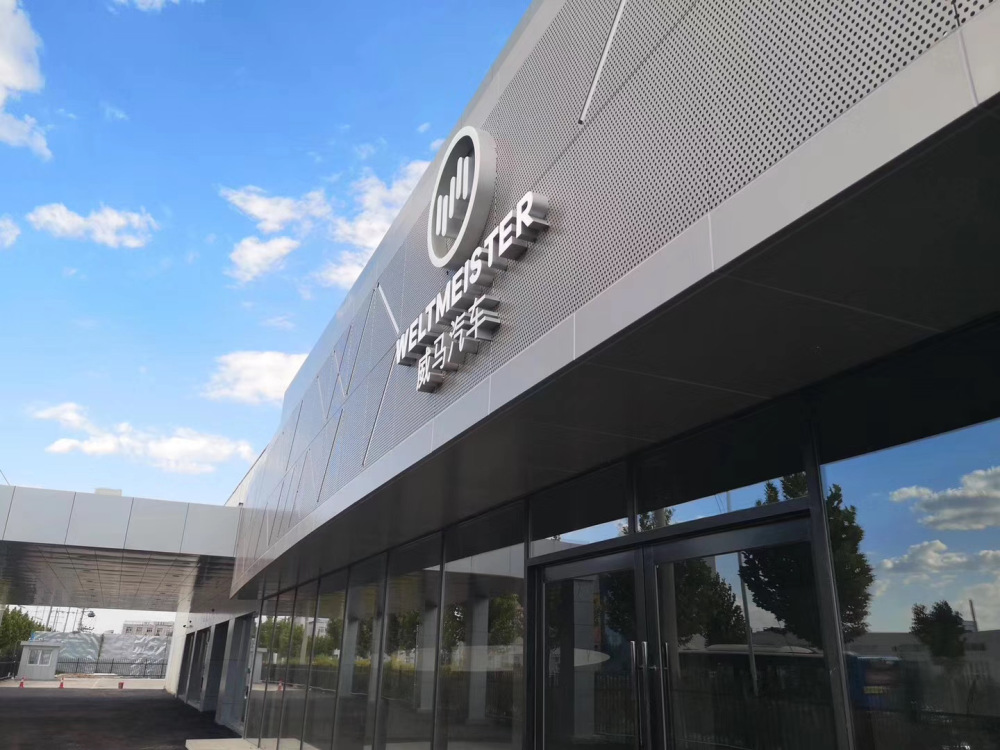

# 16万车主被“遗弃” 智能新能源汽车售后服务暗藏“天坑”

**经济观察报 记者 濮振宇**

走入末路穷途的威马汽车，已无力兑现其创始人沈晖亲口承诺过的“标杆级关怀”。这家公司的车主，近期遇上了不小的麻烦。威马车机、手机App、官网均无法正常访问和使用，令威马车主烦恼不已。

尽管威马汽车对此发文称网络问题已经修复，但威马车主们并不买账，他们反映威马的网络服务今年以来时常出现各种问题，零配件供应也无法保证。

威马汽车的网络服务停摆风波，撕开了新能源汽车售后领域的灰色一角。

中国汽车流通协会会长助理王都在接受经济观察报记者采访时透露，据协会统计，目前国内申请破产或者已长时间不生产的新能源车企，大概涉及超16万存量车主，其中威马汽车约11万，这一人群规模比较庞大。

中国消费者协会《2023年第一季度全国消协组织受理投诉情况分析——汽车投诉情况专题报告》显示，新能源汽车行业在快速发展之后进入了瓶颈期，一些新能源汽车厂家由于经营不善面临退市问题，相关车辆的定期保养、售后维修以及原厂零配件服务等难以继续提供，车辆使用安全堪忧。

这大不同于燃油车时代，哪怕厂家停止售后服务，燃油车车主的日常用车几乎不会受到影响。但新能源汽车由于普遍较高的智能化程度，在功能特性上对于厂家的云端服务依赖较强，一旦厂家因经营不善而中止服务，车主可能面临车辆“变砖”的窘况。

停摆的云服务

威马汽车所宣传的企业五大核心服务之一，即是包括智能导航、智能泊车在内的云服务。此次威马车主遭遇的问题包括威马官方App“威马智行”和“小威随行”无法登陆，导致蓝牙钥匙和远程控车等功能均无法使用。此外，威马车机界面显示无网络，导致没有在线服务。

从整个汽车行业来看，新能源汽车各项智能体验的实现，对于云端的依赖度愈来愈高。据了解，新能源汽车的智能功能运行、OTA在线升级均需要算力支持，如果提升车辆本地算力就会增加车辆功耗，进而影响车辆续航，而如果利用云计算来提供算力，就能有效解决智能驾驶和智能座舱的算力瓶颈。

“虽然网络服务停摆导致车完全不能开的概率不是很大，但很多新能源车的卖点就是智慧大屏，如果这些都没了，那么消费者凭什么买单”，王都表示，如果厂家没钱了，网络层面的服务就很难进行维护，即便不直接关停，体验差也是一定的。原来几十人乃至上百人的维护团队，现在没人了，软件的新BUG如何解决，也都是问题。

实际上，早在威马车机全面停摆之前，不少威马车主就已经反映车辆频繁出现各种问题，包括“手机App上只能接收数据，不能控制车辆”，“W6车主好几个月不能用App了”，“打开App有时显示网络异常，请稍后再试”。

王都表示，新能源汽车车机系统较为封闭，很多功能只有厂家能控制和维护，第三方根本无法介入。如果厂家中止服务，用户只能“认栽”。为保障消费者权益，车企应公开一些技术信息，可能包括软件底层源代码，以便第三方企业在厂家倒闭后能接手，继续为车主提供服务。

另一个需要关注的问题在于，车企提供的云服务，往往深度绑定了大量的用户数据。用户数据究竟归属于谁，目前在法律上还没有清晰定义。这意味着，车企是否有资格将用户数据转让给第三方，将是一个非常敏感的问题。

“还是得先有规矩，再谈落实。当然，哪些信息有价值，什么情况下需要公开，相关的认定和操作极为复杂，配套标准乃至法律法规的制定也不是一件简单的事，需要慢慢探索推进。”王都说。

虚假的“终身”质保

针对汽车售后服务，商务部《汽车销售管理办法》第二十一条第二款规定，供应商应当及时向社会公布停产或者停止销售的车型，并保证其后至少10年的配件供应以及相应的售后服务。

实际上，新能源车企在售后服务上普遍保持高姿态，爱驰、蔚来、威马、小鹏等新造车企业都推出过“三电”乃至整车的终身质保政策。其中，威马汽车曾宣布自2019年7月1日起购车的首任威马车主均可享受电池终身免费质保。“所谓‘终身质保’不是用户的终身，只是企业的终身”，王都坦言，很多新造车企业自身比较脆弱，背后也没有更强大的集团“兜底”，所以它们一旦破产，连内部员工基本权益都无法保障，更难去考虑用户售后权益。

在传统燃油车市场，当车企退市时，其售后服务往往会交由所属集团的其他相关方企业接手，或找第三方接手，如近期广汽三菱退市的善后工作将由广汽集团负责。而在新能源汽车市场，威马、小鹏等多数车企属于独立创业公司，既不背靠大集团，也没有合资伙伴。

在王都看来，传统燃油车后市场已经很成熟，即便厂家完全不提供售后服务，用户也能想办法维修，只是时间及原材料成本可能更高。在新能源汽车市场，一些新造车企业倒闭后，零配件基本无处可寻，用户只能陷入售后无门的困境，“（新能源汽车）三电系统里面有一个一致性的问题，如果企业不公开（相关技术信息），别人就根本没办法修”。

据经济观察报记者了解，近两年来，威马汽车的售后服务网点持续减少，即便仍有一些网点在运营，但由于厂家零配件供应短缺，这些网点只能保留简单的检测、保养服务，绝大部分维修工作则难以开展。

“现在很多威马门店倒闭了，我购车的门店也倒闭了，送的5次保养券，还剩3次不让用了，后期维保在宁波也没门店了，打官方客服电话说是正常营运，保养的事只能找门店协商，但App上门店的全部联系方式都停机了。”一位威马W6车主在某投诉平台上称。

王都表示，三包法规定“谁销售谁负责”，过去即便厂家破产倒闭了，燃油车消费者也可以联系4S店，4S店仍需要承担一些售后方面的法定义务。现在很多新能源车企采取直营模式，全国虽然有很多店，但都属于一家销售公司，一旦车企破产倒闭，消费者将无计可施。

除了威马汽车，目前爱驰汽车、宝能汽车、恒大汽车等新能源车企也深陷经营困境。据中国汽车流通协会统计，国内新能源汽车品牌最多的时候达到87家，2023年产量为0的有23家。

王都认为，为避免新能源车主售后无门，可以做好三方面工作：一是严格行业准入，提高企业的整体质量；二是借鉴传统燃油车渠道模式，重视经销商在售后服务上的“缓冲”作用；三是制定更完善的生产企业退出机制，在权益分配上给车主一定的优先级，企业正式破产前，应预留部分资源（如保证金、互助金、保险）保障车主的基本售后权益。

光鲜下的隐患

公安部数据显示，截至今年9月底，全国新能源汽车保有量已达1821万辆。从绝对数量而言，被厂家“遗弃”的新能源车主只是少数，但其他正常享受厂家售后服务的新能源车主，并非可以高枕无忧。

根据工信部的预测，到2025年，节能与新能源汽车的人才总量预计达到120万人，但人才缺口预计可达103万人，其中新能源汽车维修领域将面临80%的人才空白。“很多人都觉得（纯电动车）不用保养，由于没有发动机，不需要换“三滤”（机油滤清器、空气滤清器和燃油滤清器），它售后成本低确实是事实，但并不意味着不需要维护。新能源汽车起火事件现在越来越多。我们认为还是要重视‘体检’的作用，防患于未然。”王都说。

2014年，公安部、国家质检总局联合下发《关于加强和改进机动车检验工作的意见》，规定新购买的小型汽车注册登记6年内，除面包车、7座及7座以上车辆外，开始实行免检政策。

在王都看来，“私家车6年免检政策”非常便民，也很符合传统燃油车的实际情况，但新能源汽车动力电池的变化比发动机的变化要快得多，充放电次数多了动力电池就会出现一些内部变化，甚至产生风险，过长时间不检查可能存在隐患。

据了解，传统燃油车的检测、维修、部件更换，容错率高，而新能源汽车以化学、电子、信息为核心的零部件的检测、维修，需要使用更为精密、低误差率的专业工具、设备和方法。

王都表示，目前车企大都是根据自身产品特点制定新能源汽车维保标准，但这其中存在一些乱象，比如部分车企在提供维保服务时“藏拙”，自家产品擅长的地方就重点关注，不擅长的地方可能就忽略掉，不向用户展示。售后服务机构应该对新能源汽车进行完善的检测，及时发现各类小问题，避免小问题恶化为大问题。

目前，新能源汽车后市场缺乏强制性的国家标准，行业标准推广也才刚起步。2022年12月，中国汽车流通协会等单位联合起草的《电动乘用车售后服务规范》团体标准获批发布，对电动乘用车维修场地、维修设备及工具、维修技术人员和服务流程等提出规范化要求。

王都透露，中国汽车流通协会已呼吁有关部门在新能源汽车售后领域推出一些更有效力的国家标准乃至法律法规，来约束汽车生产企业。近期，协会还组织协调相关企业召开了一次闭门会议，探讨解决企业退市后的善后问题。

