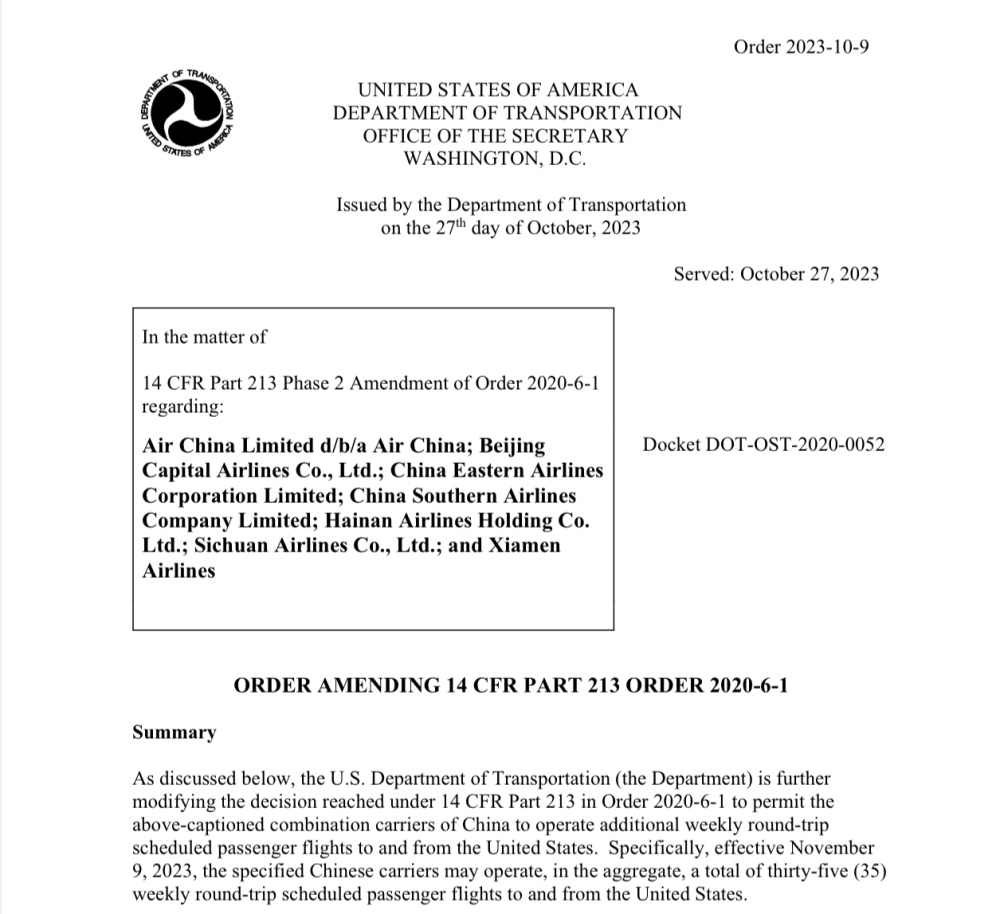

# 中美往返客运航班量将增至每周70班，最早11月9日起生效

当地时间10月27日，美国交通部发布最新指令，对2020年6月份的原指令进行第六次调整。指令称，自11月9日起，允许中国航司将中美往返航班数量从每周24班增至每周35班。

按照航权对等原则，美国航司每周执行的中美往返航班也将随之增至35班。扩容后，中国航司、美国航司每周运营的中美往返客运航班合计将达到70班。

此次增班指令距离上次调整两个多月时间。今年8月份，美国交通部发布指令，允许中国航司分两个阶段增加中美往返航班量。具体而言，自9月1日起，允许中国航司每周执行18班中美直飞往返客运航班；自10月29日起再次增班，允许中国航司每周执行24班中美往返航班。

不过，这次最新增加的11个中美往返航班具体如何分配仍是未知数。疫情前，执飞中美航线的中国航司包括中国国航、首都航空、南方航空、东方航空、海南航空、四川航空和厦门航空。

目前，仅有国航、东航、南航、厦航四家航空公司运营中美往返客运航班。11月9日前，中国的航空公司将向美国交通部提交具体的航班申请计划，待中国、美国两方的监管机构批准后方可执行。

美国交通部最新指令中还提到，将继续与中国民航局进行富有成效的对话，以促进中美航空服务市场逐步地、更广泛地重新开放。

为此，美国交通部打算制定一个路线图，分阶段恢复中美民用航空运输协定中的权利。基于此，美交通部希望到2024年北半球夏季时，能朝着中美航空运输市场正常化迈出重要一步。

在北京时间10月27日召开的中国民航局发布会上，民航局运输司司长梁楠表示，今年以来，国际客运航班持续恢复，自8月下旬以来已稳定在疫情前的50%以上。即将到来的冬春航季中，国际客运航班计划量约为2019年冬春航季的70.7%。

下阶段，民航局将继续鼓励和支持中外航空公司积极恢复国际客运航班，完善国际航线网络，为稳外贸稳外资工作和中外人员往来提供更好的保障。

