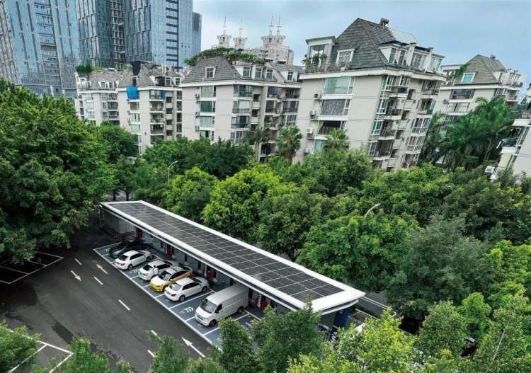
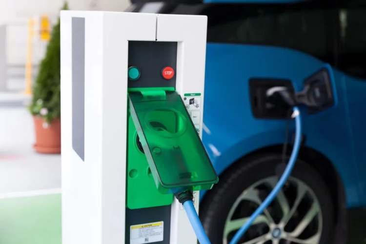
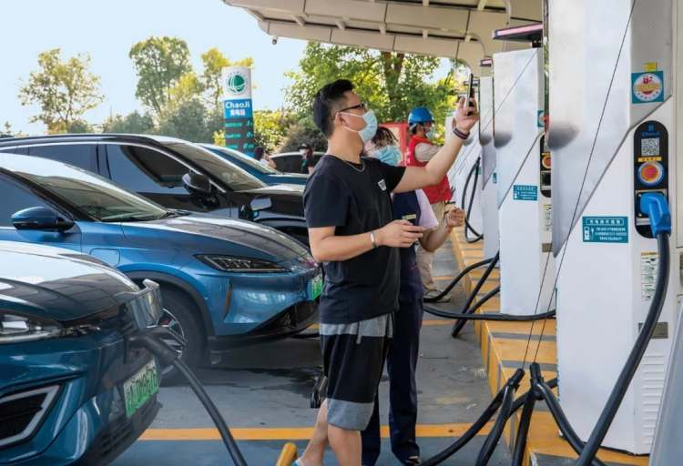
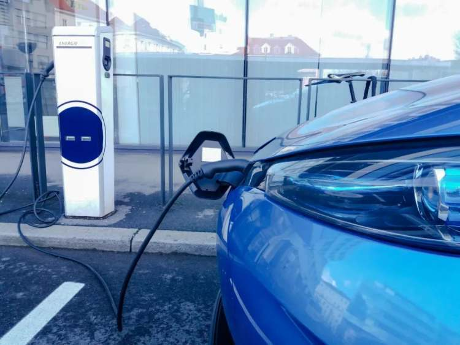
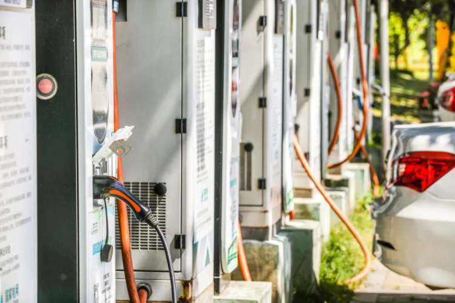
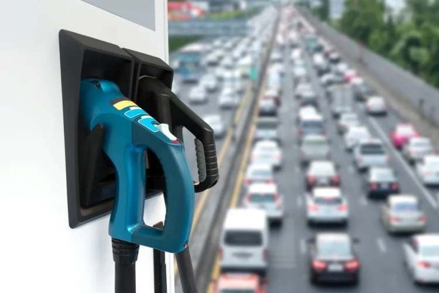
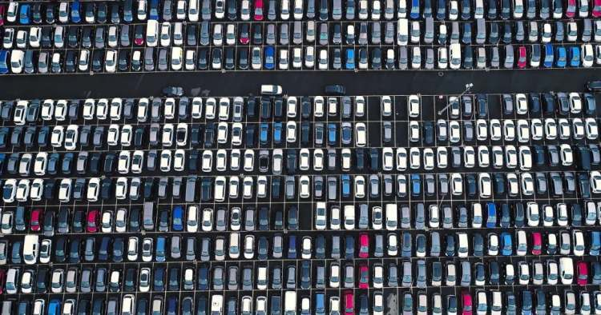

# 充电费涨价，这下电车真成“电动爹”了

作者 | 崔斯也

题图 | 视觉中国

今年下半年以来，全国多地公共充电桩价格上涨，让电车车主们感受明显。

当电费快要追上油费，一些车主开始感到焦虑。而电费上涨只是新能源汽车的困境之一，买了“电动爹”的车主们，各有烦恼。

电价快超过油价了？

新能源汽车车主们发现，今年下半年开始，公共充电桩的电费越来越贵了。

厦门的一位特斯拉车主称，很长一段时间以来，在给车充电时，自己都不会有心疼的感觉，但10月中旬，她突然发现特斯拉充电桩的优惠充电时段（21:00到次日9:00）的电价从原本的1.08元/度涨到了1.29元/度。对此，她说：“我已经习惯了开电车的精打细算，接受不了它静悄悄涨价。”

北京的特斯拉车主小白，同样经常选择在电谷时段充电，今年下半年，这一时间段的电费从1.46元/度涨到了1.78元/度。因为租房处没有自用充电桩，再加上一些不得不在白天充电的情况，小白每个月的汽车充电费用上涨到了600元以上。

_（图/图虫创意）_

据小白的计算，优惠时段内单次充电80元，能跑350公里，在确保充到最便宜的电的情况下，百公里电价在23元左右。而她开油车的朋友说自己的车的百公里油价在45元左右。“电价的确还是比油价便宜，但是这个优势随着涨价越来越小了。”小白说。以前一到周末，小白就和朋友开车去京郊玩，电价上涨后，她感觉自己每个月的开车频率也降低了。

而在峰值期，多地充电桩的价格也都涨到了2元/度以上。有上海车主称，自己亲眼看着常常使用的同一个充电桩，价格从1.15元/度涨到了2.05元/度。

而供日常使用的这种涨价幅度，仅仅是小涨幅，高速服务区的充电桩则更让车主感到心痛。因为高速上“没得挑”，被迫充高价电是出行车主的永恒焦虑。“十一”假期，很多车主发现高速上的国家电网充电桩涨价了。一位汽车博主称，自己近期在江西省赣州市的某高速服务区充电时发现，服务区内的特来电充电桩的平均价格为2.98元/度，总共121元的电费，仅够行驶200公里左右，在这样的场景内，电价几乎快要超过油价。

_2022 年 10 月 2日，江苏泰州。新能源汽车车主在高速服务区的超级充电站给汽车扫码充电。（图 / 视觉中国）_

开电车的出租车司机更是感受明显。一些司机表示，即使每天掐着点去充优惠时段的电，每个月还是会比过去多出400—500元的支出。有的司机为了更便宜的电价，选择多开几十公里到郊区充电，成为了新的“充电特种兵”。

如今的新能源汽车车主们只好怀念起曾经充电毫不心疼、不用仔细计算的时刻。那些电价0.5元/度的日子，几乎完全远去了。

充电桩不够吗？

充电桩电价涨落的基本逻辑是分时电价。一般的充电桩费用包括电费和服务费，国家电网和南方电网作为电力供给端，掌握着电费的绝对定价权。到了夏季的用电高峰期，分时电价的调整和上涨，也带动了各地充电桩不同时间段内电价的增加。

同时，今年5月，国家发展改革委印发《关于第三监管周期省级电网输配电价及有关事项的通知》，明确6月1日起实行新的电价方案。根据新方案，用户用电价格逐步归并为居民生活、农业生产及工商业用电三类，有些原本执行大工业电价的充电桩改为了按一般工商业电价收费，也直接导致了运营商购电价格上涨。

除此之外，充电运营商的盈利困境，也是充电桩涨价的主要原因。国内的公共充电桩，大多掌握在以特来电、星星充电、云快充为主的民营资本运营商手中。服务费是充电桩运营商的主要收入来源。这些企业几乎和新能源车企同时进入市场，相比国家电网等其他充电桩运营商，有着先进入市场的优势，但这些大型运营商在过去的几年内一直在持续亏损。特来电在今年上半年刚刚实现盈利，而这与充电桩的建设和销售有关。因为长期亏损，运营商只能试图通过提高服务费来增加盈利。

_（图/图虫创意）_

充电桩企业亏损的原因也是多方面的。近两年，各地针对充电桩的补贴在减少。从2022年10月起，上海充电设施的每千瓦时补贴下降了0.1元。各地运营商在很多年前拿到的补贴如今已经到期，因此服务费的价格也随之涨起来。充电桩的建设需要大量的前期投入，在很多地方，相关部门只在充电桩建设期给予建设补贴，并不提供后续的运营补贴，导致充电桩后期运营难以为继。

现有的充电桩并不少。中国充电联盟的数据显示，截至2023年9月，我国公共充电桩的数量为246.2万台，仅9月就新增了19万台。包括私人充电桩在内，全国充电桩总数为764.2万台，而我国目前的新能源汽车保有量为1821万辆。这意味着仅从数量看，充电桩是相对充足的，车、桩比例已经处于全世界之首。

但即便如此，车主也没有感受到“电量充足”的体验，“充电焦虑”还是常常存在于车主的心中。春节返乡和节假日出游时，高速上的充电桩依然人满为患，很多车主都表示自己需要提前规划充电安排。高速上排队也充不上的电，必然是很难便宜的。

_在各地分布的充电桩。（图/图虫创意）_

而因为充电桩建设的空间分布不均匀，在大量小县城里，找到一个稳定、靠谱的充电桩，甚至要靠运气。还有极大量的充电桩因为运营维护不善，几乎无法使用。小白说，她平时基本会选择自己汽车品牌自建的充电桩，充电效率高且稳定。她感觉不同充电桩的差异比较大，在一些偏远的地方或者高速场景里，只能选择其他充电桩，“线又粗又重，很硬，对女生使用不太友好，并且需要先付费再充电，还要下载扫码，流程体验也不太好”。

在很多第三方充电桩，车主经常会遇到坏桩充不上电或者充电很慢的情况，有些充电桩甚至是摆设，被油车占位。“之前去乌兰察布，往景区那边是没有自营充电桩的，就只好找第三方充电桩。我们玩完时车快没电了，开过去充电站，发现充电桩是坏的，用最后剩下的电开回酒店到自营桩充的电。今年这种情况似乎稍微有改进，但是第三方充电桩基本没有给我好的印象。”小白补充道。

充电桩数量多，但真正能顺利使用的却并不够。多方问题让充电桩行业陷入困境，运营商的钱烧不动了，涨价也就自然地发生。

_（图/图虫创意）_

尴尬的电车车主

当然，也有一大部分车主对于公共充电桩涨价无感，他们大多在家中或公司拥有自用充电桩，可以直接享受以民用电价格充电。官方的慢充家用充电桩安装费用在6000—8000元，第三方充电桩则是3000元左右。

也有一些品牌方主推“换电”的方式，相对充电来说，其速度更快，体验也更方便。但同样有车主抱怨换电站的电池不够用、服务费高、换电站数量少等情况。

从现实层面看，新能源汽车本身不仅仅是“省钱”之下的选择。在电价相比油价更便宜的优势以外，一线城市的新能源汽车本身的售价和车险等相关支出都并不便宜，但依然占据着极高的市场份额。《中国汽车报》的调查显示，目前我国一线城市新能源汽车渗透率已超过50%；三四线城市渗透率不足15%，且主要是10万元左右的产品；广大的农村市场渗透率只有5%左右，且主要是10万元以下的产品，消费者对价格敏感度高。下沉市场也因此成为了目前新能源车企的主要竞争战场。

_等待出厂的密密麻麻的新能源汽车（图/图虫创意）_

这或许和新能源汽车本身所强调的科技感、智能感有关，技术加持很容易吸引一线城市的年轻用户，但续航问题、保值率、充电困境，以及目前的电价上涨等，让一些新能源汽车车主感到焦虑。很多车主亲切地称自己的车为“电动爹”。

人们吐槽自己当初选择了“电动爹”，但依然渴望问题能够得到解决。小白说，自己还是希望电车成为主流，电车的使用环境能够随着市场份额的增加变得更完善。“我至今还是不敢自己开车到新疆、西藏，但是在网上看也是有能开过去的，准备研究一下攻略，下次试试。”她说。

