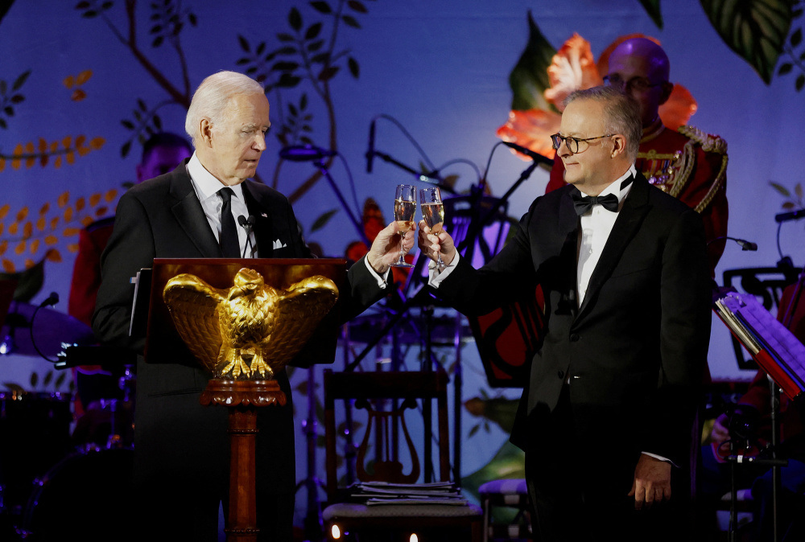
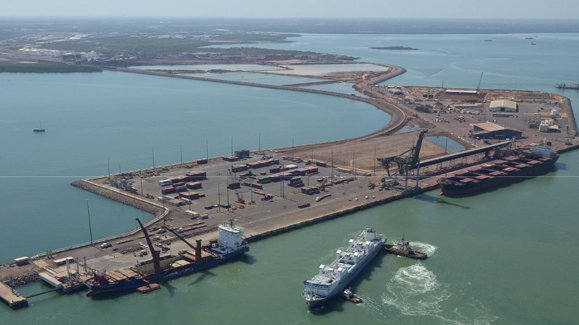
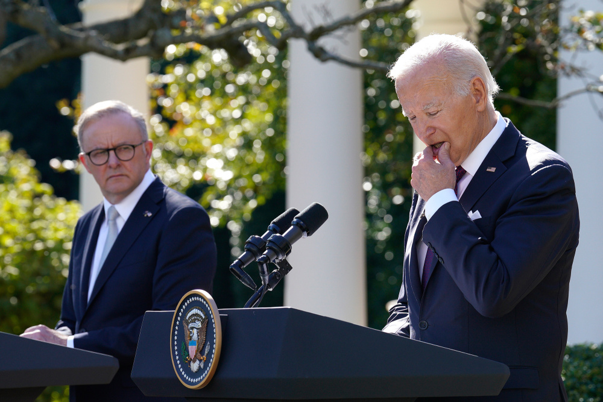
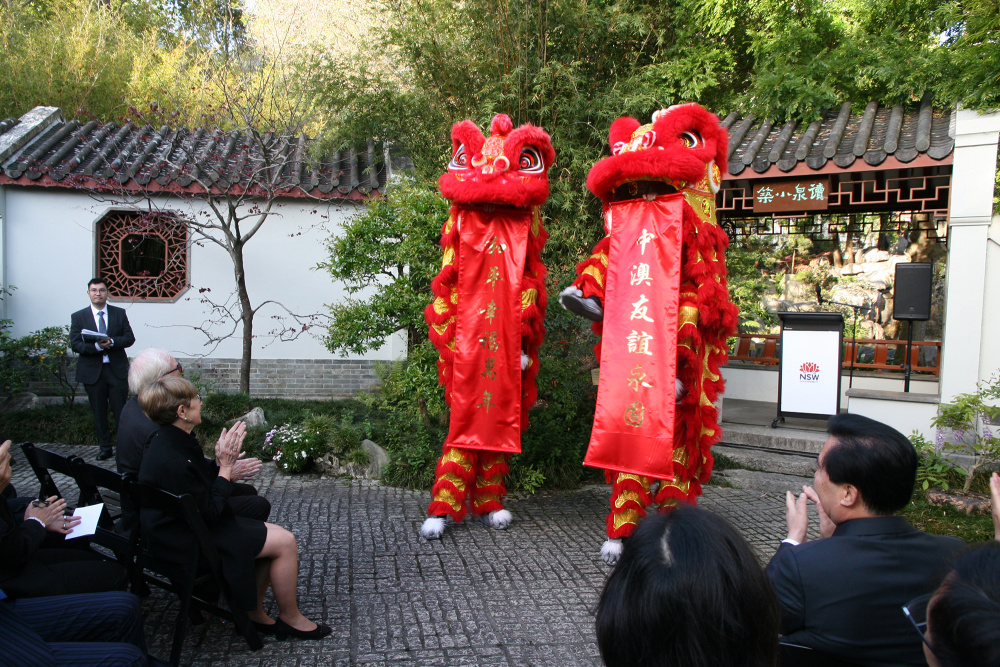

# 前后脚访美访华，澳大利亚对中国“做两手准备”？专家解读

短短一年多时间，中国与澳大利亚关系“触底反弹”，从回暖快进到升温阶段：

仅回顾过去两三个月，中澳双方世贸组织争端机制下的“大麦案”、“葡萄酒案”和“风塔等案”接连迎来转机；

适逢澳大利亚前总理惠特拉姆历史性访华50周年，现任澳总理办公室还抢在阿尔巴尼斯正式访美之前，周末“加班”官宣了下周访问中国并出席第六届进博会的具体日期，表示将与中方讨论在经济联系、气候变化和民间联系等多个领域的合作。

这也是两国关系开始走低之后澳总理首次访华，上一次还是2016年的特恩布尔。

然而，“五眼联盟”成员国澳大利亚在访华前先行访美，也引发了全球媒体关注解读。澳资源部长附和美国，在所谓“关键矿产”问题上所做出的表态，又是否意味着澳大利亚一边推动对华关系改善，一边对中国“做两手准备”？

与此同时，澳总理访华时间点有何特别之处？与澳大利亚相比，同为“五眼联盟”成员的新西兰在处理与中国关系上，有何妙法？阿尔巴尼斯想要平衡与中美的关系，他能做到吗……围绕相关议题，观察者网采访到了华东师范大学澳大利亚研究中心主任陈弘教授。

_当地时间10月25日，美国华盛顿，美国总统拜登及夫人在白宫举行国宴，欢迎到访的澳大利亚总理阿尔巴尼斯夫妇。 图自IC Photo_

“澳美同盟是澳大利亚对外政策的基石，这点肯定不会变。”但是陈弘同时指出，澳大利亚和任何国家建立这个同盟、那个伙伴关系，中国不会抱有任何立场和态度，前提是不能以中国作为代价。而前年刚刚解密的信息显示，澳大利亚曾在特殊时期顶住美国压力，向中国增加出口小麦。

他认为，莫里森政府是“黑天鹅式”的例子，中澳关系在阿尔巴尼斯上台短短一年多时间的变化也证明，现任澳总理有他的外交理念和政治智慧。“美国希望它在自己的对华棋局中充当棋子，问题是澳大利亚多大程度上愿意扮演这样的角色？是真正同步，还是简单地跟上节奏，而不至于过分地掉队？”

这一点，陈弘觉得，澳大利亚确实需要向新西兰学习。

_多次扬言“毁约”后，澳大利亚政府近日发布审查结论：没必要更改或取消中企的达尔文港租约 图自澳北领地政府网_

**以下为采访实录：**

【采访/观察者网 童黎】

**观察者网：澳大利亚总理阿尔巴尼斯11月4日至7日访华期间，将出席第六届中国国际进口博览会，中方表示欢迎。这项特殊行程释放了哪些信号？此次澳总理访华有何象征意义，又有何现实意义？**

**陈弘：** 阿尔巴尼斯访华有两方面意义，一是政治，二是经济。

从政治上看，阿尔巴尼斯这次强调了纪念澳大利亚工党籍前总理惠特拉姆访华50周年。惠特拉姆是政治上的巨人，1972年率领工党竞选获胜，出任澳总理，并在数周后与中国建交，然后于1973年首次以总理身份访问中国。

这和现在有极大的相似性，形成了一种平行。

首先，中澳关系前几年可以说处于建交以来的最低谷。然后，
**阿尔巴尼斯在去年竞选获胜，同样在第二年准备踏着巨人的步伐访问中国，推动两国关系“触底反弹”。这实际上有继往开来，揭开中澳关系下一个50年新篇章的意味。**

从经济上看，经贸关系是中澳关系的试金石。所以阿尔巴尼斯选择在进博会期间访华，给出的信号也非常清晰，就是希望以经贸关系推动两国关系全面复苏和发展，同时非常明确地表明他完全认可一个开放的中国对中澳两国都有好处。

所以我觉得，阿尔巴尼斯访华的象征意义和现实意义都非常鲜明。继他的前前任特恩布尔2016年访华之后，这是两国关系开始走低之后澳总理首次访华，甚至可以称之为“破冰之旅”。

**观察者网：澳大利亚方面早早吹风总理将在年底访华，行程最终定在了11月初，这个时间点有何特别之处？您认为澳总理访华的时机是否成熟？为什么？**

**陈弘：**
阿巴尼斯在去年5月竞选期间就明确表态，要改善澳大利亚和中国之间的关系。胜选执政之后，他也一直在放出风声说愿意访问中国，原话是“如果中国对我发出访华邀请，我就会接受”。

他也因此受到了来自美国和澳大利亚的阻挠，国内一些政治势力要求他对访华预设条件，等于破坏他的出访计划。但是在宣布这次行程之前，阿尔巴尼斯多次强调“不预设任何条件”，澳大利亚和中国发展稳定的建设性关系对两国和本地区都有好处。

**非常有意思的一点是，在他周一（23日）动身访美之前，内阁办公室在礼拜天（22日）下午急急忙忙宣布了访华的具体日期。这是很值得玩味的，他生怕在访美期间受到美方的阻挠，所以先行锁定访华行程。这也能看出阿尔巴尼斯此次访华确实顶住了种种压力，排除了各种干扰，决心非常明确。**

而关于澳总理访华时机的问题，情况是这样的。

在工党执政之前，中澳关系出现了“自由落体式”的下降。两国在政治上、经济上有这样那样的一些纠纷、摩擦，这实际上是很正常的，任何国与国之间总归会有纠纷。

阿尔巴尼斯在上台之后的一年多时间里，一直在比较稳健地推进两国关系改善，中澳关系可以说发生了180度的转变。所以在被问到“两国关系是不是要回暖了”的时候，我认为现在中澳应该已经过了回暖的阶段，进入到升温的阶段。

过去莫里森政府动不动就给两国摩擦贴上政治标签，非但无助于事态解决，反而激化矛盾。随着两国之间的纠纷在一一得到解决，中澳关系企稳向好，这也为澳总理访问中国铺平了道路，创造了条件。

_当地时间2022年5月21日，澳大利亚悉尼，现任工党领袖安东尼·阿尔巴尼斯将出任新一任澳大利亚总理。 图自IC Photo_

**观察者网：外界在谈到中澳关系时，经常会提到与澳大利亚同为“五眼联盟”成员的邻国新西兰。澳大利亚和新西兰的对华政策有何不同之处？**

**陈弘：** 新西兰和澳大利亚有几方面不同。

首先新西兰的对外政策采取了比较独立的态度，而且在处理对美关系的时候相当独立。越南战争时期，美国要求新西兰出兵，新西兰拒绝。当时澳大利亚、新西兰和美国有一个军事同盟，但是新西兰拒绝美国军舰进入自己的领海，因为新西兰是无核国家，它说美国军舰里面可能有核武器。美国一怒之下把新西兰踢了出去，所以它和美国现在不是军事同盟，是“partner”，“伙伴”
。

在处理中国问题的时候，新西兰也始终强调符合自己本国的利益，而不是把它和美国的关系凌驾于它和中国的关系之上。所以，
**中新关系一直是中国和西方国家关系中的一个典范，两国交往创造了好多个“第一”。**

而澳大利亚对外政策的基石，是澳美同盟，这和新西兰有鲜明不同。

实际上也很“搞笑”，新西兰好几次给澳大利亚上课。尤其是莫里森政府时期，新西兰的贸易部长和外交部长都公开表态，新西兰能够妥善处理好和中国的关系，同时又能够处理好和西方国家的关系，澳大利亚必须要向新西兰学习。澳大利亚当时非常恼怒，“小兄弟居然来教训我”，对吧？

我也认为，澳大利亚确实能从新西兰处理对华关系的做法上学到不少东西，有不少该注意的地方。

**观察者网：外交部发言人汪文斌此前提到，中澳经济高度互补。“高度互补”体现在哪些地方？**

**陈弘：**
中澳经济互补是非常明确的。中国是澳大利亚最大的贸易伙伴，对中国来说，两国经贸关系中最重要的就是澳大利亚的能源和矿产，然后还有农牧业产品、水产品。澳大利亚70%的铁矿石都出口到了中国，煤炭情况也是一样。反过来，中国又是制造业大国。所以即使是在中澳关系走低的过程中，两国经贸合作还是屡破新高。

实际上，中国经济发展给澳大利亚也带来了很大的助力。

比如2008年全球金融危机时期，几乎所有的西方国家都受到冲击，澳大利亚反而保持正增长，主要还是因为中国和中澳往来。因为中国当时采取了刺激经济的做法，包括修建基础设施、房地产市场等等，这个过程中进口了大量的澳大利亚铁矿石和其他产品。

此外，中澳之间还开展了留学、旅游、金融服务、保健和养老等服务贸易。澳大利亚已经是中国学生赴海外留学最多的目的地之一。

但是中澳之间的经贸合作不仅限于传统领域。尤其是在应对气候变化的背景下，澳大利亚也有自己的碳排放目标。澳大利亚作为一个无核国家，整个国家连一个核电站都没有，大量地依靠化石燃料。它也希望能够尽快转型，寻找清洁能源，实现绿色经济，而中国的光伏产业、风能产业非常发达。所以很多新的领域都可以展现两国之间的互补性。

_2022年8月10日，航拍青海省海南藏族自治州生态光伏园。据了解，该园区是中国首个千万千瓦级太阳能生态发电园。图自IC Photo_

**观察者网：澳媒近期报道称，过去五年，美国、日本、韩国和欧盟扩大了他们认为对国家安全和经济增长至关重要的关键矿产清单，以应对“中国可能利用其在矿产供应链中的主导地位作为胁迫工具”的担忧。澳资源部长玛德琳·金声称，这些担忧是有道理的。澳大利亚正考虑对“关键矿产”清单进行调整，或将铁矿石等大宗商品列入其中。**

**这是否意味着澳大利亚在推动对华关系回暖的同时，对中国“做两手准备”？**

**陈弘：** 关键矿产的问题很重要。

**“关键矿产”实际上是美国近年发明、创造出来的一个概念**
，因为矿产本身不存在“关键”“不关键”。所谓的“critical”（关键）就在于，它是不是对中国的经济发展和技术进步有好处。只要是对中国有好处，对它来说就是“关键”的。制造所谓“关键矿产清单”的最终目的，就是要在原料上对中国进行“卡脖子”。

那么在这方面，澳大利亚的锂矿石是全球探明储量最高、出产量最高的，绝大部分运往了中国，其中既有中国购买的，也有运来中国提纯的。因为澳大利亚本国不具备加工提炼的能力，完全在中国进行。从民用的电动汽车，到军用、航天业，锂矿石都不可或缺。

还有稀土。中国当然是全球最大的稀土出产国，但是澳大利亚也有，尽管比中国少多了。

所以在渲染“关键矿产”的过程中，美国希望拉澳大利亚参与进来，借此推动与中国“脱钩”，减少与中国的进出口贸易。

至于“对中国做两手准备”，那肯定是有的。美国对中国步步紧逼，澳大利亚在这过程中当然有自己的政治考虑，因为美国毕竟是它最重要的盟国，它自己又是西方阵营国家，对于美国的要求、战略布局肯定还是会予以一定的呼应，甚至配合。

另一方面，作为矿产丰富的国家，澳大利亚也希望通过“关键矿产”这样一个新概念为自己谋取经济好处。

比如锂矿石，澳大利亚本国没有锂矿石提炼的配套功能，如果美国来开发澳大利亚的这方面能力，不仅提振国内经济，还创造就业机会，那么澳大利亚乐见其成。所以，它的决定既出于政治考虑，也出于经济考虑。

但与此同时，我觉得澳大利亚在处理对华关系上还是有一定自主性，在一些问题上有自己的一些主张。当然，上届莫里森政府，我们就不说了，他确实有无视本国利益的做法，但是理性的政府应该还是能够把控好比较敏感的问题。

澳方在“关键矿产”问题上必须要明确的是，中国是澳大利亚最大的铁矿石市场，产品70%运往中国，如果失去中国这样的巨大市场，对澳大利亚经济可以说是毁灭性打击。

炼焦煤也是一样，前几年中国停止从澳大利亚进口炼焦煤，倒真的不是出于政治原因。中国根据碳排放等要求，调整了煤炭进口情况，但是当时澳大利亚国内哀鸿遍野。

所以无论澳大利亚如何表态，但是真要落实到行动上，我觉它还是会比较谨慎。如果只是为了美国的霸权战略，就把自己的经济利益当作炮灰牺牲掉，那么对澳大利亚来说只有害处没有好处。

 _当地时间10月25日，美国华盛顿，美国总统拜登与来访的澳大利亚总理阿尔巴尼斯举行新闻发布会。
图自IC Photo_

**观察者网：在正式访华前，澳总理阿尔巴尼斯先行访问了美国。美国彭博社评论称，对于既想巩固与美国的关系，又寻求改善对华关系的阿尔巴尼斯来说，这两次出访将考验他的外交技能。阿尔巴尼斯此次访美有哪些目的？面临什么考验？**

**陈弘：**
前面说到，他在访美之前宣布访华行程，访美之后紧接着再访问中国。一方面，他确实预判到了来自美国的压力，所以他必须锁定访华日期。另一方面，访美过程中，美国肯定会对澳大利亚施加各方面压力，希望澳大利亚能够配合美国的一些战略。

阿尔巴尼斯此次访美主要有两个目的，第一个目的就是美英澳三边安全伙伴关系“奥库斯”（AUKUS）。

“AUKUS”宣布为澳大利亚建造核动力潜艇的舰队以来，几乎是一纸空文，甚至在美国内部也有各种阻力。美国一些议员一直强调，美国自身的军工制造已经非常吃紧，如果还要给澳大利亚提供资源，对美国来说没有任何好处。包括美国国会的混乱在内，美国本身的政治不稳定性，也导致澳美之间听起来很美好的愿景充满了不确定性。

但是阿尔巴尼斯从上届政府手中接盘了“AUKUS”，他必须要给选民一个交代，只是到目前为止几乎没有实质性进展。

另外就是刚才我们说的“关键矿产”问题，这也是阿尔巴尼斯访美的重点，同样也是困难重重。在本土发展矿产加工能力对澳大利亚来说是有好处的，但是阿尔巴尼斯自己也表态过，知道难度很大，不但投资很大，而且非常耗时，提炼过程中对环保要求也非常高，需要各方面的配套。

所以，所谓的“关键矿产”听起来似乎是和美国合作的新领域，但是能不能做到，什么时候做到，都充满了疑问。

**观察者网：从2017年年中开始，澳大利亚特恩布尔政府和莫里森政府盲目跟随美国，全方位地破坏与中国的双边关系。不过，去年上台的阿尔巴尼斯政府有意修复与中国的关系，中澳关系逐渐回暖。**

**与往届政府相比，阿尔巴尼斯政府在对待美国和中国的态度上有何相同之处？又有何变化？阿尔巴尼斯想要平衡与中美的关系，能做到吗？**

**陈弘：** 首先，澳大利亚对外政策的基石是澳美同盟，这点肯定不会变。出于传统、政治和所谓的“国家安全”，它肯定和美国保持非常紧密的关系。

那么在这过程中，澳大利亚如何处理和中国的关系？

过去莫里森政府盲目追随美国，这确实给澳大利亚带来很大的代价，在过去几年里面受损的不单单只是中澳关系，对于澳大利亚本身也造成了严重冲击。

比如说，澳大利亚是一个多元文化的国家，莫里森政府造成了国内社会在中国问题上的严重撕裂，因为澳大利亚毕竟有130万华人。其次，澳大利亚一些政府高官去年上半年还在说“和中国必有一战”，“和中国作战的战鼓已经敲响”，这样的叫嚣把澳大利亚自己放到了中国的打击目标之内，反而给澳大利亚的安全带来严重风险。

_当地时间9月22日，象征中澳友谊的“友谊桥”落成剪彩仪式在澳大利亚悉尼市中心的谊园举行。 图自IC Photo_

所以，它如果不计成本、代价地追随美国，对自己来说真的是没有任何好处，有政治智慧的、理性的领导人对此应该有正确的认知和判断。

很多声音说澳大利亚没有战略自主，没有独立外交政策，实际上我是不同意的。它在看问题的时候，实际上取决于怎么样把自己的利益最大化，无论政治利益还是经济利益。

当然少数情况下，比如莫里森，他真的是偶然的、黑天鹅式的例子。莫里森也在赌博，因为看到了特朗普这样一个人物，他几乎是在澳大利亚复刻了特朗普式的外交行为，做出了许多缺乏理性、突发奇想、莫名其妙的举动。

但是阿尔巴尼斯上台之后，我们看到，澳大利亚一方面还是坚持和美国之间的合作，同时不遗余力地推进和中国关系的改善，甚至进入了升温阶段。短短一年时间能够让中澳关系发生180度的转变，应该看得出，阿尔巴尼斯有他的外交理念和政治智慧。所以说，他想要平衡澳大利亚和中美之间关系，是能够做到的。

那么接下来，美国肯定会对澳大利亚有这样那样的要求，希望它能够在美国的对华战略中充当棋子，问题是澳大利亚怎么做，多大程度上愿意扮演这样的角色？它肯定和美国的战略有一定的同步性，但是能不能真正同步，还是简单地跟上节奏，而不至于过分地掉队？

所以前面谈到的，新西兰现在在许多情况下能够做到这一点，甚至有时候会说“五眼联盟缺一只眼”，发生“四缺一”的情况。当自己的国家利益和美国的战略发生冲突，那么显然应该把自己的国家利益放在首位，这一点澳大利亚确实需要向新西兰学习。

**观察者网：在经历波折之后，中澳关系持续回暖，我们应该如何务实地看待、定位和规划中国与澳大利亚的交往？**

**陈弘：**
实际上中国和澳大利亚的交往在许多领域是大有可为的。1850年代，澳大利亚发生淘金热，大批中国人前往澳大利亚成为最早的中国移民，也成为了中国和澳大利亚之间交往的纽带和桥梁。

因此在建交之前，两国之间的民间交往始终没有断过，甚至在一些关键时候，澳大利亚方面仍然能够和中国保持比较积极的关系。

比如中国遭遇三年自然灾害，澳大利亚当时顶住了美国压力，向中国增加出口小麦，这是在前年刚刚解密的情况。我们有时候会听到澳大利亚一些极右声音，非常刺耳，但是具体做法还是相对比较理性的。

今后中澳交往关键在于务实地、建设性地处理两国关系，中澳在2014年升级为全面战略伙伴关系，尽管在莫里森政府时期这种关系名存实亡，但是我们现在还是要明确强调双方是“伙伴”。

中方的态度很清楚，始终不要求澳大利亚选边站队，不像美国那样要求澳大利亚和自己保持高度的一致性。澳大利亚和任何国家建立这个同盟、那个伙伴关系，中国不会抱有任何立场和态度，因为澳大利亚作为主权独立国家，它有自己的选择。

但是任何同盟关系、伙伴关系不能够以中国作为代价，不能以中国作为打击目标，中方在这方面的立场态度非常明确。

所以到目前为止，中国采取了非常务实的态度，在处理贸易纠纷、政治上的领事事务纠纷等方面采取了灵活做法，妥善解决了许多问题。中方在最大的原则性下，展现出了最大的灵活性，所以才能够推进两国关系的改善。

但是单靠中国的善意是不行的，外因通过内因起作用，澳大利亚也要通过本国的内在动能来维持和推动中澳关系发展。

