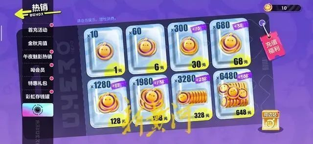
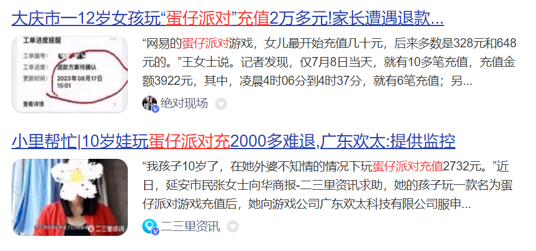
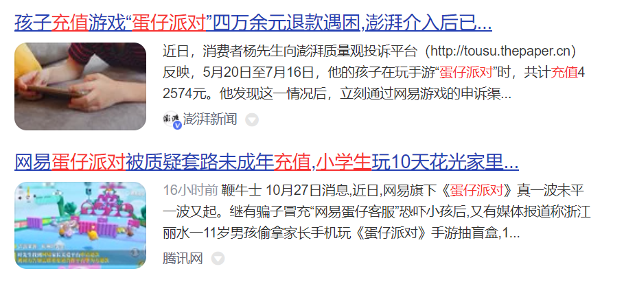
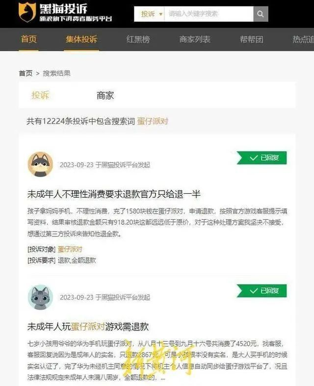

# 小学生玩蛋仔派对10天花光家中积蓄，家长称申请退款遭“踢皮球”

“短短十天时间，充值游戏花掉了全家所有积蓄。等我们发现为时已晚。”谈起儿子充值《蛋仔派对》的事情，浙江的叶先生至今无法接受。

叶先生和妻子由于常年在外地打工，留下11岁的儿子由老人照顾。今年10月初，叶先生母亲火急火燎地打来电话，说家里银行卡的钱全没了。叶先生赶紧返回老家，经过查询才得知，
**家里仅有的40301元积蓄全部被儿子充值在一款名为《蛋仔派对》的游戏中。**
“平日他在家会拿奶奶的华为手机玩，我们也不知道他怎么就玩上了这款游戏，更没想到他会把家里钱全花完了。”叶先生经过查询发现，孩子从9月20日开始进行充值，第一次只充值1元领取游戏皮肤，然后是18元、68元、128元、648元……当天就充值了六七千元。在接下来短短9天时间，每天都疯狂充值买装备，直到把银行卡里的4万多元全部花完。

**事后叶先生找到网易家长关爱平台申请退款，被对方告知需联系渠道合作平台华为方退款。**
在遭遇网易和华为多次来回“踢皮球”后，10月24日，叶先生在广州互联网法院诉讼平台起诉了广州网易计算机系统有限公司。

而这样的情况并不是个例。10月24日，河南新乡的贾女士向记者求助。 **她9岁的女儿玩“蛋仔派对”手游，看直播打赏主播一共充值消费了17万多。**
记者跟孩子沟通发现，小女孩偷用奶奶的身份证注册了游戏账号，充值消费根本不需要人脸识别。贾女士的女儿告诉记者，玩“蛋仔派对”只要有新皮肤她都会买，还会买皮肤盲盒，买到新皮肤就跟买了新衣服一样开心。孩子对钱根本没有概念，所以才会大笔大笔往游戏和直播中充值。随后，记者帮助贾女士联系了直播平台和游戏公司申请退费，等待平台进一步处理。

**游戏面向“低龄儿童”**

**投诉大多与未成年人充值有关**

记者了解到，《蛋仔派对》是网易开发的一款游戏，定位在8岁以上人群，凭借可爱的游戏风格、简单的游戏模式以及强社交属性，吸引了10后、05后等大量未成年用户，甚至不少15后人群。在《蛋仔派对》游戏中，无论是表情、衣服或是全套皮肤，大多是以盲盒游戏的形式来抽取的。此外，为了更好地“圈”住低龄儿童，《蛋仔派对》经常和一些大热动画IP联动，比如“猪猪侠”“果宝特攻”等。除了仿真盲盒机，这款主要面向低龄儿童设计的游戏里还隐藏着幸运大转盘、砸金蛋等类似博彩的玩法。

在网页中搜索蛋仔派对，就能搜到大量学生背着家长给游戏充值几千到十几万元不等，又遭遇退费难的新闻。

记者从黑猫投诉平台输入“《蛋仔派对》”关键词检索发现，共有1.2万余投诉，其中大多数与未成年人充值有关。其中，未成年人年龄大多在10岁左右，有的甚至只有6岁，达不到该游戏玩家至少年龄8岁+的要求。家长们普遍反映，孩子都是在绕过实名认证登录后被游戏诱导消费，且丝毫不限制充值金额，在退款时遭遇各种障碍，与《蛋仔派对》官方客服交涉时，对方往往把责任推给游戏合作平台，有的只能退一小部分，有的一分钱都不退。

**未成年人游戏充值可要求返还费用**

那么未成年人游戏充值，消费者可以要求退款吗？北京理道律师事务所主任律师王久成对记者表示，未成年人给游戏充值往往次数多、累计金额大，并且未成年人通常会删除游戏充值成功的短信，家长一般很难及时发现，即便发现，造成的损失也已经很大。未成年人在监护人不知情的情况下，在网络游戏中充值与其年龄、智力不相适应的款项，消费者可以要求退款。

王久成进一步解释称，《民法典》规定，不满十八周岁的自然人为未成年人，不满八周岁的未成年人为无民事行为能力人，由其法定代理人代理实施民事法律行为。八周岁以上的未成年人为限制民事行为能力人，实施民事法律行为由其法定代理人代理或者经其法定代理人同意、追认。未成年人在游戏内进行大额充值明显不属于“与其年龄、智力相适应”的民事法律行为，其监护人有权要求游戏运营商退款。

另外，《最高人民法院关于依法妥善审理涉新冠肺炎疫情民事案件若干问题的指导意见（二）》中也明确规定，限制民事行为能力人未经其监护人同意，参与网络付费游戏或者网络直播平台“打赏”等方式支出与其年龄、智力不相适应的款项，监护人请求网络服务提供者返还该款项的，人民法院应予支持。

王久成表示，在实践中，未成年人游戏充值要求退费并不容易，难点主要体现在以下几个方面：

一是举证困难，未成年人如果用家长的身份证注册网络游戏账号后进行充值，家长有权要求游戏运营商退款，但从现实情况来看，举证存有难点。家长要提供足够的证据来证明充值行为确由未成年的孩子做出，而账号的充值记录、孩子的自述等都不能作为直接证据，因此举证非常困难。

二是联系客服难，家长申请退款时，屡屡联系不上客服是退费过程中的一大难题。现在很多互联网企业用机器人客服来代替人工客服，有的转接人工服务一直繁忙，有的根本找不到人工客服入口。

三是申诉流程冗长，一般家长找到客服，根据指引向平台提交出生证明、身份证明、学生证明、充值证明等各类资料。在资料审核通过后，还有电话回访环节，会询问孩子很多问题，比如，账号ID、游戏剧情等非常细节的内容，孩子稍有记不清，游戏经营方就以此为由判定无法受理，关闭申诉通道。

为此，深圳市思其晟公司CEO、品牌管理专家伍岱麒建议，游戏企业应当对未成年人玩游戏的时间加以限制，而且未成年人进行充值支付时，不能仅凭支付密码，而是需要有监护人的人脸识别进行认证同意。

华商报综合来源：新黄河、都市报道

