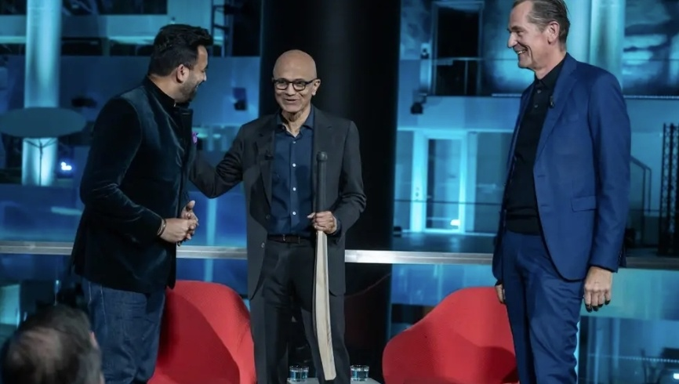
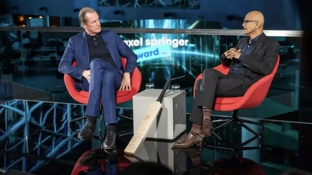
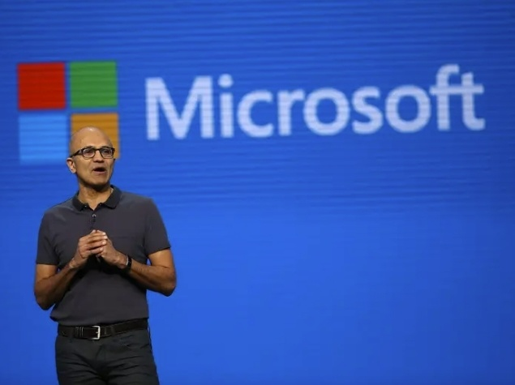
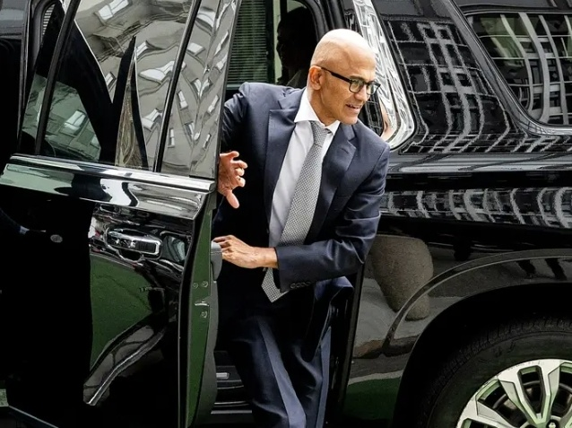
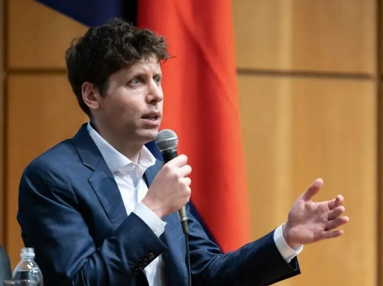
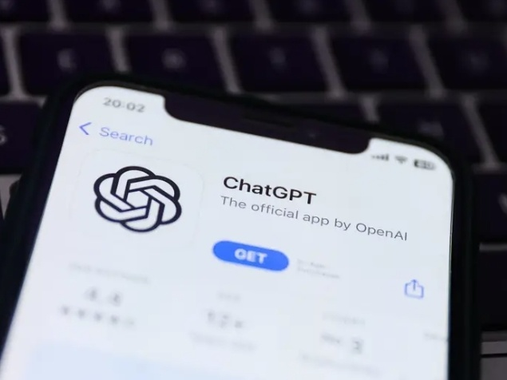

# 微软CEO纳德拉万字专访：我已经历过四次重大技术变革，AI是第五次

**划重点**

  * _1_ 纳德拉是个板球迷，他称自己从中学到很多有关领导力的教训，比如在场上全力以赴，向对手学习，不要畏惧对手。
  * _2_ 对于接任微软CEO，纳德拉透露自己当时也感到吃惊，这之前根本没想过没有盖茨或鲍尔默掌舵的日子会是什么样。
  * _3_ 纳德拉承认，他职业生涯中犯下最大战略失误就是退出移动电话领域。
  * _4_ 纳德拉认为微软的最大机遇是人工智能，这项技术将在推动生产力和沟通方面产生革命性影响，并增强人类的能力。
  * _5_ 对OpenAI投资被认为是纳德拉最成功的决策之一，他在奥特曼首次创业时就与其相识，并始终保持联系。

腾讯科技讯 软件巨头微软首席执行官萨蒂亚·纳德拉（Satya
Nadella）今年获得了2023年度阿克塞尔施普林格奖，这个奖项旨在表彰“在创新、创造和改变市场、塑造文化以及承担社会责任方面表现出卓绝才能的杰出人士。”

在前往柏林领奖时，纳德拉接受外媒专访，谈到了微软与人工智能研究公司OpenAI的合作、收购动视暴雪的交易、微软面临的最大机遇和风险，以及他职业生涯中做出的最好和最糟商业决策等话题。

**以下为专访全文：**

**问：纳德拉先生，全世界都知道你是个铁杆板球迷。尽管板球对德国人来说有点神秘，但我们确实意识到现在是发展板球的大好时机。板球世界杯正在印度举行，还有传言称2036年奥运会也将在印度举行。这对板球迷来说是非常令人兴奋的，因为它可能在2028年被纳入奥运会项目。你能谈谈对这项运动的感受吗？**

纳德拉：作为一个印度人和一个南亚人，我认为这不仅仅是一种宗教。对我们所有人来说，它是伴随我们成长的东西。

**问：关于领导力，你从板球运动中学到了什么？**

我记得有一次，我们在我长大的城市海得拉巴打联赛，当时有一名澳大利亚球员参加了比赛。我们都坐在那里欣赏这个家伙在球场上的表现。我清楚地记得，我的教练站在我身后说：“嘿，别只是远远地欣赏，去比赛吧！”对我来说，这是一种表现自己的绝佳方式：当你在场上时，你会身不由己地全力以赴。向你的竞争对手学习，但不要畏惧你的竞争对手。

我记得的另一件事也是一场比赛，当时我在其中一个队长手下打球。我们的一名球员非常出色，但由于某种原因，他对队长在场上做出的决定感到不满，并故意丢球以表明自己的观点。这真的对我影响很大：这个球员故意让整个球队的士气跌入低谷，只是因为他自己不高兴。我确实认为，在职场中，有时你也会遇到这样的情况：当有人不买你的账时，你就必须采取行动。

我学到最多的是，有一天，我的状态很糟糕，队长把我赶下场。他亲自上场，并取得了突破。但后来他又将我换上场，有趣的是，我在那场比赛中得了很多分。我问他为什么要这样做，让我再次上场，即使我那天的表现很糟糕。他对我说：“在接下来的赛季里，我需要你，所以我不想打击你的信心。”这只是高中的板球比赛，我想：“天哪，这家伙真是个开明的队长。”

因此，从某种意义上说，如果你在领导一个团队，你不只是想要这个团队只取得短暂的胜利，而是要看得更长远些。当我回首往事时，有很多事件给了我很多教训。

**01 被问是否接任CEO时感到不知所措**

**问：你成为微软首席执行官本身就是一个传奇励志故事。从类型上讲，你与前任史蒂夫·鲍尔默（Steve
Ballmer）几乎是完全相反的人，一开始也并不是最受欢迎的人。你们在文化上形成了鲜明的对比，而你以“内部陌生人”的身份成为CEO。**

纳德拉：是的，这是一个很好的描述方式。我在微软工作了很长时间，经历了比尔·盖茨（Bill
Gates）时期，然后是鲍尔默的任期，我自己从未想过，当我某天早上起床的时候，微软突然没有了盖茨或鲍尔默。坦率地说，当鲍尔默宣布他要离开时，我真的感到非常震惊。

我清楚地记得，当时一位董事会成员问我：“你想当首席执行官吗？”我回答说：“除非你想让我当首席执行官。”我也把这件事告诉了鲍尔默，因为董事会成员好像在说：“你知道，如果你想成为首席执行官，你就必须真的有这样的想法。”

但我从来没想过，我有点儿不知所措。鲍尔默是个很有趣的人，他说：“现在改变已经太迟了，所以做你自己，看看会发生什么。”回想起来，我认为董事会在继任过程中做了他们必须做的事情：他们广泛地观察了外部，深入地观察了内部，然后做出了决定。

**问：有这样一个故事：在1992年加入微软之前的一次面试中，有人问你：如果你发现一个孩子在街上尖叫，你会怎么做？你说你会拨打报警电话。这个故事是真的吗？**

纳德拉：这个问题我记得很清楚，因为那天有很多编程问题。我不得不一直编写代码，当时把我累坏了。然后，最后一个人问道：“如果你在过马路的时候，有个小孩倒在地上哭，你会怎么做？”我回答说：“我会去最近的电话亭（那时候还没有手机），然后拨打911。”面试官随后站起来说：“你可以走了。当孩子哭的时候，你应该把他抱起来，给他一个拥抱，你需要有同理心。”我当时以为，自己永远也找不到工作了。

**02 父母寄予厚望，房间中贴财富女神海报**

**问：你是一个非常理性的人吗?**

纳德拉：这些年来，我对世界和周围的人有了更多的理解和同理心。如果你像我一样，作为一名工程师接受培训和成长，那么你会认为自己的目标是变得更加理性。但在现实中，正如赫伯特·西蒙（Herbert
Simon，诺奖得主）所言，我们只是在某种程度上保持理性。因此，我认为能够将理性与自己对周围世界的理解和同情结合起来并没有什么坏处。生活的经验告诉我们，如果身边没有善意的人，我们谁也活不下去。

**问：你父母对你的期望很高吗？曾有一种说法，你的父亲在你的房间里放了一张卡尔·马克思（Karl
Marx）的海报，因为他想让你成为一名哲学家。而你的母亲则放了一张拉克希米（Lakshmi）的海报，她是美丽、爱和财富女神。**

纳德拉：是的，没错。有趣的是，我的父母都以自己的方式取得了成功。我父亲是一名公务员，还有点马克思主义经济学家的味道。我母亲是梵语教授。当然，他们都对我寄予厚望。他们希望我有学习和成长的空间，而不仅仅是跟随发生的事情。当我回首往事时，作为一个在印度长大的中产阶级孩子，他们给了我更多的空间来发展自己的兴趣，追随我自己的激情，并在没有任何灌输的情况下形成我自己的世界观。

**问：你觉得自己有一个快乐的童年吗?**

纳德拉：是的，当然。

**问：你是否总能感受到被爱，无条件地被爱？**

纳德拉：绝对如此，一点儿没错。

**问：你认为无条件的爱是未来个性发展的一个重要因素吗，因为你自己可以确信这一点?**

纳德拉：我对此想了很多。如果你在家里有一个充满爱的环境，那就会给你信心去应对这个世界和它带来的挑战。这有带来很大的不同。我确实认为无条件的爱和支持是我们发展的重要组成部分。如果你成长在这样一个家庭里：父母对你的成功投入很大，不太看重结果，而是更注重给你最好的机会，那么你可能在今后的人生中取得巨大的突破。

**03 脑瘫儿子出生，瞬间顿悟改变了自己的人生**

**问：2022年时，你的儿子去世了，年仅26岁，他生来就患有脑瘫。这在多大程度上影响了你，影响了你对家庭、无条件的爱和领导风格？这些有关联吗？**

纳德拉：当然，赞恩（Zain）的出生让我和妻子快速成长起来。坦率地说，在那短时间，我从妻子那里学到了很多东西。我当时29岁，她27岁，如果你在孩子出生的前一天问我，我们最担心的是什么，我会说是我妻子回去工作，我们在哪里可以得到托儿服务等等。后来赞恩出生了，我们的生活发生了很大的变化。尽管他的情况对我来说很难接受，但很明显，赞恩的生活将充满挑战。所以，我们真的需要做好准备，尽我们所能帮助他。

在很长一段时间里，我都为此感到苦恼，甚至怀疑人生：“为什么这种事会发生在我身上？为什么这件事现在打乱了我对生活的所有计划和想法？”然后我看着妻子，她早上起床，放弃了建筑师的工作，她去了西雅图地区寻求所有可能的治疗方案。她完全是全身心投入。

我突然意识到，我身上什么都没发生，是我儿子出了问题，作为一个父亲，我需要在他身边支持他。这花了我很多年时间，但这不像是瞬间的顿悟。但我得说，在这个过程中，我成长了很多。我知道这改变了我作为一个领导者的风格，也从根本上改变了我这个人。

**问：你会说这让你更懂得感恩，甚至更谦虚吗？**

纳德拉：是的，我认为它帮助我培养了同理心，让我明白，我可以通过儿子的眼睛看世界，而不是只通过我自己的眼睛。我认为，这开始对我在职场上的表现产生了真正的影响，如何作为丈夫出现，如何以朋友、儿子、经理和同事的身份出现。它从根本上改变了我：当别人经历一些事情时，我可以与之产生共鸣。当有人说些什么时，我不会纯粹从我的角度来看待它，而是试图从对方的角度考虑，他们的生活中发生了什么。坦率地说，当我儿子还小的时候，我工作中的几个上司都给了我很大的灵活性和回旋余地，这确实影响到了我。我只是一个无名小卒，只是公司的低级主管，当时的许多经历塑造了我想成为的那种人。这是一个决定性的时刻。

**04 最成功的文化决策：将同理心视为硬技能**

**问：作为一名领导者，你要有足够的同理心和决心，将微软的文化从刻板和男性化转变为更加开放和理解的文化，更多地关注软技能，而不是绩效KPI，这是你作为CEO最大的成功和关键成就之一。你帮助将微软市值从4000亿美元提高到大约2.5万亿美元，分析师们乐观地认为它还会进一步增长。在你看来，你做过的最重要的文化决策是什么?**

纳德拉：同理心通常被视为一种软技能，但我实际上认为它是一种硬技能。这与设计思维有关。我一直认为，设计思维是一种满足未被满足、未被明确表达的需求的能力。因此，有能力吸收正在发生的事情，然后构思创新，在某种意义上，这来自于对要完成的工作有深刻的同理心。这就是为什么我认为，这是一个非常重要的成功和创新技能。但是，回到你关于文化的问题：到20世纪90年代末，微软取得了巨大的成功。事实上，我们成为了市值最高的公司。当这种情况发生时，许多人开始自满。但我认为，我们需要一个非常重要的转变，摒弃“万事通”（know-
it-all）的观念，转而拥抱“了解学习一切”（learn-it-all）的态度。

幸运的是，在我成为微软首席执行官的前几年，我读过卡罗尔·德韦克（Carol
Dweck）写的《心态》（Mindset）一书，后者谈到了“成长心态”。在学校环境中，你可以通过帮助孩子从错误中学习来真正鼓励他们拥有成长的心态。当他们不是什么都懂，而是什么都学的时候，他们就会更成功。我觉得这也适用于CEO和整个公司。所以，我们选择了成长心态的文化模因。

**05 职业生涯中犯下最大战略失误：退出移动电话领域**

**问：你在职业生涯中犯过的最大的错误是什么？你从中学到了什么？**

纳德拉：我希望自己能说我只犯了一个错误，但实际上我犯了很多很多错误。我想说，我最大的错误可能都是关于人的。

**问：没选对人还是留错了人?**

纳德拉：文化的管理以及作为领导者的标准，成为最重要的事情。因为每个人都能感觉到你所说的和所做的之间存在区别。多年来，我有时会说一些话，但并不是真心的。然后，这就不管用了。这就是为什么让你想的、说的和做的保持一致是多么困难的原因。这并不容易，毕竟说起来容易做起来难。

**问：回想起来，有没有什么真正的战略失误或错误的决定让你感到后悔？**

纳德拉：我想很多人都在谈论的一个决定，也是我成为首席执行官后所做的最困难的决定之一，也就是退出当时我称之为移动电话的领域。回想起来，我认为我们本可以通过重塑个人电脑、平板电脑和手机之间的计算类别来实现这一目标。

**06 最好决策：建立专门高管团队代替创始人**

**问：到目前为止，你认为自己做过的最好的决定是什么?**

纳德拉：我认为最好的决定是公司的运营模式。我意识到，我是在接替一个创始人的职责，但我不能像创始人那样经营公司。我们需要一个由高层领导组成的团队来管理公司，他们需要对整个公司负责。即使是高层领导人也不能被孤立，他们需要脚踏实地。所以我们找到了一种合作的方式：过去曾有这样一种描述，把微软讽刺成一堆孤岛，我认为这是不公平的。通过展示我们是一个团队，以我们自己的方式灵活工作，同时执着于我们的最终目标，从而揭穿了这一点。我认为，这可能是最重要的事情。

**问：这在最初引发了争议吗?**

纳德拉：它是新的战略。在微软发展过程中，我们未曾遇到这样的事情。当我们回顾过去的时候，盖茨和鲍尔默手下有很多管理团队来了又走。但他们始终在掌舵，他们保持头脑的一致性，可以管理各项业务。但在任何时候，他们都需要伟大的球员。他们不需要团队。然而，我们需要一个管理团队。

**07 最大机遇和最大危险：人工智能**

**问：现在，微软收购动视暴雪的交易终于获得了批准，为何这笔价值650亿美元的交易如此重要？**

纳德拉：尽管收购的价格很高，但我们真的为此感到兴奋。对于我们来说，有几件事可以追溯到我们公司成立之初。游戏就是其中之一，对吧？当提到微软时，人们可能会想到开发者工具、专有软件和游戏。这是我们从一开始就在做的三件事。因此，对我们来说，游戏是我们认为自己可以在消费市场做出真正贡献的一个领域。如果仔细观察，你会发现人们花在游戏上的时间正在增加，而Z世代会花更多的时间在游戏上。游戏的制作方式和分发方式正在发生根本性变化。无论是移动设备、游戏机、个人电脑还是云计算，都是如此。所以，我们期待着作为游戏制作商和发行商的双重身份。现在，我们将成为最大的游戏发行商之一，也是一家为游戏搭建平台的公司。

**问：你认为微软最大的潜力在哪里？**

纳德拉：对我来说，我们拥有的最大机会是人工智能（AI）。就像云计算改变了每一个软件类别一样，我们认为人工智能就是这样一个变革性的转变。无论是在搜索还是我们的Office软件中都是如此。我们创建文档和电子表格或使用信息的方式正在发生根本性的变化。因此，我们正在引入的Copilot概念在推动生产力和沟通方面将真正产生革命性的影响。软件开发也是如此。而事实上，人工智能Copilot可以增强人类的能力，无论是一线工作还是知识工作，这将是最大的转变。

**问：我们稍后再谈人工智能。你认为微软面临的最大颠覆风险是什么？你最害怕的是什么？**

纳德拉：我一直在寻找两样东西。在科技行业，没有特许经营价值（franchise
value）这回事。我们已经历了四次重大的技术转变：首先是个人电脑和Windows占据了主导地位，然后是网络发生了明显变化，最后是移动和云计算领域，现在则是人工智能。我非常关注从根本上改变所有类别的技术转变。如果你不适应新的技术转变，那么你可能会失去一切。技术上的转变是一个方面，另一个是商业模式的转变，你不能真的指望未来的商业模式和过去的商业模式完全一样。云计算就是一个很好的例子。我们有一个非常棒的服务器商业模式，而云计算完全是颠覆性的。我认为，这是需要注意的事情。

**问：开源对微软来说攸关生死存亡吗？**

纳德拉：我们在早期是这么想的，而且确实如此。在某种意义上，开源是专有软件中最大的监控者，或者说速率限制者。事实上，我从小就在Unix和Linux的后端服务器上做过很多Windows和Windows
NT的中断工作。然后我意识到，我们与开源的互操作越多，对我们的业务就越有利。

**问：你是说我们应该接受开源吗？如果你看到威胁、危险或挑战，你倾向于接受它，而不是与之抗争?**

纳德拉：是的，我用非零和的方式处理问题。所以，每当我面临挑战时，我都非常清楚的意识到，在商业中，有时我们所有的东西都是零和的，而在现实中，很少有事情是零和的。我学到的一件事，至少是作为一名商业战略家，对零和战争是什么非常清楚，然后在任何地方寻找真正的非零和结构。开源就是这样一个东西。事实上，我们是今天最大的开源贡献者。显然，GitHub是开源的发源地。

**问：杰夫·贝索斯（Jeff
Bezos）曾说过一句名言：“总有一天亚马逊会破产！”到目前为止，在商业历史上，所有的公司都没有逃脱破产的命运。这对微软来说也是如此，还是微软会大而不倒？**

纳德拉：不，没有任何企业能够永久存在下去。只有当它们服务于某些社会目的时，例如，创造一些创新和有趣的东西，它们才应该继续经营下去。企业应该立足于它们是否在做任何与世界相关的事情。永远生存下去不是一个目标。

**08 不确定何时退休，已经有继承人**

**问：你想担任微软首席执行官多长时间？你为自己设定的目标是什么？**

纳德拉：现在，我忙得不可开交，无法考虑接下来会发生什么。我担任CEO已经快10年了，但我坚信这样一种观点：你所建立的机构力量只有在你离开后才会显现出来。当我看到鲍尔默离开的时候，我觉得微软是一家非常强大的公司，我可以接手，做我需要做的事情。因此，如果我的继任者非常成功，那就表明我做了些有用的事情。我一直在思考如何建立机构力量来重塑自我。这是最棘手的部分，这不是要延续某些传统，而是要有能力重塑自己。

**问：一旦你意识到自己无法重塑自我，你就应该退休，这样理解对吗？**

纳德拉：说得好。是的，我认为每个人都会有需要重塑自我的时候。

**问：你在公司里有潜在的接班人吗?**

纳德拉：绝对有。我认为有很多人，我相信当时机到来时，董事会会做好他们的工作。我们非常清楚，这不是关于我、关于一个人、一种文化或个性的，而是关于一个有许多领导者的公司的，他们都非常非常有能力。

**问：作为一名CEO，以及在担任这个角色卸任后的一段时间，你可以为社会回馈什么?**

纳德拉：我和妻子都有过和儿子在一起的经历，我们非常感谢所有在艰难时期支持我们的机构、人和社区。因此，我们非常非常热衷的一件事是，我们能为有特殊需要的孩子的家庭做些什么。我们与西雅图的儿童医院以及许多其他非常支持我们的机构进行了广泛的合作。作为一个有特殊需要的孩子的工薪阶层的父母，你不可能一边工作一边照顾孩子。我认为这是最困难的挑战之一。另一个领域是第一代教育，因为教育是社会流动的最佳工具。在我就读的威斯康辛大学，我们非常注重帮助第一代孩子获得STEM学位，这样他们就能获得更好的工作机会。

**问：我们来谈谈商业道德的问题。米尔顿·弗里德曼（Milton
Friedman，诺贝尔经济学奖得主）曾经说过一句名言：“生意就是赚钱。”我认为，当前的冲突表明这不是真的，或者至少不再是真的。我们能从中吸取什么教训?**

你提到了两件事，我认为这两件事都值得讨论。一个是，做生意只为赚钱？我确实这么认为。我之所以这么说，从根本上讲，是因为有时候商业领袖会非常非常困惑。一家公司的社会目的是能够创造有用的产品，为股东创造利润。所以，事实上，如果你还记得弗里德曼，他的全部理论依据是因为很多首席执行官和公司都陷入了混乱，他们在如何分配资本和为股东服务方面没有受到纪律约束。

话虽如此，我们毕竟生活在现实世界中，这也是你的观点。因此，作为一名商业领袖，你不能以某种方式认为生意就是为了赚钱，而忽视世界的地缘政治。从长远来看，它会反过来对你造成重创。如果你没有一条有效的供应链，或者因为地缘政治而断裂，那你就麻烦大了。因此，关于你的观点，甚至你的书都在说：作为一个商业领袖，你需要以你可以在哪些国家开展业务为基础。在某些地方，你可能无法开展业务，因为国家之间存在价值观冲突。

**问：我们不能容忍双重标准。一方面，我们每天都在收紧我们的ESG标准，同时却将大部分业务转移到同性恋非法的国家，或者女性可能因通奸而被石头砸死的国家。它们不能一起出现，我们必须找到一个中间立场。**

纳德拉：没错。这是一个有趣的问题：作为一家跨国公司，我们的角色是什么？我们有一套普世的价值观吗？他们是如何处理文化差异的？你如何不试图取代民主进程？作为一家跨国公司，或者更确切地说，作为一家美国公司，我的做法是，我们必须接受美国的核心价值观，但同时又要适应世界的现状。你必须明白，将会有巨大的文化差异。你有一套赖以生存的价值观，但作为一家跨国公司，你不能命令任何国家的人民选择相信什么或不选择相信什么。与此同时，作为一家公司，你仍然可以坚持自己的价值观，我认为这是一个重要的区别。

**09 不同意马斯克观点，在人工智能方面需全球合作**

**问：你对10年后我们与世界第二大经济体中国的经贸关系有何预测？美国是否会单方面与中国脱钩？它会成为一个更大的民主国家之间的团结联盟与中国对抗，还是将继续像往常一样与中国做生意，一切都会好起来？**

纳德拉：我希望自己能预测未来，但这是全世界的问题。我内心深处总在说："天啊，到底怎么了？"如今，脱钩显然似乎是一种普遍看法。

**问：我们会看到两个人工智能世界强国在新的人工智能竞赛中相互竞争，形成某种形式的双头垄断吗？或者你认为将来有一天我们会有单方面的人工智能治理和基础设施，这是可以想象的吗？**

纳德拉：我确实认为需要某种程度的全球治理。在我看来，会有一些竞争。但如果要成功的，让我们称之为对人工智能的“控制制度”，那么我们将需要一些像国际原子能机构这样的全球合作。你知道，我们在原子领域所做的可能是人工智能领域的道德等价物，中国也要参与其中。

今天，我们有现实世界的担忧。在美国和欧洲，我们谈论的是诸如偏见、虚假信息、经济和就业等真正现实的问题。这些都是我们必须以现实世界的方式处理的事情，这样人工智能才会真正有帮助。这些就是我们今天要处理的事情。然后从长远来看，存在人工智能失控的生存风险。因此，我认为至少在人工智能治理方面，我们可以找到共同点。

**问：埃隆·马斯克（Elon Musk）曾说过，相比核武器，他可能更害怕人工智能。你同意吗?**

纳德拉：问题在于，你很容易就会开始认为自我改进、自我复制的软件是你完全无法控制的东西。至少，这是一个你会开始产生一些可怕想法的领域。我自己的感觉是，归根结底，我们会有很多方法可以解决这个问题，其中控制是内置的。看看汽车：你可以说，汽车可以像上帝一样。它们可能到处都是，从人身上碾过，制造事故。然而，我们已经制定了许多规章制度和安全标准。尽管仍有很多人死于汽车事故，但我们已经能够非常有效地利用这项技术。所以，我希望我们能对人工智能做同样的事情，而不是仅仅把它当作一种生存风险。

**问：这里的关键因素之一不就是竞争吗？只要我们有各种各样的参与者，它失控的可能性就比只有一两个实体参与要小得多。**

纳德拉：你可以用两种方式来论证，不是吗？如果有几个参与者，你可以控制他们。但对于许多参与者来说，控制难度更大。最终，我们拥有的唯一机制就是政府。我们可以谈论很多事情，但在我们的体系中，七国集团有一套标准。这就是为什么我认为美国和欧洲可以发挥巨大作用的原因。

**问：我听到美国联邦贸易委员会（FTC）主席莉娜·汗（Lina Khan）说，我们需要一个跨大西洋解决方案。你同意吗?**

纳德拉：百分之百同意。我相信，我们在人工智能领域越能实现全球标准就越好。要使全球标准发挥作用，美国和欧洲必须携手合作。

**问：我想从出版商的角度，或者说从所有创意产业的角度来探讨一个话题。对于那些创造知识产权的人来说，他们继续工作的动力是非常重要的。所以，这背后必须有一个商业模式。你是否知道大型人工智能公司是否以及如何帮助这些企业保持商业模式，并在使用他们的IP时获得回报？**

纳德拉：这是正确的。其核心是，这里的价值交换必须更有利于出版商。我们知道，在互联网的当前状态下，有几个聚合点是大部分经济租金的收集地。从经济角度来看，只有很少的面包屑被扔给其他人。我觉得，如果在任何聚合点都出现更多竞争，无论是社交媒体，还是其他流量来源，直接受益的人将是出版商。被人们用作聚合点的大语言模型越多，这些模型就越能把流量拉回来。这对出版商来说是件好事。

**问：那你知道具体怎么做吗?**

纳德拉：我认为这里有两件事：一是，在像BingChat这样的大语言模型中，我们至少试图确保所有的响应都是链接式的。我们的目标是首先与我们的出版商签订合同，并找出我们是否可以通过引用和链接来拉动流量。二是考虑与发行商的广告收入分成。我觉得这是我们的出发点，我们正在一起做的很多事情都建立在这个基础上。接下来会有一些复杂的情况。毕竟，通过合成数据训练，我认为我们的动机是创造更多的合成数据。如果你是在合成数据上训练，没有稳定的相似性归因，这就变得很困难。因此，我们必须注意一些技术颠覆。事实是，如果没有价值交换，没有出版商会允许你抓取他们的内容，而价值交换必须以两种形式出现。一个是流量，另一个是收入分成。

**10 奥特曼首次创业即相识 承认谷歌依然太强大**

**问：你最大的成功之一就是对Open AI的投资。你能给我们介绍一下这件事的来龙去脉吗？你和萨姆·奥特曼（Sam Altman）的谈话进行得如何?**

纳德拉：我认识奥特曼很久了。我在他第一次创业时就认识他，多年来也始终与他保持联系。我们从2016年开始与奥特曼合作，成为首批给予他们大量信用的云计算服务提供商之一。在2018年或2019年，奥特曼找到我们，说他们需要在计算方面获得更多投资。

**问：那时候它不是一个非盈利项目吗?**

纳德拉：是这样的。我认为，从根本上说，他们仍然是非营利性阻止，但他们需要创建一个营利性的实体，这样才能为计算提供资金。我们真的很愿意在这个当时本质上还是非营利性的实体上赌一把。事实上，我们能够建立并让Copilot和ChatGPT启动并运行，这让我坚信，这一代人工智能及其所做的事情会有所不同。它在GitHub中的应用让我更有信心，你可以构建些真正有用的东西，而不仅仅是技术上的突破。所以，我们正全力以赴。

**问：很多年前，你告诉我，你们有理由在搜索领域与谷歌展开竞争。你曾经说过："我想让谷歌跳舞！" 谷歌开始跳舞了吗?**

纳德拉：还没有。我认为，当你在全球搜索市场占有3%的份额时，要和拥有97%份额的公司竞争，即使是一点点的增长，也会让人兴奋不已。但谷歌是一家非常强大的公司，他们将会变得更加强大。巴德（Bard）已经是一款竞争力强大的产品，他们还有新的多模态模型Gemini。谷歌在这方面有很多结构性优势：他们已经占据主导地位，他们控制着安卓生态系统和Chrome。我总是说谷歌在Windows上赚的钱比整个微软都多。

**问：但谷歌必须学会自我颠覆。基本上，生成式人工智能聊天机器人有可能取代我们所知道的搜索。至少我是这么用的。过去，每当我有问题时，我总是用谷歌来搜索。现在我把它放到Bing
Chat或巴德中。这创造了一种不同的用户行为，最终可能导致用户习惯发生根本改变。你同意吗?**

纳德拉：我同意。我认为你从根本上说到了用户习惯的改变。但事实证明，这比你想象的要困难得多，因为谷歌的优势是谷歌搜索的默认性质。这是一种根深蒂固的搜索习惯，而且变化非常缓慢。但话虽如此，今天我们很多人都利用Bing
Chat或ChatGPT或Bard来回答问题。我认为情况正在改变，但这是一个缓慢的转变。谷歌可以实现这一转变，他们也非常致力于实现这一转变。你说得对，他们的商业模式必须从根本上改变。这有点像我们在Windows上所做的事情。我们曾经拥有一种非常棒的商业模式，直到它不复存在。因此，我认为谷歌将面临更多的挑战，从长远来看，它将不得不从根本上重新思考其商业模式。但他们绝对会领先一步，因为他们已经拥有了庞大用户。

**问：但是事情发展得太快了。我不知道你有时会不会用Any
Call。这是一个很好的功能，你可以发出一个语音命令或提出一个问题，即使是非常复杂的问题，你也能立即得到答案。没有人知道用户的习惯会如何改变。你有什么愿景吗？对于我们习惯的未来，你最激进、最具颠覆性的愿景是什么?**

纳德拉：以Copilot为例：我们构建它的方式表明，我想用它来计划假期，或者购物、编写代码，亦或者为会议做准备。对我来说，这就像是私人经纪人。它有点像最初的个人电脑，它会赋予你能力去做一些事情。现在，Copilot在很多方面都像个人电脑。你可以简单下达指令，比如给我写一份文件，我要见马蒂亚斯，请为我的会议做好准备，给我带来所有来自合作伙伴关系的邮件摘要等。这有点像问一个助手，一个聪明的分析师，关于你想要的所有东西。

**问：我觉得很有趣的是，我们人类现在正试图通过定义人工智能可以做什么或不能做什么来应对这种颠覆性的变化，这可能比互联网的发明或汽车的发明更重要。我不断发现自己好像错了。几个月前，我认为人工智能不会有或创造情感。但人工智能做得非常好，甚至可能比人类更好，人类有时不擅长伪装情绪。或者以创造力或幽默为例，我们总是说人工智能不能做到这一点，但这也不是真。你今天看到了什么限制吗？或者你认为我们应该如何进行定义？**

纳德拉：在我看来，作为一个致力于创造更强大、更有能力的人工智能的人，我不会反对它。相反，我的问题是，人类将如何利用更有能力的人工智能？

**问：你的意思是，有人工智能还是没有人工智能，毕加索的表现会更好？**

纳德拉：如果我们有了新工具，我们会用它做什么？我们会用汽车做什么？我们用飞机做了什么？今天我们能用电脑做什么？我们做了很多有趣的事情。我敢打赌，以人类的聪明才智，他们会用这个新工具来做事。对我来说，最令人兴奋的一件事是，如果你仔细回想，80亿人的口袋里可以有医生、管理顾问、家庭教师等等。这是一种真正的知识民主化。

**11 没有经历过恐惧的人就不会有勇气？**

**问：英国人工智能专家穆斯塔法·苏莱曼（Mustafa Suleyman）相信，人工智能在这种情感背景下尤其强大。你同意他的观点吗?**

纳德拉：我认为从某种意义上说他是对的。我们始终在与Epic软件合作，它是美国最大的医疗独立软件提供商之一，每个人都在使用。美国医疗保健系统的很大一部分使用他们的医疗记录系统。他们告诉我，有些医生发现人工智能为他们创作的草稿很有同理心。人类在表达自己的方式上有时是不一致的，而人工智能可以更加一致。例如，在写职位描述时，它可以确保职位描述包含了所有性别和信仰的人，而不存在偏见。所以，我认为人工智能实际上可以在很多方面帮助我们更有同情心，更了解这个世界。

**问：我最近采访了我们公司的创始人阿克塞尔·斯普林格（Axel
Springer）的虚拟人，并问了他一些关于文化和软因素的棘手问题。不得不说，他的回答比我的更有说服力。你认为人类最终会为机器服务而不是机器为人类服务时，这其中存在什么危险吗？**

纳德拉：这是一个问题，也就是，你如何保持控制？归根结底，我们如何确保人工智能不会操纵人类，即使在这种同理心的认知背景下。它不能用它的软技能来操纵人类。所以，
我认为将会有关于软件及其验证的这种级别的思考：如何部署它，如何监控它，会发生什么不利活动。这些都属于前沿领域，被认为是对齐挑战。另一个挑战是理解人工智能如何在盒子里做出自己的决定。

**问：它是在有意识地思考吗?**

纳德拉：这就是问题所在。我们甚至还没有完全理解意识是什么。你可以从神经科学的角度来看，但我们能否从数学上或机械上理解大语言模型是如何进行预测的？这是科学的前沿，还有很多工作要做。你必须非常清楚地意识到，你如何以人类机构和人类处于循环中的方式来部署我们今天拥有的东西。事实上，人类的能动性和判断力在很大程度上是这个循环的一部分。我们不能失去控制。

**问：如果人工智能具有如此强高的智商(IQ)和情商(EQ)，甚至擅长创造、幽默、自我完善和加速进步，那么人类还能控制剩下的哪些智能领域？你对人类未来几十年的工作重点有什么建议?**

纳德拉：看看倒置教室的新例子。人们在说：“看，我们知道你要用大语言模型中的一个，比如Bing
Chat或ChatGPT，来完成你的作业。我们想知道的是提示。我们会给你答案，现在告诉我们提示。”这就是批判性思维，因为你能学到更多。我认为，批判性思维、良好的判断力、如何以广泛的方式思考以及不害怕学习，可能会带来更多好处。我有时对自己说：“天哪，我真希望我能多了解些生物学。”现在，我可以问些愚蠢的问题，让别人按我的节奏解释。我们消费更多知识和发展自己的知识库的能力可以得到提高。我认为，拥有这个强大的工具会产生很多有趣的影响。

**问：一点儿没错。你在2017年写了名为《刷新》(Hit
Refresh)的书，并在书中定义了几条关于优秀领导力的规则。其中一个是，即使你害怕挑战，也应该接受挑战。这是否意味着害怕或感到恐惧是有益的呢？**

纳德拉：绝对的。从某种意义上说，比如，对你所处的环境，对世界所处的环境，对公司所处的环境感到不舒服，会让你质疑如何才能变得更好。有时，摆脱自己或他人的限制，可以帮助你构思一些新方法、新技术或新投入。我觉得这是我们的工作，不是吗？领导力就是要直面一些恐惧和不适。

**问：这可不可以延伸下，一个没有经历过恐惧的人就不会有勇气？**

纳德拉：我从来没想过这一点，但我认为这是一个很好的描述方式。你需要勇气，每天都需要勇气。勇气会帮助你克服恐惧。（文/金鹿）

