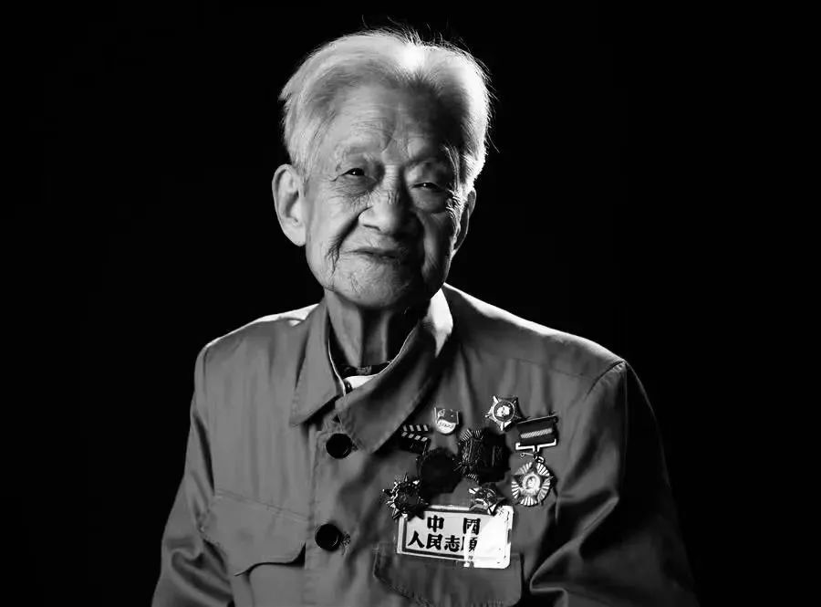
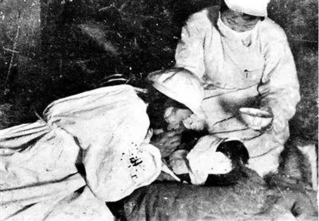
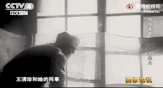

# 老英雄王清珍逝世，曾为黄继光整理遗体

据微信公众号“孝感广电”消息，抗美援朝老英雄王清珍10月27日在湖北孝感逝世，享年87岁。

王清珍出生于1936年，是中国人民志愿军15军45师一名卫生员，也是电影《上甘岭》中卫生员王兰的人物原型。

在上甘岭战役期间，担任卫生员的她，曾经为“特级英雄”黄继光整理遗体。

_王清珍 图源：孝感广电_

据央视新闻报道，王清珍15岁跟随中国人民志愿军进入朝鲜。1952年10月，上甘岭战役打响。王清珍与其他卫生员一道，投入到紧张的战地救护工作中。最艰苦时，她一个人要照顾20多名伤病员。

战场上物资匮乏，没有水，王清珍就融化雪水泡干粮；没有烧水壶，她用罐头盒代替；没有绷带，她就用敌军投放照明弹的降落伞布条包扎伤口；没有药棉，她就拆了棉衣取出棉花处理后使用。

指挥上甘岭战役的秦基伟将军曾在回忆录中写下这样一段话——“有一个女战士使我印象至深，她叫王清珍，只有十七岁，她在五圣山后面的坑道病房，护理二十多个重伤员。这个姑娘为了解除战友的痛苦，帮助伤员排尿，情操之高尚令人肃然起敬。”

 _王清珍正在护理伤员。图源：央视新闻_

上甘岭战役中，黄继光英勇牺牲。王清珍和战友们的首要任务，就是尽快整理烈士遗体。

在一间炸坏的民房里，王清珍和战友们用温水将黄继光身上已经凝固的黑血块清洗干净。他们含着眼泪，将黄继光被打穿的胸膛缝合好，并为他换上了一身新军装。

王清珍曾回忆，见到遗体时，黄继光的双手仍然高举着，保持着牺牲时的姿势。他的身体完全被子弹打穿了，胸口留下了碗口大小的贯穿弹孔。

 _图源：央视新闻_

1953年3月，王清珍以出色的表现荣立了二等功，被授予二级战士荣誉勋章。

1958年，王清珍复员回到北京一家医疗器械厂，成为一名普通工人。1961年，王清珍响应军队号召，再次入伍，一直在部队从事卫生工作，并于1962年10月加入中国共产党。

退休后，王清珍参加了“老战士革命传统报告团”，传颂“上甘岭”精神。她还经常义务为困难群众治疗病痛，乐善好施，扶贫济困。

2021年11月，王清珍被退役军人事务部、中央军委政治工作部评为“先进军休干部”。

此前接受媒体采访时，王清珍说自己只是万千战士中的普通一员。

“电影《上甘岭》中的王兰是一个代表。在真实的战争中，还有更多跟我一样的女卫生员。她们都做得很好，她们都是王兰的原型。我只是做了自己该做的事。”王清珍说。

