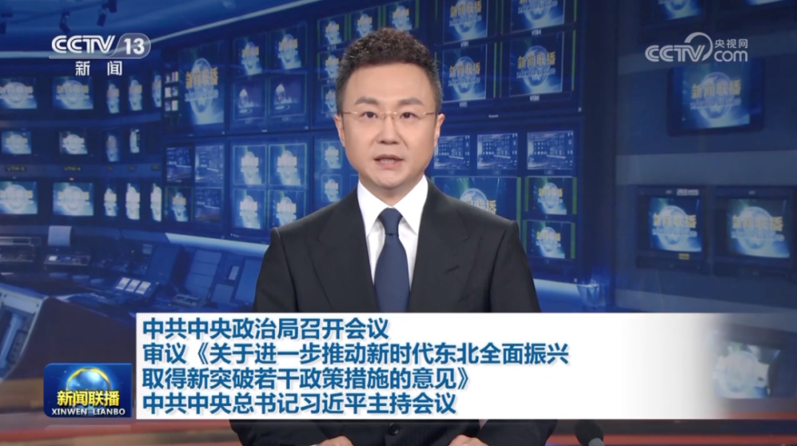
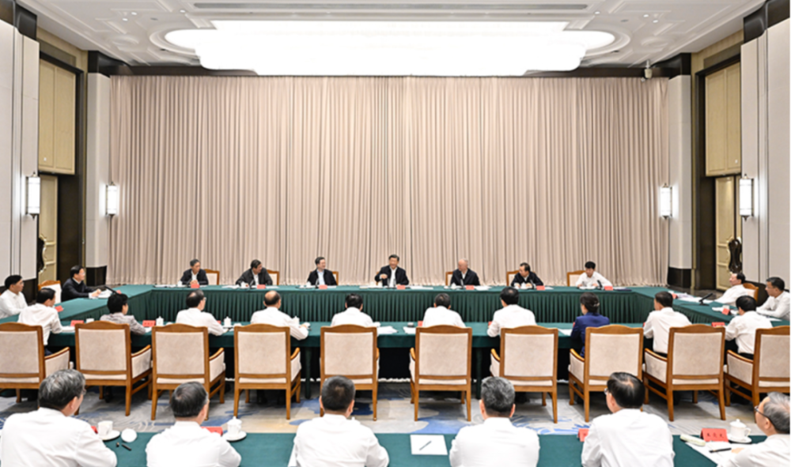

# 高规格座谈会召开后，中央政治局会议审议重要文件，释放新信号

**撰文 | 高语阳**

新华社消息，10月27日，中共中央政治局召开会议，审议《关于进一步推动新时代东北全面振兴取得新突破若干政策措施的意见》。中共中央总书记习近平主持会议。

此前，今年9月，习近平在黑龙江省考察期间，在哈尔滨市主持召开新时代推动东北全面振兴座谈会并发表重要讲话。

重要背景

**这是二十届中共中央政治局第十次召开会议。**

历次二十届中央政治局会议中，主要内容包括审议相关文件的有6次，分别是：

2022年10月25日，二十届中央政治局召开首次会议，审议《中共中央政治局关于加强和维护党中央集中统一领导的若干规定》《中共中央政治局贯彻落实中央八项规定实施细则》；

2023年3月30日，二十届中央政治局召开会议，审议《领导干部报告个人有关事项规定》；

6月30日，二十届中央政治局召开会议，审议《关于支持高标准高质量建设雄安新区若干政策措施的意见》；

8月31日，二十届中央政治局召开会议，审议《干部教育培训工作条例》、《全国干部教育培训规划（2023—2027年）》；

9月27日，二十届中央政治局召开会议，审议《关于二十届中央第一轮巡视情况的综合报告》；

10月27日，二十届中央政治局召开会议，审议《关于进一步推动新时代东北全面振兴取得新突破若干政策措施的意见》。

**政知君注意到，上述会议中，围绕支持推动地方发展审议推出一揽子政策的共有2次，分别是支持高标准高质量建设雄安新区，以及进一步推动新时代东北全面振兴。**

这并不是十八大以来中央政治局会议首次审议关于东北振兴的相关文件。

2015年12月30日，十八届中共中央政治局会议审议通过《关于全面振兴东北地区等老工业基地的若干意见》。

党中央重大战略决策

今年是东北振兴战略实施20周年。

**10月27日的中央政治局会议指出，推动东北振兴是党中央作出的重大战略决策。东北地区资源条件较好，产业基础比较雄厚，区位优势独特，发展潜力巨大，在国家发展大局中具有重要战略地位。**

**今年是东北振兴战略实施20周年，新时代新征程推动东北全面振兴，面临新的重大机遇，制定出台一揽子支持政策，对于进一步坚定信心，充分发挥东北比较优势，推动东北走出一条高质量发展、可持续振兴的新路，具有重要意义。**

2003年10月，中共中央、国务院正式印发《关于实施东北地区等老工业基地振兴战略的若干意见》，制定了振兴战略的各项方针政策，吹响了振兴东北老工业基地的号角。

2015年7月，习近平在吉林省调研期间，专门在长春市召开部分省区党委主要负责同志座谈会，东北三省及内蒙古自治区党委主要负责同志在会上发言。

习近平指出，振兴东北老工业基地已到了滚石上山、爬坡过坎的关键阶段。

2018年9月，习近平在东北三省考察，并在辽宁省沈阳市主持召开深入推进东北振兴座谈会。

会上，习近平指出，新时代东北振兴，是全面振兴、全方位振兴。

**今年9月，习近平在黑龙江省考察，并于9月7日下午在哈尔滨市主持召开新时代推动东北全面振兴座谈会并发表重要讲话。**

中共中央政治局常委、中央办公厅主任蔡奇，中共中央政治局常委、国务院副总理丁薛祥出席座谈会。

辽宁、吉林、黑龙江三省省委书记和内蒙古自治区党委书记参加新时代推动东北全面振兴座谈会并发言，就推动东北全面振兴汇报工作情况、提出意见建议。

座谈会上，习近平强调，当前，推动东北全面振兴面临新的重大机遇。

“相信在强国建设、民族复兴新征程中，东北一定能够重振雄风、再创佳绩。”习近平指出。

强化东北战略支撑作用

**这次中央政治局会议指出，要强化东北的战略支撑作用。**

会议还从六个方面提出具体要求：

要以科技创新推动产业创新，改造提升传统制造业，积极培育战略性新兴产业和未来产业，增强发展新动能；

要发展现代化大农业，提高粮食综合生产能力，加强粮食稳产保供；

要加强生态保护，树立增绿就是增优势、护林就是护财富的理念，积极发展林下经济、冰雪经济，筑牢北方生态安全屏障；

要加快发展风电、光电、核电等清洁能源，建设风光火核储一体化能源基地；

要加强边境地区基础设施规划布局建设，积极发展特色产业，促进兴边富民、稳边固边；

要大力发展基础教育，加大对东北高校办学支持力度，提高人口整体素质，以人口高质量发展支撑东北全面振兴。

**此外，中央政治局会议还要求，要进一步优化政治生态，以新风正气振奋发展信心。**

政知君注意到，此前，在新时代推动东北全面振兴座谈会上，习近平专门提到了“要进一步优化政治生态，营造良好营商环境”，并对干部提出要求。

他指出，要督促党员、干部特别是领导干部清廉自守、廉洁从政、干净做事。

要解放思想、转变观念，增强市场意识、服务意识，克服形式主义、官僚主义；党员、干部既要关心支持民营企业发展，主动排忧解难，又要坚守廉洁底线；常态化开展扫黑除恶，为各类经营主体创造稳定、透明、规范、可预期的法治环境。

这次中央政治局会议再对干部提要求。

**会议明确，要加强东北地区各级党组织和领导班子建设，加强党风廉政建设。**

同时，东北三省及内蒙古自治区要切实履行主体责任；有关方面要制定出台针对性强的支持政策，加强协调服务和督促检查，及时跟踪研究新情况解决新问题，合力推动东北全面振兴取得新突破。

**资料｜ 新华社 人民网 央视等**

**【版权声明】本文著作权归政知新媒体独家所有，未经授权，不得转载。**

