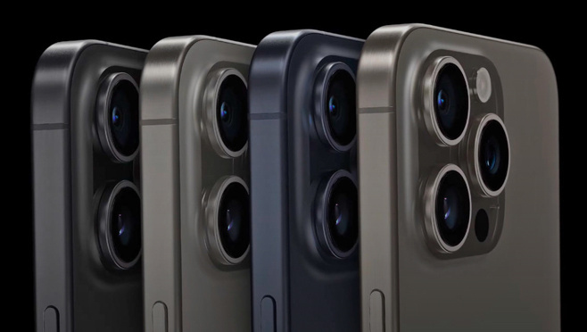

# iPhone 15价格“跳水”，高端手机撑不住了吗？

发售不到两个月， iPhone
15系列手机的价格“绷不住”了，在拼多多、抖音等电商平台，部分产品降价幅度超过1500元，但在走访中，记者发现线下门店则是另一番景象。业内观点指出，渠道的多元化叠加“双11”促销效应，令苹果手机价格下探，不过更重要的是，当下手机领域中，“高端”这一概念正经受着前所未有的挑战，而苹果又是否有充足的回旋余地？

价格“跳水”为哪般

今年“双11”还没到，但iPhone 15价格已经“跳水”，据北京商报记者观察，在部分线上渠道，iPhone 15 Pro Max
256GB最低入手价降至9098元。iPhone 15标准版128GB最低入手价降至5198元，对比官网售价低了近千元，部分版本最高降价幅度超过1500元。

不同平台降价情况差异明显，在苹果官网，iPhone 15以及iPhone 15
Pro系列仍然维持原有售价，京东自营、淘宝旗舰无明显降价，相反拼多多、抖音等渠道通过促销的方式，将iPhone 15的价格打了下来。

线下门店又是另一番光景，北京商报记者走访位于王府井的 Apple零售店发现， iPhone
15并未降价，店内工作人员也表示，未曾接到有关降价的通知，对于拼多多等网络渠道的行为，工作人员表示与门店无关。但同时工作人员也谈到，相比iPhone
15系列刚发布时的抢购热潮，现在店内现货相对充裕，部分颜色的iPhone 15和iPhone 15 Pro无需预约。

随后记者也走访了其他线下门店，其中很多工作人员都表示， iPhone
15系列并未降价，不光是苹果，实际上今年内发售的新款型号手机均无降价可能，对于货源情况，工作人员则称，无论是iPhone 15还是iPhone 15
pro均无现货，需要预约并从其他地方调货。

此前有经销商在采访中对记者谈到，如今线下门店手机销售惨淡，毕竟既然到手产品相同，门店只要比网上贵一点，便吸引不到消费者，这种情况在一、二线城市尤为明显，甚至有部分经销商从拼多多进货，再转售给消费者。

资深产业经济观察家梁振鹏对北京商报记者谈到，iPhone
15系列价格跳水，最明显的原因还是电商促销，“双11”价格战已经开打，正因如此线下、线上的价格才会出现差异。

专家指出，抖音、拼多多一类的电商平台之所以有低价货源，首先是因为补贴，电商为了扩大用户群体、提高市占比，会留出高额的商业推广预算，尽可能优惠手机价格。其次，经销商成为电商重要的低价货源，对苹果品牌而言，保持价格一致性是维护品牌形象的关键，但经销商方面则无此顾虑，如何快速出货、回笼资金、降低风险才是他们要考虑的问题。

高端概念面临挑战

与此同时，另有业内观点指出，苹果手机之所以价格跳水，很大程度上是由于其定价策略出现偏差，在如今手机出货艰难的情况下，提升性价比是主流做法，对大品牌来说，拓展产品条线，让平价产品肩负更多营收才是顺势而为。

然而苹果的平价条线不仅不降价，高端条线反而进一步提价，iPhone 15系列中，256GB以上的产品都出现了不同程度涨价，最贵的一款iPhone 15
Pro Max售价高达13999元，成为史上最贵苹果手机。

更重要的是，即便“降价促销”后，iPhone 15的价格依旧昂贵。以iPhone 15 Pro
Max为例，目前“跳水”后售价依旧高达9000元以上，最高配版本“直降1500元”后售价仍超过12000元。而作为对比，其他安卓厂商的旗舰机普遍售价在6000元左右，大部分起售价在5999元左右。即便是颇受追捧的华为Mate
60 Pro，起售价也仅为6299元。

这样的价格策略已经显现出后果，据市场追踪机构Counterpoint Research数据，苹果手机在发布后17天内的销量与iPhone
14相比下降了4.5%，可能是自2018年以来iPhone在中国最糟糕的首发之一。该机构表示，消费者信心不佳、iPhone
15较前代性能提升较低和高端手机市场竞争日渐激烈等因素，都为苹果带来了新的挑战。

在业内专家看来，苹果长期以来的高价是以其独特的性能、生态作为支撑，然而随着安卓手机高频地更新优化，不仅iPhone的性能优势被逐渐抹平，在界面设计、交互方式等方面，iOS与安卓两大阵营也日渐相同，换言之，消费者难以找到为苹果支付溢价的理由。

苹果如何抗“焦虑”

在价格问题上，苹果自身也显得有些焦虑。近来官方打折降价的消息层出不穷。

早在2022年底，苹果方面便出台政策，凡在Apple Store在线商城或苹果Apple
Store零售店以指定支付方式购买特定产品的顾客，即可享受不同金额的立减优惠。参与活动的产品包括iPhone、iPad、MacBook、Apple
Watch和AirPods的特定型号，其中iPhone、iPad的优惠金额普遍为200元，AirPods等产品优惠100元，而MacBook Pro
14英寸与16英寸版本，优惠金额可以达到1000元。

今年2月，苹果再推优惠计划，从2月5日开始，iPhone 14
Pro系列全部版本将迎来700元优惠，起售价仅7299元，活动截止日期为4月1日，范围几乎覆盖所有授权门店。

此外苹果也愈发重视国内的促销节点，今年“6·18”期间，在Apple Store天猫官方旗舰店上，iPhone 14
Pro直降了1150元，并可叠加350元的天猫购物券，入手价最低仅6499元起。iPhone 14 Pro
Max直降1350元，其中256G版本叠加优惠后降价幅度达到1900元，入手价仅8199元。

家电产业观察家丁少将指出，相比经销商而言，苹果官方降价行为显得更加保守。一方面，苹果公司必须维持产品价格总体一致，否则会导致定价混乱，产品自相践踏，最终影响整体出货。另一方面，iPhone一直维持着高端的品牌形象，大幅度的降价促销会让苹果显得自相矛盾。

同时丁少将也谈到，包括苹果在内的一众手机企业都看清了一个趋势，那就是手机愈发向耐用品转变，其时尚化、个性化的标签逐步减弱，人们的消费趋于理性，换机时间越来越长。

专家认为，在当下的手机竞争格局中，覆盖低、中、高三档产品，条线丰富的品牌有更大的回旋余地，企业很难靠单一的平价市场或高端市场养活自己，无论出身如何、定位如何，手机品牌都将目光投向自身之外的领地。

北京商报记者 陶凤 王柱力

