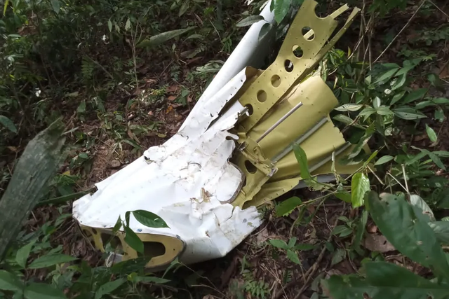

# 一小型飞机在巴西阿克里州坠毁 机上12人全部遇难

当地时间10月29日，一架小型飞机在巴西西北部阿克里州首府里奥布朗库国际机场跑道附近的丛林坠毁并起火。据该州政府的消息，机上12人全部死亡，包括10名乘客和2名机组成员。

据悉，该小型飞机从里奥布朗库起飞，原计划飞往亚马孙州的恩维拉（Envira），但于当地时间29日6时30分左右坠毁。事故详情警方仍在调查中。（总台记者
倪天颖 徐丹娜）

来源：央视新闻

