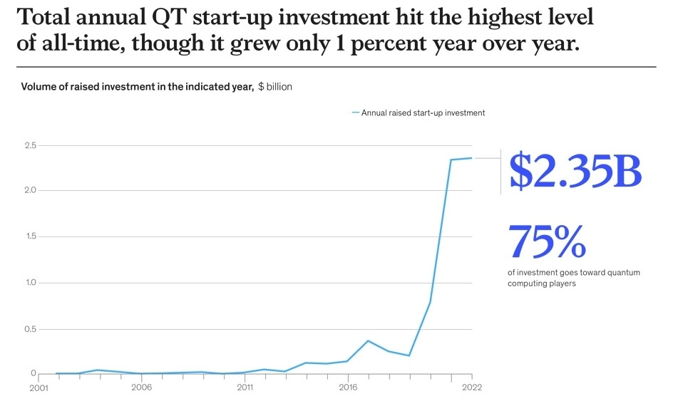
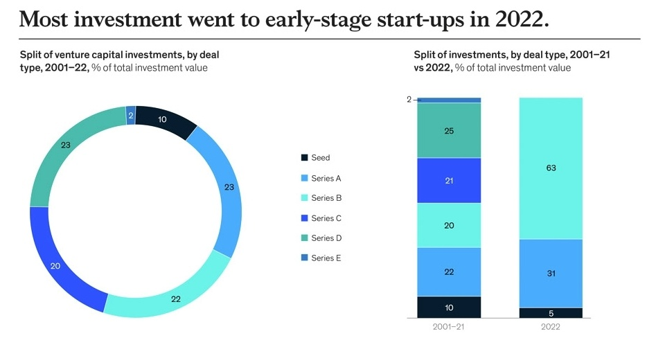
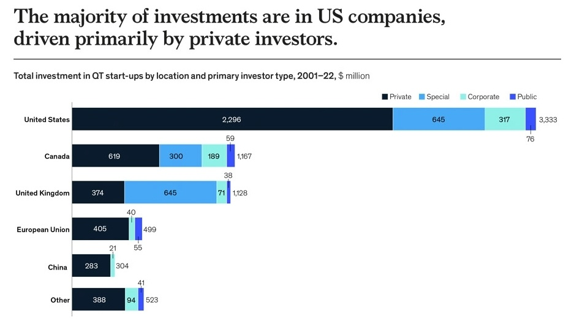
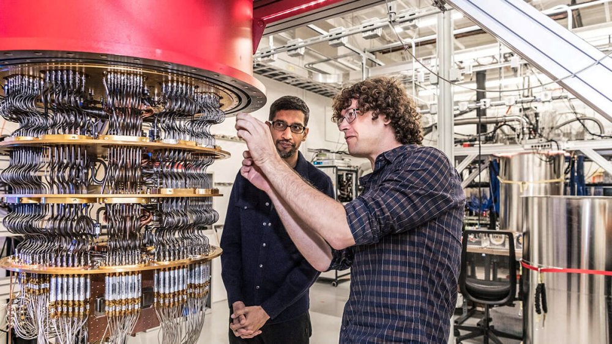

# 一文读懂量子计算：现已进入“实用阶段”，“量子时代”即将到来

**划重点：**

  * _1_ 量子计算首次出现于20世纪80年代初，主要依靠量子力学来解决复杂的、以前不太可能解决的计算问题。
  * _2_ IBM于2019年推出了首个IBM Q System One量子计算系统，谷歌也声称其实现了“量子霸权”。
  * _3_ 尽管量子计算行业的实际同比增长率仅为1%，但该领域初创企业2022年获得的总投资达到23.5亿美元。
  * _4_ 多数首席信息官和IT领袖认为量子计算并未被过分炒作，他们希望更多地关注这项技术，以了解即将到来的颠覆。
  * _5_ 十年内具有主动纠错功能的大型量子计算机有望诞生，21世纪也将因此被视为“量子时代”。

腾讯科技讯
量子计算是一个新兴的科学领域，由于它在许多行业拥有着巨大的应用潜力，已经引起了许多国家和公司的兴趣。随着更多资源和资金的投入，量子计算技术正以极快的速度向前飞跃。有科学家预言，量子计算机正进入“实用”阶段，十年内具有主动纠错功能)的大型量子计算机有望诞生，“量子时代的黎明”即将到来。

01 量子计算将成改变人类历史进程的新里程碑

量子计算这种变革性技术虽然仍处于起步阶段，但它将成为改变全球技术进程的科学趋势之一。

量子计算首次出现于20世纪80年代初，是一种变革性的技术趋势，旨在通过快速有效地解决不可能的问题来改变世界。这是一项新兴技术，它利用量子物理定律来处理与传统计算不同的信息。

量子计算主要依靠量子力学来解决复杂的计算问题。实际上，量子计算将原子、电子或光子等基本粒子的量子特性与量子比特结合起来，作为计算中的一种新形式的信息编码。量子计算的基础将使它们比传统计算机优越数千倍。

2019年1月，IBM推出了首个IBM Q System
One量子计算系统，这是计算界前所未有的创新。谷歌也宣布，得益于其Sycamore量子处理器的突破，该公司已经实现了“量子霸权”，该处理器可以在200秒内完成世界上最好的超级计算机需要1万年才能完成的特定计算任务。

在标志着将信息单位“比特”(值1或0)转换为量子比特(同时值1和0)的量子系统诞生两年后，IBM于2021年11月推出的127量子比特处理器打破了所有记录，首次超过100量子比特。

IBM最近还推出了鱼鹰(Osprey)量子处理器，该处理器具有433个量子比特，是两年前发布的上一代处理器处理能力的三倍多。同时，IBM还更新了路线图，计划到2025年开发出有超过4000个量子比特的处理器。

虽然这项技术还处于起步阶段，但不可否认的是，它将在人工智能、量子化学、金融、密码学、网络安全、物流等领域有着巨大的潜力。量子计算的特点是具有更高的计算能力、更大的内存容量和更低的能耗，从而为更高的处理速度奠定了基础。

然而，量子计算的主要缺点是它对噪声、温度和光非常敏感，这会污染它所处的环境，从而破坏信息，产生需要纠正的错误以获得所需的结果。与经典计算不同，在创建算法时，量子计算需要为每次计算编写新的算法。量子计算的另一个缺点是它只能在零下240摄氏度的极低温度下运行，而这是非常难以维持的环境。

02 全球量子计算领域投资创史上新高

量子计算行业正以惊人的速度增长，对这项潜在突破性技术的投资也创造了历史最高水平。全球咨询公司麦肯锡发现，
2022年，量子初创企业获得的年度总投资达到了23.5亿美元，尽管该行业的实际同比增长率仅为1%。

近年来，投资者始终在向量子计算初创公司投入资金。而自2001年以来的所有此类投资中，有68%发生在过去两年。

自2001年以来，10笔最大的量子领域投资中有4笔投资于量子初创公司。其中包括软件初创公司SandboxAQ，它筹集了5亿美元资金。另外三家公司Rigetti、D-Wave和Origin
Quantum也都完成了价值数亿美元的重大投资交易。

这些投资标志着人们对量子计算越来越感兴趣，并表明该行业可能在未来几年迎来显著的增长和发展。

麦肯锡的分析显示，从2023年开始，量子计算可能会对汽车、化工、金融服务和生命科学等四个行业产生更大经济影响。到2035年，这些行业的价值可能会达到1.3万亿美元。

量子计算现在被认为是世界上竞争最激烈的领域之一。根据该领域专家的说法，拥有运行良好的量子计算的国家将有能力更好地预测、更好地模拟，分析更多的数据和场景，以便发现新药、预见自然灾害或意想不到的金融危机。

如今，美国、中国和欧洲在这项技术的发展上处于领先地位，紧随其后的是日本、韩国、新加坡、澳大利亚、俄罗斯以及印度等，这些国家都在投资数十亿美元推动这项尖端技术的发展。

从美国到中国和欧盟，世界上所有主要大国都认为量子计算是制药、环境和能源等领域科学研究的优先事项。值得注意的是，参与量子计算机开发的主要公司是美国公司，即IBM、谷歌、英特尔、霍尼韦尔和IonQ等。

根据麦肯锡公司2022年6月发布的量子技术监测报告，欧盟正将其兴趣集中在量子计算上，并与中国一起被认为是在这一创新技术开发上投入最多公共资金的地区。然而，量子市场依然由北美主导，前12大制造商中有10家来自北美。

在这场让跨国公司和世界主要国家垂涎三尺的竞赛中，其他国家也在积极参与进来。2020年，俄罗斯政府投资7亿美元发展量子技术，并于2022年建立了国家量子实验室。目前，俄罗斯科学研究所俄罗斯量子中心正在寻求与金砖国家集团的其他中心建立伙伴关系。印度最近也宣布了其国家量子任务，旨在未来几年将量子技术的科学和工业研发翻一番。

03 量子计算被过度炒作？

量子计算还处于发展的早期阶段，在量子计算机广泛应用于实践之前，必须克服许多实际和理论上的挑战。

与任何先进和快速发展的技术一样，量子技术有可能被滥用，而且人工智能和强大的解密技术等快速采用也存在风险。有些物理学家还声称，很多初创企业都是建立在不切实际的炒作基础上的，并警告称，目前的估值存在泡沫。

法兰克福高级研究所研究员、理论物理学家萨宾·霍森菲尔德(Sabine
Hossenfelder)说：“包括我在内的许多物理学家都认为，量子计算被过度炒作了。它不会改变世界，充其量只能有一些小众应用，而且取得成果所需要的时间比许多初创企业预期的要长得多。”

然而，多数首席信息官和IT领袖对此持有不同意见，他们希望更多地关注这项技术，以了解即将到来的颠覆。这也代表了许多行业观察人士的看法，包括莱特州立大学量子计算主任、计算机科学研究教授内拉·格蕾丝·勒德洛（Nella
Grace Ludlow）。

虽然量子计算仍处于实际发展的早期阶段，但有些公司已经在用它来解决困难的挑战。当科技公司能够充分开发这项技术的潜力时，量子计算机可以在几秒钟内解决传统计算机需要数月或数年才能解决的复杂问题。不利的一面是，量子计算机还可能使黑客能够快速解决数据加密所需的复杂数学算法，从而将所有数据和网络安全置于危险之中。

勒德洛认为量子计算现在很有用。计算机科学中的“最大谎言”是，只要我们有足够大的超级计算机，就能解决任何问题。但事实上，更大的超级计算机（使用传统的二进制计算）也未必能解决许多挑战。

在化学领域，有几十个这样的例子，我们目前使用量子计算机来搜索理想新材料的新化学结构，搜索新药或更好地优化机器学习算法，这些算法目前使用人工智能帮助寻找有用却不能算是最佳的解决方案。

量子计算正处于迅速发展时期，所以任何进步都会带来巨大的改变。如果一台新的量子计算机多了10个量子比特，那么其处理能力就可以提高1000倍。在过去的七年里，商用量子计算机的量子比特数量大约翻了一番，单个量子比特的能力翻了一番。

2018年，加州理工学院教授约翰·普雷斯基尔(John
Preskill)创造了“NISQ”一词，意为“含噪声的中型量子时代”计算。许多人认为，我们仍处于量子计算机的NISQ时代，或者即将结束。

这是因为量子计算机的量子比特错误率仍然高于传统计算机。虽然量子比特的数量增加了，但错误率却没有减少。每个月都有新的性能基准问世，使我们能够进入“容错量子计算”时代。这个新时代将允许人们处理超难的问题，比如破解密码。

我们需要克服思维障碍，因为量子计算机与经典计算机截然不同，它们具有完全不同的计算机体系结构，可以解决以前不可能解决的问题。

目前，量子计算领域还缺乏适当的监管。与当前围绕人工智能面临的监管或政策制定情况相比，关于量子计算的监管讨论甚至更少。

04 “量子时代的黎明” 即将到来？

今年6月，IBM的一位计算高管声称，量子计算机正在进入“实用”阶段。在这个阶段，高科技实验设备变得更有用。今年9月，澳大利亚首席科学家凯西·福利（Cathy
Foley）甚至宣布“量子时代的黎明”即将到来。

不久前，澳大利亚物理学家米歇尔·西蒙斯(Michelle
Simmons)因在开发硅基量子计算机方面的工作获得了该国最高科学奖。显然，量子计算机正在大行其道。

当被问及量子计算距离实际应用还有多远时，莱特州立大学量子计算主任、计算机科学研究教授内拉·格蕾丝·勒德洛称，现在可能有几十个难以解决的问题，任何组织都可以使用量子计算来帮助改进。

空客正在使用量子计算机来设计他们的新飞机，德国汽车行业正在使用量子计算机来规划、调度数百辆自动驾驶汽车。多家公司正在使用它们来设计更好的电池，以满足电动汽车的需求。

对于试图投资量子计算的企业来说，勒德洛认为，他们不要只着眼于获得5%到15%改进的问题，而是专注于以前不可能解决的问题。在数学中，这些难以解决的问题通常被称为“NP”，即非确定性多项式时间问题。

量子计算的最佳应用包括物流、调度、金融、市场预测、新材料设计、药品和能源运输等领域。任何需要优化结果的问题都是量子计算能够解决的理想问题，因为它涉及到数百万种可能的选择，而量子计算能从中找到最佳解决方案。

在材料科学领域，量子计算机将能够在原子尺度上模拟分子结构，从而更快、更容易地发现新的、有趣的材料。这也可能在电池、制药、化肥和其他基于化学的领域有重要的应用。

量子计算机还将加速许多困难的优化问题，在这些问题中，我们想要找到做某事的“最佳”方法。这将使我们能够解决物流、金融和天气预报等领域的更大规模问题。

采用量子技术的组织应该采取措施来保护他们的数据，比如大公司提供的量子云服务。微软提供Quantum
Azure，亚马逊通过AWS提供Braket，这些方法是组织可以使用领先公司的量子计算机实施量子计算的方法。谷歌在其量子硬件上提供量子服务。IBM在销售量子计算机和提供在线访问他们的量子计算机方面处于世界领先地位。

05 四条路经探索量子计算的未来

2023年，量子计算将从大学物理系的地下室实验室转移到工业研发设施中，此举得到了跨国公司和风险资本家的支持。

当代量子计算原型多由IBM、谷歌、IonQ、Rigetti和其他公司建造，但距离完美还有很长的路要走。

今天的机器体积不大，而且很容易出错，处于所谓的“含噪声的中型量子时代”（NISQ）发展阶段。这意味着，它们很容易受到许多错误来源的影响，而纠正这些错误存在许多技术挑战。

科学家们希望能够开发出能够自我纠正错误的大型量子计算机。整个生态系统的研究人员和企业都在通过不同的技术方法追求这一目标。

目前领先的方法是利用超导电路中的电流回路来存储和处理信息，这是谷歌、IBM、Rigetti等公司采用的技术。

另一种方法是“捕获离子”技术，它与带电原子粒子群一起工作，利用粒子固有的稳定性来减少误差。IonQ和霍尼韦尔率先采用了这种方法。

第三条探索路径是将电子限制在半导体材料的微小颗粒中，然后将其融合到经典计算的成熟硅技术中。硅量子计算公司（Silicon quantum
Computing）正在从这个角度进行研究。

第四个方向是使用单个光粒子(光子)，它可以被高精度操控。一家名为PsiQuantum的公司正在设计复杂的“导光”电路来执行量子计算。

在所有这些技术中，目前还没有明确的赢家，最终胜出的很可能是一种混合模式。

今天试图预测量子计算的未来为时尚早，但许多研究人员都认为，未来十年该领域可能会实现某些里程碑式的目标。我们有望看到从嘈杂设备时代向可以通过主动纠错维持计算的小型设备过渡。

未来十年，一种不犯错误(或称具有主动纠错功能)的大型量子计算机有望诞生。届时，我们可以说，21世纪将是“量子时代”。（文 / 金鹿）

