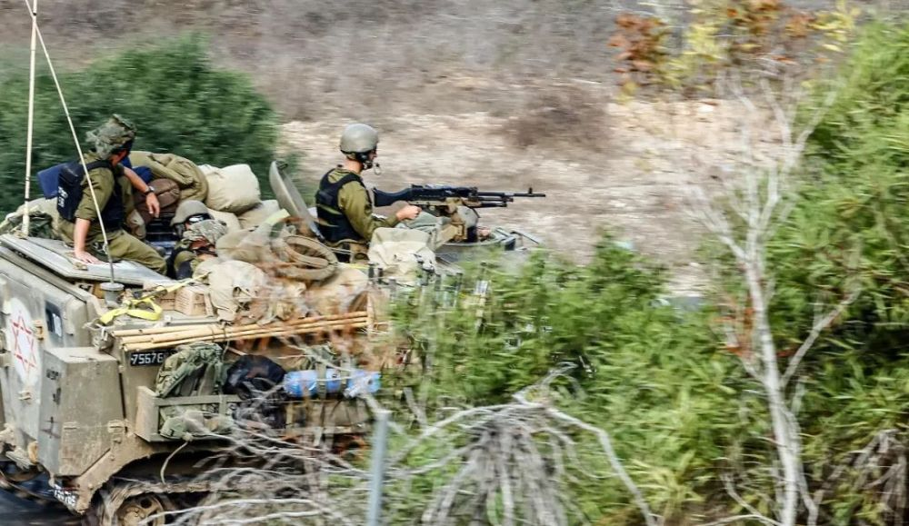

# 以色列在加沙作战进入新阶段，局势将如何演变？专家：美以各有盘算

巴以冲突进入第四周，局势仍在持续升级。

据新华社报道，以色列总理内塔尼亚胡10月28日晚在新闻发布会上说，随着27日晚以军更多地面部队进入加沙地带，以军针对巴勒斯坦伊斯兰抵抗运动（哈马斯）的“第二阶段战争”已经开始。同日，哈马斯也表示愿与以就交换被扣押人员进行谈判。

分析认为，以色列在加沙地带推进地面行动并非易事，如果在当地造成重大人道主义灾难，以色列将承受来自国际社会的谴责。虽然哈马斯释放愿意就交换被扣押人员进行谈判的信号，但恐无法换来暂时停火。此外，以色列和美国都反对联合国达成的停火决议，两国虽然捆绑在一起，但各有各的政治考量。

以军在加沙地带的作战进入第二阶段

内塔尼亚胡28日晚在新闻发布会上说，以军在加沙地带发动地面进攻的决定是战时内阁和安全内阁一致做出的。以方的作战目标非常明确，即摧毁哈马斯的军事和治理能力，并帮助被扣押人员返回家中。

以军总参谋长哈莱维当天早些时候发表声明说，以军部队正在加沙地带开展地面行动，“这场战争有多个阶段，今天我们进入了一个新阶段”，为摧毁哈马斯并解救被扣押人员，以色列“必须在加沙地带发动大规模地面进攻”。

以军28日发表声明说，自27日傍晚以来，以军装甲兵、工兵和步兵组成的联合作战部队一直在加沙地带北部开展地面行动。

_当地时间2023年10月28日，以色列与加沙边境，以色列士兵驾驶装甲车巡逻。图/IC photo_

多家媒体认为，以军当前地面行动依然有限。对于此次地面行动，军事评论员宋忠平对新京报记者表示：“地面作战表达了以色列铲除哈马斯的决心，持续时间的长短取决于哈马斯抵抗的能力和决心。”

以色列在加沙地带开展地面行动并非易事。“以色列发动地面行动，表示要帮助被扣押人员返回家中，然而，从目前以色列所采取的军事行动来看，更多的人质可能因以色列的突袭行动而丧生。以色列要实现解救人质的目标难度很大。其次，哈马斯的防御体系仍未知，哈马斯现在打巷战，以游击的方式抗衡以色列的正规战。同时，更多人质扣押地点在哪儿，也需要摸排。此外，想打击哈马斯军政领导人还需要大量情报的保障。”宋忠平说。

以色列推进地面进攻会带来负面影响。宋忠平指出，以色列军队在加沙地带作战，可能会蒙受巷战带来的损失，因此以色列军队基本是快进快出，以此来减少以方伤亡，但由于以色列军队深入到加沙不同城市采取地面战，必然会导致大量人员伤亡。无论是巴勒斯坦人，还是以色列军人，这些伤亡难以避免。

宋忠平补充说，在加沙地带推进针对哈马斯的地面攻击会遭到国际社会，尤其是全球爱好和平者的一致反对，以色列在国际社会的声望将会一落千丈。虽然以色列是以自卫的旗号对加沙发起地面进攻，但如果在加沙地带造成重大的人道主义灾难，必然也会让以色列面临更多的国际谴责，内塔尼亚胡也将备受指责。

专家称人质谈判可能无法换取停火

据新华社报道，哈马斯下属武装派别卡桑旅28日发表声明说，哈马斯愿与以色列就交换被扣押人员进行谈判，要求以方释放所有被关押在监狱中的巴勒斯坦人员，以交换被哈马斯扣押的人员。声明说，无论“一次性”还是“分阶段”完成交换，哈马斯都已做好准备。对此，以国防军发言人丹尼尔·哈加里回应说，这是哈马斯方面的“心理战”。

在突袭以色列初期，哈马斯带走许多以色列人和其他国家平民作为人质。据央视新闻10月21日报道，哈加里表示，本轮巴以冲突发生以来已有210名人质被关押在加沙地带。

哈马斯在此时释放就交换被扣押人员进行谈判的意愿，是否可能促使以色列在释放人质谈判期间停火引外界关注。在宋忠平看来，哈马斯此举未必能带来“局势的缓和”。

宋忠平表示，人质问题对以色列策略的影响有限。巴以冲突持续几十年，哈马斯的武力依然存在，巴以冲突会永无休止，内塔尼亚胡一门心思要实现彻底消灭哈马斯的目标，他和以防长加兰特都不断强调，这是针对加沙最后一次的军事行动。随着哈马斯提出释放人质的想法，以色列可能会认为，停火只会让哈马斯有喘息的机会，所以不会采取停火的方式去进行围绕人质的谈判。

此前，以色列方面对停火和人质谈判的问题已有所表态。10月22日，据报道，以色列一名高级官员在接受媒体采访时表示，在美国和卡塔尔斡旋解救被哈马斯控制的200多名人质过程中，加沙不会停火。

各有盘算，美以反对人道主义休战

以色列和哈马斯对峙的同时，呼吁停火的外交斡旋也在加紧进行。

据央视新闻消息，当地时间10月27日，第十届联合国大会紧急特别会议就巴以相关决议草案进行投票，最终以120票赞成、14票反对、45票弃权，同意票达到三分之二的多数票获得通过。美国、以色列等投票反对。

该决议草案由约旦等超过48国共同提出。草案呼吁立即实行持久和持续的人道主义休战，立即向整个加沙地带平民提供基本物资和服务，保护平民及国际机构，呼吁撤销以色列要求巴勒斯坦平民和联合国工作人员以及人道主义和医务工作者撤离加沙地带加沙河以北所有地区并迁往加沙南部的命令，谴责所有针对巴勒斯坦和以色列平民的暴力行为。

尽管最终联合国通过决议，呼吁以巴冲突双方实行人道主义休战，但据新华社报道，以方当天表示坚决拒绝联合国停火决议，以军继续对加沙地带实施空袭和地面打击。卡桑旅发表声明说，其武装人员正在抵御以色列军队的“地面入侵”。

为何以色列和美国反对人道主义休战？宋忠平解释说，主要有两点原因。

首先，美国和以色列现已捆绑在一起。“美国和以色列都将哈马斯视为恐怖组织，把不愿意撤离的巴勒斯坦人当成恐怖组织的帮凶，因此并不希望看到停火。”宋忠平说，美国甚至派出军方人员支援加沙军事行动，这表明美国和以色列现已捆绑在一起。如果美国和以色列在加沙地带制造了大量人道主义灾难，也将会共同犯下战争罪行。

央视新闻援引美联社报道称，当地时间10月23日，美国国防部已向以色列派遣军事顾问，其中包括精通城市战的海军陆战队中将詹姆斯·格林。此前，美国向以色列派遣航母以及提供其他军事支持。

其次，美国和以色列各有打算。宋忠平表示，从以色列的角度看，以色列希望尽快彻底消灭哈马斯，达到让巴勒斯坦人永远不能再反抗的目的，同时也想借助美国之手来铲除伊朗等什叶派武装。美国则是另一番考虑。美国希望尽快稳定中东局势，不能因为巴以冲突打乱美国的全球战略布局，所以美国选择调派军事力量帮助以色列，以期尽快平息巴以之间的冲突。

“所以，美国和以色列看似是同一类人，实际上是各怀心思，各有各的政治算盘。”宋忠平说。

“持续的暴力并不是答案”

加沙地带的人道主义形势进一步恶化。

据报道，10月28日，以色列军队对加沙的轰炸和地面行动是迄今为止最密集的，使这场可怕的危机达到了新的暴力和痛苦水平。以色列对电信设施的袭击以及随后的互联网关闭实际上使加沙人无法了解加沙各地正在发生的事情，并切断了他们与外界的联系，这加剧了平民的苦难。另据央视新闻报道，截至10月29日，本轮巴以冲突已致双方超9510人死亡。

“我们提醒各方遵守国际人道法和国际人权法规定的义务。”联合国人权事务高级专员蒂尔克指出，这场战争的人道和人权后果将是毁灭性的、持久的。目前已有数千人死亡，其中许多是儿童。他说：“持续的暴力并不是答案。我呼吁所有各方以及第三国，特别是对冲突各方有影响力的国家，竭尽全力缓和这场冲突，并努力实现以色列人和巴勒斯坦人在和平中毗邻相处且能够充分享受所有人权的目标。”

联合国秘书长古特雷斯多次强烈呼吁立即实现人道主义停火，同时无条件释放人质，并根据加沙人民的迫切需要提供人道主义救援物资。他说：“那里的人道主义灾难正在我们眼前上演。”

宋忠平也表示，目前而言，以色列以武力消灭哈马斯从而实现停火的方式，只能让巴以之间的矛盾越积越深。这种所谓的停火不可能是长久停火，只可能让巴以之间的矛盾世世代代延续下去。

新京报记者 朱月红

编辑 张磊 校对 吴兴发

