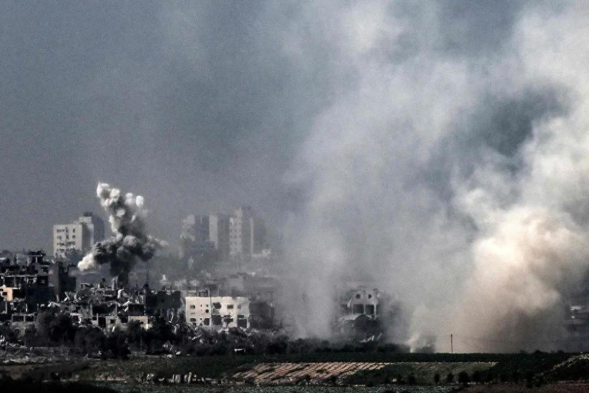

# 加沙地面战升级，“第二阶段战事”将持续数月？“战争困境”难以打破

当地时间10月27日晚，以色列军队轰炸了加沙地带北部地区的150个隧道、地下作战空间和地下基础设施等“地下目标”。在空袭力度加大的同时，由装甲兵、工兵和步兵组成的地面作战部队，也扩大了攻击行动。

28日，以色列总理内塔尼亚胡在特拉维夫举行的新闻发布会上表示，以色列地面部队已经进入加沙地带，开始“战争的第二阶段”。他称这是以色列的“第二次独立战争”，并提醒以色列人，铲除哈马斯的战争预计会“漫长而艰难”。

哈马斯下属武装派别“卡桑旅”同日证实，已经加入与以色列地面部队的战争。该组织发言人阿布·奥贝达声称，哈马斯将使以色列“尝到新的死亡方式”。

随着战事的进一步扩大，加沙地带的平民正在遭遇空前的人道主义灾难。红十字国际委员会表示，在大规模轰炸中，加沙平民没有安全的避难所，而且由于军事围困，目前也无法采取适当的人道应对措施，加沙的人道主义局势是“灾难性的失败”。

_10月28日，加沙地带北部遭到袭击。图/视觉中国_

地面战可能持续数月

10月27日，夜幕降临后，加沙地区的互联网连接和电话线路开始中断，外界猜测以色列军队已经准备好对加沙进行地面袭击。稍晚些时候，以军一份简短声明证实，地面行动正在“扩大”，但没有提供其他细节。随之而来的是，持续三周的战争中最猛烈的轰炸开始了。与此同时，以色列国防军分别从加沙北部城镇拜特哈农和布雷吉难民营发起进攻，在空袭和炮击的掩护下，坦克和运载步兵和工兵的装甲车进入加沙境内。

与前两晚军事行动不同的是，之前的袭击规模较小，且只持续了几个小时，部队就返回到以色列领土。而此次以军留在加沙境内，并在加沙境内建立了临时据点。

巴勒斯坦电信公司指责以色列的轰炸造成了大范围的通讯中断，导致加沙大多数人无法通过电话联系到。巴勒斯坦两大移动网络运营商Jawwal和Paltel也表示，他们的电话和互联网服务在轰炸中瘫痪。

联合国儿童基金会表示，在互联网和手机服务中断后，该机构与加沙的所有工作人员失去了联系。该机构执行主任凯瑟琳·拉塞尔表示：“我非常担心他们的安全，也担心加沙一百万儿童又将经历难以形容的恐怖之夜。”

内塔尼亚胡宣布开始“战争的第二阶段”的同时，以色列国防部长加兰特也指出，“战争已进入新阶段，加沙昨晚的大地都在震动。我们同时在地面和地下发动攻击，袭击各地各级的恐怖分子。”

以色列国防军近日多次表示，战争的总体目标保持不变，即一次性地消灭哈马斯。不过，以色列并没有像起初外界所预想的那样发起快速大规模进攻，从袭击拜特哈农和布雷吉的行动来看，这是一项逐步包围加沙的战略计划。对此，一位不愿透露姓名的以色列军官认为，地面战争可能持续数月甚至一年。

以色列特拉维夫国家安全研究所高级研究员梅尔·埃尔兰也对《中国新闻周刊》表示，目前战争还处于早期阶段，而且很可能比以往巴以间的任何一场战争都持续更长的时间。

难以打破的“战争困境”

对于以色列正在发起的“漫长而艰难”的战争，以色列政界人士解释称，如果发动大规模地面进攻，以色列将被拖入城市战，而哈马斯肯定早已为此准备了伏击和诱杀装置。同时，大规模地面进攻也会造成大量平民伤亡和加沙基础设施受损，国际社会要求停火的压力也会与日俱增。

“我不希望我们陷入困境，而无法实现消灭哈马斯的目标。”以色列前总理纳夫塔利·贝内特表示。

哈马斯武装派别“卡桑旅”则表示，该组织武装人员正在加沙东北部和中部与以色列军队作战。“我们和所有巴勒斯坦抵抗力量已做好充分准备，全力对抗侵略并挫败入侵。”

哈马斯还驳斥了部分以色利官员的说法。此前，以色列一些官员透露，以军战斗机袭击了加沙地带北部150个地下目标，杀死了多名哈马斯成员，袭击中没有以军人员伤亡。哈马斯则称，以色列的进攻是“失败的”且损失惨重。

不过，巴勒斯坦籍的卡塔尔西北大学中东问题学者哈立德·赫鲁布认为，以色列可以发动地面战争，但无法确保能够以他们满意的方式结束战争。他向《中国新闻周刊》分析，“消灭哈马斯”很难实现，因为该组织已经深入到当地的政治、社会甚至宗教中，即使哈马斯的军事力量在这场战争中遭到重创，支离破碎的军事派系也会衍生出新的武装组织，继续抵抗以色列的占领。

此轮交火后，哈马斯表示，愿意与以色列就交换被扣押人员进行谈判，并要求以方释放所有被关押在监狱中的巴勒斯坦人员。对此，以色列国防军发言人哈加里称，这是哈马斯方面的“心理战”。

据报道，10月28日，内塔尼亚胡还会见了人质家属。他表示，即使在地面进攻期间，也将继续为确保人质获释而进行接触，对哈马斯施加军事压力可能有助于让他们回家。据了解谈判情况的消息人士透露，由卡塔尔调解的以色列和哈马斯之间的人质谈判仍在继续。

此前，美国和其他西方国家敦促以色列推迟发动大规模地面进攻，因为担心当地平民大量伤亡和冲突扩大，并为人质谈判提供更多时间。但美国官员随后表示，这取决于以色列自己的决定。

停火呼声中的战事升级

对于已经持续三周的加沙战事，越来越多人开始担心，战争可能演变成地区冲突。

10月27日，联合国大会以压倒性多数通过了一项决议，呼吁立即“人道主义休战”。投票结果为120票赞成、14票反对和45票弃权。

在投票中，美国拒绝任何停火谈判的提议。“我们不会为以色列划出红线，”白宫发言人约翰·柯比表示。尽管如此，美国依旧敦促以色列实行“人道主义暂时停火”，以便更多援助进入加沙，并让外国公民通过埃及离开加沙。

与此同时，世界各地要求停火的抗议活动仍在继续。在美国旧金山市，活动组织犹太和平之声的当地分支机构表示，超过1.5万人封锁了一条高速公路，要求“结束对加沙的种族灭绝”。该组织在社交媒体上写道：“巴勒斯坦人、阿拉伯人、犹太人，这里的每个人都希望流血的战争立即结束。”

以色列《国土报》28日报道称，美国在地中海部署的第二个航母战斗群——“艾森豪威尔”号航母战斗群进入地中海。伊朗外交部长侯赛因·阿米拉卜杜拉希安则威胁称，“如果美国继续采取现有的举措，那么针对美国的新战线将会开辟。”据报道，一些民兵组织已经对叙利亚和伊拉克的美国基地发动了至少19次无人机或导弹袭击。

与此同时，以色列北部的局势也在升级。以色列国防军10月28日袭击了黎巴嫩南部的多个真主党阵地。黎巴嫩边境的小规模冲突已持续数周，外界担心，随着以色列国防军继续在加沙南部地带与哈马斯作战，真主党可能会开辟北部的第二战线。

在哈立德·赫鲁布看来，以色列关于地面入侵的言论非常高调，但也有某些不情愿的迹象。更重要的是，他们无法解决如何根除哈马斯以及用什么取代它的战略困境。

梅尔·埃尔兰也认为，这是一场非常具有挑战的战争，需要仔细的思考、周密的计划以及有针对性的行动。

但对于生活在隧道上方的200多万加沙人来说，现在最可怕的问题是如何在一场战争中生存下来。加沙卫生部门表示，自10月7日冲突爆发以来，当地死亡人数已经超过7700人。

在加沙地带的巴勒斯坦作家纳鲁兹·卡尔穆特写道，许多街区弥漫着死亡的气息，瓦砾下埋藏着大量尸体。“你无法想象那种感觉，随时都会想到死亡”。

记者：郑立颖

编辑：徐方清

