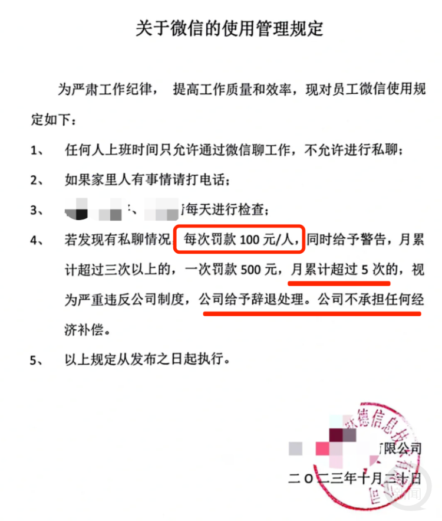

# 哈尔滨一公司规定私聊微信每次罚100元，官方通报：属实，已要求纠正

为了严加管控员工，一公司竟然提出了工作期间私聊微信罚款的制度，这一举措引发了极大的争议。

对于这一规定，有网友表示难以理解和接受。他们认为，员工在合理的时间内进行私人交流是应该得到尊重的。

近日，哈尔滨一家公司发布关于员工微信的使用管理规定，“若发现私聊微信，每次罚款100元/人”。

有员工把相关通知发布到了网上，引发网友热议。

通知截图显示为提高工作质量和效率，员工在上班时间只允许通过微信聊工作，不允许私聊，如果家里人有事就打电话，每天进行检查。

“若发现私聊，每次罚款100元/人，月累计超过三次以上的，一次罚款500元，月累计超过5次的，给予辞退，公司不承担任何经济补偿”等等文字。

对此，@平房发布 通过其官微发布消息称，平房区人社局工作人员立即与该企业核实，经核查，情况属实，已要求企业立即纠正。

企业表示将在法律框架下制定出台人性化管理措施，对造成的负面影响深表歉意。

