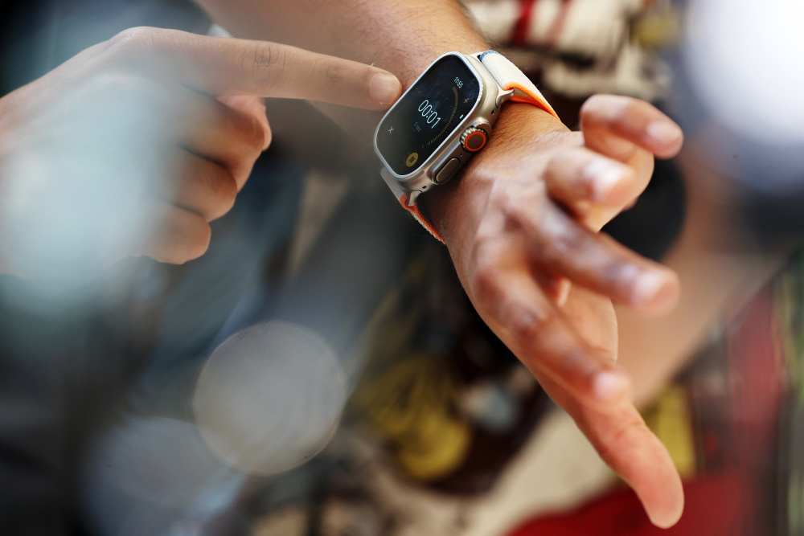
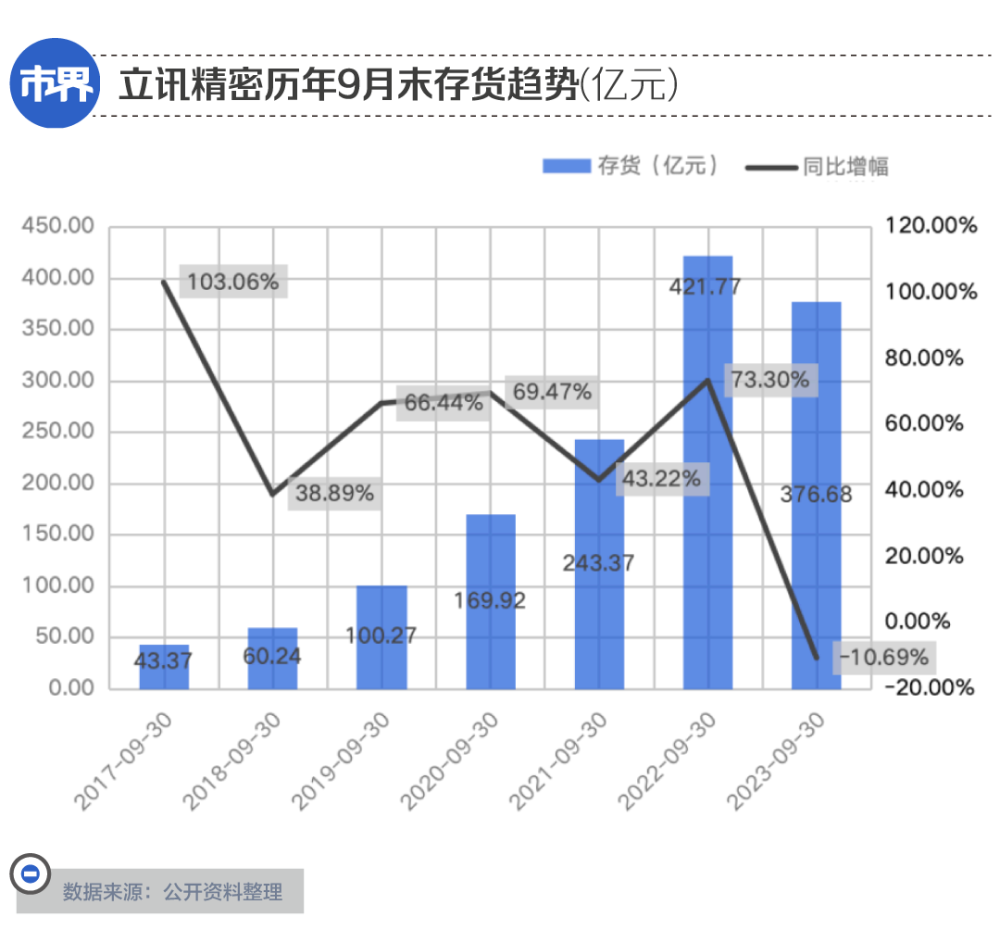
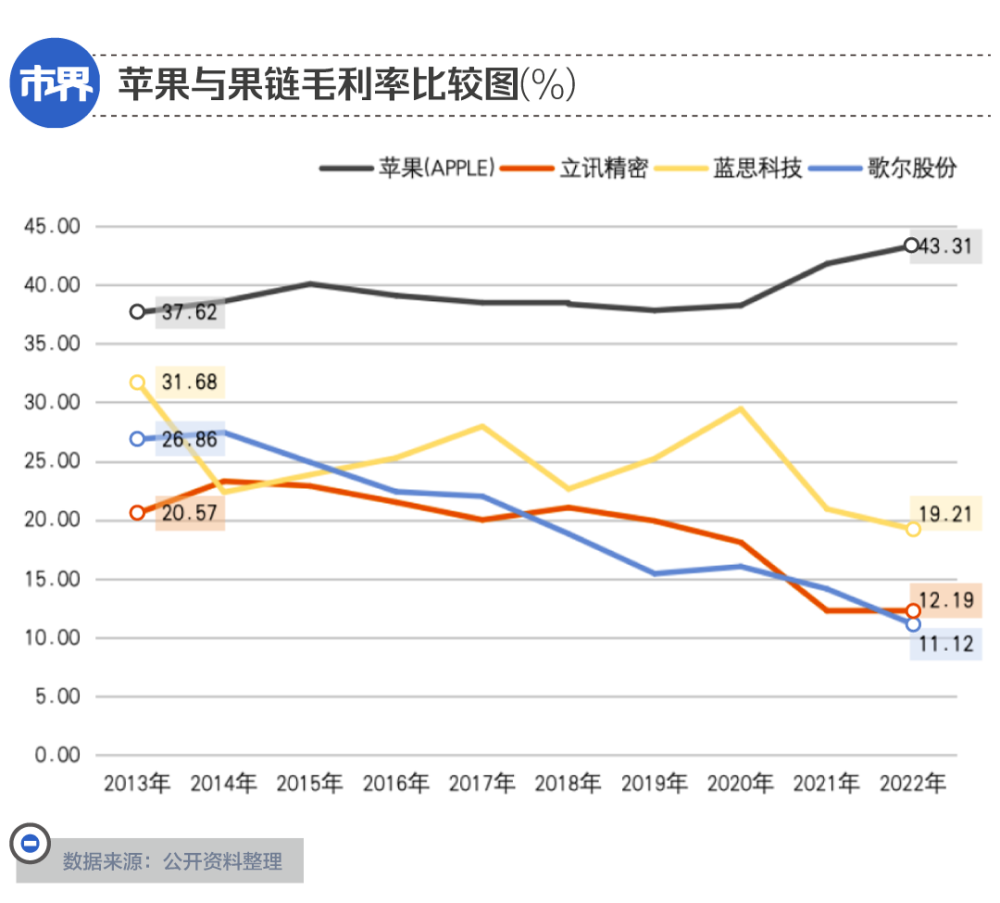

# 苹果失宠，寒意传给了中国供应链

苹果产业链最近显然不太“安宁”。

先是10月22日传出富士康被有关部门“查税、查用地”的消息，让工业富联在3个交易日内蒸发了522亿元，紧接着10月23日“iPhone
15全系价格暴跌”冲上了热搜第一。

在此微妙的背景下，
苹果CEO库克年内2次访华，引来颇多解读。尤其是最近的10月16日，库克在第二次访华途中来到四川雅安村镇看小学生用iPad学习编程，但“华为中国销量已超越苹果”却登上了当日微博热搜，颇有“高手过招”的戏剧性。

值得关注的是，库克10月份还有一趟相对高调的行程，就是走访立讯精密旗下位于浙江的一个工厂，其主要为苹果生产Apple
Watch，库克向媒体表达了对立讯精密颇高的评价，似乎也试图显示出一种与立讯精密“携手共进”的意味。

高光时期，立讯精密市值在2020年几度突破4400亿元，超过工业富联和比亚迪成为果链之首，但从立讯精密前不久交出的三季报和全年业绩预告来看，第三季度收入和存货都在近十年内首次出现了同比下滑，背后有相当一部分原因归咎于大客户的严控库存。

以立讯精密为代表的果链巨头们，沿着不同的故事和路径走上同一个巨人的肩膀，当下则面临着类似的难题——果链的拐点是否已经出现，未来又该作何抉择？

**千亿果链巨头养成**

此次库克到访，相当程度上展现了苹果的重视，那么立讯精密对当下的苹果来说到底有多重要呢？

库克在到访立讯精密的过程中表示，目前有超过95%的苹果产品是在中国制造。而纵观A股的苹果概念股，立讯精密当前2227亿元的市值排名第三，仅次于比亚迪和工业富联（富士康上市主体简称）。

且从已披露的大客户销售额来看，立讯精密来自第一大客户的收入已经从2016年的46亿元跃升至2022年的1568亿元，为A股之最（富士康未披露前五名客户收入明细）。

按照苹果2022财年1.6万亿元的营业成本计算，其花在立讯精密身上的成本就占了大约10%，而立讯精密正在为苹果生产包括AirPods、Apple
Watch和iPhone 15（包括高端系列iPhone Pro Max），也是明年即将与消费者正式见面的苹果首款混合现实头戴式设备的组装商。

当下在苹果供应链内的重要位置，大概是40年前来到深圳打工的立讯精密创始人王来春很难想象的。

1967年出生在广东潮汕的一个普通农家，王来春和当时许多村里的孩子一样，并没有读多少书，上完初中就回家帮忙干活、四处务工，辗转在改革开放初期的1984年来到了深圳，进入日本三洋在深圳蛇口的工厂，也初次感受到现代化企业管理的氛围和电子制造业的魔力。

更重要的是1988年，富士康在深圳建起了大陆地区第一个工厂，王来春也成为首批受雇工人，还被分到了郭台铭的二弟郭台强管理的部门，接触到了连接线这门生意，为日后经营千亿市值的上市公司完成了一个重要的开头。

此后王来春在富士康一待就是10年，且从手工组装零件、电路板等机械性的工作岗位，一路做到了团队负责人，并在富士康1998年的一股离职潮中，受到郭台强的鼓励，开始独立创业。

但离开富士康的王来春，并未切断与富士康的关联——早期王来春与哥哥王来胜共同创办一家叫做“全胜”的小工厂，主要业务就是消化富士康的额外订单，之后兄妹俩收购了香港立讯，陆续发展为后来的立讯精密，过程中郭台强也在2009年注资了4000万元，其实际控制的富港电子在2014年前都是立讯精密的第三大股东。

更直观的是，2010年A股上市的招股书显示，2007年到2009年立讯精密有45%到56%的收入来自富士康，但相关代工业务毛利率维持在10%-20%之间的较低水平。

直到2010年成功上市，才给了立讯精密和王来春相当的底气，从二级代工角色转变为直接面对苹果，并且利用上市后畅通的融资渠道，开启了“八爪鱼”式的并购。

Wind数据显示，上市以来立讯精密在IPO首发融资中获得12.61亿元，2014年定增获得20.31亿元，2016年定增融资46亿元，2020年可转债募资30亿元，此外还新增了445亿元左右的长短期带息债务、149亿元的债券融资。

口袋里的钱多了，于是立讯精密在2011年收购了昆山联涛电子，切入了苹果iPad连接线供应链，2016年收购了苏州美特，切入苹果声学器件领域，2020年又重金收购了江苏玮创、昆山玮新和高伟电子，接过了苹果手机的组装业务和摄像头模组业务，2021年更大手笔地以60亿元收购日铠50%的股权，开启了苹果金属结构件和手机顶部模块业务。

通过持续的并购和加码，立讯精密一步步深入苹果供应链，成为果链之中不可忽视甚至动摇富士康地位的存在，其实控人王来春也与蓝思科技的周群飞、领益制造的曾芳勤一起，被形容为“苹果背后的三个中国女人”。

**果链拐点已至？**

花了13年时间加码苹果供应链，立讯精密来自第一大客户的销售额，从2012年的7亿元增至2022年的1568亿元，占总收入比重也从22.4%增至73.28%。

如今苹果正在中国市场面临一系列挑战，背后的立讯精密自然也免不了一丝忧虑。

iPhone15系列于9月份发布后，发售的当天下午就仅少数机型需要加价购买，大部分已经可以原价买到，较往年的热度有所减弱。

再加上10月24日前后多平台开启双十一预售，平台补贴叠加市场上的降价氛围，直接让iPhone
15系列各机型在拼多多、抖音电商等部分渠道降价1000元左右，“iPhone 15全系价格暴跌”也在10月23日冲上了微博热搜的第一名。

与降价的苹果相对应的，是当前手机市场上需要加价才能买到的华为Mate 60系列。在深圳的加尹告诉市界，自己一直没有等到Mate 60
Pro机型，之前有渠道需要加价2000元，近期变成了加价1000元，自己还是咬牙买了，身边愿意加价买的朋友也有不少。

BCI最新数据显示，2023年第40周，华为手机的市场份额已经跃升至19.4%，居于国内市场第一位，而上一次华为在国内智能手机市场拿下第一，已经是2020年第四季度了。

除此之外苹果的麻烦还体现在富士康近期被查税、查用地等方面，库克在此背景下走访立讯精密，对外强调与其“携手共进”的合作关系，则显得颇具深意。

复杂处境下的苹果，终于还是将“寒意”传导给了重要供应商立讯精密——2023年1月有消息称苹果或将以需求减弱为由对各大供应商砍单，其中立讯精密受创最大。但立讯精密很快发布了澄清公告，表示“公司与现有客户合作均正常开展。报道中提及的公司相关业务不存在特殊变化和影响。”

那么从最新三季报和全年预告来看，立讯精密真的没有受到影响吗？

最新数据显示，立讯精密前三季度收入1558.75亿元，同比只增长了7.31%，作为对比，此前13年时间其收入同比增幅基本都在20%以上。如果单单看第三季度收入，甚至同比下滑了8.51%个百分点，为近十年首次。

全年业绩预告则显示归母净利润将有17.5%-22.5%的同比涨幅，而2017年到2022年间，只有2021年涨幅较低，为4.4%，其他年份同比增幅都在34.14%到75.14%之间。

根据最新电话会议纪要，立讯精密第三季度收入下滑主要有几方面原因，包括策略性地放弃了一些通讯产业利润率较低的OEM业务、可穿戴产品业务未推出新品及客户管控库存、部分产品交易模式发生变化，以及终端客户MINI
LED产品销售不及预期。

王来春表示，上述四个原因量化金额在60.6亿元，另外客户今年930比往年严控库存，受影响减少的销售额约40亿元——以此对应1月份“砍单”的传闻，其实是能够对应上的。

再来看看存货情况——从历年数据来看，每年一季报和三季报立讯精密的存货都会处于一个相对高位，且从2017年以来一直到2022年，三季报存货金额同比增幅都在38%以上。

但2023年初传出被苹果“砍单”的消息后，立讯精密2023年9月末存货余额从上年同期的421.77亿元降至376.68亿元，同比压缩了10.69%，也是上市以来首次在三季度减少备货。

值得关注的是，在前三季度收入下滑、备货减少的背景下，立讯精密依然在净利润上取得了15.14%的同比增长，但究其原因，主要是在毛利率有所降低的情况下，通过更大幅度的降低费用得以实现。

具体来说，立讯精密2022年和2023年前三季度销售费用相比2021年同期几乎持平，管理费用和研发费用增长了29%，低于同期的收入增幅79%，导致费用率有所下滑。从管理费用和销售费用率的角度可以理解为规模效应的显现，但当前3.94%的研发费用率，在一众果链公司中确实不算高。

用立讯精密在电话会议中的话说，公司前三季度的成绩离不开积极的开源节流。

**寻找第二曲线**

回看立讯精密深入苹果供应链多年的收获，会发现一个有意思的现象。

在苹果的“喂养”下迅速攀升的业绩规模自然是最直观的呈现——立讯精密的收入从上市之初的10亿元增至2022年的2140亿元，净利润更是从1.29亿元增至104.91亿元。

但与此同时立讯精密也付出了相当的“代价”，其毛利率从10年前的20%左右跌宕降至2022年的12.19%，2023年前三季度进一步下滑至11.8%。另外两家果链巨头歌尔股份和蓝思科技大体上也呈现相同趋势，相比10年前降低了8到16个百分点不等，而苹果的毛利率则从2021年开始走高，相比10年前反而提高了6个百分点左右。

如果说净利润绝对值的增长弥补了盈利能力的下滑，那么持续不断的巨额资本开支，就是让果链在与苹果的漫长交易中越陷越深的另一个关键。

**曾有媒体报道，包括富士康在内的中国台湾地区的苹果供应商，对于公司业务的低利润率和巨额资本投入产生了不满的情绪。而随着以立讯精密为代表的A股果链逐渐强大，压力也给到了它们身上。**

数据显示，整个A股近10年资本支出33.25万亿元，是其近10年净利润总和的81.33%，但如果看A股49家苹果概念股，近10年资本支出达到1.07万亿元，是其近10年净利润总和的222.1%。

其中蓝思科技、立讯精密和歌尔股份近10年资本支出分别为532.06亿元、529.66亿元和393.14亿元，分别是其近十年净利润的253.2%、136.5%和206.5%。

简单来说，上述果链巨头们这十年赚的钱，还不够用来投资扩产。

以被踢出果链后股价大跌、资产大幅缩水的欧菲光为借鉴，果链们过去几年也在寻找不同的“第二曲线”，比如蓝思科技瞄准了新能源汽车、智能头显、光伏几个赛道的屏幕、玻璃业务，歌尔股份从2012年开始布局VR，而立讯精密也选择了当下具有更多可能性的新能源汽车赛道。

2021年立讯精密明确提出了“三个五年”战略，目标是在第三个五年内成为全球零部件Tier1领导厂商。

王来春也已经表示，立讯精密不会过分依赖少数几家大客户，已经开始收购和投资电动汽车制造商的供应商。而公开资料来显示，2021年以来立讯精密先后在汽车业务领域布局了激光雷达、与奇瑞共同组建合资公司，还以11亿元收购了汇聚科技，加码通讯、汽车行业的连接线缆业务。

从未来几年资本开支计划来看，也将更多侧重于汽车领域的布局而非消费电子领域的加码。

回顾立讯精密过往通过并购、整合不断深入苹果供应链，在汽车领域其似乎也将延续这种风格，而手机领域多次成功整合的经验，对其涉足汽车领域、成为Tier1厂商而言，无疑是一个重要的加分项。

寻找第二曲线之外，智能手机行业内部还是此消彼长的关系，与苹果需求收缩相对应的，大概率将是华为手机的强势回归，而这也是果链巨头们在手机业务领域分散客户的一个契机。

毕竟过去多年立讯精密从苹果那里获得的不只是销售额和利润，还有对于供应链管理、技术打磨的积累，果链们更多收获还来自于，不断将“与巨人同行”得到的养分，内化为自身的实力。

当合适的时机与需求到来，这种能力也可以向更多客户进行赋能，比如曾被踢出果链、股价大跌的欧菲光，近期因为参与了华为Mate
60系列供应链的消息，股价在6个工作日内大涨了82%，感受了一把连续涨停的美妙。

不管怎样，从当下的种种迹象来看，立讯精密已经对未来有了苹果之外的规划。

用王来春的话说，“我们必须抓住前5年的黄金窗口期。虽然这个窗口期可能是10年，但前5年一定是最确定的，也是最充满挑战的。所以，想要把握这一机会，就一定要提前布局。希望10年后，大家提到立讯精密的时候，不仅会想到它是消费电子品牌的核心供应商，还能想到它是众多汽车品牌客户的Tier1供应商。”

**作者 |** 林夏淅

**编辑 |** 刘肖迎

**运营 |** 贾天宇

