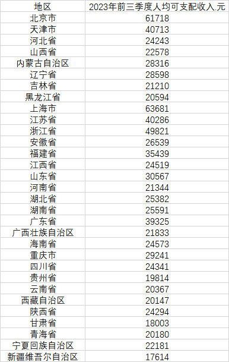

# 31省份前三季度人均可支配收入公布 上海北京超6万元

国家统计局网站最新公布了31个省份前三季度居民人均可支配收入情况。有8个省份前三季度人均可支配收入超过了3万元，其中上海和北京超过了6万元。

数据显示，有8个省份前三季度人均可支配收入超过3万元，全部来自东部地区，分别是上海、北京、浙江、天津、江苏、广东、福建和山东。其中上海和北京前三季度人均可支配收入超过6万元。

前三季度，上海全市居民人均可支配收入63681元，同比增长7.1%，两年平均增长4.0%。城镇常住居民人均可支配收入66857元，同比增长7.0%；农村常住居民人均可支配收入35130元，同比增长8.3%，农村居民收入增速继续快于城镇居民。

前三季度，北京全市居民人均可支配收入61718元，同比增长5.3%，比上半年提高0.3个百分点。

整体来看，上海和北京作为城市经济体，城镇化率高，现代服务业、高新技术产业、新兴产业十分发达，总部经济突出，高薪岗位多，吸引了大量人才集聚，居民的平均收入也高。

上海和北京之后，浙江全体居民人均可支配收入分别为49821元，距离5万元大关近在咫尺。前三季度浙江城镇和农村居民人均可支配收入分别为58121元和32578元，城乡居民人均收入比值1.78，同比缩小0.03。

浙江之后，天津、江苏、广东、福建和山东前三季度人均可支配收入分列四到八位。从区域发展的四大板块分布来看，前三季度人均可支配收入前八名的省份均来自东部沿海地区。

重庆、辽宁、内蒙古、安徽、湖南、湖北这6个省份前三季度全体居民人均可支配收入位于2.5万到3万之间，分列9到14位。其中，辽宁是我国工业化和城镇化较早的省份，另外5个省份来自中西部地区，也是中西部工业化和城镇化水平较高的地区。

国家统计局10月18日发布的数据显示，前三季度，全国居民人均可支配收入29398元，比上年同期名义增长6.3%，扣除价格因素，实际增长5.9%。分城乡看，城镇居民人均可支配收入39428元，增长5.2%，扣除价格因素，实际增长4.7%；农村居民人均可支配收入15705元，增长7.6%，扣除价格因素，实际增长7.3%。

