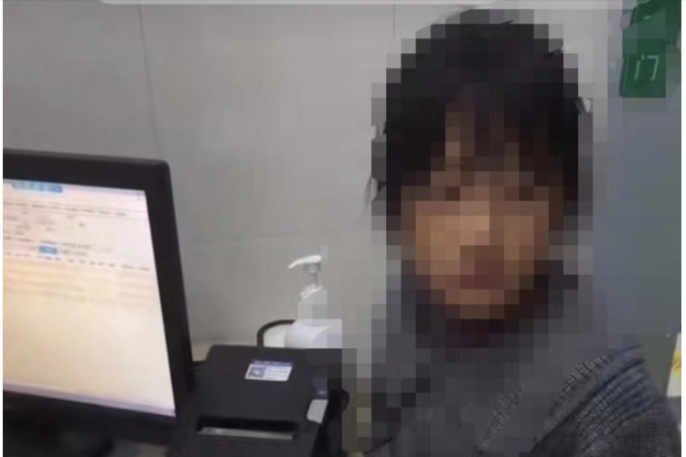

# 7岁女生遭“短暂围住拍打”，有视频何不公开？

日前，湖南娄底冷水江市一家长在网上发视频反映，其就读于娄底某乡镇小学二年级的女儿，遭同班十余名女同学霸凌，包括性霸凌，导致孩子下腹和下体疼痛。10月30日中午，冷水江方面通报称，当事人系被另外几名同学“短暂围住拍打”，初查未发现存在故意伤害的情形，已安排专人做好学生及家长的心理疏导工作，并表示相关情况还在进一步调查。

校园突发涉霸凌个案，多部门介入调查，本属于热点事件的常态进展。但从受害女生被家长发现遭霸凌到网络发帖求助，再到官方回应通报的过程，却可能透露出事实上并不那么正常的地方性个案处置节奏与逻辑。

据媒体援引受害家长所述，7岁女生被发现疑似遭霸凌的时间事实上在10天前，而家长网络发帖细述相关过程已是“截至10月28日”晚间，各方均无应有态度。因为家长投书网络，可能更因为相关网络讨论上了热搜，涉事地方的调查介入和进展披露才得以为人所知。

事实上，在媒体追访中，曾有事发地教育局工作人员“已经处理了”的回应得到包括央广网在内的诸多媒体报道。而在前述回应所指的有权通报部门那里，“已经处理了”的个案却又处在“正在调查处理”的状态，直到10月30日午间的通报还是需要“进一步调查”。按照涉事女生监护人此前的陈说，早在家长诉诸网络之前，当地警方已经介入个案调查，与家长一同前往涉事学校了解情况，并得到学校方面“重要部分监控老化”的答复。

监控老化与否的判断，不是说说而已就可以搪塞过去，现在的进一步联合调查有必要深究，彼时警方参与调停、调查，在面对校方“监控老化”说法时的即时处置措施。调取事发地监控资料，警方应当主动而为，而不能被校方是否积极配合所决定，当事家长所述场景，亦为警方工作人员所亲历，不应该任其一直停留在孤证状态，同样需要向公众做出必要说明。

对于通报所言“短暂围住拍打”场景，既然已经有现场监控为佐证，也需要向当事人及公众公开相关资料，反过来看，对涉事场景，校方又为何一度被认为是不愿意提供监控？监控既然存在，第一时间出示本可以避免很多麻烦与争议。

更何况，“已经处理了”的个案，又是如何在同一时间里重新回到“正在调查处理”状态的？当然也不排除，教育局工作人员此前“已经处理了”的本意即“正在处理”，而非真的有了结果。但在家长讲述中，这个“已经处理了”的说法，似乎又与校方在调停相关事项时的暧昧态度颇为相似。从“孩子们去上课吧”到“你知道这是什么地方吗”，再到“只能赔偿道歉了”，校方在一线处理时的各种说法、态度，让人似曾相识。

把校园欺凌事件尽最大可能当“小孩子打闹”处理，甚至将不接受相关“大事化小”尺度的家长看做麻烦制造者，与本来还在调查处理的问题被说成（或者认为）“已经处理了”，内在逻辑极有可能一致但却十分危险，会成为下一次校园霸凌事件被弱化处置的某种潜意识。对校园霸凌的零容忍态度，需要从表态到扎扎实实的细节和实践。

疑似霸凌被发现后的10天时间里，有8天处在受害者一方感受中的全无进展与态度暧昧，只有到了网络发酵、屡上热搜后才快速呈现出各方积极处置、介入调查并给出初查结果的状态，这可能符合目前舆情热点事件的地方应对节奏，却不应当成为社会治理有效开展的姿势。

一件应该重视并及时处理的事，不能只是在闹得尽人皆知后才把它当一回事，高水平的地方治理，需要个案调查进展的及时回应，但绝不能仅是最终结果惜字如金的通报。在此过程中，起码对于当事人知情权的满足，也需要增加进展披露频次，哪怕就是还没出结果，对于受害一方的情绪抚慰、工作人员的举止约束都应当有更细致的规程要求。问题调查过程中的及时披露进展，同样是有效心理疏导的一部分。

**此前报道：**

[网传7岁女孩遭多名同学霸凌，官方：相互打闹约1分钟，未发现故意伤害
](https://new.qq.com/rain/a/20231030A041H900)

[湖南娄底7岁女生疑遭同班17名女生霸凌及性霸凌？官方：公安已介入
](https://new.qq.com/rain/a/20231030A02Z1L00)

