# 万圣节终于被我们文化入侵了

今天是刚过完万圣节回来的小白。

家人们，咱后悔啦。

我花了一千多去环球影城看鬼，都没有上海街头免费的正宗。

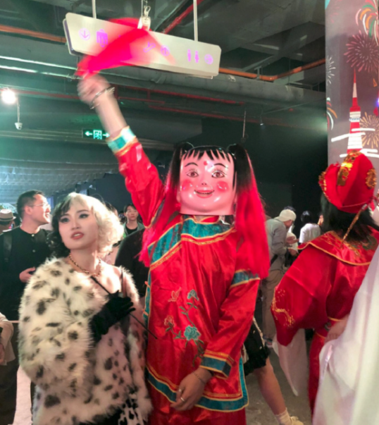

他们扮的，比鬼还恐怖啊——

我们中国人有自己的魑魅魍魉。

以后谁再说万圣节是洋节我跟谁急。

哪家的洋节， 开场大戏是安陵容给果郡王招魂。

旁边还跟着一个泡发的宝娟。

我劝你们不要太放肆。

往前走你就知道了，三步一个观音菩萨，两步一个如来佛祖。

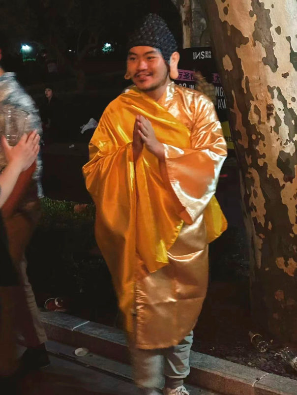

奥特曼都给套上了光圈。

来了就是中国神，奥特曼也得入乡随俗。

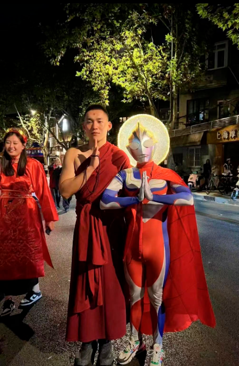

要说全场c位，还得是财神赵公明，路人都抢着合照。

祈求财神老爷能对自己定向扶贫。

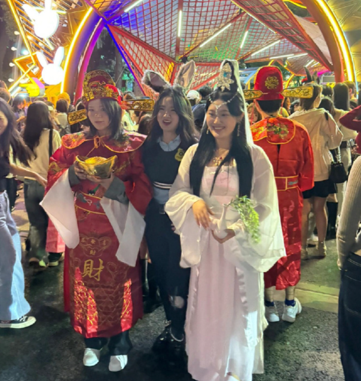

可百鬼夜行，只有神仙咋行？

黑白无常安排上。

不对，是这张（我们没有要索老板命的意思。

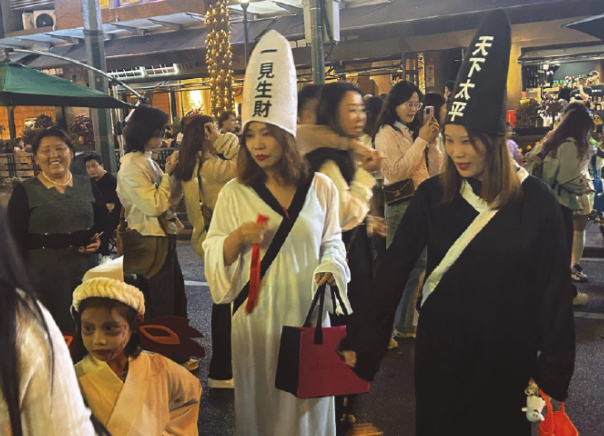

天地玄黄急急如律令，尔等速速去捉拿从对岸窜访而来的“新郎0号”。

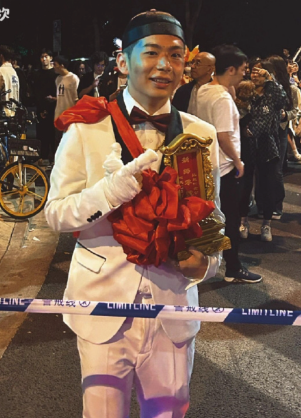

现在的鬼可不简单，东瀛的奇技淫巧运用自如，早就完成了到电器时代的进化。

但在网络时代的大魔王面前，他还是太弱了。

是谁，用一句话就击溃我们穷鬼的自尊心？

别说了别说了，再说要哭了。

发疯！发疯！

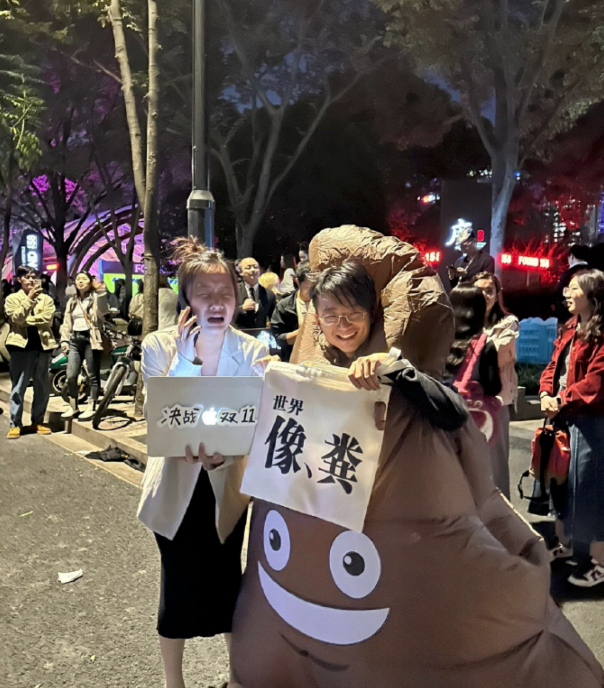

不是精神病院住不起，而是万圣节更有性价比。

这波万圣节上海街头的精神状态，领先全国几十年。

那英来了都要重喊一句X的牛X。

啊，那英已经来了？

我看了四遍，才确认不是本尊。

相似程度，仅次于隔壁的向太cos了。

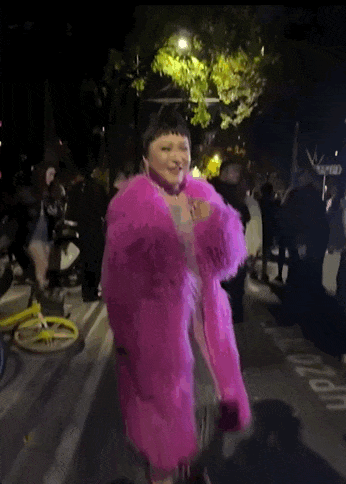

小嗑唠的，比向太还像陈岚。

另一头的“那英”和“王菲”虽然扮相稍逊风骚，但一首《相约98》可谓是拿捏了精髓。

节目效果爆鲨春晚十个百变大咖秀。

有抒情派，自然就有激情派。

鹿晗，你看你有没有一种熟悉的感觉？

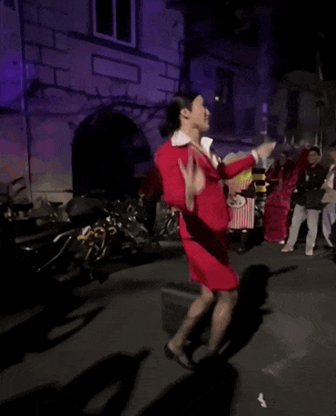

张瀚：我可太熟悉了。

而我的熟悉感，在下图出现时达到最高潮。

两眼一黑了朋友们。

我给个建议啊，五年高考三年模拟对于校园生活固然重要，但学习之外也得补全啊。

比如cos一只……长着老鼠头的鸭子。

这个才叫魔幻现实主义。

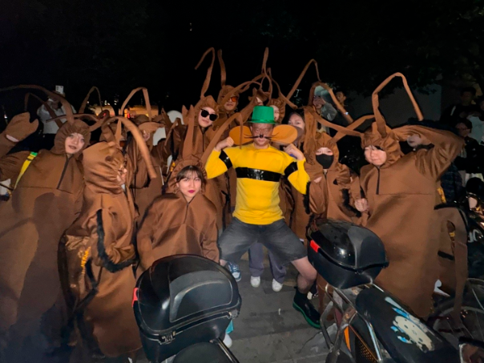

虽然大伙的cos范围之全面，给我一种全世界都疯了的安全感，但万圣节没有那个，怎么能算完整呢？

就那个，那个，每年万圣节一定会出现的保留节目——

在评论区cos刚出土的古董。

一年就发这一回疯，可把有些老僵尸吓得呀。

别说洋节了，你过端午说快乐他们也不让啊一定得说端午安康。

被社会PUA几十年，自己不快乐也看不得别人快乐。

吆喝着抵制洋节的人，如果把最普遍的洋节周末双休取消，他们会是啥反应呢？

还不是一起发疯！发疯！

依旧是那些年年说的老话，我们并不缺少强调宏大概念的节日，家庭、亲人、先人长辈……传统节日里关于家庭团圆、祈愿美满的习俗，并没有被年轻人抛弃。

只是在这些节日里，年轻人要在长辈面前小心扮演一个乖巧孩子。

在这份其乐融融的大团圆之外，年轻人也想有自己的狂欢。

一个不用去想该感恩谁想念谁的节日。

你说中元节和清明节也可以过，可他们那天上街狂欢试试，中元节谁敢扮鬼啊，看见有人烧香都要吓一跳。

万圣节就没有这种包袱。

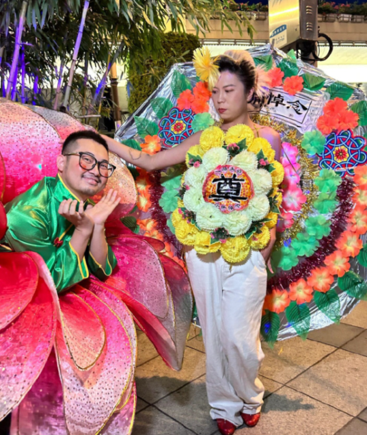

没有繁琐的习俗，没有源远流长不得玷污的规矩。

管你是广场舞大妈，还是路过的外卖小哥，随时都能参与进来。

管他这节那节，让大家开心的就是好节。

况且，你看这万圣节哪还有一个洋节样。

有谁上街“不给糖果就捣蛋”？有谁提着万圣节必备的南瓜灯？

外国人要遵守的规矩礼仪咱是一点都不管，凑热闹想咋玩咋玩，把世界变成一副发癫的样子。

你说是这是洋节文化入侵，我看是我们文化入侵洋节还差不多。

正是因为完全无视所谓的传统，这个节日过起来才没有任何包袱。

你不用去想烦人的亲戚什么时候会来拜访，不用去管别人怎么看，你可以脱开你的社会关系、家庭关系。

大伙只是借了一个万圣节的壳，穿上喜欢的衣服，真真正正做一次自己，投入一场百无禁忌的狂欢而已。

玩梗也好，发疯也好，代表的都是真实的心境。

我甚至都不想说什么“要包容”。

做错事才需要“包容”，快乐无罪，人就应该舒展的活着。

不是万圣节有多好，是我们真的缺少一个大家都能放肆快乐的节日。

啥？你说不是有个阖家欢乐的除夕。

哦，除夕不放假。

也看不成烟花。

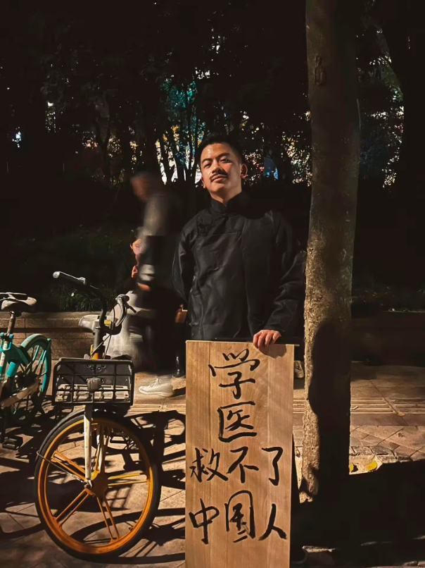

