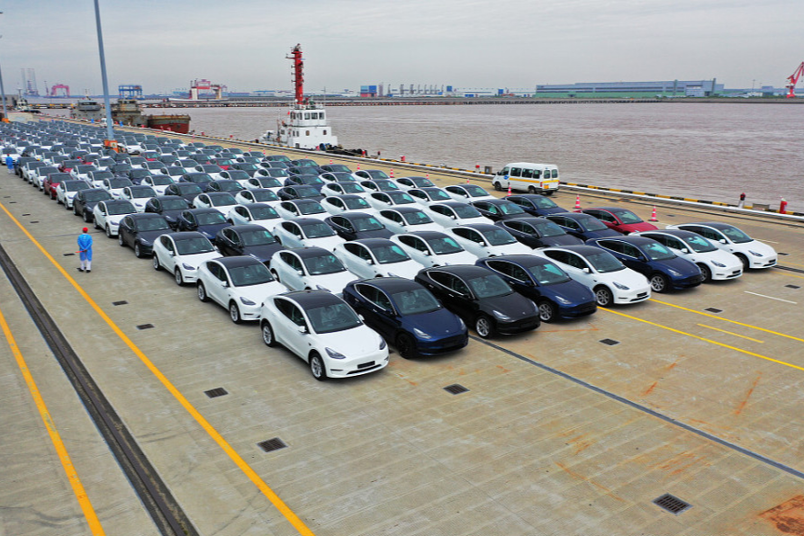

# 中国电动车掘金中东：躺着赚钱，价格翻倍，一车难求

作者 ｜ 程潇熠

编辑 ｜ 康晓

出品 ｜ 深网.小满工作室

在巴以冲突发生第一天，中东新能源汽车转型特聘顾问Emma便收到了国内新能源车企高管的问询：冲突到底有多严重？影响会有多大？

巴以冲突已持续75年，但此次堪称近几十年来最大规模爆发。

**Emma告诉《深网》，准备进军中东市场的新能源车企担心冲突会持续升级，导致他们在中东布局的业务无法开展。**

“这次的冲突确实比之前严重。”Emma第一时间电话联系了以色列合作方沟通具体情况，“本地合作方已经习惯了冲突，都很淡定，但这次从他们的语音语调都能听出来冲突很严重。”

以色列总理内塔尼亚胡（Benjamin Netanyahu）将这次冲突定调为“新的战争”。

**“但以色列其实是一个擅长打逆风球的国家。”Emma结合自己在中东的工作经验判断，即使短期中东地区社会不够稳定，也不影响整体经济。“以色列创业精神那么强，跟他们习惯身处冲突世界有很大的关联。”**

Emma介绍，在过去五年受疫情与巴以冲突双重困扰的情况下，以色列依然出现了近百家独角兽公司，人均创业率全球排名第二，仅次于美国硅谷。“他们觉得我明天可能会被一个火箭弹打飞，那还有什么不敢去尝试的。”

中东阿拉伯国家如卡塔尔、阿联酋和沙特等现处于经济上涨阶段。
**“对于西方国家来说，阿联酋就像二三十年前的日韩，沙特像二三十年前的中国。”发展快、市场大、资本想象空间更大。**

恒隆集团董事长陈启宗也曾在今年9月称，“当下中东市场充满潜力，是我继40年前参与中国内地改革开放之后最令人兴奋的一波机会。”

此前文化壁垒成了天然的商业屏障，国内创业者与投资人鲜少选择布局中东。“我们对他们的了解真的太少了。”Emma第一次落地中东，才知道迪拜和阿布扎比在同一国家。

**Emma告诉《深网》国内主流新能源车企基本都在布局中东或计划布局中东，“大家都醒悟了，中东对中国来说是一块战略宝地。中国车企出海那么多国家，唯一一个在发达国家做销冠王的就是以色列。”**

中东不想只做“世界的钱袋”

中东只有以色列一个发达国家，却因丰富的油气资源积累大量财富。在中国更是屡因“一掷千金”的土豪行为频繁出圈。

研究机构Preqin数据显示，截至2022年底，中东主权财富基金的资产管理规模总额高达3.64万亿美元，占全球主权财富基金总额的三分之一。

**“他们非常崇尚选择比努力重要。”Emma称中东非常重视赛道选择。从近期中东资金走向来看，他们将与中国的合作以及新能源转型放在更为重要的位置上。**

例如，全球资产规模排名第三的阿联酋的阿布扎比投资局，对中国市场的投资占比在三年多的时间里从4.5%（2019年末）飙升至22.9%（2023年一季度）。

另据环球零碳统计，仅今年6月，国内造车新势力如蔚来、高合汽车母公司华人运通、前途汽车母公司长城华冠等就先后宣布拿到了来自中东地区的投资或战略合作，项目金额规模近500亿元。

**“中东GCC国家现在很想把产业链建起来。”Emma在与中东政府高层交流后发现，“他们不想只做世界的一个钱袋，只负责买东西，也想有自己的产业链。”**

中东以油气资源起家，但也无比希望其经济能摆脱对油气的依赖。2015年，阿联酋当任总统曾敲响“50年后装完最后一桶石油”的警钟，直言石油让他们告别了贫穷，告别了落后，但“如果我们不改变自己，这一切仅仅是昙花一现的辉煌罢了。”

沙特在2016年推出“2030愿景”，目标是2030年可再生能源发电量占比提高到50%；阿联酋在2017年发布“2050能源战略”，计划投资万亿人民币（6000亿迪拉姆），目标到2050年阿联酋能源结构中44%为可再生能源、38%为天然气、12%为清洁化石能源、6%为核能。

中东能源转型战略自上而下，民众对新能源汽车的接受度也很高。 **据阿联酋媒体调查报道，阿联酋82％的居民表示，下一辆车将准备购买电动汽车。**

**新能源汽车时代，中东也需要找到自己的位置。燃油车时代，中东没有属于自己的汽车品牌但紧握汽车“血液”石油，仍深度参与全球汽车产业。但到了新能源汽车时代，先天的资源优势不复存在，中东也开始探寻造车之路。**

今年年初，沙特与富士康合资成立了第一家本土汽车品牌CEER，宝马授权技术合作，富士康代工，还计划与现代汽车合作建设年产5万辆汽车的工厂。

纯电车在以色列“一车难求”

“对于中国新能源车企来说，在整个中东有两个国家是必争之地。一个是以色列，另一个是阿联酋。”Emma告诉《深网》，在以色列买一辆燃油车的购置税是83%，但买一辆纯电动车只有20%，在强政策引导下，纯电汽车在以色列可谓“一车难求”。

根据以色列能源部制定的计划，从2030年起，以色列将全面禁止进口汽油和柴油汽车，进口汽车仅限定为电动或天然气汽车。

从2021年到2022年，以色列纯电车渗透率从3.8%快速攀升至10%。以色列没有本土汽车品牌，在当地最受欢迎的电动汽车是中国品牌。

根据以色列汽车进口商协会数据，今年上半年，以色列卖的最好的新能源汽车品牌是比亚迪，占据以色列33.6%电动汽车市场份额，同比翻了近六倍。中国新能源品牌整体在以色列的市场份额也从去年50%涨至60%。

“中国车企出海那么多国家，唯一一个在发达国家做销冠王的就是以色列。”Emma告诉《深网》，汽车出口中东地区除了需要欧盟WVTA认证，大多还需要其他认证，但以色列只要有欧盟WVTA认证就可以直接进口，“对车企很友好。”

Emma回忆，中国疫情放开后，以色列汽车经销商便第一时间飞到中国来聊合作。巴以冲突发生后，Emma团队与以色列及中国车企的三方合作项目仍在正常推进，“他们相当于居家办公的状态。”

“比亚迪没去之前，吉利是卖的最好的。”目前在以色列最畅销的纯电车型是比亚迪ATTO 3（海外版本），即比亚迪元PLUS
EV车型。据当地媒体报道，比亚迪第一家门店开业当日，消费者为试驾车辆排队三小时，仅一周便获得2000辆订单。

比亚迪ATTO 3在以色列当地售价15.65万以色列新锡克尔（约合人民币32万元），而国内比亚迪元PLUS EV起售价仅为13.98万元。

**“所有国内的车去了欧美、中东，价格基本都是翻一倍。”**

**以色列积极转型纯电动汽车的动机在Emma看来很简单，“汽车现在要么是油驱动，要么是电驱动。油驱动就要向阿拉伯人买油，他们是死对头，用电的话完全没有这个问题。”**

除此之外，以色列自动驾驶等科技创新行业发展蓬勃，“只要是跟自动驾驶相关，必须要用电车来做”。

“中东天气很热，夏天高达五六十度，所以空调和电池的要求会很高，在这方面会跟中国要求不一样，然后车型审美也会稍微不一样。”对于中国车企出海需要注意的事项，Emma认为，中东国家分两种人，一种人是喜欢像奔驰那种既高级又低调的感觉，另外一种就是很喜欢这种酷的、没见过的品类；当然，就像全世界所有地方一样，那种紧凑级的性价比高的车是永远受欢迎的。

信仰与商业界限分明

中东文明是人类历史上最古老的文明之一，宗教色彩贯穿始终。中东人在兼顾厚重的宗教习俗及日新月异的现代商业生活时，选择分层对待。

**“阿拉伯国家比如阿联酋、卡塔尔，他们将日常生活分为了三层：commercial life（商业）、social life（社交）、family
life（家庭）。”**

在工作场景，Emma可以穿着无袖连衣裙和阿拉伯男性握手及平等交流，非常世俗化，“但从朋友圈社交到家庭往来，大部分更传统的当地阿拉伯人还是不太欢迎外国人加入。”

以犹太人为主的以色列则是另一种叙事逻辑。除了有其传统宗教习俗外，跟欧洲很相似。

石油大国沙特为了加速经济多元化转型，也开始向海外敞开大门。

在2019年9月98日以前，沙特签证仅对外籍劳工、商业人士和前往麦加等圣地朝圣的朝圣者开放，审批流程繁琐冗长；在这一时间点之后，沙特正式开放包括中国在内的49个国家的公民旅游签证申请，还以“2030年吸引1亿游客、旅游业占本国GDP10%”为阶段性目标。

从2020年到2022年，沙特石油收入占国家财政收入的比例已从87%降至68%，且保持了一定的经济增速。2022年，沙特取代荷兰成为全球第17个万亿美元GDP俱乐部成员，且经济增速连续第二年位居G20国家第一。

“沙特阿拉伯将是21世纪最大的成功故事。”今年9月20日，沙特王储萨勒曼在媒体采访时称。

在中国与欧美等地已进入存量市场的今天，中东仍是难得具有增量发展潜力的地区。从去年到今年上半年，约有200家中国投资机构、超800家企业涌向中东。中国与中东两大拥有古老文明的地区首次全面“双向奔赴”，无疑将碰撞催生出巨大的时代机遇。

但与此同时，早在中东地区扎根的竞争对手也不可小觑：盘踞顶尖科技创新领域的美国企业、深入渗透实体经济的欧洲企业以及拥有极高性价比的印度团队。

在新战场遇老对手，中国企业出海中东，仍有一场硬仗要打。

