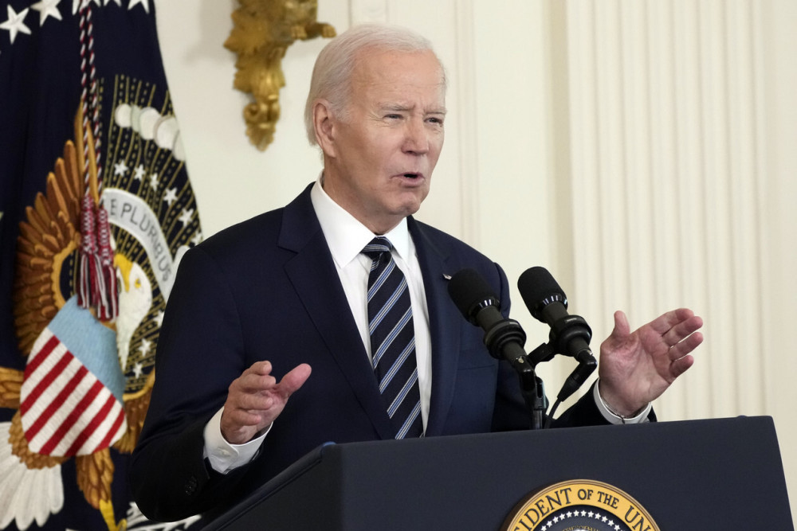

# 拜登签署行政命令，发布白宫首个生成式AI监管规定

**划重点：**

  * _1_ 行政命令要求美国多个政府机构制定标准，对人工智能产品进行测试，寻求“水印”等内容验证的最佳方法，拟定网络安全计划，吸引技术人才，以保护隐私，促进公平和公民权利，维护消费者和劳动者的利益，促进创新和竞争，提升美国的领导地位等。
  * _2_ 白宫将向十多个政府机构发布内容广泛的指令，还将任命一个白宫人工智能委员会来协调联邦政府的相关活动。尽管行政命令不是立法，但新规定将通过联邦机构的购买力和执行工具对美国市场产生影响力。

美国总统拜登此前已采取行动，组织15家领先公司自愿承诺推动人工智能安全、可靠和值得信任的发展。

当地时间10月30日，美国总统拜登签署一项“具有里程碑意义的”行政命令，推出白宫有关生成式人工智能的首套监管规定。

根据行政命令，美国多个政府机构需制定标准，以防止使用人工智能设计生物或核武器等威胁，并寻求“水印”等内容验证的最佳方法，拟定先进的网络安全计划。

具体而言，命令要求对人工智能产品进行测试，并将测试结果报告给联邦政府。它还提出吸引全球人工智能人才留在美国。据多家媒体此前报道，该行政命令要求运行云服务的公司向政府通报其外国客户的情况。

“行政命令设定了规范”

白宫在一篇声明中称，该行政命令旨在确保美国在兑现人工智能的承诺和管理风险方面发挥带头作用。作为拜登政府负责任创新综合战略的一部分，它建立在总统之前采取的行动的基础上，其中包括15家领先公司自愿承诺推动人工智能安全、可靠和值得信任的发展的工作。

美国媒体Politico报道称，尽管该命令不具有法律效力，而且白宫之前的人工智能监管工作也因缺乏执行力而受到批评，但新规定将通过联邦机构的购买力和执行工具对美国市场产生影响力。例如，行政命令特别指示联邦贸易委员会重点关注人工智能行业的反竞争行为和消费者伤害问题，该机构主席莉娜·汗（Lina
Khan）已经公开支持这一使命。

“这是重要的第一步，重要的是，行政命令设定了规范。”乔治城大学安全与新兴技术中心高级研究分析师劳伦·卡恩（Lauren Kahn）在接受媒体采访时说。

白宫将向十多个政府机构发布内容广泛的指令。在明年总统选举之前，大多数机构将有90至240天时间来满足行政命令的要求。命令还将任命一个白宫人工智能委员会来协调联邦政府的相关活动，该委员会由白宫负责政策的副幕僚长担任主席，并由来自各主要机构的代表组成。

拜登政府一位高级官员在简报中告诉记者，新规定主要适用于未来的人工智能模型，“我们不会召回现有的公开型号。”

《纽约时报》报道称，该命令针对的是最先进的未来系统，但在很大程度上并没有解决现有聊天机器人的直接威胁，这些机器人可能被用来传播与乌克兰、加沙或总统竞选有关的虚假信息。此外，虽然该命令仅影响美国公司，但由于软件开发发生在世界各地，美国在执行这些规定时将面临外交挑战，所以美国政府试图鼓励盟友和对手制定类似的规则。

必须与政府共享安全测试结果

行政命令将指导八项行动：为人工智能安全制定新标准，保护隐私，促进公平和公民权利，维护消费者、患者和学生的权利，支持劳动者，促进创新和竞争，提升美国在人工智能技术方面的领导地位，并确保政府负责任且有效地使用该技术。

第一个部分是“人工智能安全新标准”。根据《国防生产法》，该命令将要求开发任何对国家安全、国家经济安全或国家公共健康安全构成严重风险的基础模型的公司，在训练模型时通知联邦政府，并且必须与联邦政府共享所有红队安全测试的结果，并开发标准、工具和测试手段，以帮助确保人工智能系统安全和可靠。

美国国家标准与技术研究所（The National Institute of Standards and
Technology）将为广泛的红队测试制定严格的标准。国土安全部将把这些标准应用于关键基础设施部门，并成立人工智能安全委员会。能源部和国土安全部还将解决人工智能系统对关键基础设施的威胁，以及化学、生物、放射性、核和网络方面的安全风险。

命令要求，通过制定强有力的生物合成筛选新标准，防范使用人工智能设计危险生物材料的风险。

命令还要求，通过建立检测人工智能生成的内容和验证官方内容的标准和最佳方法，保护美国人免受人工智能驱动的欺诈和欺骗。商务部将制定内容认证和水印指南，以明确标记人工智能生成的内容。

命令要求制定国家安全备忘录，以指导人工智能和安全方面的进一步行动，由国家安全委员会和白宫办公厅主任负责。该文件将确保美国军事和情报界在其任务中安全、合乎道德且有效地使用人工智能，并将指导采取行动反击对手对人工智能的军事使用。

据POLITICO和《纽约时报》稍早前披露的草案，为了防止强大的人工智能模型落入外国对手手中，该命令要求开发强大人工智能模型的公司向商务部提供定期报告，并要求亚马逊和微软等大型云服务商在外国客户租用服务器训练大模型时通知政府。

隐私、公平、健康、教育方面

第二部分是“保护美国人的隐私”。第一步将涉及管理和预算办公室查明政府购买了多少个人身份信息。行政命令还将制定指导方针，以减轻政府收集、使用、共享和删除从数据经纪人处购买的信息时的隐私风险。

行政命令鼓励联邦机构采用高端隐私增强技术来保护收集的数据，并鼓励国家科学基金会资助一个新的研究网络，该网络专注于开发、推进和部署供联邦机构使用的隐私技术。

该命令还涉及人工智能在工作场所的使用，指出不应部署人工智能技术来“鼓励不当的劳动者监视”。

第三部分是“促进公平和公民权利”。命令要求为房东、联邦福利计划和联邦承包商提供明确的指导，以防止人工智能算法被用来加剧歧视。通过制定在量刑、假释和缓刑、审前释放和拘留、风险评估、监控、犯罪预测和预测性警务以及法证分析中使用人工智能的最佳实践，确保整个刑事司法系统的公平性。

第四部分是“支持消费者、患者和学生”。卫生与公众服务部将制定一项安全计划，以接收涉及人工智能的危害或不安全医疗保健实践的报告，并采取行动进行补救。命令要求支持教育工作者部署人工智能支持的教育工具（例如在学校进行个性化辅导），塑造人工智能改变教育的潜力。

第五部分是“支持劳动者”。制定原则和最佳方法，为劳动者提供指导，防止雇主薪酬过低、不公平地评估工作申请或影响劳动力的组织能力。

为留住人工智能人才提供便利

第六部分是“促进创新和竞争”。白宫称，美国在人工智能创新方面已经处于领先地位，去年在美国首次筹集资金的人工智能初创公司数量超过了排在后面的七个国家的总和。

命令提出，通过国家人工智能研究资源试点来促进美国各地的人工智能研究，并扩大对医疗保健和气候变化等重要领域人工智能研究的资助；通过为小型开发者和企业家提供技术援助和资源，帮助小型企业突破商业化，并鼓励联邦贸易委员会行使其权力，促进公平、开放和竞争的人工智能生态系统；通过现代化和简化签证标准、面试和审查，扩大在关键领域拥有专业知识的高技术移民和非移民在美国学习、居留和工作的能力。

第七部分是“提升美国在海外的领导力”。命令提出，美国国务院将与商务部合作，领导建立强大的国际框架，与国际合作伙伴和标准组织一起加快重要人工智能标准的开发和实施，促进人工智能在国外安全、负责任和维护权利地发展和部署。

据悉，美国副总统卡马拉·哈里斯将出席本周在伦敦举行的人工智能安全峰会。

第八部分是“确保政府负责任且有效地使用人工智能”。命令要求，为各机构使用人工智能发布指南，包括制定保护权利和安全的明确标准、改进人工智能采购并加强人工智能部署；通过更快速、更高效的签约，帮助机构更快、更便宜、更有效地获取指定的人工智能产品和服务。

