# 朱一龙新片赢了胡歌周冬雨，20个关键词揭晓《河边的错误》真相

“人类理解不了命运，所以我装扮成命运，换上诸神那副糊涂又高深莫测的面孔”。加缪戏剧作品《卡利古拉》中的这段话，可以视作全片最高的一个主旨的揭示。

**影鉴丨第8期丨有理观影，独家影评**

**文/而一**

《河边的错误》看不懂？究竟是烂片还是神作？作为艺术片，《河边的错误》有余华原著打底，在入围戛纳一种关注单元后又斩获平遥影展最佳影片，豆瓣评分7.5，
众多影评人与文艺青年“交口称赞”，都证明了它在艺术片受众群体里的口碑。

但是， **“普罗大众的灭顶灾难、影迷的沉思与惊喜、影评人的狂欢”，这几乎是每部艺术电影进入大众院线后的宿命，背后是受众群体的错位。**
有意思的是，《河边的错误》尽管也被院线观众诟病“看不懂”，但不少观众在看懵之余却愿意坐在影院座位上搜索解读贴，甚至还陷入自我反思——“这部电影我发现了，大家看不懂的时候，没有人质疑余华和导演，都是怪自己没有文化。”

这样的现象在“红抖”及围脖等平台都极为明显，在影片目标受众也就是高知年轻群体的带动下， **这场潜在的“灭顶灾难”已经渐渐演变成了一场烧脑的解读狂欢。**
影片预估票房也达到近3亿，有望成为春节档后票房最高的国产艺术片。

_胡歌《不虚此行》、周冬雨《燃冬》票房表现均未及《河边的错误》_

而这部电影的文本细节之丰富，也经得起我们显微镜式的深扒。本文尝试以20个关键词切入，做一番稍为全面的解析。

1.

【加缪的台词】

影片开篇即提纲挈领地引用了加缪戏剧作品《卡利古拉》中的一段话：“人类理解不了命运，所以我装扮成命运，换上诸神那副糊涂又高深莫测的面孔”。这段话可以视作全片最高的一个主旨的揭示。

在加缪《卡利古拉》中，罗马暴君卡利古拉在妹妹兼情人去世后，突然领悟到“人必有一死，而他们并不幸福，且悲伤和痛苦也毫无意义”。意识到世界的荒谬，卡利古拉决定自己“扮演命运”，他利用手中的王权，肆意主宰别人的命运，他说，“我之所以草菅人命，正因为我自己就视死如归“。

_康春雷饰 疯子_

**《河边的错误》中的疯子拥有跟卡利古拉相似的特征——他们都是非理性、不可捉摸、对他人生杀予夺的荒谬命运的化身**
，他似乎也换上了诸神那”糊涂又高深莫测“的面孔，将幺婆婆、诗人王宏、异装癖许亮、小男孩的结局导向死亡，而自己却游走在人间的法律之外。

余华在谈到《河边的错误》时也说“命运的看法比我们更准确，我们一直生活在未知之中。”试图寻找真相打破未知、并将疯子（命运）关进笼子的刑警马哲，在意识到这种荒谬与不可知后，终于陷入了癫狂。

2.

【河流与雨水】

河流与雨作为影片重要的意象，也营造了影片湿冷残酷的氛围。

河流可以是不可捉摸的命运，可以是宏大的时代历史洪流，可以是神秘的卷走与淹没一切的危险之物，它见证了河边发生的所有一切，滔滔不绝却从不介入。

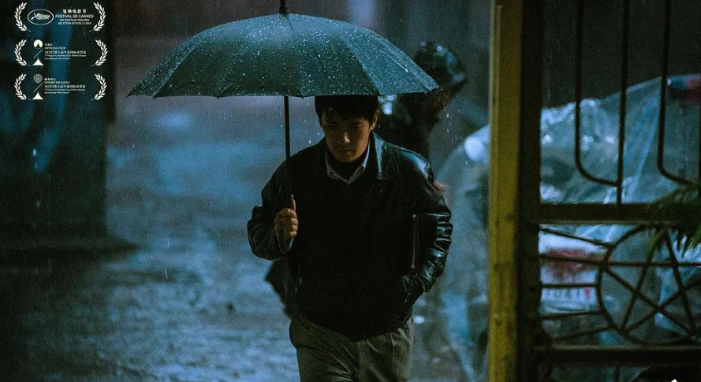

雨则常常出现在犯罪片中，在影片中好像每次命案后都有雨，故事发生的地点也叫沛水市。雨冲刷掩盖了犯罪的痕迹，也让人更加看不清现实的面貌。

3.

【扮演警察的少年】

影片第一场戏是全片故事与寓意的一个浓缩。一群少年在废弃的大楼里玩警察捉贼的故事，少年戴着警帽举着玩具枪，逐个撞开房间的门寻找凶手，最后一扇门打开却是临街的“断头路”，让他无路可走险些掉落，外面是烟雨迷蒙的现实世界。

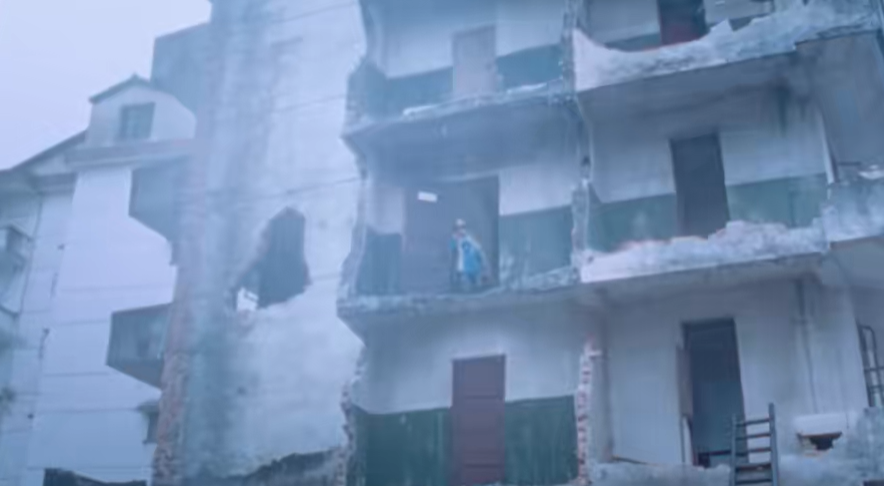

少年就像马哲，探寻不到世界的真相，还把自己引向了“深渊”。

4.

【石头与水中衣服】

疯子第一次出场时，镜头非常明显地强调了他衣服下漏出来的屁股，衣服作为一种遮羞蔽体的物件，象征着社会的规训，而疯子这个群体显然是不受这种规训约束的。

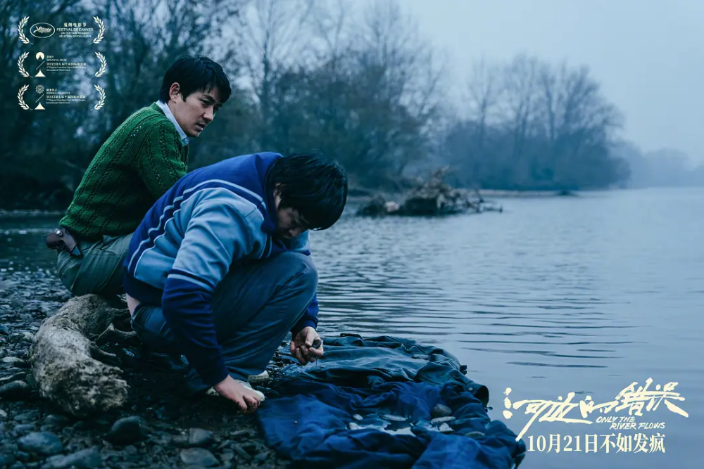

而片中的孩子们会向疯子这样的社会异类扔石头，
**石头成为一种绞杀异类的武器，而疯子借用了这个武器，他把象征规训的衣服放入水中，再将石头压在上面，形成他对社会规训的反叛。**

马哲第一次在河边见到疯子时，他也模仿疯子把外衣放入水中，一种试图平等交流的姿态，暗示了他的某种“认同”——在他的心里其实也住着一个不受社会规训的“疯子“。

5.

【皮夹克与警服】

朱一龙扮演的马哲一出场就穿着黑色的皮夹克，不管是开会还是合照，都与同事们整齐划一的警服显得格格不入，皮夹克便是他作为“异类”、某种程度的“疯子”的一个外化的象征。

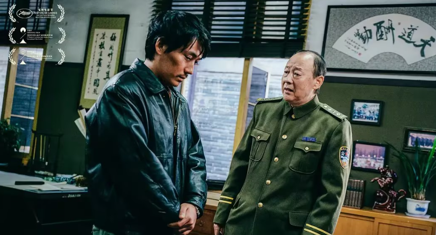

如上文所述第一次遇见疯子时他就已脱下皮夹克与疯子达成了某种“同化”，疯子当时也被他的皮夹克吸引，影片结尾马哲把皮夹克放在岸边，自己潜入河里，这时疯子出现了，将马哲的皮夹克穿到身上，马哲于是将“披上马哲外衣的疯子“打倒了，之后的他警服加身接受集体表彰，此前连他的妻子在照相馆都“劝”他：这身警服挺好的，别换了。

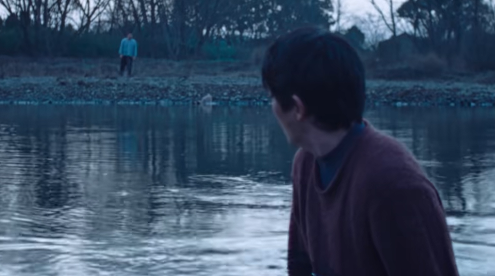

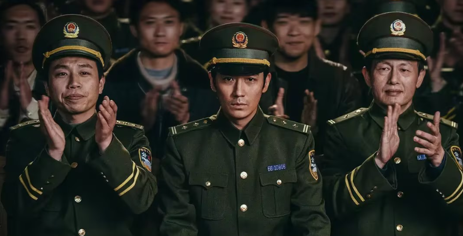

从皮夹克到警服，马哲杀死了内心的疯子，重归体制的怀抱。

6.

【局长的乒乓球】

乒乓球作为国球已经是超越体育本身的存在，短视频平台上“陪领导打乒乓球，全是人情世故，是时候表演真正的技术了”已经成为一种流量密码。

局长首次出场就是被簇拥着打乒乓球，并开会让大家高度重视先进集体的评比。片子透露出来的机关内的腐朽作风，颇有90年代《背靠背脸对脸》《黑炮事件》等黑色讽刺喜剧的味道。

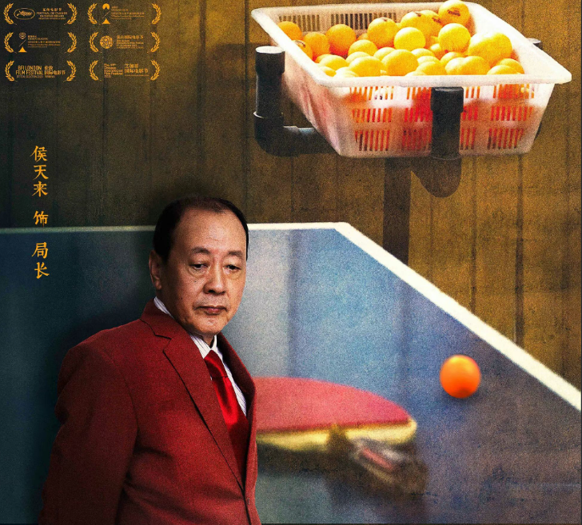

在片中，乒乓球是体制抛出的橄榄枝，是归顺的招安令，马哲却在陪局长打乒乓球时无情扣杀，局长无意识地接了一句话，“这错误要改正过来”，当一箱子的乒乓球不小心滚落满地，同事们纷涌着去捡时，马哲却独自站在那茫然沉思，后来马哲梦到了局长用乒乓球作为抽奖球为他开奖，抓住疯子的他最终也如愿得到了体制的表彰。

同时，乒乓球在滚落一地时的混乱，也是马哲日渐分裂的精神世界的影射。

7.

【废弃的电影院】

导演魏书钧一如既往地延续他在《野马分鬃》《永安镇故事集》中对“元电影”（讲述电影的电影）的嗜好，废弃的影院、被拆卸下来的万宁电影院招牌、燃烧的放映机等，但他对元电影元素的运用又不止于迷影趣味。

片中局长让马哲把刑警队办公地搬进影院里，于是警察办案变成了舞台上的一场戏，魏书钧表示：“电影院的设置是一个视角，马哲被置放在一个舞台上面，给我们提供了一个观看他的角度，给影片本身增添了一种虚构性。”
**所以当观众意识到马哲“精神失常”时，他们忍不住会想，所以前面的讲述是真实的吗，会不会是马哲幻想出来的？** 甚至，这其实就是一个嘲讽意味十足的历史舞台。

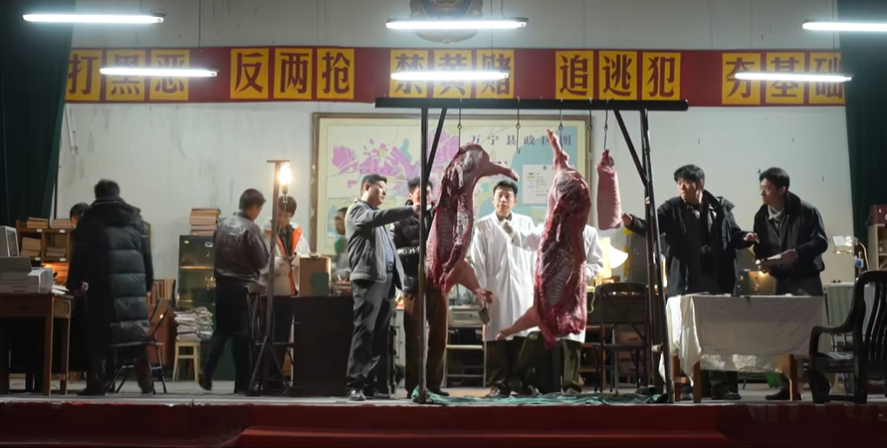

影片中，马哲原本是舞台上被观看的“画中人”，后来却抽身出来变成影院坐席上的观众，银幕放映的是那段串联起疯子作案过程的梦境，那是属于马哲的“楚门世界”，他终于意识到自己身处故事中，他站起来背向银幕茫然地望向观众席，
**这是导演对电影虚构性明目张胆的提醒。**

此外，魏书钧还善于用小聪明式的“自反”来与影迷互动，在对凶手一筹莫展的时候，徒弟对马哲说，师傅，我看过一部电影里头的死者父亲都是一场侵略战争的参与者，你不会也是这么想的吧？似乎在揶揄银幕外的我们，试图打破我们对某些叙事套路的预期，也用自我嘲讽来消解我们对影片不按套路出牌的潜在不满。

8.

【受虐狂、异装癖、婚外情】

幺婆婆、王宏、许亮，这三个死者有一个共同的特点，都是不容于社会主流的异类。

幺婆婆在小说原著里她收养了疯子，她享受疯子鞭打她时的快感，因为跟她死去的丈夫家暴她时很像。电影里更加隐晦一些，马哲在她的房间里发现了鞭子和屋顶上的鞭痕，最后在梦境里揭示了她的受虐倾向。

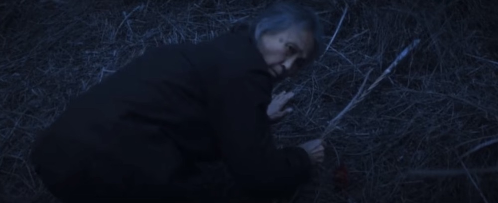

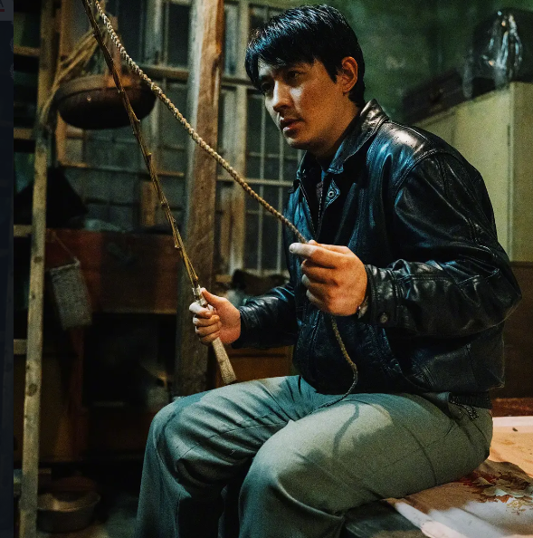

而对另外两位死者许亮和王宏，魏书钧都进行了大刀阔斧的改编，许亮被赋予了异装癖的设定，王宏被赋予了地下情/诗人等身份特性，由此与带有受虐倾向的幺婆婆一起，
**共同构成了一个社会“异类”的群像，并死于世俗的凝视，死于另一种社会集体意识的绞杀。**

9.

【疯子的意象】

魏书钧对原著许亮、王宏等人物背景的丰富化改编，虽然更符合电影视觉化与人物逻辑性的要求，却弱化了余华原著作为反思文学的警示。

原著里王宏与许亮等人物反复出现“你们谁都怀疑“，“我从来不相信别人会相信我”，“我知道自己随便怎样也逃脱不掉了“等台词，因为在某个“欲加之罪”泛滥的疯狂年代，太多人逃不脱非理性的集体攻讦，小说中的许亮甚至非要证明自己就是凶手，用自我毁灭的方式获得了对自己命运的主宰权。

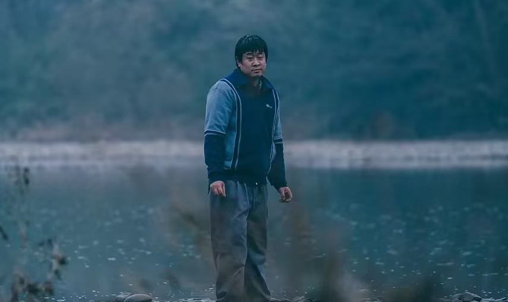

疯子作为荒谬命运和非理性时代的意象，在电影里因为受虐狂、异装癖、地下情的“异类群像”的设定，而具化成另一种更具有世俗普适性但同样具有杀伤力的社会主流意识。

10.

【《月光奏鸣曲》、《花心》、《醉酒》、《逗你玩》】

影片多次出现贝多芬的《月光奏鸣曲》，它并非曲名表面上的那般宁静温柔，相反，却带有幽深的坠落的不安的紧张氛围，导演魏书钧甚至品出了杀戮的恐怖感，因而将这首曲子用在片中。

另一首反复出现的歌曲是周华健的《花心》，这是90年代来自台湾的“靡靡之音”，当它出现在钱玲的录音带里后，被马哲的徒弟洗脑般地反复吟唱，最后马哲撇下工作回归家庭时，为妻子“浪漫”献唱的却是这首来自命案现场的歌——疯子的存在已经深深烙印在他心里，哪怕他选择了回避。同时，《花心》的歌词也呼应着影片的故事：“花的心藏在蕊中……从不轻易让人懂”。

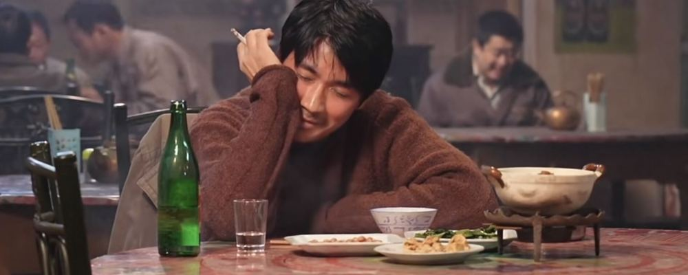

马哲和徒弟在酒馆时，背景播放的是侯宝林相声《醉酒》；马哲在酒馆遭遇疯子时，背景播放的是马三立相声《逗你玩》，疯子在马哲背后放声狂笑，嘲弄意味十足。

11.

【怀孕的妻子与拼图】

收音机里播放着贝多芬的《月光奏鸣曲》，连贯的音乐连接起了马哲的办案空间与妻子的生活空间。
**妻子一醒就说做了个梦，以及许亮死后妻子有了类似的大波浪发型等，都强化了影片虚虚实实的心理氛围。**

妻子织毛线时，马哲手上套上了毛线圈，仿佛是戴上了一副手铐，片中还有大量的将人物置于牢笼般的门框、铁窗、隔离带之内的镜头，寓意人物的困境。

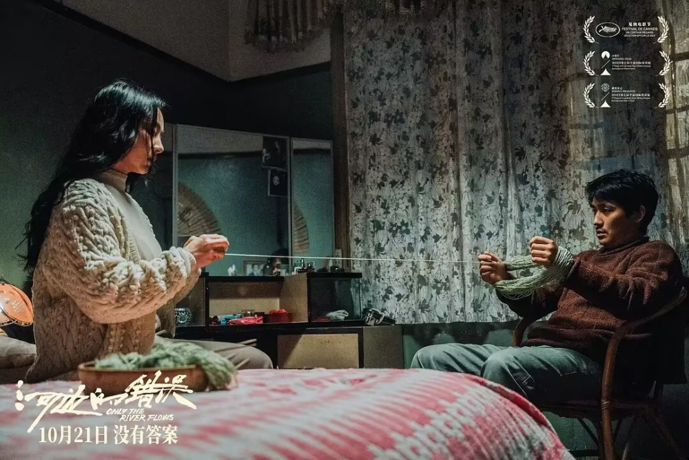

妻子在厨房与马哲争论，不同意打掉可能有智力缺陷、可能成为下一个“疯子”的孩子时，手上却在做着打蛋的动作，孩子也正面临鸡蛋这样的命运，能不能保住在他们的一念之间。妻子控诉马哲“你没有情感”“这一切不是意外是天意”，虽然歇斯底里，却是人对抗荒谬命运时保留人性光辉的选择。

妻子每次出现似乎都在拼图，那是一副母婴图，是孕中妻子期盼孩子出生的心愿的外化动作，不想生下“疯子”的马哲把拼图里孩子的头冲进了马桶。马哲把抓疯子的任务交给徒弟后回归家庭，与妻子聊天说笑喝酒抽烟，这是全片最松弛最温馨的一场戏，以至于有些不真实，当他们倚偎着跳舞时，墙上猛然出现了完整的母婴拼图，如幽灵般诡异，图中的背景是一轮耀眼的“红太阳”，片中也多次出现红色，局长两次出现的红色外套、许亮跳楼时墙上的血红色放映机、马哲困于其中的红色车子和红色毛衣等。

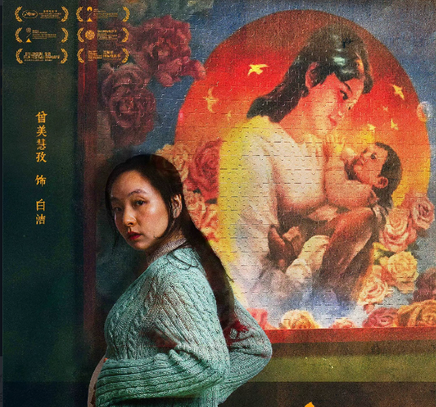

马哲的眼中因而露出了惊恐，不管在事实上，拼图和孩子是否还在，也不管马哲是不是精神出现问题，这都不重要，
**这场戏就是一个隐喻，马哲试图杀死某个疯子的行为没有成功，“疯子没有死”“疯子又回来了”“疯子一直都在”。**

12.

【幺婆婆的鹅】

在余华的原著小说中反复出现鹅群，电影里河边场景也多次出现，鹅在文艺作品中似乎常被用来譬喻“乌合之众”，在姜文的《让子弹飞》同样有出现鹅城和被煽动革命的人群。

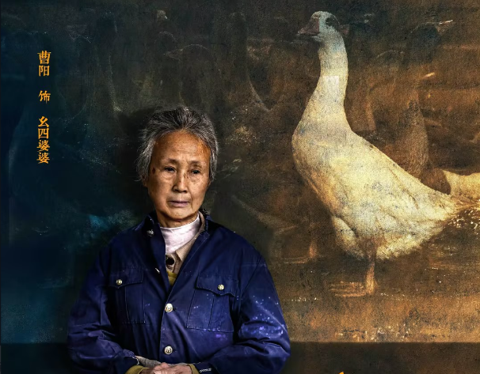

余华用马哲的视角写道“那群鹅，一如从来那么无忧无虑”，哪怕照料它们的幺婆婆死了，哪怕它们生活的河边发生了那么多命案，它们迟钝、愚笨、成群结队，在水里随波逐流，靠幺婆婆手中的那把抽鹅鞭指引方向，一如愚民、群盲、乌合之众。正是它们成就了那些希特勒式的疯狂。

13.

【东风火车与钱玲的秘密】

马哲在命案现场发现了一个包里的录音带，女子钱玲在录音里对男子宏倾诉爱意，当她说道“我有一个秘密”时，响亮的火车呜咽声遮盖住了这个秘密。

马哲和徒弟找到火车上的司机师傅，师傅确认这是火车出现故障时才会发出的报警信号，当他们走下车，镜头背景里的“大连机车辆厂””大力（牌）”“东风2642“字样尤为显眼，这是一款可追溯到五十年代仿制苏联的火车。

没错，宏大的“东风火车”在出了故障的时候才意外地给到了个体喘息的空间，帮助钱玲掩盖了她因地下情怀孕（自称吃了20个饺子，和得知王宏死讯时隐约隆起的肚子）的秘密，使她成为片中唯一一个有名有姓还能免于疯子绞杀的河边目击人。如果这辆火车还像过去几十年那样开，更多人的命运又将何去何从？

14.

【王宏与诗歌】

扮演诗人王宏的是“音乐诗人”莫西子诗，代表作是那首《要死就死在你手里》，他在片中的造型恍惚让人想起了海子。影片故事背景是1995年，诗歌从光芒万丈的80年代来到沉沦的90年代，被边缘化是诗歌的命运，虽然片中诗歌朗诵甚至开进了单位里的“下沉市场”，但群众报以的却是哄堂大笑。

影片给予王宏的诗很美，当他死后，旁白响起他给钱玲的温柔的告别信：“你就是我在牢笼里打开的天窗，也是我心甘情愿的枷锁，你是我安稳的故乡，也是我漂泊的岛屿。我们就是这个世界上最小的乌托邦。”现实让人无力，“可诗歌不是我们的避难所，当眼睛再次睁开，现实又回到面前“。
**这个现实既是王宏钱玲的，也是诗歌的。**

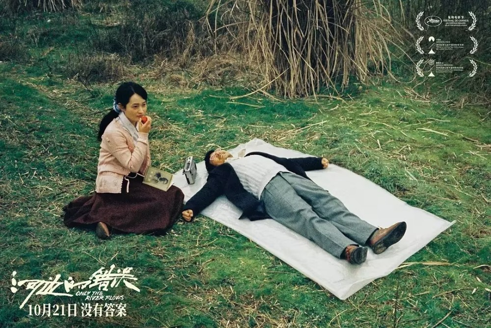

王宏本想来到河边与钱玲分手，但命运弄人，疯子的出现，“成全”了他的诺言——“只有死亡能把我们分开”，诗歌成了他的原罪。王宏之死也就不仅仅是因他不容于社会的婚外情，还有诗人身份在这个社会必然被放逐的命运，随他一块逝去的还有那个理想主义的年代。

当王宏的尸体躺在白布上，一旁的钱玲吃着他诗句里伊甸园的禁果，腿上放着契科夫绝笔遗作《樱桃园》，书中既有“生命就要完结了，可我好像还没有生活过”的人生喟叹也有对樱桃园这个美丽诗意家园逝去的告别。

15.

【被杀死的男孩】

第一次发现命案现场的是一个小男孩，但大人宁愿看虚假的新闻节目也不相信他，真实在现实世界里受到排斥；男孩想知道坏人到底长啥样，一如原本纯真的马哲，但当他真正认出命运的面孔、世界的真相时，迎接他的是死亡，像是命运无情的嘲弄：你想知道我长啥样，我就成全你。这跟王宏诗歌里的“flag”——“只有死亡能把我们分开”异曲同工。

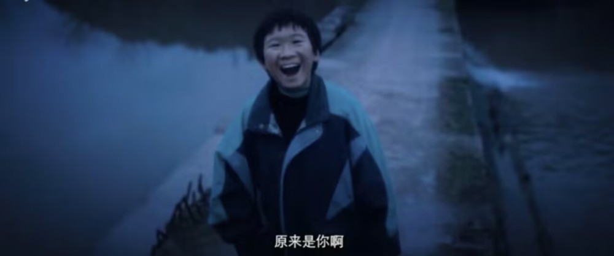

此外他认出疯子时说的“原来是你啊”与之前幺婆婆邻居说的“小孩朝疯子扔石头”也构成了非常微弱的联系，男孩的死简单点理解就是自食其果。

16.

【“大波浪”许亮】

在余华的原著小说中，许亮身上并没有异装癖这个设定，他只是呢喃不休地说着一些抽象的话语。魏书钧尽管在电影后半段骤然把观众引向了困惑与混乱的艺术片氛围，但他不敢将影片变成一个彻头彻尾的先锋实验电影，所以只好赋予许亮等角色更多易于理解的人物逻辑动机与故事背景。

许亮也就成了“大波浪”，一个不容于世人、曾因莫须有的流氓罪入狱七八年的女装大佬，从而解释了他那些不知所云的话（“流程到哪了，说个日子，不会冤枉一个好人？那我知道到哪一步了“）因何而起。

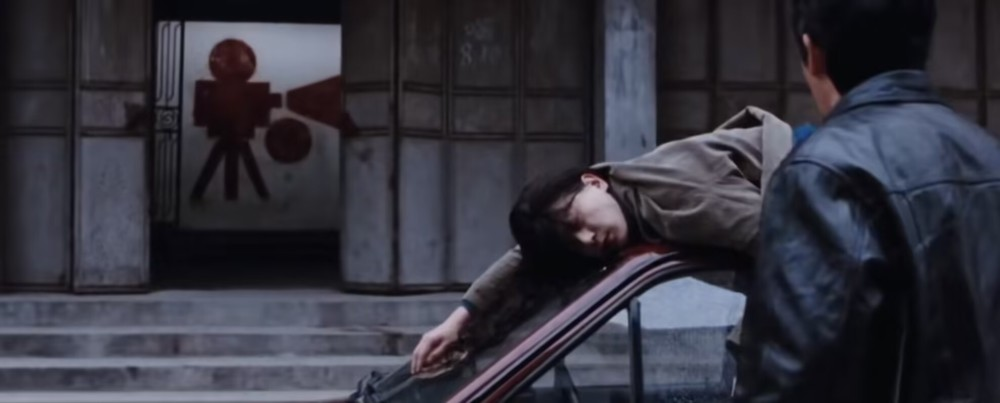

虽然许亮的生理性自杀被救回来，但被马哲从他房间里翻找出来的女装已经暴露了他的秘密，
**社会性死亡的他在讽刺性地当面为马哲送出锦旗后，从楼上跳下坠在马哲那辆红色的车子上** ，头戴大波浪，面朝镜头和马哲，背后是血红色的放映机见证一切。

许亮疑似因他而死，这个真相终于让马哲的精神世界陷入崩塌。

17.

【梦境与燃烧的放映机】

马哲坐在影院的观众席上，像看电影一样经历了一场梦境，梦里幺婆婆等人轮番出场，展示自己的结局，马哲还梦到了局长抽奖对他的嘉奖，最后放映机燃烧，他试图用皮夹克扑灭大火，遭到死者们的嘲笑，最后抱着放映机投入河中。

**马哲在梦境中串联起了案件的部分真相，却理解不了这个世界的真实与荒谬。**
放映机及投影出来的照片本是他掌握的关于真相的证据，此刻的燃烧意味着这些理性证据的不可靠，他试图挽救，但无济于事，醒来后的他，终于放弃了对这个世界的解释，提出了辞职。
**在另一个层面上，燃烧的放映机也是导演对电影叙事不可靠性的暗示，提醒观众跳出观影陷阱重新思考整个故事的含义。**

18.

【“枪杀”疯子】

马哲在照相馆看到疯子出现在他人的照片中，但没人质疑过照片里有陌生人，似乎只有马哲看到了疯子，其他人都集体无意识地无视了，这又是一处对时代的隐喻。

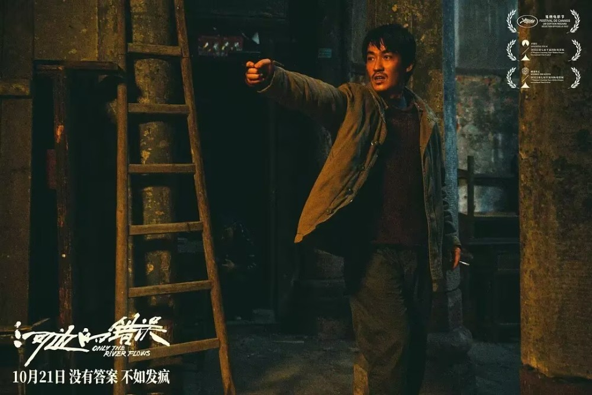

**马哲在酒馆里遇到疯子莫名的狂笑与跟踪挑衅，影片对此处理得同样虚虚实实，亦真亦幻，既是命运的纠缠、时代狂暴的阴魂不散，又是马哲内心疯魔的外化**
，他不敢直视“疯子”，先是苦笑与回避，最后鼓起勇气在庙里四枪“枪杀”了疯子，但镜头没有给到枪杀现场，而是一直停留在墙上的“钟馗捉鬼”图上，指证了这场戏的不真实性，最后马哲在局长面前发现四颗子弹完好无损。

马哲对局长说：一切都是疯子安排的，你把我杀了，就圆满了。他既陷入了跟许亮一样的自证中，又对疯子这个阴魂无可奈何。

19.

【捉住疯子与三等功】

马哲向局长提到自己在云南拿过三等功，而无论妻子还是老同事都不记得这件事。三等功贯穿全片，一个渴望被集体认可的象征，一个叙事的小悬念，并在马哲孩子被发现有基因缺陷后，强化了马哲本身也疯魔的一个伏笔，难道他真的精神错乱了，三等功根本不存在？

最终他通过抓到疯子，获颁三等功，那场表彰仪式在影院里，一个反复被指认为虚构性空间的地方，这个三等功的真实性也因而变得更加可疑了起来。

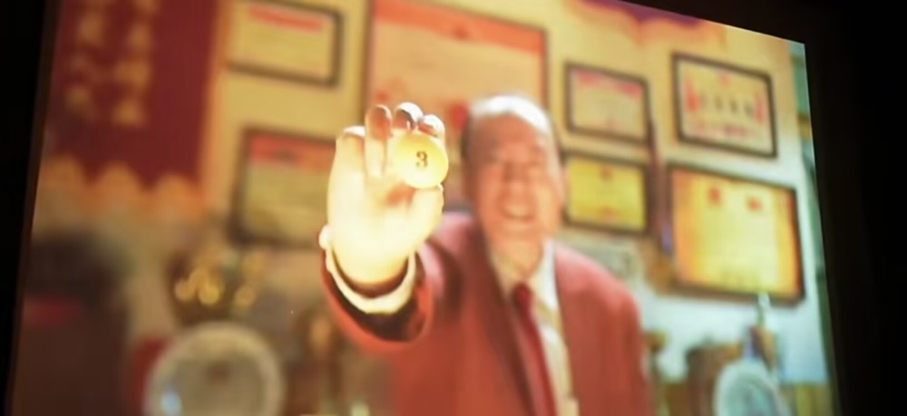

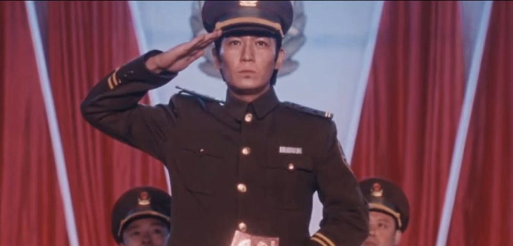

而颁奖词里提到，疯子并没有死，只是被“妥善地安置在精神病院”，要知道，疯子原先就是从精神病院逃出来再次犯案的，疯子靠此逃脱了法律的制裁，
**命运、时代、权力，都可以换上疯子的糊涂面孔，然后肆意主宰别人生命而得到庇护。**

在原著里，疯子在精神病院中被折磨了两年，因为政府节约成本而被放出来了，人们恐慌地喊道“疯子又回来了”，马哲动用私刑在河边杀死了疯子，最后他在局长的安排下，用言语错乱假装精神病人逃脱法律的制裁，他对此大感荒谬，他的笑声越来越响：真有意思。一种权力杀死了另一种权力，但都戴上了精神病的伪装面具，疯子永远无法真正被关进牢笼里。

电影里取消了马哲假装精神病的结尾，改为了表彰大会，并用马哲的孩子来隐喻“疯子”还在不断延续与轮回，如同马哲圆周率般的车牌号31415。

20.

【马哲的孩子】

从不存在的三等功、失而复现的拼图、燃烧的梦境、与疯子相遇的幻觉，马哲的精神世界似乎出现了问题。

但一切是不是马哲幻想出来的，马哲到底有没有精神分裂，只是导演魏书钧玩弄的一个小把戏，我们看过太多利用主角精神或人格分裂的设定，来实现剧情反转的电影，比如《搏击俱乐部》《禁闭岛》等。
**但《河边的错误》野心不在于此，它用这个叙事陷阱来激发观众对故事的怀疑，随后观众不得不跳出此前陷入的类型故事的舒适区，重新寻找与拼凑电影中的细节线索，被动地配合导演完成了对这部影片的深层解读。**

“马哲”本身就很值得玩味。

刑警“马哲”孜孜不倦地试图用理性去探寻世界的真相，但却解释不了全部的事实与人性，他手中的权力甚至引发了许亮等人的不必要死亡，最终马哲自己也产生了自我怀疑。

“马哲”暂时性地将”疯子“关进了精神病院里，重新受到集体的认可表彰，但他的孩子仍旧有10%的可能存在智力缺陷，成为下一个“疯子”。

影片结尾，马哲的孩子洗澡，将精神病院服般条纹状的毛巾浸在水中，把玩具压在上面，与片中疯子用石头压水中衣服的动作如出一辙。

“马哲”疯了吗，“马哲”的孩子将来会继续疯吗？谁也不敢回答。

