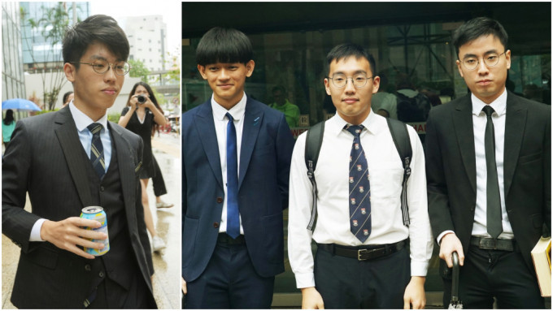

# 港媒：4名港大学生承认“煽惑他人蓄意伤人罪”，被判监禁2年

【环球网报道】据香港星岛网30日报道，4名时任香港大学（简称：港大）学生会评议会成员，2021年7月通过所谓“动议”，“哀悼”铜锣湾刺警案疑犯梁健辉，原被控涉嫌违反《香港国安法》第27条的“宣扬恐怖主义罪”，开审前均承认交替“煽惑他人蓄意伤人罪”。法官谢沉智慧今（30日）午于区域法院判处4人监禁2年。

_4名被告左起张敬生、杜林丞亨、郭永皓和容颂禧 资料图 图自香港星岛网_

报道介绍称，4名被告依次为21岁时任评议会主席张敬生、22岁时任学生会会长郭永皓、21岁时任李国贤堂学生会代表杜林丞亨及21岁时任文学院学生会代表容颂禧，同被控于2021年7月7日，在香港非法煽惑他人意图使香港警务处警务人员身体受严重伤害，非法及恶意伤害警务人员。

据报道，法官今日判刑时表示，该案中有多项加刑因素，各被告并非单独行事、而是伙同犯案。他们以港大学生组织的官方渠道发布煽惑言论、令其煽惑更可信。法官还提到，“动议”事前草拟在议程上，犯案有预谋；各被告知道会议过程会被拍摄录像，并且在学院和校园电视等平台发布，这些平台均对本地及国际公众开放；而且上传到互联网的内容迅速广泛传播，议案也引起媒体广泛报道及国际关注。

报道提到，4人罔顾香港特区政府事后谴责刺警案疑犯梁健辉事件，他们的煽惑行为是明目张胆地公然挑战法律和治安。法官表示，涉案“动议”和议案与学生会职能或学生利益无关，各被告是公器私用，滥用作为评议会成员的权力。报道称，香港大学是香港、乃至国际上的最佳大学之一，4名被告在社会上被视为接受过良好教育的有识之士，是其他年轻人的榜样，他们煽惑言论很可能对社会造成影响。

