# 直击巴以冲突：以军全力攻击加沙，战斗迎来“血腥的磨难”

据环球时报30日消息，以色列地面部队大举进入加沙，加沙的社会秩序开始崩溃……巴以冲突升级的噩耗让外界绝望。以色列总理内塔尼亚胡当地时间28日晚在特拉维夫宣布，随着以军更多地面部队进入加沙，针对巴勒斯坦伊斯兰抵抗运动（哈马斯）的“第二阶段战争”已开始，“这将是漫长而艰难的”。另外，多国警告，以色列地面部队大规模进攻加沙，将带来严重后果。

_当地时间2023年10月28日，以色列特拉维夫，以色列总理内塔尼亚胡表示，随着27日晚更多以色列地面部队进入加沙地带，针对巴勒斯坦伊斯兰抵抗运动（哈马斯）的第二阶段作战已经开始。_

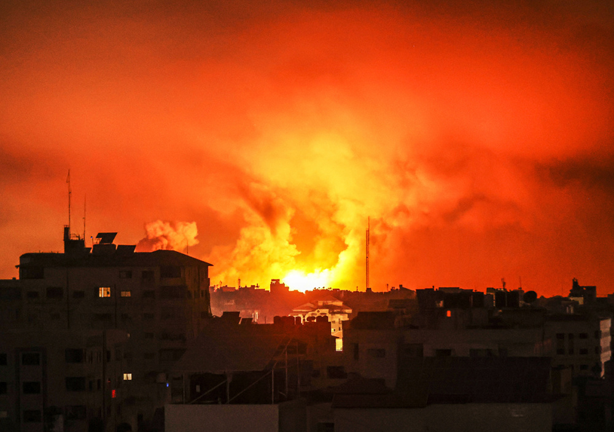

 _当地时间2023年10月27日，以色列空军继续空袭加沙地带，爆炸照亮黑夜。_

加沙社会秩序崩溃

当地时间28日，以色列战斗机在加沙城上空投掷传单，警告民众该地区现在是“战场”，他们应“立即撤离”。夜里，加沙遭遇自战争开始以来最猛烈的轰炸，以色列对当地电信基础设施的袭击导致加沙地带通信完全中断。哈马斯管理部门表示，数百座建筑物在以色列的空袭和炮击中被摧毁，过去一天至少有377人死亡。直到29日上午，加沙地带通信服务才开始逐步恢复。

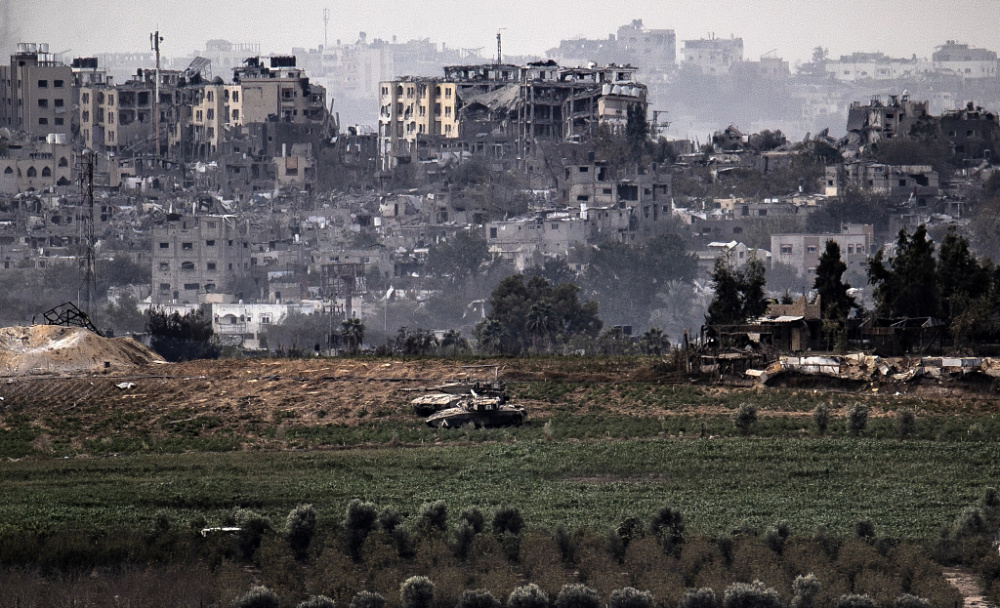

_当地时间2023年10月29日，以军坦克部署在加沙地带北部拜特哈嫩镇附近的农田上。_

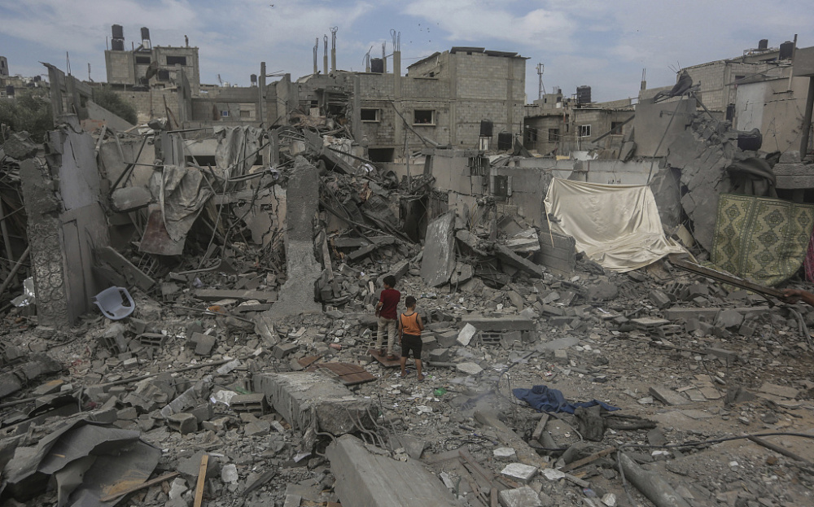

_当地时间2023年10月29日，以色列空袭后，加沙地带的建筑变为一片废墟。_

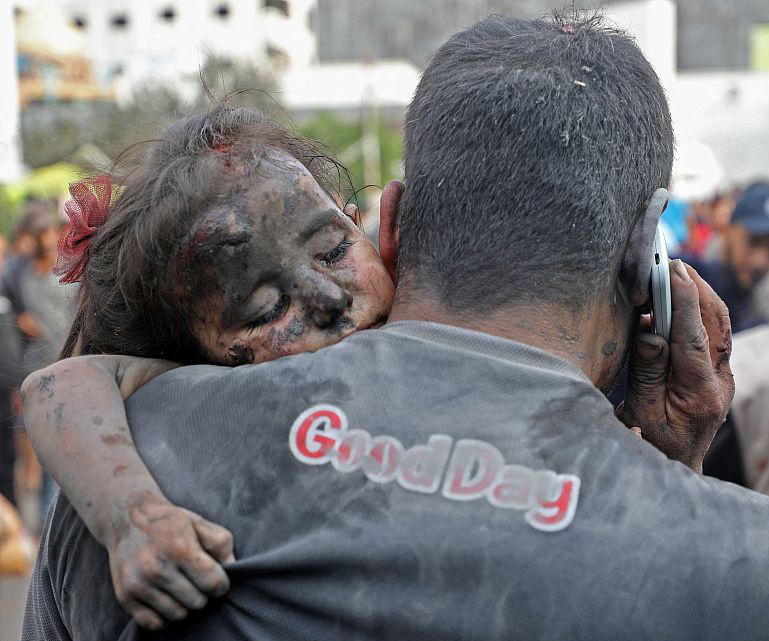

_当地时间2023年10月29日，以色列空袭加沙地带，男子抱着一名受伤的女孩进入医院。_

“加沙的社会秩序开始崩溃”，联合国表示，数千人洗劫了该机构在加沙的食品仓库，面粉等基本生活物资被抢。该机构负责人托马斯·怀特说：“这是一个令人担忧的迹象，经过三周的战争和围困，加沙的社会秩序开始崩溃。人们感到害怕、沮丧和绝望。”“市场上的物资即将耗尽，而从埃及通过卡车运往加沙地带的人道主义援助物资却严重不足。”截至目前，加沙地带有2000多名学生和70多名教育人员在本轮冲突中死亡。

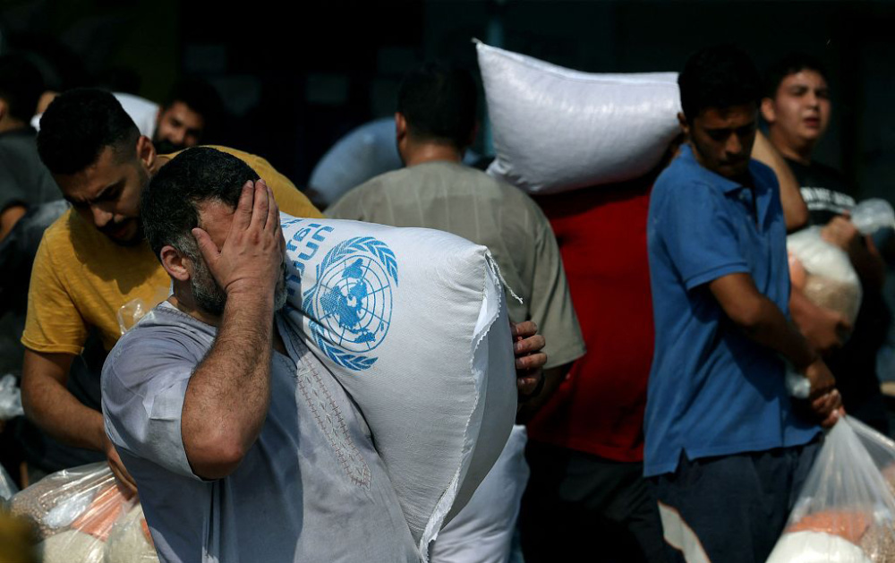

_当地时间2023年10月28日，巴勒斯坦，人们从联合国运营的援助供应中心领取食物。_

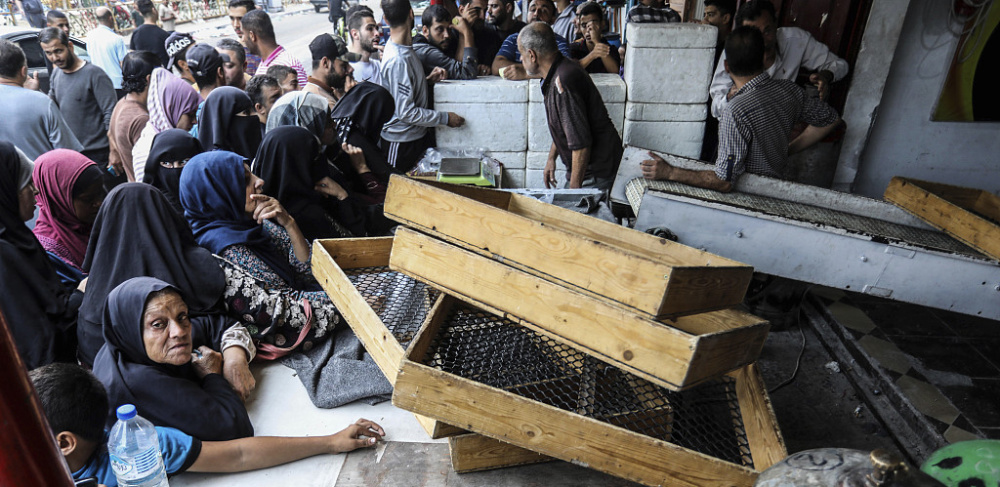

_当地时间2023年10月29日，巴勒斯坦拉法，人们在一家面包店前排队购买面包。_

据新华社报道，以色列当地时间29日宣布，部分恢复对加沙地带供水，日均供水量为2800万升。据以色列媒体报道，以国防部下设的政府领土活动协调处当天表示，已重启两条通往加沙地带的输水管道，每日向加沙地带输水2800万升。

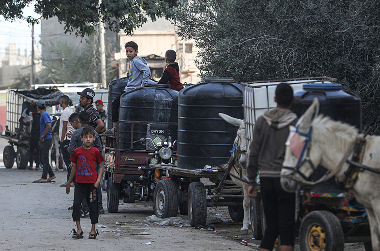

_当地时间2023年10月30日，加沙地带汗尤尼斯，由于以色列暂停供水，导致水危机，人们排队等待给水箱加水。_

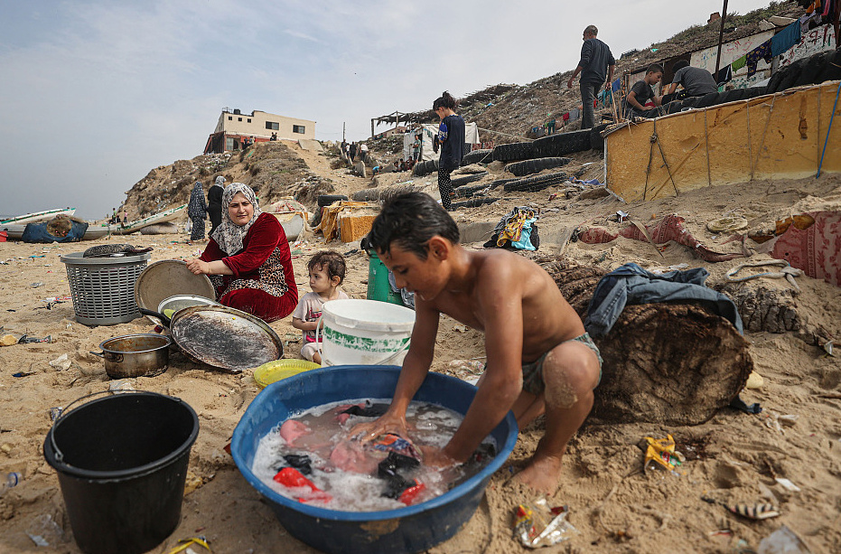

_当地时间2023年10月29日，加沙地带被停水期间，人们使用海水洗衣服。_

以军正全力攻击加沙地带

据央视新闻30日消息，加沙师指挥官阿维·罗森菲尔德（Avi
Rosenfeld）表示，以军正在全力攻击加沙地带。阿维·罗森菲尔德还说，“这将是一项持续而复杂的行动”，目的就是要摧毁加沙地带的“恐怖分子及其支持力量”。

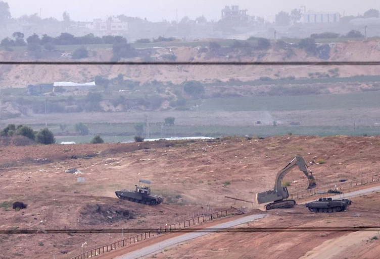

_当地时间2023年10月29日，加以边境，以军坦克和挖掘机越过边境进入加沙地带。_

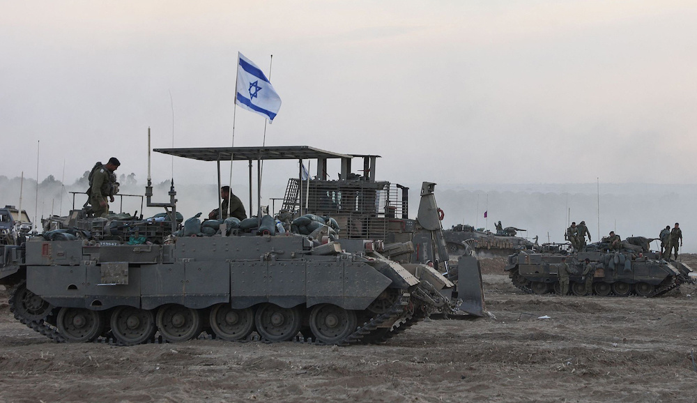

_当地时间2023年10月29日，以军在加沙边境附近集结。_

_当地时间2023年10月29日，以色列军队聚集在加沙边境附近，然后进入巴勒斯坦地带。_

“加沙城的战斗将是一场血腥的磨难”，城市战为防御者提供了很多优势，给士兵和平民带来了巨大的危险。以色列军方至今没有说明有多少地面部队已进入加沙。

_当地时间2023年10月29日，以色列阿什杜德，以色列总理内塔尼亚胡对南区海军基地进行视察，并听取冲突期间以色列海军活动情况介绍。_

多国警告大规模地面进攻后果严重

据新华社消息，埃及外交部28日发表声明说，以色列对加沙地带的大规模地面攻击将带来严重风险以及前所未有的人道主义和安全影响，以色列升级军事行动将增加包括儿童、妇女在内的平民伤亡。黎巴嫩外交部在28日发表声明说，以色列“不加控制、不负责任的”行为可能点燃中东战火，威胁地区和国际和平。声明敦促国际社会采取紧急行动，令以色列立即停止当前军事行动并遵守国际法。

_当地时间2023年10月27日，加沙地带汗尤尼斯，受伤的巴勒斯坦儿童在医院接受治疗。_

俄罗斯外交部28日就巴以冲突发表声明说，国际社会当前的首要任务是阻止流血事件，尽可能减少对平民伤害，推动局势转入政治外交轨道。俄方正与有关各方保持联系，发挥调解功能，推动和平解决冲突。声明呼吁落实“两国方案”。

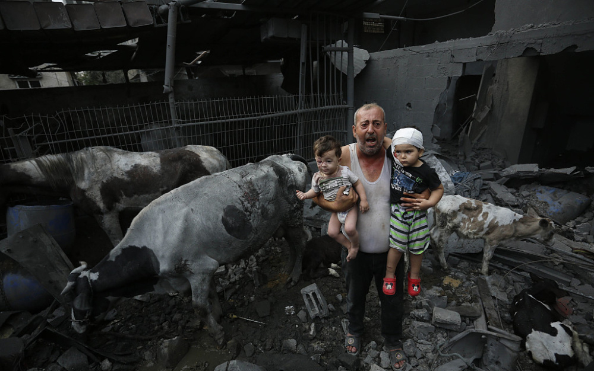

_当地时间2023年10月29日，以色列空袭加沙后，男子抱着孩子，赶着牛，冲出受损建筑。_

以色列现在的行动是半个世纪以来最危险的，其后果将威胁整个中东。以色列本国媒体也发出警告：地面进攻开始后，加沙城的战斗“将是一场血腥的磨难”。而来自加沙的最新数字显示，此轮冲突爆发以来，加沙地区已有8000多人在以色列的轰炸中死亡，其中近一半是儿童。

_当地时间2023年10月28日，联合国秘书长安东尼奥·古特雷斯再发声，对以色列升级针对加沙地带的轰炸行动感到震惊，再次呼吁立即实行人道主义停火，以便运送援助物资。_

**图文来源：新华社、央视新闻客户端、环球时报、参考消息、人民视觉、澎湃影像**

