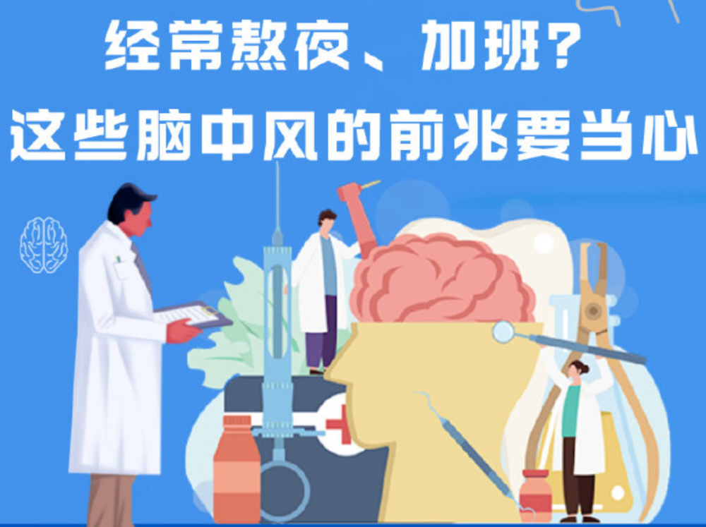

# 第一批“90后”已成中风高发人群，我国约四成人从25岁开始就可能中风

每经编辑：李泽东

脑卒中简称“卒中”，俗称“中风”，是一种常见的急性脑血管疾病，是由于脑血管突然发生破裂出血，或因脑血管阻塞或严重狭窄导致脑组织缺血缺氧而引起的疾病，包括出血性卒中和缺血性卒中。

10月29日是第18个世界卒中日，今年的主题为“卒中识别早，救治效果好”。而当前，我国居民在卒中患病与治疗负担上面临着严峻形势。

据第一财经，脑血管流行病学资料显示，全球范围来看
**，25岁以上人群罹患中风（脑卒中）的终生风险为24.9%，我国这一数字接近40%，即有四成的人从25岁开始就有可能发生中风。**

 _图片来源：新华社_

据国家卫健委脑卒中防治工程委员会的数据，2020年，我国40岁以上居民中风患病率为2.61%，发病率为505.23/10万人，死亡率343.4/10万人；由此测算，2020年时全国40岁以上人群中有约1780万卒中患者。事实上，这一数字每年还在递增。

卒中俗称“中风”，其发病急、病情进展迅速，致死致残率相当高。 **当前，第一批“90后”已成为中风高发人群** ，相关识别、干预工作刻不容缓。

海军军医大学第一附属医院脑血管病中心副主任、长三角脑血管病专科联盟秘书长张永巍表示，我们正在通过当地各行业的工会组织，争取将卒中的早筛全面覆盖到所有30岁以上年龄的人群。

如何识别中风？

据四川在线，识别中风，多名专家都提到“FAST”口诀。四川大学华西医院神经内科副教授陈宁介绍，中风发生后的6个小时以内，是抢救的黄金时间。如果没有在这个黄金时间内得到治疗，有可能造成患者残疾，甚至死亡。即使在黄金时间内，也是越早治疗效果越好。快速识别中风非常关键，牢记一个快——FAST。

 _图片来源：新华社截图_

F-Face(脸)：脸部不对称，口角歪斜，不能做出微笑表情。

A-Arms(胳膊)：一只或者两只胳膊软弱无力，两只胳膊不能同时抬起。

S-Speech(言语)：说话困难，说话不清楚，或者不能理解别人说的话。

T-Time(时间)：如果符合上述任何一种症状，抓紧时间，赶快送去医院。

陈宁提醒，一旦怀疑是中风，不要想着休息一下就能缓解，要迅速拨打120送去有急性卒中诊治能力的医院，标注有“卒中中心”的医院多数具备相关条件，选择距离最近的。同时，检查患者的口腔，及时清除口鼻中的呕吐物和痰，有假牙的也要取出来，并且让患者保持侧卧，避免头部剧烈摇晃和震动。

保持健康的饮食与生活习惯，脑卒中高危人群要注意保暖

预防中风的措施之一，是控制疾病。陈宁建议，高血压、糖尿病、高血脂、心脏病患者积极治疗，定期检测相关指标，并按医生指导规律复诊，遵医嘱服药，千万不要私自停药或者减药。此外，还要保持情绪平稳，不要激动。“若情绪出现高度兴奋激动，导致心率加快、血压骤升，在一定程度上会诱发脑卒中，在生活中合理应对挑战和压力，保持规律健康的作息、乐观积极的心态。”四川疾控中心慢病所专家介绍。

其次是要保持健康的饮食习惯。陈宁建议，多吃新鲜蔬菜和水果，少吃肥肉和动物内脏等脂肪高的食物。饮食要低盐、低脂，避免暴饮暴食，每一餐不要吃得过饱。四川疾控中心慢病所专家推荐食盐摄入量≤5g/天。

还要保持良好的生活习惯。陈宁提醒，平时进行适当强度的体育锻炼，注意不要用力过猛;不要熬夜，避免过度疲劳;减轻精神压力，保持心理平衡，戒烟限酒。

维持合适的体重也是一个预防措施。专家建议，体重指数(BMI)的增加会增加中风的发病风险。建议控制BMI

气温变化时需小心。四川疾控中心慢病所专家介绍，忽冷忽热的气温会导致血管忽而收缩、忽而扩张，容易诱发脑卒中。脑卒中高危人群，尤其是中老年人，体温调节能力差，一定要注意保暖。还需注意的是，洗澡水温应控制在42℃左右，不可过高或过低，洗浴时间不宜过长，控制在20到30分钟为宜。

每日经济新闻综合第一财经、四川在线

