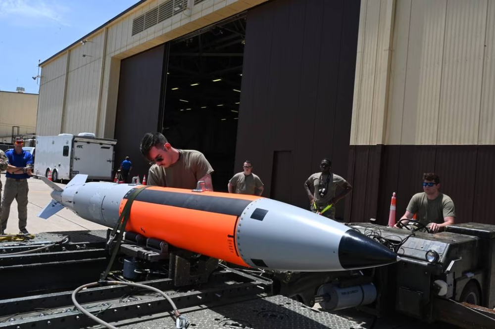

# 美军：美正在研制专门针对地下加固目标的钻地核航弹B-61-13

【文/观察者网
王世纯】美国继续推进其核武器研制计划，这一次美国决定制造一款新的钻地核弹。美《防务新闻》10月28日报道，美军对外公布，正在研制一款当量更大，专门针对地下加固目标的钻地核航弹B-61-13。五角大楼表示，这也将使美国总统有更多的选择来打击“更大范围的军事目标”，此举意在“威慑两个主要核武器竞争对手——中国和俄罗斯”。

五角大楼在声明中说，B61-13的当量将与B61-7相似，但装有精确制导套件，具备更大的射程和精准度，并将取代一些较旧的重力炸弹。有专家分析称，拜登政府希望通过研制B-61-13的方式结束与共和党的争吵，并让B-61-13将替代美军库存的B61-7和B83-1等老式核航弹。但共和党当下继续要求拜登政府保留百万吨级的B-83-1核弹。

不过，B-61-13似乎只能由B-21进行携带。

_B-61-12核航弹_

这已经是美国近年来研制的第二种新型核航弹。特朗普政府时期，美国曾宣布开始批量制造B61-12核航弹。美国科学家联合会的核武器专家汉斯·克里斯滕森本周早些时候听取了五角大楼关于这种新型航弹的简报，他告诉《国防新闻》，B-61-13的弹头将采用与20世纪80年代和90年代B-61-7相同的氢弹头，但将采用和B61-12类似的弹体材料和尾部套件。

不过，B-61-13似乎只能由B-21进行携带。在一份后续声明中，五角大楼发言人表示，空军目前正在与诺斯罗普·格鲁曼公司，该公司开发的B-21“游骑兵”隐形轰炸机将可以携带B-61-13。但五角大楼表示，美国目前不打算将其部署在F-35联合攻击战斗机上。

美国是全世界最大的战术核武器保有国，根据《新削减战略武器条约》的规定，美军保留400-500枚B-61和B-83航弹。B-61-13核弹可以通过更改老式套件的方式获得，“这样美国可以在不增加核武器数量的情况下，获得更强大的核打击能力”。

克里斯滕森说，B-61-13的立项主要是为了结束两党就是否退役百万吨级氢弹而进行的争吵。奥巴马时代美国政府曾试图销毁80年代制造的，120万吨当量的B83-1——这是美国核武库中最后一种百万吨当量的氢弹，其爆炸威力是1945年投在广岛的原子弹的80倍。但他的继任者、前总统特朗普推翻了这一决定。到了拜登时代，拜登希望退役全部B-83-1。但是共和党议员表示反对，他们说，需要83-1来打击坚硬而深埋的目标。

克里斯滕森说，B61-7以及新型号的最大当量为36万吨，而B61-12的当量为300到5万吨。他说：“这对国会中的强硬派来说是一种安慰，好吧，伙计们，你们想要高收益的东西。这里有个当量没那么大的……但你也会得到一个带有精确制导套件的，这将更准确。”

共和党欢迎制造更大当量的航弹，众议院军事委员会主席迈克·罗杰斯，阿拉巴马州共和党。参议院军事委员会资深共和党人、密西西比州参议员罗杰·威克在一份声明中表示，他们欢迎制造新的B61改型，但这“只是朝着正确方向迈出的一小步”。

不过这群共和党人继续炒作“中俄核威胁”，他们表示，中国和俄罗斯正在进行一场“全面的军备竞赛”，而美国“正在原地踏步”。要应对这一威胁，我们需要对我们的威慑态势进行重大转变，而不是渐进或零敲碎打的改变。

如果B61-13获得国会批准并获得拨款，美国能源部下属的国家核安全管理局将负责生产。不过，克里斯滕森说，国防部官员表示，预计只会生产很少的B-61-13核弹，大约几十枚。这让他，怀疑B-61-7退役以后，是否会导致美国武器库中重力炸弹的数量大幅下降。

**本文系观察者网独家稿件，未经授权，不得转载。**

