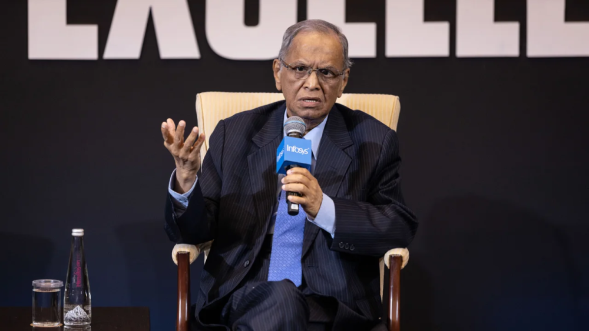

# 苏纳克岳父号召“为国加班”！“70小时工作制”建议震惊印度

【环球时报报道 记者 苑基荣
刘明】“印度年轻人应该自愿每周上70小时班。”印度印孚瑟斯科技有限责任公司创始人兼前首席执行官纳拉亚纳·穆尔蒂的一席话近日在互联网掀起舆论风暴。据《福布斯》杂志估计，穆尔蒂的财富超过40亿美元，他还是英国首相苏纳克的岳父。

据《印度教徒报》29日报道，尽管印度网约车服务平台“Ola出行”的联合创始人巴维什·阿加瓦尔等部分企业家赞同穆尔蒂的观点，但不少印度人对其展开猛烈抨击。

 _印度印孚瑟斯科技有限责任公司创始人兼前首席执行官纳拉亚纳·穆尔蒂在班加罗尔公司总部发表讲话。图源
美媒_

**为了与中国竞争，“印度年轻人必须加班”**

“不知为何，我们的年轻人从西方学到了坏习惯，不帮助国家发展。印度是世界上工作效率最低的国家之一，除非我们提高工作效率，除非我们在某种程度上减少政府腐败并提高官僚机构的决策效率，否则我们无法与其他国家竞争。”26日，穆尔蒂在YouTube的一条视频中表示，印度必须提高工作生产力，年轻人必须承担推动国家进步的责任，“因此我要求年轻人必须说‘这是我的国家，我想每周工作70个小时’”。

国际劳工组织（ILO）的数据显示，印度约66%的人口年龄在35岁以下。穆尔蒂认为，若年轻人希望看到印度成为全球经济强国，就要花更多时间工作。

在视频中，穆尔蒂对印孚瑟斯前首席财务官莫汉达斯·派说，印度需要“意志坚定、纪律严明、工作极其勤奋”的年轻人，“现在是我们巩固和加快发展的时刻”。他还说，到2075年，印度有望成为“世界第二大经济体”，为了与中国等国家竞争，印度年轻人必须加班——就像日本和德国在二战后做的那样。

美国有线电视新闻网（CNN）称，穆尔蒂的这番言论诞生于西方国家工作观念发生巨大转变之际。去年，悄然辞职成为美国职场的新趋势，人们纷纷决定不再从事超过受雇范围的工作。

**“印度IT业之父”工作很拼命**

根据ILO的数据，印度已是世界上工作时间最长的国家之一，每个“打工人”每周平均工作时长为47.7小时。但对于“创一代”的穆尔蒂来说，这仍不够。他曾说：“创业是马拉松，不是百米短跑。”

1946年出生的穆尔蒂，曾考上印度最著名的大学印度理工学院，但由于交不起学费，只能选择稍逊一筹的迈索尔大学电气工程学。不过，他在两年后攒够钱考上了印度理工学院的硕士。

20世纪70年代末穆尔蒂曾开办一个计算机公司，但一年半后失败。1981年，他与6位年轻同行一起创立了印孚瑟斯，创业资金来自其妻子提供的1万卢比（约合879元人民币）的“私房钱”。

据悉，印孚瑟斯专门提供互联网和电子商务软件服务，如今已是印度IT产业的领军企业。穆尔蒂也因此被美国媒体称为“印度IT业之父”。

**“将女性赶出职场”**

尽管穆尔蒂的“70小时工作制”获得了部分企业家的认同，但仍遭到印度多方批评。班加罗尔的一位软件工程师对《印度教徒报》称，该制度相当于每周工作6天、平均每天工作近12小时，如此疯狂的工作制度没有给个人和家庭留下任何空间。美国“商业内幕”网站28日报道称，印度科技企业家贡代尔在社交平台上写道：“虽然努力工作很重要，但每周工作70小时可能会让人精疲力竭，扼杀创造力。”

《印度教徒报》报道称，“70小时工作制”其实已经存在于该国部分行业。人力资源专家表示，在IT、金融、保险和制药等行业，加班像是一种日常规范。而在零工行业，很多工人被迫每天工作超过12小时。

此外，“70小时工作制”还会为女性带来职业困境。2019年的一项调查发现，印度女性每天在家务上花费近300分钟、在照顾他人上花费134分钟，男性的数字仅为97分钟和76分钟。有女性网民表示，穆尔蒂实际上是在“将女性赶出职场”，因为“男人永远不会分担家务以及照顾和抚养孩子的重担”。

