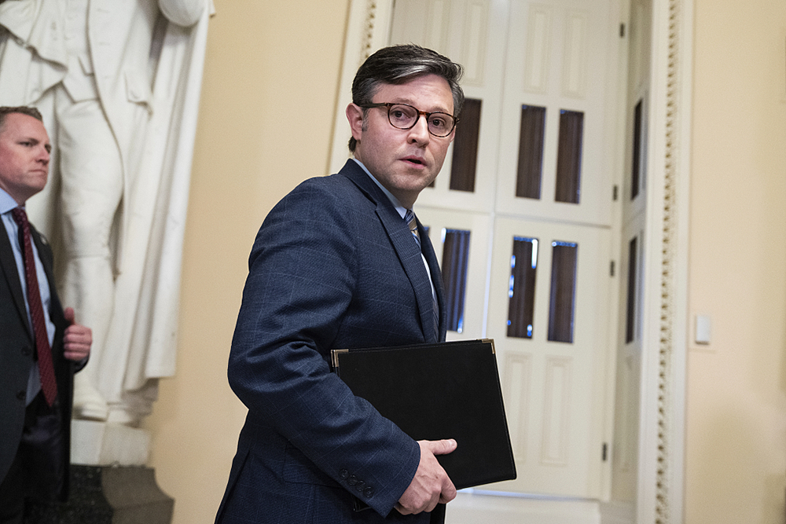
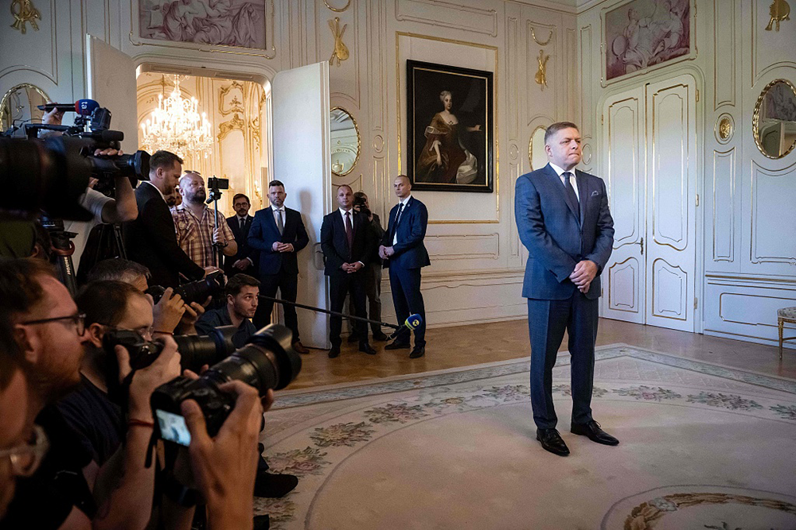

# 西方多国政局生变，美国援乌成未知数，欧洲部分国家现反对援乌声音

据央视新闻报道，当地时间10月27日，正在布鲁塞尔出席欧盟峰会的匈牙利总理欧尔班·维克托（Orbán
Viktor）表示，欧盟的乌克兰战略已经失败，匈牙利没有任何理由继续向乌克兰送钱。

无独有偶，10月26日，新上任的斯洛伐克总理罗伯特·菲佐（Robert
Fico）在参加欧盟峰会前宣布，斯洛伐克政府将停止对乌克兰的军事援助。同日，新当选的美国众议院议长迈克·约翰逊（Mike
Johnson）表示，美国对乌克兰和以色列的援助应分开处理，这意味着他在接下来的工作中可能不会支持总统拜登对乌克兰的援助计划。

当前，一些反对“无条件支持乌克兰”的声音开始在西方各国出现，不仅美国在对乌援助问题上表现得摇摆不定，欧洲不少国家也纷纷表态要从乌克兰“撤资”。

**来自美国的援助成未知数**

_美国众议长迈克·约翰逊。视觉中国 图_

据新华社报道，在经历三周“群龙无首”后，美国国会众议院10月25日进行议长选举第四轮投票，来自路易斯安那州的共和党保守派众议员迈克·约翰逊当选议长。接受媒体采访时，他表示对乌克兰援助资金的担忧，因为援助以色列的各项资金都需要通过削减其他方面的资金来获得。

此前，美国国会在预算协议中删除了用于支持乌克兰和以色列的军事资金，然而拜登本人及其团队依然没有放弃对乌克兰和以色列的援助计划。

据新华社报道，拜登于10月20日向国会提出一项总额约1060亿美元的拨款请求，用以对乌克兰和以色列提供援助。据报道，这项特别拨款中的143亿美元将用于军事援助以色列，614亿美元用于向乌克兰提供军事、安全和经济援助，另有130多亿美元用于加强美国边境安全。为了在国内获得舆论支持，拜登还于19日晚发表全国电视讲话，呼吁民众支持他提出的这项巨额援助计划。

约翰逊26日会见拜登时表示，“在众议院共和党人中达成的共识是，我们需要一分为二地看待以色列和乌克兰问题。”似乎暗示其可能不会支持拜登的援助计划。

美国在对乌援助问题上扑朔迷离的态度无疑引起了基辅方面的恐慌。乌克兰一位不具名的高级官员表示，美国的援助对乌克兰而言至关重要，没有了美国的装备支持，乌克兰在后续的战斗中将举步维艰。

**欧洲部分国家现反对声音**

_当地时间2023年10月2日，斯洛伐克布拉迪斯拉发，方向党领袖罗伯特·菲佐在总统府与斯洛伐克总统恰普托娃会面前等待。视觉中国 图_

近期，部分欧盟成员国内部也不断涌现反对给予乌克兰军事支持的声音。

10月1日，赢得斯洛伐克国民议会选举的方向党领导人菲佐就曾表示应结束对乌克兰的军事支持，通过和平谈判解决俄乌冲突。10月26日，就任总理后的菲佐再次表示，斯洛伐克将停止向乌克兰提供武器，之后将仅限于“人道主义和民事援助”，“乌克兰的战争与我们无关。”他补充说，“立即停止军事行动是乌克兰问题的最佳解决方案，欧盟应从武器供应者转变为和平缔造者。”

与此同时，波兰政府内部也在是否继续支援乌克兰的问题上产生矛盾。此前，因法律与公正党宣布延长对乌克兰农产品禁令，波乌关系持续紧张。波兰总理马泰乌什·莫拉维茨基（Mateusz
Morawiecki）一度表态称，波兰将不再向乌克兰提供任何武器装备，而是要致力于用最现代化的武器保卫自己。

据新华社报道，波兰国家选举委员会10月17日公布议会选举正式结果，执政的法律与公正党保持议会众议院第一大党地位,
但失去了独立执政资格，这意味着波兰在乌克兰问题上的态度可能发生改变，但这一选举结果能否使渐冷的波乌关系回温还是未知数。

在近日召开的欧盟峰会上，乌克兰问题依然是主要议题之一。欧盟外交与安全政策高级代表博雷利23日发表讲话，敦促在场媒体和记者不要将所有注意力放在巴以问题上，“不要忘记乌克兰”。然而博雷利的呼吁并没有使欧盟各国在乌克兰问题上“团结一致”。匈牙利和斯洛伐克总理在峰会上对欧盟向乌克兰提供500亿欧元财政支持的计划提出异议。匈牙利总理欧尔班27日表示，匈牙利既没有能力、也不愿意这样做，因为匈牙利没有理由把纳税人的钱用来支持乌克兰。

显然，欧盟内部在援乌问题上存在不小分歧，但由于欧盟对乌克兰的援助需要27个国家的一致同意，目前讨论陷入僵局，各方难以达成一致。

