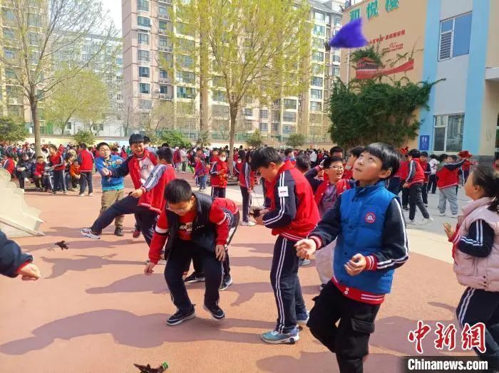
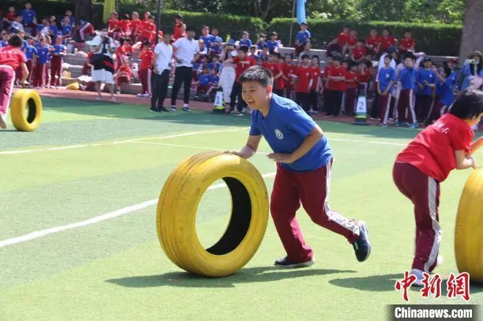
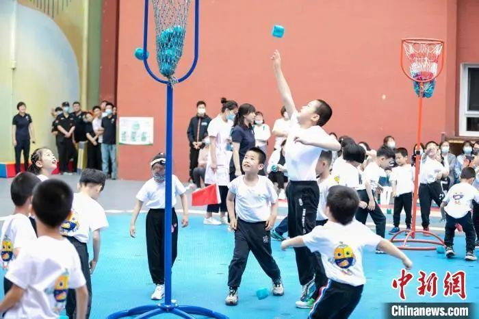

# 课间不让学生下楼、不能跑跳？老师：孩子娇生惯养，怕家长来闹腾

“下课了，大家在大青树下跳孔雀舞、摔跤、做游戏，招引来许多小鸟，连松鼠、山狸也赶来看热闹。”

不少家长反映，小学课文里描述的校园生活正离孩子们越来越远。很多学校要求学生课间不要下楼，不能高声说话、跑跳，被抓到还会扣分。课间十分钟，诺大的校园空空荡荡。

其实早在几年前，就有媒体多次关注小学“静悄悄的课间十分钟”。多年过去，记者发现，这依旧是围绕在学生、家长和老师之间的一个难题。

_资料图：小学生在大课间踢毽子。黄建 摄_

**01**

**学生：被检查员抓到在走廊打闹会扣分**

记者采访了多名北京的小学生。小学四年级的学生晨晨说，其实他最喜欢在课间和同学玩一会，但老师要求课间不能大声喧哗，不能在楼道里闹腾，所以他只能写会作业，或上个厕所，然后就到时间了，“只能等到中午休息的时候才能玩一会”。

“上趟厕所，收拾收拾东西，跟同学聊会儿天。”小学六年级的学生天天说，他们班在三楼，一般大家都是在教室或走廊玩一会，并不会下楼，因为时间来不及。他表示，除了一些特别爱捣乱的同学，老师并不会对大家的课间活动做出要求。

小学一年级的学生茜茜说，通常她会在课间看会课外书，因为老师要求尽量不要出教室，只有上厕所或接水可以出去。不过她说，学校几乎每天都有体育课，可以去操场玩。

小学二年级的学生丁丁也表示，在他们学校，课间可以喝水、上厕所、在教室玩，但是不能跑不能闹。“去走廊里追逐打闹更不行了，要是被检查员抓到那可就惨了，会扣分，还会被扣流动红旗。”

他说，上次他在走廊里被绊倒，那个同学就被扣了1分。班里有个同学总在走廊里跑，几个月被扣了二十几分。

丁丁说，他也希望课间可以出去玩，但他“又希望又害怕”，因为出去玩也有安全问题。他曾经在别的学校看到一个小哥哥在走廊跳绳，结果不小心抽到了人，那个人眼睛下方的神经就被抽坏了，还得做手术。上次有个同学下去玩，头也被磕到了。丁丁说，如果安全有保障的话，他也想出去玩。

_资料图：学生们在课间玩耍。_

**02**

**家长：不能出去跑，**

**孩子们会发明纸上游戏**

对于孩子们的课间生活，多位家长都对记者表达了担忧。李女士称，因为网课的原因，儿子的眼睛已经开始近视了，必须保证户外活动时间，所以她让儿子课间出去走走。对此，老师私下批评过儿子，但没有找过家长。放学后，她还会让儿子继续在外面玩一个小时，天黑了再回家，来补白天错过的时间。

她说，因为不能出去跑，孩子们会发明一些纸上的游戏，比如在纸上画一条鱼、给鱼喂食，或者在纸上做聊天框。

李女士认为，对小孩来说，集中四十分钟的注意力已经很难了，课间正好可以放松一下，何况现在孩子的近视率这么高。即便现在体育课占比增加，但运动和运动不一样。

“大人要担负起自己的责任来，把课间还给孩子，担心出问题，那就再多费点心，无论是家长还是老师，都不应该用束缚孩子的方式来图轻松。”李女士说。

“我们上学时，课间可以随意在操场上玩耍嬉戏，跳皮筋、丢手绢、过家家，都是童年时的美好回忆。但现在的孩子，课间只能待在座位上，最多聊聊天、打个水、上个厕所，作为家长，我很心疼这些孩子。”赵女士表示，她知道学校这样做有自己的考量和苦衷，有些家长对孩子磕碰很敏感，出了事学校很被动，但这不应该成为剥夺所有孩子课间活动的理由。

赵女士说，希望从社会、学校等各个层面协调好这个问题，还孩子快乐课间十分钟，让孩子能到楼下指定区域玩耍。

刘先生也表示，他很愿意让孩子课间出去，能活动活动最好，也放松一下眼睛。他提到，之前有个一年级的家长都急了，因为老师说课间不让出去，结果孩子小，一直憋着不敢上厕所。

“现在网络也发达，哪里出事马上全知道了，老师也紧张，家长也紧张，两头为难。”在刘先生看来，其实也可以采取一些措施，比如设置一个专门岗位保障课间孩子们的安全。

_资料图。_

**03**

**老师：怕家长过来闹腾，**

**平常教学工作已很累**

对于课间十分钟的争议，老师们也有自己的看法。来自山东的小学老师张女士表示，现在学校不让孩子出去玩就是怕出事，怕家长过来闹腾，平常教学工作已经很累了。

“年代不同了，以前的孩子天天在外面抓蚂蚱爬树，家长从来不会觉得怎么样。现在都娇生惯养的，稍微磕碰就要找老师的事，久而久之老师只能让孩子们都在教室里待着。”

在她看来，三四五年级的学生出去玩可以，能控制住时间和保证安全，但是一二年级确实容易出事。张女士认为，如果体育课能保质保量，大课间活动每天进行，课间十分钟在教室里玩一玩没什么不好的。

“我建议家长放开手让孩子去跑，不知道跌倒的疼就永远不会保护自己。”张女士说。

来自上海的小学老师王女士表示，班里出现安全事故，学校会全部安到班主任头上，学校出现安全事故，家长会要求学校全权负责。为了避免处理安全事故占用过多老师的精力，不耽误老师授课，只能采取这样的措施。

她认为，矛盾的症结就在于有的家长没有辩证地看待孩子是活动的人，要求活动的人组成的集体不能发生一点安全事故，导致的后果就是每个孩子都被剥夺了奔跑的权利。

_资料图。_

记者注意到，也有一些学校采取了不同的措施。来自重庆的小学老师于女士表示，她所在学校的课间十分钟照常，学生可以自由安全文明玩耍。不过，如果有学生玩耍时受伤，在保险公司或其他学生家长都同意赔付的情况下，家长仍要求学校负责的话，学校就会加强课间管理，比如下课后拖堂两分钟、班主任课间在教室值守，值周老师加强巡逻等。

来自湖南的小学老师陈女士说，课间时，他们学校的学生可以在教学楼走廊和操场自由玩耍（规定了哪些地方能去，哪些地方不能去），做游戏、跳绳、踢毽子的都有，并且每层楼都有老师巡视，每个班都配备了“小小安全员”。

不过她也表示，还有一些地方需要改进，比如一个老师要负责一整天不太合理，有些老师巡视工作做得比较形式化等。

“玩本来就是孩子的天性。在课堂上我们已经对他们提出各种要求：坐姿要端正，不能自由交流。如果碰到很严厉的老师，学生的上课状态就会很压抑。下课了还不能玩，那也太痛苦了。我也是从学生时代过来的，没有课间，那我现在一定是个沉默寡言又内向的小孩，跟同学们一起做游戏给我留下了很多美好且珍贵的回忆。”陈女士说。

（文中人名皆为化名）

编辑：朴丽娜

责编：程春雨

