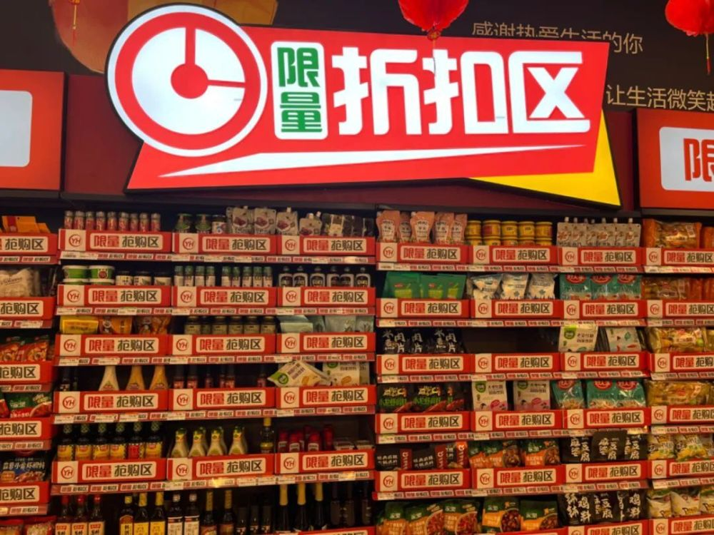
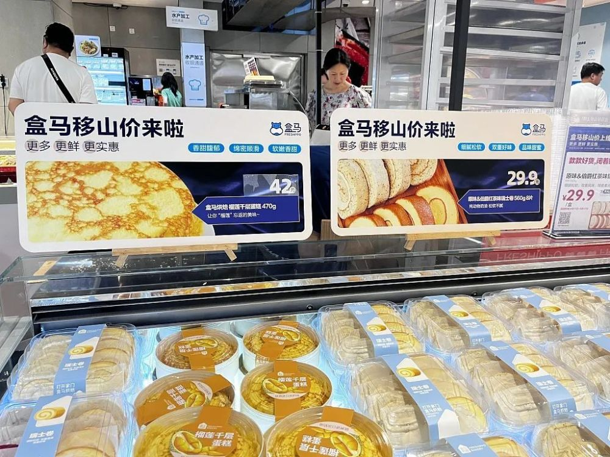

# 这个双十一，电商还干不过超市了？

又一年的双十一要来了。

就在各大电商平台争抢“全网最低价”的同时，线上商超却来“偷家”。

永辉、盒马甚至老牌的步步高超市，近日纷纷宣布产品降价，比如永辉在店内开设折扣店，步步高则整体转型折扣店，而盒马主打“线上线下不同价”。

_永辉北京鲁谷店。图/余源摄_

从各家的宣传策略看，他们不仅仅是跟同行竞争，更要和线上电商平台争夺顾客，让线下找回烟火气。

在被线上电商冲击多年后，线下实体零售这是要反攻了吗？

**比线上要更便宜**

线下商超比线上电商更便宜，这在之前并不多见，而且眼下还是线上疯狂降价的双十一。

近日，中国新闻周刊在永辉超市北京鲁谷店看到，不少货架上贴着“限量抢购”的标签，超大字体提醒消费者，这里的折扣力度更大，而且售完即止。

_永辉店内打折的牛奶。图/余源摄_

比如三元极致纯牛奶（250mlX12盒）线下价格为39.9元，而在天猫超市，这款产品的价格为52.9元，双十一百亿补贴后39.9元；5升装的金龙鱼花生浓香型食用植物调和油在这里仅售59.9元，也与天猫超市同价。

而一款圣诞树主题的森宝儿童积木，永辉超市的价格为64.5元，而在电商平台，最便宜为79元，上百元的也不少。

据了解，这是永辉超市的最新动作，即在门店中增设“正品折扣店”。永辉方面告诉中国新闻周刊，所谓“正品折扣店”，即每日从新品、网红商品及常规商品中选择一部分进入折扣商品池，再根据具体情况按照商品原价的七折、五折及三折进行销售。

无独有偶，盒马也想要撕掉“贵”的标签。

近日盒马宣布将打折的商品一口气扩展到5000多款，包含乳制品、洗护产品、冷冻水产等多个品类商品，平均降价20%。比如原价20.5元/200g的蒜蓉粉丝扇贝直接降到9.9元，原来39.9元的Knoppers牛奶榛子巧克力威化饼干只要29.9元。

盒马此次降价还有个特点——线上线下不同价。中国新闻周刊在走访盒马鲜生北京杨闸环岛店时看到，门店多个区域都贴出“线下专享价”的宣传海报，比如线下16.9元/300克的肥牛卷，在盒马App里卖19.9元；300ml雅漾喷雾门店售价49元，盒马App售价69元。

而且部分产品不仅比自家App要便宜，比主流电商平台也要便宜。盒马爆款产品泰象苏打水（325mlX24）价格为49.8元，同款商品在进口水饮京东自营专区为56元，3.8元的东方树叶也比线上动辄四五块钱的价格便宜了10%以上。

一度停摆的老牌超市步步高也紧随永辉盒马的步伐。

近日，步步高宣布重启全国门店，以湖南大本营为起点，陆续重启了湖南、广西等地的33家门店，下月底将完成全国超市门店的重启。值得注意的是，步步高重启门店将推行低价折扣的零售策略。

据报道，10月27日，步步高超市岳阳四店及长沙金星路店全面恢复正常营业。顾客在选择商品的时候，一种黄色的价签也吸引了不少人驻足。原来，这种黄色价签代表着促销价，例如一款燕麦片，零售价上显示33元，实际售价其实是27.8元，售价约下降了15.7%。

步步高集团董事长王填也表示，步步高已对整个供应链做了重大改造，与以往相比，重启后的商品种类更丰富，售价更便宜，平均售价相当于以前的85折。

超市降价促销并不鲜见，难得是能一直便宜下去，那么这次能持续多久呢？

**折扣化转型**

过去，线下商超降价主要有两种原因，一是依赖超大量采购，把单价打下来，二是牺牲利润，用补贴换取流量。

但这两种模式在进入电商时代后都难以为继。论采购量大，谁能比得过京东？论资本雄厚，又有哪个企业敢与阿里叫板？

对此，盒马CEO侯毅在朋友圈对近日的降价做出解释：“线上有很高的配送成本，线下成本低，所以线下的价格比线上低才是合理的。”

客观来说，线上成本着实不低，其中配送费用只是成本的一部分。过去几年，随着移动手机覆盖率趋于饱和，线上获客成本正在成倍增加。

根据光大证券研报，从2018年到2020年，阿里巴巴获客成本由278元增长到929元，拼多多由77元增长到203元。即便是有增长潜力的新明星APP，获客压力也居高不下，根据B站2021年Q4财报，该季度单个获客成本达391元，比去年同期的212元暴涨84%。

此外，对于盒马永辉这类同时有着到家业务的零售商，还要同时承担门店租金、水电、人工等费用，成本会更高。

线上成本高或许可以解释线上为什么贵，但并不能成为线下降价甚至比电商还要便宜的理由。

从永辉、盒马、步步高的降价策略中可以发现，三家不约而同都提到了“折扣店”或者“折扣化”的字眼。

首都经济贸易大学教授陈立平曾在CCFA举办的超市发展战略高峰论坛上表示，折扣店不是一种仅依靠低价格销售商品的零售业，而是超市发展中的创新业态。从行业公认的定义来看，折扣店是指持续性地向消费者提供低价格的商品。因此，折扣店的业态创新核心，就是如何打造低成本这样一种经营系统和体系。

事实上，折扣店大举扩张的背后，其实是对传统商超模式的颠覆。

盒马方面告诉中国新闻周刊，对于传统商超卖场来说，卖货并不是其主要的赚钱方式，渠道费、进场费、堆头费、陈列费等才是最主要的利润来源。

换言之，传统商超的目标客户并不是普通消费者，而是广大的供应商。

而盒马则是换了一种模式。具体而言，就是从以前的KA模式向折扣模式转变。

在这种模式下，卖场不再依靠中间的批发商、代理商，而是直接找到生产商，通过减少中间环节来节省成本，如此一来价格也就有了下降的空间。

 _图/视觉中国_

盒马在江苏昆山投资的烘焙工厂“糖盒”，是国内首个实现“从一粒小麦到一只面包”的全链路生产的烘焙工厂，但仅仅是垂直供应链还不够。

为了把钱省下来，盒马将这家工厂建在距离码头不远的地方，原材料到港后可以就近配送，节省物流成本；同时这家工厂晚上开工，“因为晚上的电价更便宜”，这样既保证了产品的品质，还能让利给消费者。

永辉也是类似的做法。上半年，永辉超市自有品牌供应链共引入了60多家种植基地、源头供应商，共同推动自有品牌的创新研发，其中，形成战略合作供应商34家，订单种植、产线包销供应商13家。财报显示，今年上半年，永辉超市实现营业收入420.27亿元，自有品牌销售额达19.5亿元。

**供应链是核心**

连锁经营专家文志宏告诉中国新闻周刊，转战折扣店也是超市业态被倒逼的结果。

近年来，电子商务以其便捷、快速和价格优势，逐渐改变了消费者的购物习惯，使得线上购物成为了主流，实体商超原有的消费者被“堵”了在家中。

数据显示，今年上半年，国内十一家实体零售上市企业中，实现收入增长的仅有3家，而利润减少的企业则有3家，其中步步高和人人乐更是陷入亏损：步步高上半年亏损4.49亿元，同比下降2162.98%，而人人乐净亏损3.09亿元，亏损增长31.03%。

为了应对电商带来的挑战，超市开始寻找新的生存之道，而折扣店模式就是其中的一种选择。除了永辉盒马等，其他零售巨头也在拥抱折扣店。

2021年12月，连锁超市品牌家家悦旗下首家会员店在济南弘阳广场正式开业，这也标志着家家悦入局仓储会员店。

据悉，该店中商品售价较常规门店低10%-15%。此后家家悦又陆续在章丘、莱芜、滕州、淄博等城市开店。

2022年下半年，物美在北京门头沟区的一家商场开出折扣店“美淘”，主要销售的是换季商品和未销售完汰换商品。

这些零售商的做法各不相同，有独立店、有店中店，有全场普降，但是他们都认同了折扣这条道路。

中研普华产业研究院发布的《2023-2028年中国折扣商店行业竞争分析及发展前景预测报告》显示，2021年，我国折扣零售行业市场规模达1.62万亿元，近五年CAGR(复合年均增长率)为4%，目前处于扩张期。

中研普华产业研究院还指出，折扣店将是未来10年发展最快的业态，其复合增长率为5.6%——远远高于大卖场的2.5%，甚至也要高于便利店的5.5%。

折扣零售爆红的背后，是消费逻辑正在发生嬗变。开源证券认为，零售行业折扣化趋势的背后是消费者面对新的经济周期与消费环境，对必选消费品的需求变化，即品质不能下降的前提下，追求最极致的低价满足感。

在侯毅看来，零售企业的核心竞争力在于服务能力、差异化能力和价格竞争力，而价格竞争力就是变革的核心目标。据了解，盒马“移山价”期间，爆款产品榴莲千层蛋糕在上海的销量一度同比增长26倍。

不过，实体零售现在还难言转型胜利。文志宏表示，折扣化转型不能一蹴而就，需要经历从局部到全部，从线上到线下的过程。而随着变革逐步驶入深水区，势必会遇到硬骨头。

中国新闻周刊在走访时发现，无论是盒马还是永辉，打折商品集中在标品领域，但蔬菜、水果等生鲜产品打折的较少，而生鲜是实体零售相较于电商最容易做出差异化，也是优势最大的赛道。

文志宏表示，低价是折扣店的招牌，而低价的背后，比拼的是供应链运营能力。如果没有相应供应链的支撑，只是靠牺牲利润换来销售和流量，那么就不会长久，反而可能“饮鸩止渴”。

作者：余源

