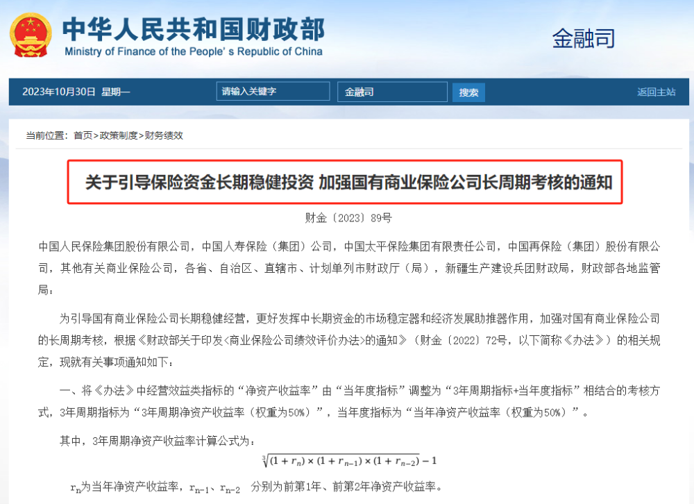

# 重磅利好！财政部考核周期调整，提升27万亿险资入市积极性

中国基金报记者 李树超

继前期金融监管总局发布通知降低保险公司权益投资风险因子后，10月30日，财政部发布《关于引导保险资金长期稳健投资
加强国有商业保险公司长周期考核的通知》（以下简称《通知》），对国有商业保险公司净资产收益率实施三年长周期考核。

多位业内人士表示，保险资金是资本市场中长期资金的重要组成部分，对国有商业保险公司实施长周期考核有助于增强其投资股票、基金等权益类资产的积极性和稳定性，提升其参与资本市场的广度和深度，推动资本市场的高质量发展。

**国有商业保险公司**

**实施三年长周期考核**

为引导国有商业保险公司长期投资、价值投资、稳健投资，提升保险资金权益资产投资积极性和稳定性，近日，财政部印发《通知》，将国有商业保险公司经营效益类绩效评价指标“净资产收益率”由当年度考核调整为“3年周期+当年度”相结合的考核方式，其中，3年周期考核指标为“3年周期净资产收益率(权重为50%)”，当年度考核指标为“当年净资产收益率(权重为50%)”，相关要求自印发之日起施行，其他商业保险公司可参照执行。

同日，在财政部有关负责人就《财政部关于引导保险资金长期稳健投资加强国有商业保险公司长周期考核的通知》答记者问中也提到，为引导国有商业保险公司投资经营更好匹配保险资金长期属性，《通知》在投资资质、资金投向和内部管理方面提出了相关要求。

一是在投资资质方面。国有商业保险公司应当依法合规开展各类投资，遵守监管要求的偿付能力、风险管理、公司治理等相关规定，匹配自身投资管理能力、风险控制能力和相关资质。

二是在资金投向方面。国有商业保险公司要坚持审慎、安全、增值的原则，根据保险资金长期属性，平衡好投资收益和风险，优化资产配置，保险资金要投向风险可控、收益稳健、具有稳定现金流回报的资产。

三是在内部管理方面。国有商业保险公司要制定专门的投资管理制度，建立透明规范的投资决策程序，设置科学有效的投资风险评估体系，做好投资项目的尽职调查和可行性研究，加强投资风险管理、交易管理和投后管理等。

同时，《通知》还进一步强调绩效评价结果运用，要求国有商业保险公司进行经营业绩对标，分析差距、找出原因，并进一步强化绩效评价数据真实性的要求。自2023年度绩效评价起，国有商业保险公司按照《办法》及《通知》执行，其他商业保险公司可参照执行。

**保险资金运用余额近27万亿元**

**提升权益投资比例还有很大空间**

根据金融监管总局公布信息，截至2023年8月底，保险资金运用余额达26.97万亿元，同比增长10.21%，其中投资股票、基金3.49万亿元，同比增长13.84%，占比12.94%。2016年以来，保险资金投资股票、基金的比例基本稳定在10%-15%之间，距离监管部门规定的权益类资产投资比例上限还有很大空间。

目前，由财政部或中央汇金控股的保险公司主要有中国人民保险、中国人寿保险、中国太平保险、中国出口信用保险、中国农业再保险、中国再保险、新华人寿保险、中汇人寿保险等8家公司。根据2022年报披露信息，截至2022年底，上述保险公司的资金运用规模共9.37万亿元，占全行业资金运用余额的比例约34.74%。

从目前保险资金考核实践看，我国保险公司的经营绩效考核主要采取年度考核方式。以国有商业保险公司为例，目前财政部每年对国有商业保险公司净资产收益率(ROE)实施考核，
ROE主要受资产回报率、负债成本率、杠杆率等影响。

根据保险资管业协会调查情况，我国保险公司的投资绩效考核周期以中短期为主，近七成机构采取年度考核方式。其中，不同规模保险公司的考核周期存在差异，超大型机构通常兼顾年度考核和中长期考核，大、中、小型机构均以年度考核为主。

业内人士对此解读，针对国有商业保险公司实施三年长周期考核，首先有利于提升国有商业保险公司投资股票、基金等权益类资产的积极性。保险资金天然具有长期性，风险承受能力较高，短期流动性要求较低，具备投资股票、基金等权益类资产的能力和条件。

其次，有助于提升国有商业保险公司投资股票、基金等权益类资产的稳定性。股票、基金等权益类资产的波动性较大，涨跌周期通常超过一年。对国有商业保险公司实施三年长周期考核，有助于提升保险资金对权益类资产短期波动的容忍度，缓解其为应对考核而追涨杀跌、频繁申赎等短期投资行为，增强国有商业保险公司投资股票、基金等权益类资产的稳定性。

此外，还有助于优化市场生态，推动资本市场高质量发展。国有商业保险公司代表了我国保险行业的排头兵，其动向对保险行业其他公司具有示范引领作用，对其实施长周期考核，有助于引导保险行业全面践行长期投资、价值投资理念，增加资本市场中长期资金规模，提高机构投资者占比，更好发挥资本市场优化资源配置、服务实体经济的功能。

编辑：舰长

审核：陈思扬

