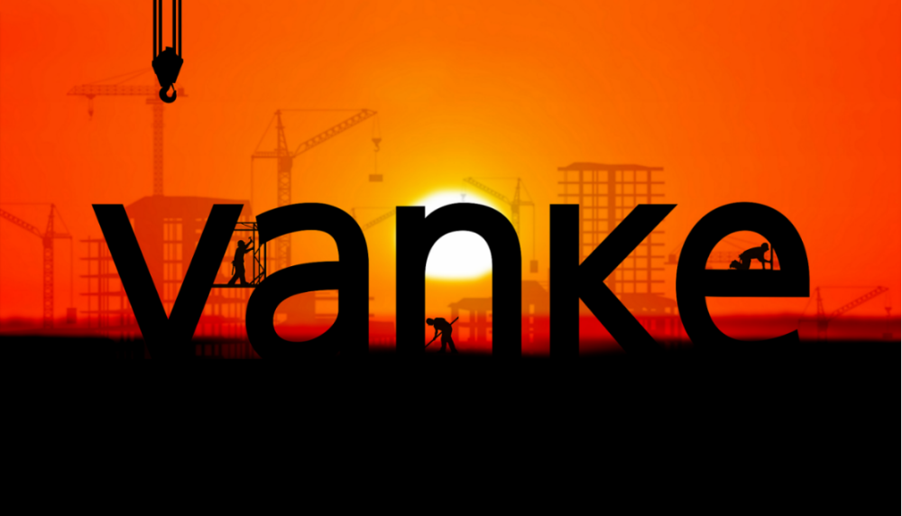
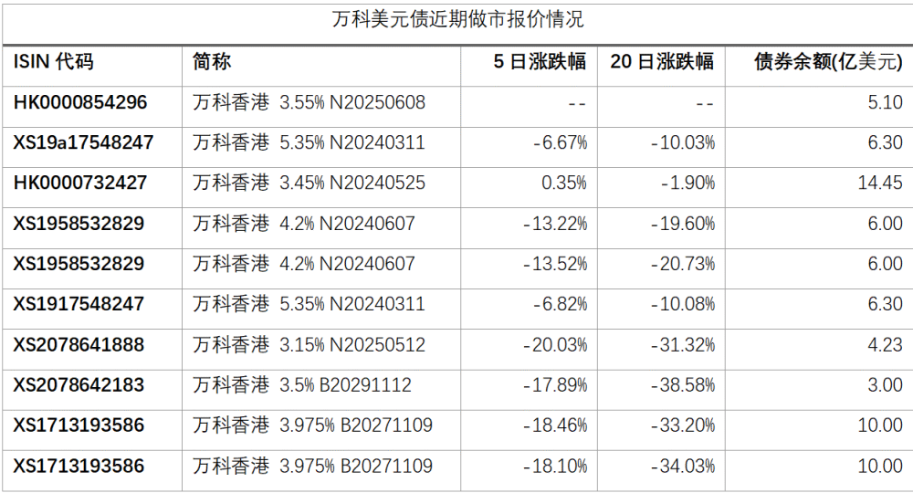

# 199亿境外债跌30%，万科也要违约？官方回应：境外出现不实猜测

_图：视觉中国_

作者|温世君

编辑|陈弗也

出品|棱镜·腾讯小满工作室

连续的地产债务违约潮下，投资者已经风声鹤唳。

这次轮到了万科。数据显示，近期其美元债大幅波动，多只债券20日跌幅超过30%。随着市场情绪的发酵和传递，境内债务和万科股票也随之承压。

10月31日，万科A股价单日下跌2.33%，收11.33元，相较2018年1月31.92元股价峰值，跌去近三分之二。

在深圳证券交易所官方投资者交流平台上，10月28日，有投资者问得非常直接：

“董秘你好：最近公司美元债及国内债价格大跌，很多分析人士认为公司可能步恒大、融创等后尘进入债券违约，公司发展一直（以）稳健著称，同时公司也是最早意识到房地产危机的并采取行动的，发展到目前这种情况，请问公司真的要债券违约了吗？”

10月31日，万科对此问题进行了回应：“近期公司境内外部分债券品种交易出现异动，并非公司基本面出现任何问题，主要是市场情绪波动所致。同时境外市场出现有关公司的不实猜测，导致公司美元债价格在上周尾出现大幅波动。”

万科公布了一组数据：“截至3季度末，公司在手资金1037亿，对短债的覆盖倍数2.2倍。年内公司已无境外债务到期，境内待偿还信用债仅3.8亿”，并表态：“目前公司财务稳健，各项资金排布和还款安排都在有序进行中。”

当然，回应没有提一点，本轮20日做市中间价跌幅超30%的万科的美元债，合计余额27.23亿美元（约合199.21亿人民币），到期时间分布在2025、2027和2029三年。

 _数据来源：Wind，作者绘制，数据时间10月31日_

天弘基金策略分析师王健认为，这就是市场恐慌的蔓延，在楼市销售低迷、违约事件频发的背景下，中资地产美元债投资者已草木皆兵。目前看，一线城市新房销售环比已有回暖迹象，对此还应放长时间、冷静看。

但市场情绪并非无中生有。

10月27日，万科A股（万科A）、港股（万科企业）同步发布三季度财报，营收利润双双下滑：前三季度营收2903.1亿元，较上年同期调整后下降14.0%；归母净利润136.2亿元，较上年同期调整后下降20.3%。

其中，三季度单季营收894.2亿元，同比下降31.6%；归母净利润37.5亿元，同比下降22.5%。

在当下地产市场较为低迷的周期中，这样的数据虽然并不意外，但投资者脆弱信心已经经不起任何的波澜。

随即，摩根士丹利予港股万科企业
“减持”评级，目标价8.94港元。富瑞（Jefferies）予万科企业“持有”评级，目标价由10.3港元下调至8.41港元。大和（Daiwa）将万科企业目标价由10.7港元下调20%至8.6港元，维持“跑赢大市”评级。

10月31日，万科企业收盘7.32港元。

另外的变量则是在公司治理层面。万科一向被认为是房地产企业中职业经理人治企的标杆。

10月27日，万科发布《第二十届董事会第三次会议决议公告》，选举深圳市地铁集团有限公司党委书记、董事长辛杰为董事会副主席。

实际上，曾经作为万科大股东的华润，也会长期安排人员兼任万科董事会副主席。“宝万之争”后，深圳市地铁集团入主万科，其前董事长林茂德也曾兼任万科董事会副主席。

但在当下市场环境下，这一“正常”的变动却产生了远比其本身大得多的波澜。

有媒体援引业内人士的观点认为，受近期房地产市场变化和新一轮房企违约风波影响，部分投资人对民企和混合所有制企业的信心持续下降，导致万科债券受到波及。

证券日报等多家媒体报道了辛杰对万科的支持态度：“万科的背后有深铁集团，深铁集团的背后是深圳国资，将始终不渝地全方位支持万科的健康发展。”

但这样的表态并不能完全对冲市场的担忧。

