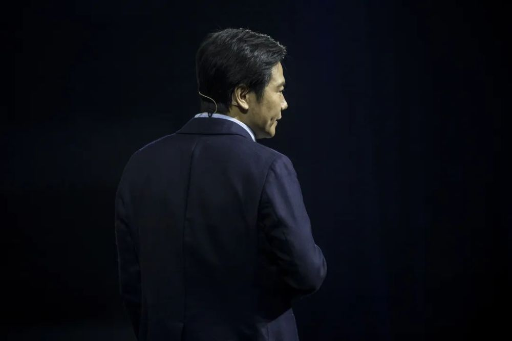
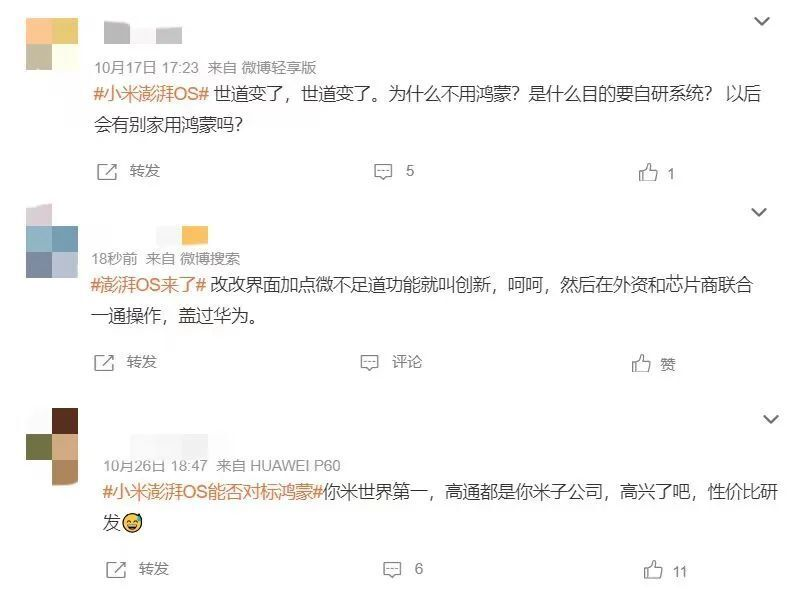
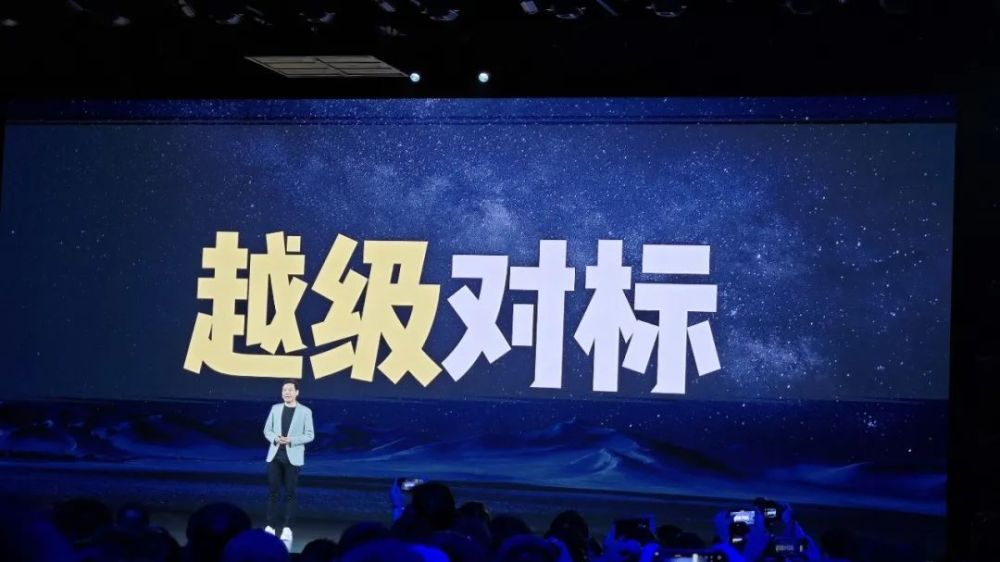

# 从雷布斯到雷传志，污名化企业家何时休

_那些创新力普通，或者明明很强只是不符合舆论场预期的企业和产业，就不配获得尊严，不配被称作民族企业，甚至，不配生存？_

**撰文丨张明扬**

最近，雷军郁闷地收获一个新标签：雷传志。

整件事的缘起有些莫名其妙。小米发布了一个全新操作系统——澎湃OS，雷军在舆论场上也算是身经百战，可能也预期到了会有一些针对系统功能的群嘲和攻讦。

**但雷军没想到的是，群嘲的确来了，但指向却是民族主义风**
：“雷军弄操作系统干吗？为什么不能用鸿蒙系统呢？”“国内已有自己的系统鸿蒙了，你雷军自己再搞一套，这就是给国产操作系统捅刀子”“浪费资源，对接鸿蒙会死？”
“我是雷军，我为高通代言”……

_图/网络_

于是乎，雷军成了“雷传志”，澎湃OS成了“安卓套皮”，小米成了“买办”。

按照这个逻辑，这澎湃OS要是不好用也就罢了，最多也就是自不量力挑战鸿蒙；要是真的好用，那就真的是恶贯满盈……舆论场上已经有阴谋论，雷军自研新系统背后站着的是“海外资本”和高通，目标就是为了阻击鸿蒙。

何至于此？

**01**

2011年8月16日，雷军穿着乔布斯式的黑色T恤蓝色牛仔裤为小米手机启幕，由此得到了一个名震江湖的绰号：雷布斯。

2021年，因传出小米下场造车，雷军又得到一个新绰号：雷斯克。但因为小米汽车雷声大雨点小，这个绰号显然没有如“雷布斯”那样流行开来。

很显然，雷军是以“雷布斯”为豪的；但与此同时，雷军也以“民族科技企业大佬”这个标签为荣，以华为创始人任正非为对标者。

**而今，“雷传志”一出，践踏了雷军一切的光荣与梦想。**
小米作为科技企业的成色、小米的民族企业标签、小米的原创力，雷军作为民族企业家甚至仅仅作为一名企业家的“资格”…….一切的一切，都被某些网民在舆论场上否定了。

“雷传志”典出柳传志。曾经，柳传志作为中国企业家的教父，联想作为中国最早大举国际化的科技企业，名噪一时，雷军还曾公开表达过对柳传志的倾慕。但近几年，誉之所至，谤亦随之，柳传志和联想陷入各种舆论漩涡，名声一落千丈。

 _▲2023年10月26日，雷军在小米新品发布会上（图/FTP）_

平心而论，舆论场上很多对联想的批判都是有些道理的（司马×除外）：后续创新乏力、转型举步维艰、国际化名大于实……但是，很多批判背后的一个潜台词或者说是危险倾向是：
**一家创新能力不符合公众预期的企业不配生存。**

说白了，联想造不出芯片，没有突破“卡脖子”，安于全球科技产业链的分工，就是它最大的原罪。

现在，这个被制造出来的原罪轮到了小米和雷军，这也就是“雷传志”的终极杀伤力所在：小米没有能力搞出去安卓化的国产操作系统也就罢了，还背刺了国产操作系统之光鸿蒙。

**02**

华为手机和小米手机谁好？

见仁见智。如果一定要让我选择的话，我应该会选择华为，毕竟，按照我们通常的印象，华为手机的创新力更强一些，小米的营销更强一些。当然，也有人认为，小米的性价比更好，华为的定价偏高。

这本是正常的市场反馈，小米的创新力相对华为应该差一些，但这个相对的劣势不也体现到价格差之中了吗？
**可以说，这是国产手机极其正常的生态位分布，每个消费者有自己的价值观偏好，也有自己的价格敏感度。**

国产操作系统也是如此。华为突破技术卡脖子，鸿蒙横空出世自然是国货之光，是市场的一种自我突围；而小米基于安卓自研操作系统，也是正常的商业考量。

有人说了，小米就不能争点气与安卓一刀两断。这就奇怪了，小米毕竟没有被这方面的制裁压力，为什么要主动脱钩？这就好比，国外芯片不卖给中国，中国企业自然要发愤图强，但如果卖了，中国不也乐见其成么？

_图/图虫创意_

**这种思维，不仅是一种极端的民族主义思维，还是一种计划经济思维。**
鸿蒙毕竟是华为的，华为卖不卖，小米买不买，华为卖多少钱，理应由市场决定；网友吼上几句，小米就必须用鸿蒙，你也不问问卖便宜了华为是否愿意。

按照这种逻辑，中国有一家手机企业就够，一家钢铁企业就够，一家汽车企业就够，国内的市场竞争都是“内耗”、都是“买办”。如果这样曲解“集中力量办大事”，那倒是可以看看改革开放前的中国企业与科技，究竟有没有国际竞争力？

华为很好，鸿蒙或许也很好，华为的创新力或许也强于小米，但是，当国人在为华为鼓掌的时候，是否进入了另外一个误区：
**那些创新力普通，或者明明很强只是不符合舆论场预期的企业和产业，就不配获得尊严，不配被称作民族企业，甚至，不配生存？**

这种逻辑推而广之，那些华为产业链上的配套企业，是否也不配生存：核心科技？一个配套企业谈什么核心科技。它们赚很多钱？它们赚了华为的钱，这还了得，这不是影响了华为的研发资金投入能力。

**03**

前不久，最高人民法院发布了《关于优化法治环境
促进民营经济发展壮大的指导意见》，要求依法保障民营企业和企业家人格权；后续还发布了涉民营企业、民营企业家人格权保护典型案例。

**那么，“雷传志”难道就不是侵害民营企业、民营企业家名誉权吗？**

现实是，那些编这些段子的人，完全不把最高法这些指导意见当回事。他们认为自己口含天宪、言出法随，连司马老师都没事，他们就有事了？

妄人自然不少，但更多的网络攻讦者也是有自己理论基础的。在他们看来，柳传志、雷军乃至互联网科技企业创始人，都不算企业家，他们只能算资本家。

这样，不就逻辑自洽了，他们批判的不是民营企业和民营企业家，是资本家，是联想、小米这样的“买办企业”。

好家伙，这样一偷换概念，一曲解政策，他们倒成了永远的正确者；被他们攻讦践踏的中国民营企业家，则连被称作企业家都不配了。

 _图/图虫创意_

**在中国舆论场上，仍然明里暗里流行着企业的出身论。**

第一重出身论是明的，也就是民营企业有原罪，民营企业家是资本家，由于主流舆论的公开反对，这种说法正逐步改头换面，往第二重出身论转移。

第二重出身论是暗的，也就是搞硬科技的，突破卡脖子的民营科技企业可以豁免批评，其管理层才有资格可以被视作企业家，而那些搞软科技，或者干脆一切不搞芯片、不与国际科技分工体系硬怼脱钩的民营企业家，则还是贪婪无爱国心的资本家，其企业也不配称作什么民族科技企业。

主流舆论热衷谈什么“56789”：即民营经济贡献了50%以上的税收，60%以上的国内生产总值，70%以上的技术创新成果，80%以上的城镇劳动就业，90%以上的企业数量。“56789”看似热热闹闹，但在两重出身论的冲击下，不堪一战。

道理很简单， **“56789”诉诸理性和证据，两重出身论诉诸情绪和仇恨。**

打个比方，三个××大学计算机专业毕业的同班同学，他们分别在中移动、华为、小米写代码。根据两重出身论的经典言说：你在华为写代码，是为中国科技独立自主研发作贡献；你在小米写代码，以往是在被资本盘剥，这也就罢了，随着雷传志的风行，被利用的你是为国际资本扼杀中国国产操作系统的帮凶；你在中移动写代码，虽然中移动在国际市场不能打，但据说承担了为那些被资本遗弃的不发达地区、没钱群众“普遍服务”的功能。

**在两重出身论的恶质舆论气氛下，中国企业就这样被人为地撕裂了，**
民营的、搞软科技的搞应用科技的赶快学会唾面自干；中国企业家也被分别人为地安排上鄙视链的各端，有些国际一流的企业家被剥夺了企业家的标签，只配被称作资本家。

科技企业也被分为三六九等，声称搞硬科技的，搞芯片搞电动车亏成一地鸡毛的，都在鄙视链的顶端，那些在不那么硬核的领域熠熠生辉、在国际科技分工体系灼灼其华的科技企业，一句被国际资本绑架，就毁掉了你的一世荣光，零落成泥碾作尘，只有香如故。

10月17日，苹果CEO蒂姆·库克在成都苹果旗舰店观看了一场王者荣耀表演赛。作为顶流硬核科技企业CEO的库克，为什么去围观游戏比赛，原因或许有很多，但这也是一种表征；硬核科技与游戏等其他软科技是相辅相成的。

_图/视频截图_

没有足够多足够新的软件与APP，当年电脑硬件的升级，今日手机的更新换代，就成了“无意义的升级”：任何硬件上或硬核意义上的科技进步，不都要最终体现到消费电子、消费互联网以及公众的日常科技消费之上么？否则，硬核科技的发展是为了什么，发展之后谁来买单，又如何取得利润投入后续的科技发展？

没有不断升级的互联网应用，消费者为什么要购买新手机，手机升级的意义何在？没有性能更好的手机，更先进的芯片制造出来又有什么用，给谁用？

**从根本上而言，科技的进步，落脚点就是人和人的生活。** 这才是“科技以人为本”，“科技让生活更美好”的真意啊。

从这个意义上而言，硬科技与软科技本就不分彼此，互为势能。又何来硬科技比软科技更高级，更科技呢？又何来从事硬科技的企业家才是企业家呢？

“雷传志”，可以休矣；中国企业的出身论，可以休矣；中国企业家的污名化，可以休矣。

