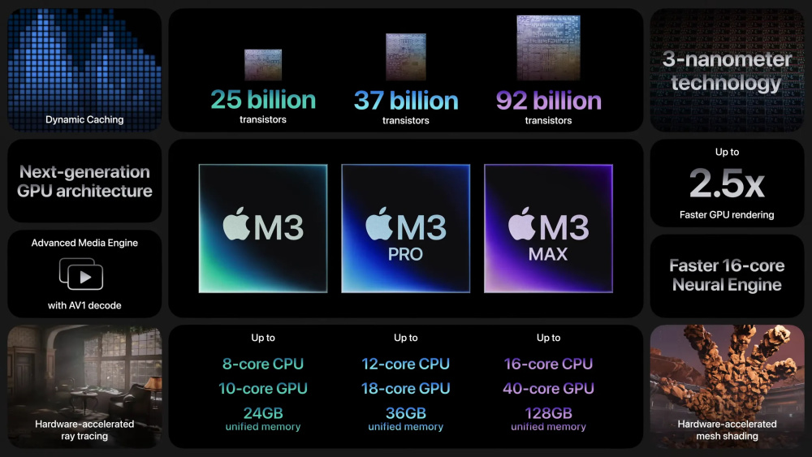
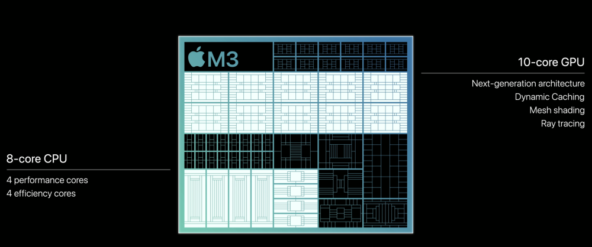
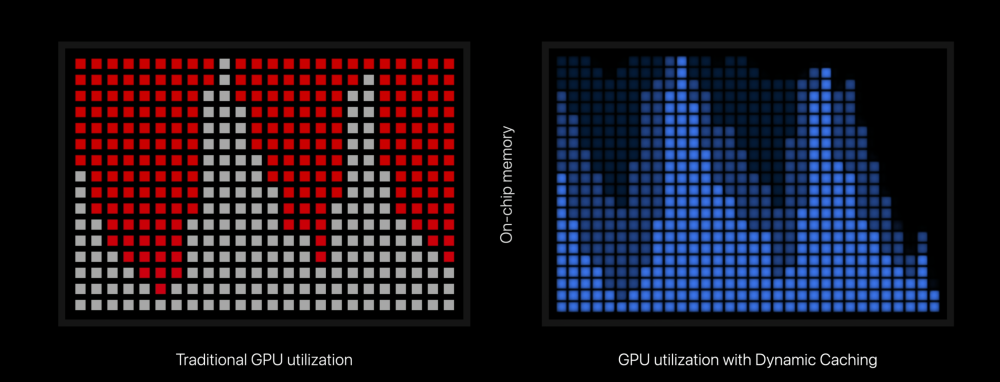
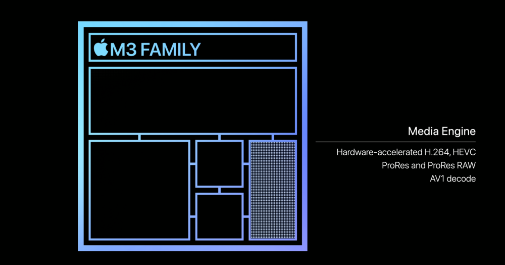
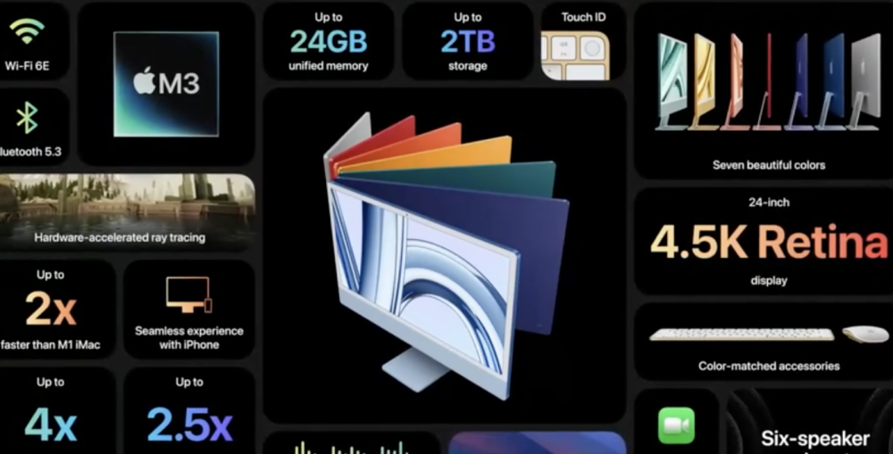

# 史上最短苹果发布会：发布M3系列芯片和全新MacBook Pro

腾讯科技 文/吴彬

北京时间10月31日，苹果召开了一场线上发布会，正式发布了全新的M3系列芯片，M3也是苹果首个采用台积电3nm工艺制程的桌面级芯片。和M1和M2一样，M3系列此次依然拥有包括M3、M3
Pro以及M3 Max三款采用不同堆叠技术的芯片产品。

[【苹果发布会全程回放：发布M3系列芯片和全新MacBook Pro
】](https://new.qq.com/rain/a/20231031V01Q0L00)

有意思的是，这场只有30分钟、堪称史上最短苹果发布会的视频，全程都是依靠iPhone拍摄录制、依靠Mac完成剪辑包装的。

**M3：3nm工艺，晶体管数量创新高**

此次M3系列全部更新了和A17 Pro一样的台积电3nm工艺，更加极限的工艺制程让M3芯片的晶体管数量再次提升，M3拥有250亿个晶体管，M3Pro和M3
Max分别拥有370亿和920亿个晶体管。

M3依然使用了苹果的芯片堆叠技术，以M3为核心单位，通过不同的堆叠进行CPU扩展。M3配备最多8核CPU以及10核GPU，24GB统一内存，速度最高比M2提升
20%；M3 Pro配备12核CPU，18核GPU，36GB统一内存，速度最高比M2 Pro提升10%；M3 Max配备16核CPU，40
核GPU，128GB统一内存，速度最高比M2 Max提升20%。

M3系列芯片这一次重点升级了全新的GPU，具有行业首创的动态缓存功能，这项技术允许系统在最需要的时候动态调整资源分配。

同时M3系列芯片也成为了苹果首颗支持网格着色渲染以及硬件级光线追踪加速技术的M系列芯片。网格着色技术支持高级几何处理，能够渲染复杂的场景。光线追踪技术可以实现逼真的光照效果，为3D渲染锦上添花。与第一代苹果芯片相比，性能升级后的M3芯片比M1芯片快了30%，效率内核快50%。

硬件级的光线追踪技术以及网格着色技术的到来，意味着苹果很有可能会继续加大对于Mac系统上游戏应用和应用方面的投入，在今年的WWDC上，苹果不但宣布引入包括《死亡搁浅》在内的一系列的3A大作，同时还面向开发者提供了Game
Porting Toolkit这样的工具，帮助开发者更好的将现有的游戏作品移植到Mac系统上来。

视频流处理器部分也获得升级，M3、M3 Pro和M3 Max支持多种编解码器，例如H.264、HEVC、ProRes和ProRes
RAW以及AV1，保证了更多素材剪辑的空间。

NPU部分，M3此次也更新了全新的神经引擎，拥有16个核心，
苹果也首次表示神经引擎可以被用于端侧的边缘计算，为用户提供智能体验的同时，确保数据只在本地化运行，保证用户的隐私安全。

**MacBook Pro更新：搭载M3芯片起，全新“深空黑”配色**

随着M3系列芯片一起发布的，包括了新款的MacBook Pro，除了拥有一个全新的“深空黑”配色外，包括M3、M3 Pro和M3 Max均出现了可选项里。

苹果在此次的MacBook Pro上带来了一个全新的配色，同时他们也表示，与“午夜色”的MacBook
Air相比，新的深空黑的MBP在外壳材质上应该不会那么容易留下指纹，因为这是一种全新的材质，“通过阳极氧化打造，从而大大减少指纹”。

新款的MacBook Pro依然有14和16英寸两个版本，继续使用miniLED背光显示屏，分辨率分别为3024 x 1964和3456 x
2234，支持P3广色域显示、True Tone原彩显示和ProMotion动态刷新率。这块屏幕亮度可达600尼特，可显示SDR内容，比以前亮了20%。

存储容量从512GB起步，最高可达8TB，屏幕依然是刘海屏设计，1080p FaceTime HD高清摄像头位于显示屏刘海内。

续航方面，新款MacBook Pro的电池续航时间有望达到22小时。M3 Max机型的续航时间通常会稍短一些，因为所有这些GPU内核都会消耗电量。

在其他大多数地方，新款MacBook Pro与今年年初发布的M2 Pro / Max版本完全相同，包括：6扬声器系统、三个Thunderbolt
4端口、一个HDMI端口、一个SD读卡器和一个用于充电的 MagSafe 3接口。

价格方面，14英寸配备M3处理器的Macbook Pro售价12999元，配备M3 Max处理器的版本最高价格26999元。16英寸版本只有M3
Pro和M3 Max两个处理器版本，起售价19999元，最高31999元，依然支持多项选配。

**iMac更新：依然采用彩虹配色，10999元起售**

同步更新的还有iMac，起依然采用M1版本时的彩虹配色设计，拥有24英寸的屏幕，最大的区别是更换了全新的M3处理器。

新款的iMac采用了和之前M1版本完全相同的外观设计，这意味着我们没能看到更大屏幕的iMac出现。

M3版本的iMac拥有绿色、黄色、橙色、粉红色、紫色、蓝色和银色七种配色，11.5毫米的机身厚度，白色的屏幕边框。同时，1080p摄像头、扬声器、麦克风、USB端口配置和4.5K
Retina 显示屏都和上一代一样。随机的键盘和鼠标也没变，依然采用了Lightning接口。

价格方面，iMac只有M3一种标配处理器，基础版拥有8核CPU、8核GPU、256GB硬盘和8GB内存，起售价10999元，配备10核心GPU和512GB硬盘的版本，售价13999元。

