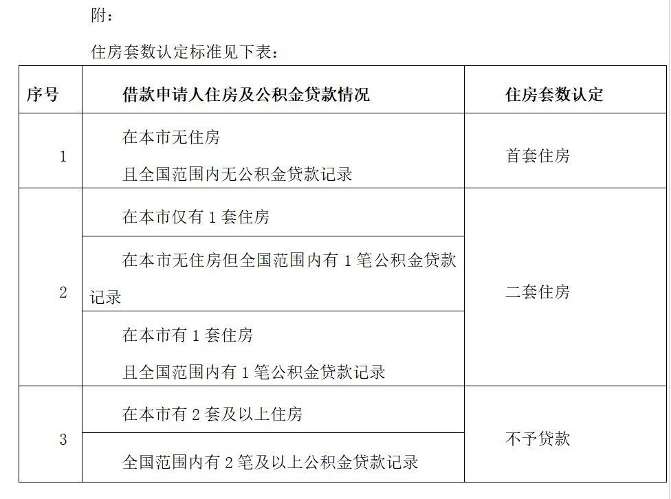

# 哪些情况不享受“新政”？北京住房公积金管理中心详解

新京报讯（记者曹晶瑞）10月31日，北京住房公积金管理中心发布《关于优化住房公积金个人住房贷款中住房套数认定标准的通知》，此次政策优化调整的目的是什么？新政实施后，对于借款申请人来说，有哪些实际影响？新京报记者采访了参与此次政策制定的北京住房公积金管理中心贷款管理处处长王宪。

王宪表示，为更好满足居民刚性和改善性住房需求，体现公积金制度的公平性、互助性、普惠性，经北京住房公积金管理委员会第二十九次全体会议批准，北京住房公积金管理中心调整了公积金贷款政策。“此次政策，在满足居民刚性住房需求下，支持改善性住房需求，保持住房公积金的政策性和互助性，从认本地房、认全国公积金贷款（含住房公积金政策性贴息贷款）记录入手，优化住房套数认定标准。”

王宪告诉新京报记者，此次新政最大的变化是公积金贷款在住房套数认定上不再考虑商业贷款情况。“以前是认房认全国住房贷款，政策调整后，是认房兼顾公积金贷款，简单地说就是‘认房不认商贷’。”比如，借款申请人（含共同申请人，下同）在北京市无房，且在全国范围内无公积金贷款记录的，执行首套住房公积金贷款政策；如借款申请人在北京市有1套住房的，或在北京市无住房但全国范围内有1笔公积金贷款记录的，或在北京市有1套住房且全国范围内有1笔公积金贷款记录，住房记录与公积金贷款记录不论是否为同一套的，执行二套住房公积金贷款政策。“在这一政策的基础上，我们有一个限制性底线，即如借款申请人在北京市有两套及以上住房，或已使用过两次及以上公积金贷款的，依据新政，是不予公积金贷款的。”

此外，新京报记者了解到，按照现行政策，借款申请人在申请公积金贷款时，全国范围内不能有未还清的公积金贷款。同时，对于离婚一年内的借款申请人按原政策执行差别化住房信贷政策，即离婚未满一年申请公积金贷款的，按二套住房贷款政策执行。“新政执行后，这两条不变，继续按照现行政策执行。”王宪介绍，2005年，建设部、财政部、中国人民银行印发的《关于住房公积金管理若干具体问题的指导意见》中规定，对于职工没有还清贷款前，不得再次申请住房公积金贷款。同时，2017年，央行发布了《关于加强北京地区住房信贷业务风险管理的通知》，提出对离婚一年内的贷款人实施差别化住房信贷政策，从严防控信贷风险;对于离婚一年以内的房贷申请人，商贷和公积金贷款均按二套房信贷政策执行。

本次政策调整自2023年11月1日施行。自2023年11月1日（含）后受理的公积金贷款申请，按调整后政策执行。

编辑 唐峥

校对 王心

