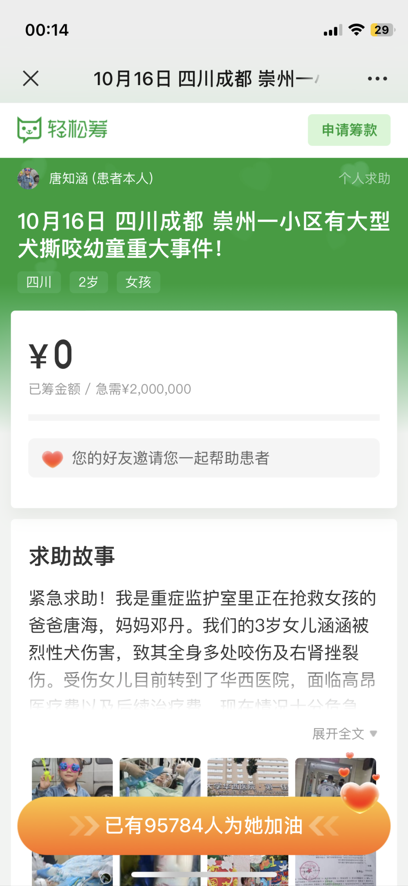
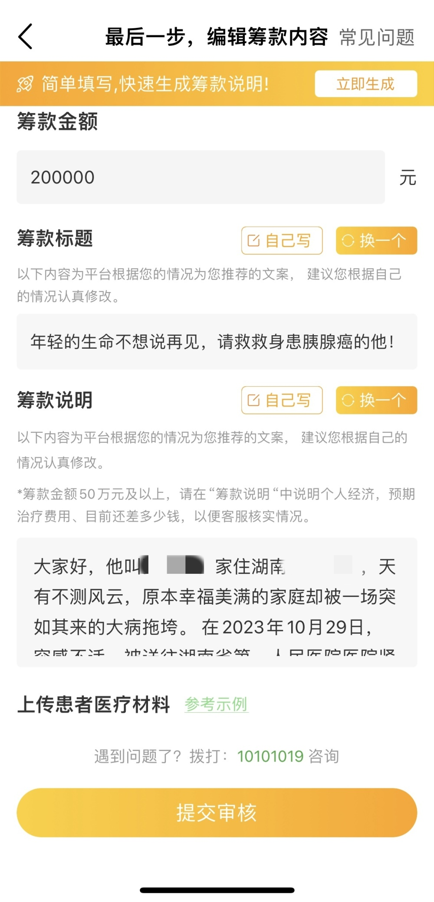
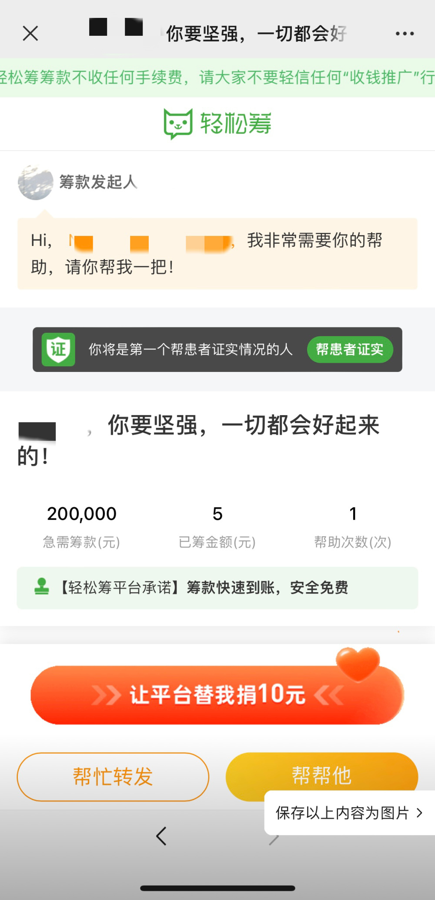

# 四川成都被咬女童200万元筹款风波：大病筹款平台再遭质疑

10月16日8时许，成都崇州市羊马街道恒大西辰绿洲小区内发生一起女童被狗咬伤事件。两天后，女童家属在筹款平台轻松筹上发起目标金额为200万元的筹款项目，用于女童的治疗。在短短5小时18分钟内，8.7万名爱心人士完成捐款200万元。

但很快，此次筹款就陷入捐助金额和资金用途的争议中。有网友认为女童父母筹集的金额过高，质疑钱款的使用去向。有人说，家属有车有房，为何不第一时间卖车或抵押车房救孩子？有人认为是女童代理律师让女童父母进行高额筹款，还有人认为平台的筹款审核过松，质疑平台从巨额筹款中收取费用。

而事件中的各方则各执一词。律师周兆成向新京报记者表示，自己并没有参与筹款的过程，不了解具体的筹款发起细节。他认为，筹款引发风波背后是女童父母爱女心切、思虑不周，而平台也存在没有任何评估通过筹款审核的问题。

轻松筹总裁于亮则表示，因医院无法开具预估的治疗费用明细，200万元是平台与女童家属及律师共同沟通的结果。新京报记者多次联系女童家属，截至发稿时尚未回应。

10月25日，筹款事件启动退款程序。轻松筹在社交媒体上发布“退款说明”称，受伤女童转出ICU，情况比较稳定，经与发起人沟通，轻松筹将对未使用的所有善款全额原路退回。

此次捐赠风波的背后，是大病筹款平台的又一次信任危机，监管缺位之下，这类筹款模式仅仅依靠行业自律，在实际操作中仍面临许多待解的难题。

_女童入院时的照片。受访者供图_

**医院里遇到“筹款顾问”**

10月16日8时许，成都崇州市羊马街道恒大西辰绿洲小区内发生女童被狗咬伤事件，据崇州公安部门通报，受伤女童“全身多处被咬伤、右肾挫裂伤、右侧肋骨骨折”。10月17日凌晨0点46分，女童被转入四川华西医院重症监护室，初步诊断为“犬咬伤多发创伤，右肾戳裂伤伴血肿形成，脓毒性休克”等15项症状。

事件发生两天后，女童涵涵的父母在一款大病筹款服务平台轻松筹里申请筹款。平台允许用户通过在其平台发布筹款项目，来获得网友的捐赠。项目发起者可以将发布的项目分享至微信、微博等社交网络，从而获得更多的关注和支持。

涵涵父亲唐海在轻松筹求助介绍中写道，由于情况严重，华西医院的医生组织了医生团队到第五人民医院为涵涵会诊。涵涵背部有多处撕咬伤，最长伤口达到了8厘米，背部左右两侧到臀部均有严重外伤，而最大的危险是伤口感染和来自腹膜后的右肾撕裂。

女童代理律师周兆成表示，女童家属筹款主要有三点原因：一是当时女童在医院治疗时，事故的责任方没有找到，且走诉讼赔付的时间会很长；其次是尽管物业公司承担了部分医药费，但是一直强调自己只是连带责任；三是女童父母自身的经济情况有限，轻松筹认识女童家属以后，愿意给他们筹款。

据周兆成发布的微博图片显示，轻松筹筹款顾问手写了一份说明，说明指出，10月17日上午10点，轻松筹工作人员在华西医院11楼遇见被狗咬伤女童的父母，听他们说孩子在儿童重症监护室抢救，但是狗主人没有支付医疗费，物业公司仅付了2万元，并且自己经济情况较差，无力承担医疗费，非常担心孩子费用不够。

上述情况说明中提到，筹款顾问向女童父母表示，轻松筹可以帮助他们，随后他们提供了相关筹款资料，经过审核符合筹款要求，同意筹款。

在轻松筹患者家庭的基本信息一栏，女童家属填写的收款方为四川大学华西医院，目标金额为两百万元。家庭信息为年收入3万到10万，房屋财产1套，车辆财产1辆，价值1万到10万，未变卖。家庭债务情况为负债20万以上，无金融资产，无医保，以及未在其他平台发起筹款。

据新京报此前报道，10月25日，女童家属称，因当时情况比较危急，狗主人未主动垫付医药费，只有小区物业公司垫付的2万元和政府工作组垫付的8万元，考虑到孩子未来进行器官移植、康复、整形等所需费用，女童家属在轻松筹平台发起了200万元筹款求助。此外，女童母亲没有工作，父亲为送货员，月薪四千到五千元，家中共负债40多万元。

10月18日12时，女童家属在筹款页面下方公示了一张华西医院预收款凭据，凭据金额为一万元。15时，女童父母在项目更新进展中表示，项目所有筹款都打到医院账户，全部用于孩子治疗，如果后续资金有剩余会转捐慈善基金会。18时，女童父母在项目进展中备注，女儿涵涵现在华西重症监护室治疗，目前还在昏迷状态，每天的花费大概一万元左右。

筹款完成后，质疑声却陆续出现。有网友提出疑问：女童的治疗为何需要200万元的高额费用？目前使用了多少医药费？有人认为女童父母借热点事件高额筹款，并质疑资金的使用去向。随后，有更多网友开始质疑平台在没有医院提供费用证明的情况下为何通过了该筹款审核。有捐赠者陆续申请了退款。10月19日，轻松筹平台官方微博发布说明称，截至10月19日17时37分，平台共处理该项目的退款申请195个，总计8972元，并表示相关退款明细平台将定期进行公示，轻松筹不收取任何手续费。

但轻松筹的评论区仍不断出现质疑声音：200万元的善款究竟如何使用？

**两百万数额争议**

风波之下，10月25日，女童家属通过轻松筹平台发布信息，决定将200万元筹款全额退回。女童代理律师周兆成表示，截至退款时，筹集的善款一直都未使用。

_轻松筹平台上，女童的项目目前显示已筹款0元。网络截图_

10月25日，受伤女童母亲通过轻松筹平台发文回应筹款争议，称事件发生时未在第一时间联系上狗主人，慌张无助之下通过轻松筹向社会求助，目前涵涵的后续治疗费用暂时有了保障，因此决定将所有善款原路全额退还。女童母亲称，目前涵涵花费的治疗费用近6万元，物业和对方在医院预交的费用还剩16万元。

200万元金额的设定是此事件中最大的争议。2020年，轻松筹、水滴筹等个人大病求助互联网服务平台曾签署《个人大病求助互联网服务平台自律公约2.0》，该公约将一般的单次求助金额限定在50万元。对于超过50万元的，增加了平台的事前审核把关，规定单次求助金额超过50万元的，发起人应当提交具有相关资质的医疗机构书面证明，由平台审核并公示后发起筹款链接；再次求助且累计筹款已经超过50万元的，发起人应当提交医疗花费清单。

轻松筹总裁于亮向新京报记者表示，在大病救助的筹款项目里，并没有法律法规明确规定不同疾病的治疗金额，平台一般根据过往疾病的治疗费用数据预估金额，“我们有一个数据报告，是在各个医院调研过的各种重大疾病在标准情况下治疗费用的区间。患者在提交医疗筹款需求时，需要填写疾病的种类和门诊的诊断，我们根据他提交的这些材料，帮他评估一个大概的区间，正常情况下是5万元、10万元、20万元这几个区间。”

在女童家属的描述中，筹集的费用包含了女童后续的器官移植、康复、整形。于亮表示，平台征求过家属和律师的意见，200万元是女童家属和律师沟通的目标设定，“因为当时不知道到底能筹到多少钱，大家觉得200万元是足够女孩后续的各种治疗了。在发起项目的时候，女童的家属和律师也已经明确了资金使用在女童的治疗上。平台从一开始就引导家属对资金的使用需要对公众有告知。”

按照筹款流程，单次求助金额超过50万元的，发起人应当提交具有相关资质的医疗机构书面证明。但据南方周末报道，华西医院人员曾表示，医院“没有出具任何相关的费用证明”，而截至筹款筹集成功两天后的10月20日8时，患儿预交费用11万元，已发生费用3万元左右。

没有获得医院开具的费用证明，平台如何通过筹款的审核？于亮称，通常情况下，国内医院并不会开具患者疾病的资金使用预估证明。在现实情况下，没有人敢评估病人的病情需要多少医药费合适，“因为这种重大疾病和突发事件面前，随时有可能有突然的事情发生，你根本不可预知这种金额。”

“我们做大病救助将近9年多，肯给家属开医疗证明和资金使用证明的，是海外的一些医院。为了帮助筹款人证明资金的使用量，他们会给患者出具大概的资金评估，但他们也会有一个弹性的范围，会说这只是当前病情下的一个预估。”于亮说。

“在大病救助的业务上，患者设定的目标金额和实际筹到的金额往往有很大差距。大部分人希望能筹到10万元，但往往筹款最后的结果是目标值的十分之一或者五分之一。”于亮认为，目前国内并没有明确的法律规定捐赠资金的上限，“在没有法律法规的情况下，平台在特殊的情况下适当地满足家属的意愿，并没有太大问题。”

**“简单”的筹款流程**

2014年9月，北京轻松筹网络科技有限公司成立并推出“大病救助”模式，希望通过搭建社交众筹平台帮助许多大病患者解决医疗资金等问题。此后，水滴筹、爱心筹等一批个人大病求助信息发布服务的网络平台上线，互联网公益众筹平台逐渐发展。而这些网络众筹平台背后，运营主体均为以营利为目的的商业公司。

一项关于互联网大病众筹平台的调查问卷显示，据不完全统计，目前已有逾500万大病家庭通过个人大病求助互联网服务平台发布了求助信息。5月20日，2023年中国互联网公益峰会连续第8年举办，其间提到自2016年《慈善法》颁布至今，累计超过510亿人次参与互联网慈善，募集善款350亿元。

一家互联网公益众筹平台2021年的数据报告显示，所有捐款人次中，求助者直接好友占比仅10.9%，平台助推触达的爱心人士占比70.1%；捐助金额中，来自求助者直接好友的占比仅16.9%，来自平台助推触达的爱心人士占比63.1%。也就是说，求助者的大部分捐款来自互联网平台上对其病情和家庭状况等信息不知情的陌生人。

那么，求助者的信息是否都是经过众筹平台审核的？

新京报记者调查发现，在轻松筹平台，甚至不需要患者的身份证件、住院缴费清单、亲属关系证明等材料，仅凭借一张盗用的诊断报告书，就可以在平台完成审核，发起筹款。

10月26日，新京报记者提交了一张社交媒体上下载的“CT诊断报告书”，在患者身份信息一栏，记者并未填写“身份证件号”，而是在选项“其他”中填写了5个数字。在疾病名称部分，页面提示“如不清楚具体疾病可不填”。

在众筹金额上，当记者填写大于50万元时，页面弹出提示，“筹款金额限填1000元至50万元”，页面下方的“大额筹款说明”提示需要上传预期医疗花费证明。页面并未有明确的关于筹款金额的指导建议，只在页面右上角的“常见问题”中显示：建议求助人咨询主治医师；一般情况下，50万元筹款金额可覆盖大部分疾病的治疗费用。最后，记者填写了筹款金额20万元。

“筹款标题”和“筹款说明”可以选择快速生成的“文案模板”。记者在填写“患者家乡”“就诊日期”“就诊医院”“已花费金额”之后，系统自动生成一段标题为“年轻的生命不想说再见，请救救身患胰腺癌的他！”

_记者调查时，筹款说明页面自动生成的文案。网络截图_

新京报记者在“提交审核”按钮上方看到一行小字提示：“继续操作表示您同意《个人求助服务协议》”。服务协议中提到，发起人须对所提交的文字描述、图片等资料保证完全真实，无任何虚构以及隐瞒真相的情形；而对捐赠者，平台并不能保证其完全真实或完全准确，捐款人应进行理性分析、判断后决定是否捐赠、资助。

随后，筹款页面跳转到填写“患者家庭财产情况”和“患者医疗保障情况”。此时，记者在页面上方看到“筹款内容已提交平台审核。继续填写以下信息，即可开始筹款”。患者家庭年收入、房产、车辆等经济状况，以及医保等情况为筹款必填信息，由筹款人自行选择“有”或“无”，同时也可以选择“不公开”。另外，该页面还提示“请如实填写，公开的信息越多筹款效果越好”。

整个筹款填写流程花费时间不到5分钟。提交申请2分钟后，轻松筹后台通过该筹款申请。记者转发后发现，该求助链接可正常接收捐款。

随后，新京报记者拨打轻松筹客服热线，客服人员称，“患者同意（筹款）的话谁都可以发起。”只要是大病，无论是什么情况都可以进行筹款。同时客服提醒，没有如实填写，周边有人对项目有质疑，他们会核实处理。另外，项目周期一般为30天，完成后需要患者本人或直系亲属凭户口本等相关信息提现。

至于财产信息，“年收入、房产、车辆等征信信息是告知给捐款的爱心人士看的，项目验证时不会有人核实，之后在提现时会再一次核实患者的近况。”轻松筹客服回复。

针对信息核查的问题，新京报记者咨询水滴筹平台的筹款顾问，对方同样表示，“无人核查财产信息”。

对于求助者个人信息的审核，于亮认为，平台的审核能力有限，“它（患者家庭资产作假）的发现其实只是来自群众的一个举报。没有别的办法，因为现在即便是公安机关也无法查证一个人家庭资产的真实情况。如果一个人没有犯罪，谁都没有办法去查这件事情，且查证成本非常高。”

_不需要患者的身份证件、住院缴费清单、亲属关系证明等材料，仅凭借一张盗用的诊断报告书，就可以在平台完成审核，发起筹款。网络截图_

**真实性谁来审核？**

利用筹款平台进行诈捐、骗捐的事件屡有发生。据观察者网报道，2018年年底，唐某某以“急性淋巴细胞白血病”“煤气一氧化碳中毒”为由，在轻松筹、水滴筹等平台发起筹款。随后在2019年7月，唐某某被曝光多次利用网上购买的虚假病历，在轻松筹、水滴筹等平台发布求助信息，骗取捐款7404.11元。

据中国青年报报道，2019年5月，杭州市萧山区一女子替父在水滴筹发起20万元的筹款，称父亲被确诊胃癌，此后不少网友转发、捐款。6月中旬，有人发现该女子在社交平台晒出买跑车、出国旅游、购买奢侈品等情况。水滴筹展开全面调查，筹款人承诺将已提取的8547元善款退还。

作为第三方平台，平台是否对求助者信息的真实性有审核义务？记者梳理裁判文书发现，北京市朝阳区人民法院曾审理过一起个人大病筹款的诉讼纠纷。

在上述案件中，筹款发起人莫某因隐瞒了其名下财产信息以及接受的其他社会救助信息，并且未将筹款用于其孩子的医疗费中，法院认为，莫某与赠予人之间系附义务的赠予合同关系，其隐瞒家庭财产信息、社会救助情况构成一般事实失实，违反约定用途使用筹款的行为属于将筹款挪作他用，上述行为构成违约。根据水滴筹个人求助信息发布条款，平台有权要求发起人返还筹集款项。

法院在判决中同时指出，因目前个人大病求助需求量大、家庭财产状况核查比对复杂度高，水滴筹平台审核甄别力量确实有限，但这不构成水滴筹平台降低审查或者监督义务的正当理由。尤其在本案中，该院查明水滴筹平台的运营者是水滴公司，是一家以营利为目的的有限责任公司，并非慈善组织，也不是民政部指定的公开募捐平台，其更应在运营水滴筹平台获得合理利润的同时，加大资源投入，健全审核机制，配备与求助规模相适应的审核和监督力量。

但事实上，平台能够承担的审核义务非常有限。于亮说，法律上所有捐赠都是单向的赠予行为，钱赠予患者之后，钱的支配权完全在患者自己身上。“如果用捐赠的钱做其他事情，平台没有任何权力去强制患者怎么做。”

_四川大学华西医院开具的女童的住院患者病情证明书。来源：轻松筹平台_

于亮表示，目前所有政府指导的公约上面都标明，患者家属的家庭财产情况由患者自己承诺，“没有强制说有钱人就不能筹款，但是有钱人如果筹款可能会受到舆论的谴责，所以他可能会放弃这样的方式。现在给的正确的引导就是告诉大家我有房有车，如果人家能接受你有房车这事，他愿意把这个钱给到你，法律也是允许的。”

新京报记者发现，在轻松筹等筹款平台的捐款界面上，均有发起人承诺的一栏信息，声明发起人发起的项目为大病求助性质，非慈善性质，并保证所提交的文字、图片证明材料等本项目全部信息的完整性、真实性、有效性及合法合理性。基于项目所筹款项将全部用于受助人的疾病治疗，不另行挪作他用。若有违反，自愿承担全部法律责任，并赔偿相关方(包括但不限于平台、捐赠人、其他利害关系人)的全部损失。

此外，在项目信息下方，同时标注有“该项目信息不属于慈善公开募捐信息,真实性由信息发布个人负责”。

**慈善法或将作出规范**

风波背后，在没有法律法规明确规定的情况下，大病救助的捐助活动目前依靠的仍是行业自律。

民政部慈善事业促进和社会工作司曾在关于互联网救助平台的监管问题上指出，有关网络平台开展的互联网个人大病求助，在形式上属于民事赠予关系，不属于慈善法规定的慈善募捐，不在民政部门法定监管职责范围之内。相关当事人的法律关系应当按照民法中附条件的民事赠予合同来对待。

民政部慈善事业促进和社会工作司同时也指出，虽然个人求助不属于慈善募捐，但事关人民群众奉献爱心，客观上影响到慈善领域的秩序规范，“为此，民政部门从确保慈善事业健康发展的角度出发，持续开展对互联网个人大病求助的风险提示和风险防范工作，引导互联网个人大病求助平台开展行业自律。”

2018年，在民政部的指导下，轻松筹、爱心筹和水滴筹三大网络筹款平台在北京联合发布《个人大病求助互联网服务平台自律倡议书》和《个人大病求助互联网服务平台自律公约》，承诺将明确告知用户大病求助不属于慈善募捐，加强求助信息前置审核，搭建求助信息公示系统，抵制造谣炒作恶意行为，建立失信筹款人黑名单等多项措施。

随后在2020年，在民政部的主导下，《个人大病求助互联网服务平台自律公约》2.0版发布，新增了360大病筹共四家平台。升级版的公约增加了平台的督促义务，对救助款打款对象的限制来保证资金安全。

在上海交通大学中国公益发展研究院院长徐家良看来，水滴筹、轻松筹本质上还是商业公司，为了保证可持续性，大多数平台或抽取部分服务费用，或开展保险等业务来保持收支平衡。在这个模式中，公众的信任显得尤为重要。但现实是，由于对筹款人资格审核不严、平台之间出现恶性竞争等，个人求助平台始终处于信任危机中。

对于商业化运作的平台而言，对求助者的家庭经济情况进行详尽的背景调查，本身也存在成本过高等问题。“如果求助者不告诉平台的话，平台也没办法去核实的，没这么多的精力。”徐家良提到，对接房产系统、征信系统也不现实，政府之间有的系统都没有连起来，其中还牵扯个人隐私。

在外部监管方面，徐家良坦言，目前对互联网个人求助平台的监管相对薄弱。

徐家良认为，行业规范不是公约就能够保证的。“公约是平台尽可能不要出差错，但这个很难，比如材料有假如何审核出来？又比如做了抽查，但是遗漏的申请里面有虚假的。”只要出现一例审核不严的负面情况，整个行业都会受到影响。

互联网个人求助平台的发展均面临相同困境。徐家良提出一些建议，首先是否能扩大担保的范围，在现行的筹款平台中，有“帮他证实”的选项，那么是否可以考虑邀请当地的村干部或者其他公职人员为此担保，以证明有效性。其次，是否可以设置求助公证，用法律手段来确保求助的真实性和合法性。

徐家良还提到，对于普通人而言，大病是沉重的负担，政府部门无法全部解决问题，个人才求助平台，“在民政部门制定个人求助平台规范的基础上，把如何提供真实信息、如何审核、如何确保款项用于真正的病人身上等规定得更完善一些，这个行业将会朝着更有序的方向发展。”

据光明日报报道，2019年，在莫某隐瞒个人信息筹款的案件中，朝阳法院提出司法建议，建议民政部指导推进平台自有资金与网络筹集资金分账管理，建立健全第三方托管机制和筹集资金公示制度；同时建议网上大病求助平台建立与医疗机构的联动机制，实现资金双向流转，强化款项监督使用。

网络平台求助的法律也正在逐步完善。10月22日，十四届全国人大常委会第六次会议分组审议慈善法修正草案。修正草案明确个人因疾病或者其他原因导致家庭经济困难，向社会发布求助信息的，求助人和信息发布人应当对信息真实性负责；个人求助网络服务平台应当承担信息查验义务，具体管理办法由国务院民政部门会同有关部门另行制定。

于亮表示，如果民政部将来有了指定的筹款平台管理机构，明确了资金的设定标准，未来不仅需要医院能够为家属出具资金的使用证明，还需要研究医疗行业数据信息如何打通，以及如何在不涉及病人隐私的情况下调取有效的医疗信息。

“这个病要花多少钱，他已经花了多少钱，是不是要筹款。现在这些只能靠患者提供的材料，要想真正做到准确，就需要打通医疗数据。大病救助纳入慈善法，它就不仅仅只是一个自律公约。”于亮称。

新京报记者 周思雅 李聪

编辑 陈晓舒

校对 刘越

