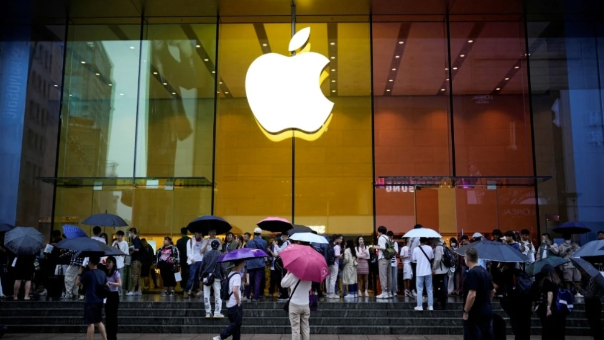

# 外媒评苹果发布会：与其说“快得吓人”不如说“相似得吓人”

**划重点**

  * _1_ 《华尔街日报》认为，苹果此次活动中发布的升级产品看起来基本没有变化，与其说“快得吓人”不如说“相似得吓人”。
  * _2_ 彭博社评论称，半导体业务（即苹果硅）已经成为苹果内部的一项宝贵资产，M3系列的发布将帮助苹果电脑重回正轨。
  * _3_ 路透社称，苹果芯片采用了Arm技术，与使用微软Windows操作系统的电脑相比，这种芯片电池续航时间更长，在某些任务上的表现也更好。
  * _4_ 雅虎财经表示，在芯片领域，苹果与英特尔都面临来自高通和英伟达等公司的激烈竞争，而英特尔的处境将更艰难。

腾讯科技讯 10月31日，美国当地时间周一晚间，苹果举办了主题为“快得吓人”（Scary
Fast）的在线发布会（[史上最短苹果发布会：发布M3系列芯片和全新MacBook
Pro](https://new.qq.com/rain/a/20231031A0172000)），宣布推出三款新芯片以及升级版MacBook
Pro和iMac等设备。发布会结束后，多家主流媒体对此次活动发表了评论。

以下为媒体评论摘要：

**《华尔街日报》：与其说“快得吓人”不如说“相似得吓人”**

苹果此次发布会名为“快得吓人”，该公司发布了新款M3系列芯片，这是为新款14英寸和16英寸MacBook
Pro笔记本电脑以及新款iMac提供支持的三款处理器。然而，这一切似乎都似曾相识，也许这个活动应该叫“相似得吓人”。

虽然苹果承诺搭载M3的电脑具有令人印象深刻的性能和图形飞跃，但产品本身看起来基本没有变化。当然，也并非完全没有变化，毕竟新款MacBook
Pro增加了“太空黑”颜色选项。

在过去三年里，苹果从英特尔芯片转向自主研发的M系列芯片，帮助其电脑业务起死回生。现在，苹果笔记本电脑更酷、更安静、更快、更耐用。但是，虽然速度提升可以让那些需要在截止日期前完成任务的专业人士受益，但大多数人都没有注意到这些渐进的性能提升。

新款电脑在其他方面也令人失望，尤其是新款iMac，它没有升级屏幕或配件。总的来说，在抢先看到新款iMac和MacBook
Pro机型后，有些消息令人兴奋，有些则令人感到失望。

**彭博社：苹果硅已成苹果宝贵资产**

苹果刚刚发布了新款iMac、MacBookPro和第三代自主研发的Mac芯片处理器，并推出了首款提升性能和图形处理能力的M3芯片（包括M3 Pro和M3
Max）。

苹果内部的半导体业务（又被称为苹果硅）已经成为一项宝贵的资产。自2020年放弃英特尔的组件转而自主开发芯片以来，苹果的Mac电脑销量大幅增长，这得益于疫情期间科技支出的广泛增加。

但最近几个季度，Mac的收入又开始下滑，竞争加剧。M3的发布是为了帮助苹果恢复在行业中的优势，让Mac业务重回正轨。数据显示，预计在假日季，这款电脑的销量将增长约5%，从本月开始的财年收入将增长5.5%。

改用M3标志着苹果（或任何其他大批量生产的电脑制造商）首次转向3纳米技术。这一过程可以压缩更多的晶体管，在更小的空间内获得更多的功能。这种芯片旨在提高性能，同时还能节省电量。

通过使用内部芯片，苹果可以定制硬件和软件，从而创造更好的整体用户体验。该公司表示，其顶级MacBook
Pro现在比最快的英特尔笔记本电脑快11倍。M3芯片在执行标准计算任务时比M1芯片快35%，在图形处理方面比M1芯片快65%。

苹果的新款iMac是这款一体机自2021年4月重新设计以来的首次更新，它也是唯一一款跳过M2，直接从M1芯片跳到M3芯片的硬件。苹果表示，新版本的速度是上一代的两倍，图形性能也更好。

此前有迹象表明，电脑处理器业务正在升温。苹果前合作伙伴英特尔上周给出了乐观的预测，推动股价飙升。英伟达和AMD也正在研发基于Arm技术的新处理器。高通上周发布了一款笔记本电脑处理器，号称比苹果的M2更快。

**路透社：重新设计GPU与英伟达竞争 重塑电脑业务**

苹果在发布会中推出了新笔记本电脑款MacBook
Pro、台式机iMac以及三款新芯片。该公司表示已重新设计图形处理器(GPU)，这是英伟达主导市场的关键部分。

市场研究机构的初步数据显示，苹果的Mac业务出现了复苏，自2020年与英特尔分道扬镳并开始使用自主研发芯片作为台式机大脑以来，苹果的市场份额大约翻了一番，达到近11%。

苹果的定制芯片采用了英国芯片设计公司Arm的设计技术，与使用微软 Windows操作系统的电脑相比，这种芯片的电池续航时间更长，在某些任务上的表现也更好。

其他笔记本电脑制造商可能会将英特尔的中央处理器(CPU)与英伟达GPU相结合，而苹果则不同，该公司将这两个部分结合在了自己的苹果硅芯片中。该公司声称，这使其性能优于竞争对手。

苹果没有透露是谁在制造这些芯片，但分析师认为是台积电，该公司使用同样的技术为高端iPhone 15机型制造芯片。

在整个发布会上，苹果高管将新款Macbook和iMac电脑的性能与使用英特尔芯片的旧款苹果电脑进行了比较，强调客户升级到使用苹果自家芯片的设备后会注意到速度有了巨大提升。

苹果对市场的颠覆刺激了高通加倍努力，为Windows生产基于Arm的芯片。该公司上周宣布，计划推出一款比苹果部分产品更快、更节能的芯片。同时，英伟达也计划最早在2025年进入个人电脑市场。

同时，苹果还调整了电脑的整体阵容，这可能会改变企业买家的行为。

Creative Strategies首席执行长兼首席分析师本·巴加林（Ben Bajarin）说，苹果将新款14英寸MacBook
Pro在美国的售价从1999美元大幅下调至1599美元，但似乎已经取消了售价较低的1299美元的13英寸MacBook Pro，这款产品在企业中非常畅销。

此举可能会促使人们在以生产力为导向的MacBook Air机型（最高售价1299美元）和1599美元的MacBook Pro新机型之间做出选择。

在苹果内部，Mac在2022财年的收入达到401.8亿美元，约占其收入的11%。虽然这个数字较上一财年增长了14%，但随着个人电脑行业其他部门增长放缓，今年的销售更显低迷。

苹果表示，这款新芯片将是首款采用3纳米制造技术的笔记本电脑和台式电脑芯片，该技术将使芯片在耗电量上表现得更好。

**雅虎财经：苹果推出M3芯片应对处理器竞争**

正如你可能猜到的那样，苹果为其Mac电脑推出了第三代自研处理器M3、M3 Pro和M3 Max。该公司承诺，这是迄今为止最先进的处理器。

苹果表示，基于Arm架构设计的M3是首款3纳米级消费电脑芯片，将200万个晶体管集成到2个只有人类头发横截面那么小的空间里。M3芯片CPU的性能内核比M1快30%，而其效率内核则快50%。

M3芯片也有一个改进的神经引擎，比M1快60%，随着人工智能渗透到我们日常使用的更多软件和应用程序中，这一点变得越来越重要。

但最大的变化，也是苹果在推出M3时最倚重的，是芯片的GPU。苹果表示，这些芯片的GPU提供了一项名为动态缓存(Dynamic
Caching)的新功能，这是一种为图形密集型操作分配内存的独特方式。

这样做的目的是确保你正在使用的软件能够最大限度地利用GPU的可用资源。该公司表示，该功能将显著提高图形密集型应用程序和游戏的性能。M3的GPU现在还包括硬件加速光线追踪，它可以改善光线与游戏和应用程序中场景的交互方式，以创建更逼真的图像。

苹果自研芯片是为了将自己的电脑与基于Windows系统的设备和Chromebook区分开来。通过控制驱动其笔记本电脑和台式机的芯片、硬件和软件，苹果能够施加其他公司根本无法比拟的控制水平。

虽然苹果在笔记本电脑和台式机上使用自研芯片只有3年的时间，但其设计iPhone芯片已有多年的历史。多年来，这种专业技术已经转化为令人印象深刻的性能提升，同时提高了整体电池续航时间。

但在芯片领域，苹果面临高通和英伟达等公司的竞争正在加剧。上周，高通推出了新的骁龙X Elite芯片，其性能与苹果的M2 Max相当，但功耗更低。

高通基于Arm架构的芯片将只能在Windows系统中找到。虽然这意味着该公司的芯片与苹果之间没有直接竞争，但如果高通的产品能兑现其承诺，那么这款芯片可能会成为一种催化剂，说服那些考虑购买Mac电脑的消费者转而购买基于Windows的电脑。

不仅仅是高通在争夺苹果的功率与性能，英伟达也在开发自己的Arm架构芯片，可能与苹果的处理器竞争。

所有这些也给英特尔带来了麻烦，该公司需要消费者购买使用其芯片的Windows系统，以确保其在CPU市场上的份额。数据显示，到2022年，64%的新消费个人电脑出货量使用英特尔芯片。但随着竞争对手不断推出新的、有趣的芯片选择，英特尔的处境可能会变得更加困难。（文/金鹿）

