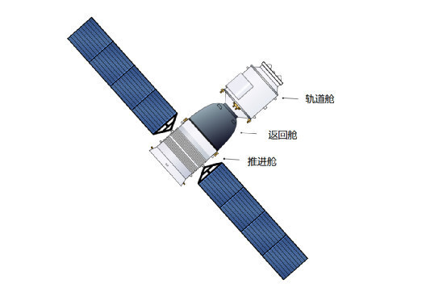
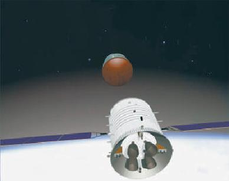
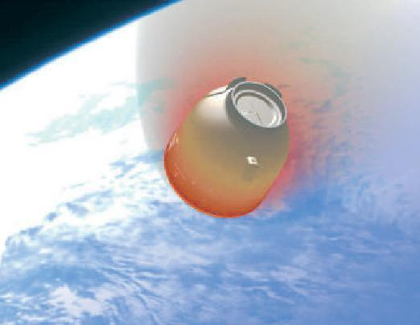
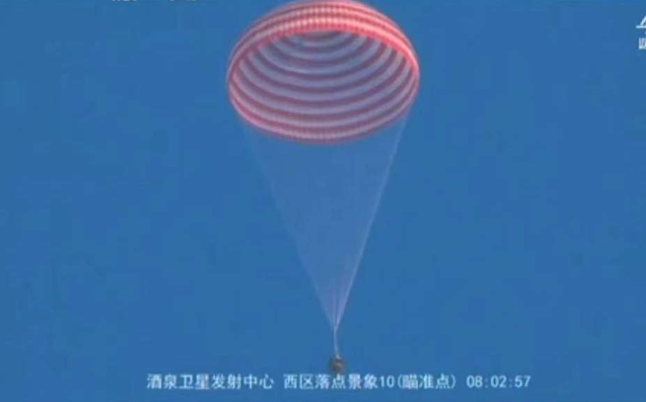
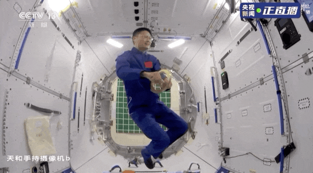

# 神舟十六“博士乘组”成功返回地面并顺利出舱，一文快速读懂重要环节

腾讯太空 乔辉

据央视新闻消息，2023年10月31日8时10分，神舟十六号飞行乘组（景海鹏、朱杨柱和桂海潮）成功返回地面，安全降落在东风着陆场，圆满完成任务。由于三名航天员都取得了博士学位，因此神舟十六号飞行乘组又被亲切称为“博士乘组”。

从2023年5月30日，神舟十六号飞船与空间站对接成功算起，到2023年10月31日神舟十六号载人飞船返回地面截止，神舟十六航天员乘组在空间站组合体工作生活共计五个月时间。

返回前一天，北京时间2023年10月30日20时37分，神舟十六号载人飞船与空间站组合体成功分离。

分离前，神舟十六号航天员乘组与神舟十七号航天员乘组开展了工作交接，完成了在轨工作经验交流、上行物资及下行样品转移安装等工作。

分离后，神舟十六号航天员手持高清相机，通过飞船绕飞完成了以地球为背景的空间站组合体全景图像拍摄。

**神舟十六号飞行乘组在空间站做了哪些工作？**

关于神舟十六号飞行乘组在空间科学实（试）验取得的情况，10月25日，中国载人航天工程新闻发言人、载人航天工程办公室副主任林西强介绍，神舟十六号飞行任务是中国载人航天工程进入空间站应用与发展阶段后的首次载人飞行任务，在航天员与地面科技人员密切配合下，空间应用项目按计划稳步推进，共开展了70项航天医学、生命生态、生物技术、材料科学、流体物理、流体力学、航天技术等空间实（试）验和8项人因工程技术研究，获取了大量实验数据，还有一些实验样品将随神舟十六号飞船下行，部分项目已取得阶段性应用成果，空间站作为国家太空实验室的综合效益正在逐步显现。

据悉，此次任务期间，他们还圆满完成了一次航天员出舱活动、一次“天宫课堂”太空授课、多次载荷出舱、配合完成天舟五号货运飞船分离撤离等工作。

**神舟十六号飞船返回的是哪一部分？**

我们知道，神舟十六号飞船是三舱结构，由轨道舱、返回舱和推进舱构成。只有载人的返回舱最终能回到地面，轨道舱和推进舱则最终坠入地球大气销毁。下面我们回顾一下各舱段的作用。

 _图注：神舟载人飞船结构（艺术图）。_

轨道舱是一个圆柱体，总长度为2.8米，最大直径2.27米，一端与返回舱相通，另一端与空间对接机构连接。轨道舱集工作、吃饭、睡觉和清洁等诸多功能于一体。

返回舱呈钟形，有舱门与轨道舱相通。返回舱是飞船的指挥控制中心，长2米，直径2.4米，内设可供三名航天员斜躺的座椅，供航天员起飞、上升和返回阶段乘坐。

推进舱呈圆柱形，长3米，直径2.5米，底部直径2.8米，内部装载推进系统的发动机和推进剂，为飞船提供调整姿态和轨道以及制动减速所需要的动力，还有电源、环境控制和通信等系统的部分设备。

**神舟十六号飞船是如何返回地面的？都经历了哪些挑战？**

我们知道，神舟十六号飞船与空间站运行在接近400公里高的轨道上，以接近每秒8公里的速度运动，飞船具有极大的势能和动能，要想稳稳落地就需要把这些能量耗散掉。耗散能量的办法就是不断各种“刹车”。

第一次刹车

首先神舟十六号飞船转体90度丢弃掉轨道舱，然后再继续转90度让推进舱的发动机冲前，随后发动机点火反推，让飞船脱轨运行轨道，进入返回地球轨道，飞船以无动力状态在地球引力的作用下自由下落。

 _图注：返回舱与推进舱分离（艺术图）_

在距离地面140公里的时候，飞船再丢弃掉推进舱，此时飞船只剩返回舱了。

第二次刹车

_图注：返回舱再入大气层（艺术图）_

在距离地面100公里的时候，返回舱开始进入大气。返回舱高速进入大气层后，强烈压缩其前面的空气，造成温度急剧升高，温度可达2000度左右，也就是说，返回舱被一层高温的等离子体包围着。等离子体有一个特性，能够屏蔽电磁波，形成所谓的“黑障”区，这就造成了返回舱与地面控制人员无法进行通讯，这种情况可持续数分钟。

在距离地面40公里的时候，黑障消失，返回舱与地面重新恢复联系。

第三次刹车

在距离地面10公里的时候，依次打开减速伞与主降落伞，减速伞能够让返回舱的速度降低到60米每秒，主降落伞能够让返回舱速度降低到3米每秒！

第四次刹车

当距离地面只有1米的时候，返回舱底部的反推发动机瞬间点火，最终把最后的一点速度也抵消掉，返回舱完成太空之旅。

**航天员返回地球后要进行隔离吗？**

是的！要进行医学隔离。资料显示，航天员要进行身体恢复，一般分为医学隔离期、医学疗养期和恢复疗养期三个阶段。

医学隔离期约为14天。航天员在航天员公寓内适应地球重力环境，提高心血管系统和支持运动器官功能，提高立位耐力，消除飞行后疲劳。

医学疗养期为20天至30天。航天员将入住天气好、空气好的疗养院，在继续恢复健康的同时逐渐增加活动量。

恢复疗养期大约为3个月。在这期间，要将航天员各项生理参数恢复到飞行前的状态。3个月后航天员如果身体情况良好，就可开始正常的日常训练。

**神舟十六号太空授课精彩回顾**

相对于太空科研实验，每次“天宫课堂”都是最令大众关注的。2023年9月21日，“天宫课堂”第四课开讲，神舟十六号航天员景海鹏、朱杨柱、桂海潮面向全国青少年进行太空科普授课，这是中国航天员首次在梦天实验舱内进行授课。

_图注：航天员桂海潮在演示陀螺的角动量守恒实验。_

在约48分钟的授课中，神舟十六号航天员景海鹏、朱杨柱、桂海潮生动展示介绍了空间站梦天实验舱工作生活场景，演示了球形火焰实验、奇妙“乒乓球”实验、动量守恒实验以及又见陀螺实验，并生动讲解了实验背后的科学原理。授课期间，航天员通过视频通话形式与地面课堂师生进行了实时互动交流。

**五、接下来还有哪些值得关注的太空任务？**

目前，中国空间站进入长期有人驻留模式。按照惯常节奏，平均每年发射两艘货运飞船和两艘载人飞船，其中货运飞船在文昌发射，载人飞船在酒泉发射。但由于天舟货运飞船的容量增加了，今后天舟货运飞船发射的频率会有所下降。

中国第一个太空望远镜预计2025年将升空，并与中国空间站形成“伴飞”状态。届时，长征五号B火箭将在文昌执行这次发射，有兴趣的朋友请留意官宣时间，不要错过现场观看发射的机会。

