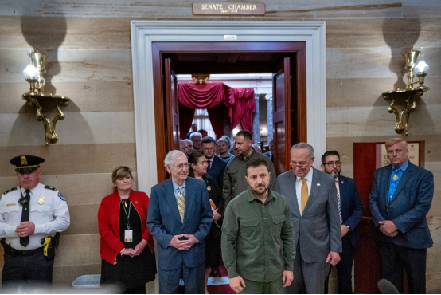
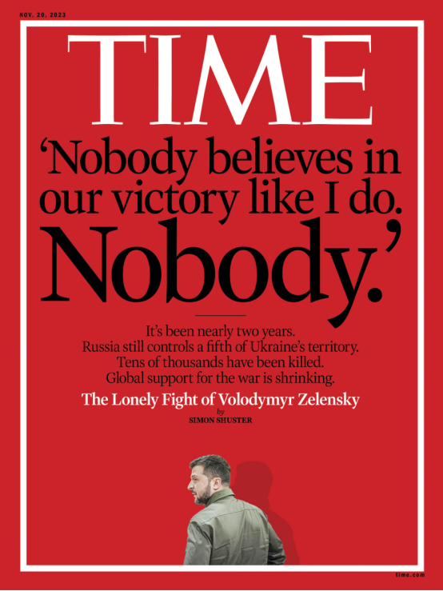
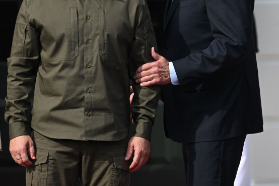

# 美媒：乌总统亲信透露，泽连斯基感觉自己被西方盟友背叛了

【环球网报道】美国《时代》周刊网站当地时间10月30日发布了一篇关于乌克兰总统泽连斯基的长篇报道。报道称，一名总统身边圈子成员告诉记者，泽连斯基感觉自己被西方盟友背叛了。

_9月21日，泽连斯基在美国国会与美国参议员举行了一场有争议的会议。《时代》周刊报道配图_

《时代》周刊报道开头部分讲述了泽连斯基9月访美时的一个场景。报道称，计划在华盛顿国家档案馆发表演讲的泽连斯基迟到了，原因是他在白宫和五角大楼的会议耽误了一个多小时。当泽连斯基抵达并开始演讲时，“他显得心不在焉且焦躁”，演讲有些僵硬，他似乎想快点结束。

报道称，泽连斯基后来说，他表现出这种状态的原因是当晚他感到筋疲力尽，不仅因为战争期间需要表现出领导力，还因他一直需要让盟友相信，在他们的帮助下乌克兰能够取得胜利。泽连斯基在行程结束后接受《时代》周刊采访时说，“没有人像我一样相信我们会胜利。没有人”。他继续说，向盟友灌输这种信念“需要你的全部力量和精力。你明白吗？这需要太多”。

_将要发售的《时代》周刊杂志封面_

《时代》周刊报道写道，几个月来，美国公众对援助乌克兰的支持率一直在下降，泽连斯基的访问也未能带来反弹。路透社在泽连斯基离开美国后不久进行的一项调查显示，约41%的美国人希望国会向基辅提供更多武器，低于6月时的65%。当时乌克兰开始了大规模反攻行动。报道称，乌克兰的攻势进展缓慢，损失惨重，这使泽连斯基越来越难以让其合作伙伴相信胜利就在眼前。随着巴以冲突爆发，就连让世界继续关注乌克兰也成了一大挑战。

《时代》周刊称，泽连斯基结束对华盛顿的访问后，该媒体跟随乌克兰总统及其团队回到基辅，希望了解他们将如何应对收到的讯号，尤其是要求泽连斯基打击其政府内部腐败的强烈呼吁，以及对一场看不到尽头的战争逐渐消退的热情。在基辅的第一天，记者询问一位总统圈子成员泽连斯基的感受是什么。他毫不犹豫地回答，是“愤怒”。

报道称，泽连斯基一贯乐观、幽默，他在作战室开会时喜欢用玩笑话来活跃气氛，这些在（与俄罗斯的）“全面战争”的第二年都不复存在。泽连斯基团队的一位成员说：“现在他（泽连斯基）走进来，了解最新情况，下达命令，然后离开。”另一位成员告诉记者，最重要的是，泽连斯基觉得自己被西方盟友背叛了。他们让泽连斯基失去了赢得战争的手段，只保有生存下去的手段。

_9月21日，美国总统拜登在白宫欢迎乌克兰总统泽连斯基。《时代》周刊报道所配图片突出了二人的肢体接触_

报道称，尽管如此，泽连斯基的信念没有改变。尽管乌军最近在战场上遭受挫折，但他并不打算放弃战斗或寻求任何形式的和平。恰恰相反，他对乌克兰最终战胜俄罗斯的信念变得更加坚定，这让他的一些顾问感到担忧。泽连斯基一位最亲密助手沮丧地对记者说：“他在自欺欺人。我们没有选择，我们没有赢。但你可以试着告诉他这一点。”

报道称，泽连斯基的一些助手说，其固执己见损害了他们团队提出新战略、传达新信息的尝试。在他们讨论战争的未来时，有一个问题一直被视为禁忌，那就是与俄罗斯人谈判并达成和平协议的可能性。报道称，根据最近的调查结果，大多数乌克兰人都会拒绝这样做，尤其是在需要失去任何“被占领领土”的情况下。

报道还提到了最新中东局势。《时代》周刊称，在俄乌冲突初期，泽连斯基的首要任务，或许也是他对国家防务的主要贡献，就是保持人们对乌克兰的关注，并团结西方支持乌克兰。随着巴以冲突爆发，这两项任务都将变得更加艰巨。乌克兰在美国和欧洲的盟友以及全球媒体的焦点迅速转移到了加沙地带。泽连斯基告诉记者：“这合乎逻辑。我们当然会因中东事件而蒙受损失。”不过，报道提到，泽连斯基请求以色列政府允许他访问该国，以示支持。以色列媒体随后披露了对方的回答：“时机不成熟。”

《时代》周刊还称，关于美国总统拜登试图同时推进对以色列和乌克兰的援助，泽伦斯基在受访时承认，拜登似乎受到共和党的制约。他说，白宫仍致力于帮助乌克兰，但关于共同价值观的争论对美国政客或其选民不再有太大的影响力。“政治就是这样，”泽连斯基带着疲惫的微笑告诉作者，“他们会权衡自己的利益。”

在新一轮巴以冲突爆发后，美西方能否同时对以色列和乌克兰提供他们寻求的支持受到媒体的关注。美国Axios新闻网报道称，奥斯汀10月13日访问以色列时表示，拜登政府将确保以色列拥有自卫所需的一切。他称，美国向以色列提供了弹药、“铁穹”系统的拦截器等增强防空能力装备，“美国对以色列的军事援助正以战争的速度涌入”。他还表示，美国可以同时支持以色列和乌克兰。“我们将与以色列站在一起，就像我们与乌克兰站在一起一样。美国能一边走路一边嚼口香糖，”奥斯汀说。

关于以色列和乌克兰局势，美国总统拜登则在讲话中将哈马斯和俄罗斯相提并论。在20日的演讲中，拜登对哈马斯和普京进行指责，宣称他们“构成了不同的威胁”，但共同点是“都想彻底摧毁民主的邻国”。他还称，他将向美国国会紧急申请预算，目的是“为满足美国的国家安全需求提供资金，以支持包括以色列和乌克兰在内的我们的关键伙伴”。他还吹捧称，“这是一项明智的投资，将为美国几代人的安全带来红利”。另一方面，对于美国总统拜登将俄罗斯与哈马斯相提并论以及其发表的涉俄总统普京言论，克宫发言人佩斯科夫当天予以谴责，表示拜登言论“不可接受”。
佩斯科夫对记者表示，这种言论“不适合负责任的国家领导人”，美国“遏制”俄罗斯的努力将被证明是无效的。

