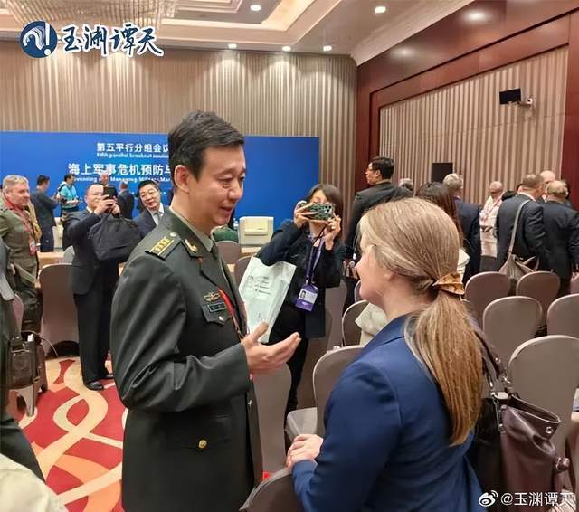

# 美方代表团来华参加香山论坛，三个重要细节值得关注

**撰文 | 董鑫**

10月29日至31日，第十届北京香山论坛在京举行。

本届论坛共有99个官方代表团、19国国防部长、14国军队总长（国防军司令）、6个国际组织代表及专家学者和各国观察员等1800余名嘉宾出席，参会的外方高官与重量级专家学者数量都达到了历届之最。

美方代表团的团长是美国国防部副部长办公室中国事务高级主任卡莱斯。论坛期间，她和她所在的代表团都毫无意外地成为了参会代表以及媒体关注的重点对象之一。

政知道（微信ID：upolitics）全程参会，在现场注意到了美方代表团的多个细节。

**参加“中美危机管控”研讨会**

北京香山论坛创办于2006年，从“二轨”向“一轨半”升级，逐步发展成为亚太地区具有重要影响力的高端防务与安全对话平台。

自首届香山论坛以来，美国学者代表一直参会，官方代表则是在近些年开始参会。

2015年，美国首次派官方代表参加香山论坛。

2019年，美军首次派出现任高官参加北京香山论坛，时任美国助理国防部长帮办施灿德带队参加，并在论坛分组会议发言。

从代表团规格上来看，美方代表团今年参会的规格相较之前没有太大变化。

美国国防部副部长办公室中国事务高级主任卡莱斯作为代表团团长出席论坛，施灿德也来华，作为专家学者参加相关活动。

本届北京香山论坛有3天议程，共举行了30多场会议。

**政知道（微信ID：upolitics）注意到，美方代表团参加了开闭幕式、全体会议、分组会议、研讨会等多项活动。**

10月30日晚上，卡莱斯出现在了一场主题为“中美危机管控”的小型研讨会上，这场研讨会闭门举行，不对媒体开放。卡莱斯并没有发言。会后，她和与会代表进行了简单交流。

论坛官方发布的名单显示，研讨会的发言嘉宾有20位，来自美方的嘉宾有美国昆西国家事务研究所东亚项目首席主任迈克尔·史文，以及美国海军分析中心副总裁冯德威。

迈克尔·史文是中国国防与外交政策、中美关系、东亚国际关系问题专家，他在10月29日出席了论坛举办的中外名家对话。

冯德威也是一位军事专家，他在10月29日出席了论坛举行以“孙子兵法与当前国际安全挑战”为主题的研讨会并发言。

**与中方代表交流**

根据此前国防部发言人吴谦在国防部记者例会上的介绍，本届论坛期间，中方相应官员会与卡莱斯开展交流。

**公开报道显示，在论坛现场，军事科学院原副院长何雷中将与卡莱斯进行了简短交谈，吴谦也与卡莱斯进行了简短寒暄。**

_△论坛会场，国防部发言人吴谦与卡莱斯进行简短寒暄_

值得一提的是，何雷还送了卡莱斯解放军臂章作为礼物。

何雷告诉政知道（微信ID：upolitics），卡莱斯会汉语，二人交流并无语言障碍，他借着送臂章的机会向卡莱斯讲述了中国的国防政策。

“军队臂章反映了一个军队的文化，我们中国军队的臂章是盾牌形状，盾牌表示了什么？卡莱斯会汉语，她马上说，表示防御。我说，你理解的是对的，我们奉行的是防御性的国防政策。臂章上有橄榄枝，橄榄枝代表的是和平，我们中国军队是维护地区和世界和平的正义之师，捍卫国家主权安全和统一的胜利之师。”何雷回忆说。

何雷告诉政知君，卡莱斯很高兴收到这份礼物。他还另外再送了一枚臂章请卡莱斯转交给美国防长奥斯汀，希望下一次奥斯汀能够与卡莱斯一起来中国，参加第十一届北京香山论坛。

**婉拒媒体采访**

论坛开幕当日，中外媒体都在会场门口拍摄各国代表团入场。

卡莱斯甚少公开露面，在场大多数记者都没有见过她本人。她进入会场时，很多媒体都没有注意到。

虽然论坛期间参加了不少活动，但美方代表团此行一直颇为低调，鲜少参与公开发言和讨论。

卡莱斯每次出现都会被媒体记者围堵，却始终婉拒采访，无论记者提问中美两军对话、地区热点问题或者对论坛的评价和期待，她都未作出任何回答。

在开幕式之前，还有记者上前递出名片，卡莱斯和随行人员也未接收。

政知道（微信ID：upolitics）还向卡莱斯询问了收到何雷将军的礼物有何感受，她也未作回答。

不过，政知君看到，在10月30日晚上“中美危机管控”研讨会结束之后，卡莱斯一边步出会场，一边与同行的参会代表讨论起她收到的臂章，还将臂章从手提袋中拿出来进行了展示。

**【版权声明】本文著作权归政知新媒体独家所有，未经授权，不得转载。**

