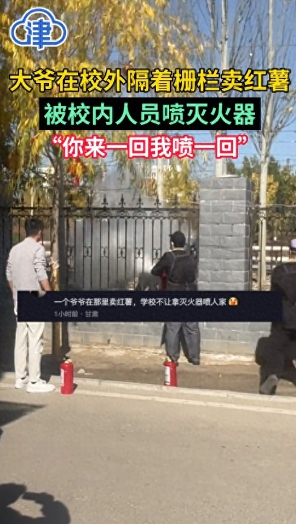

# 老人在校外隔着栅栏卖红薯被食堂人员用灭火器驱赶，学校：向老人道歉

据津云报道，10月30日，在甘肃兰州，网传大爷在学校栅栏外卖红薯，遭学校工作人员用灭火器驱赶。

视频显示，几名男子拿着灭火器对着学校栅栏外的人喷洒，还有一名男子指着对方说道：“你来一回，我喷一回。”

有网友表示，是因为一位老爷爷在校园外的栅栏处卖红薯，学校不允许就拿灭火器喷他。

据触电上海报道，对于此事学校方面回应称，是食堂的人喷的，已经进行处罚。

该工作人员表示：“作为学校老师，我看到也觉得挺气愤的，昨天那个拿灭火器的是我们食堂的，已经做了相应的处罚了，并且给大叔道歉。”

**【来源：九派新闻综合津云、触电上海】**

