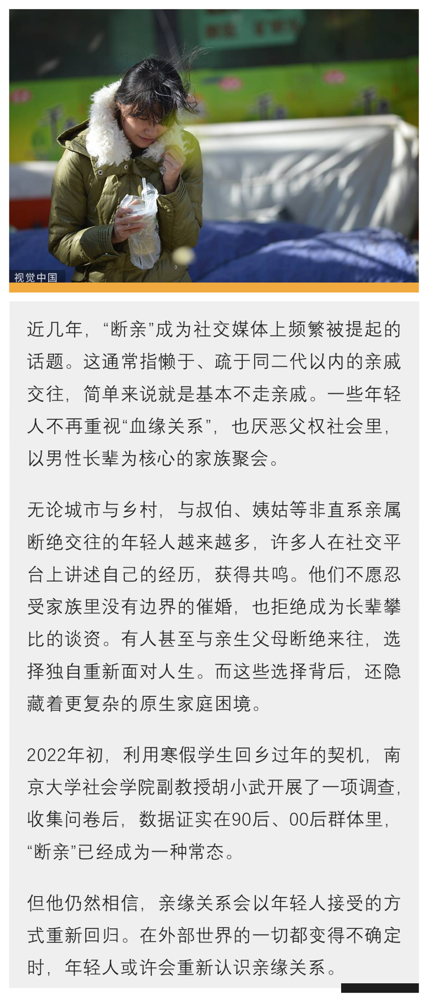
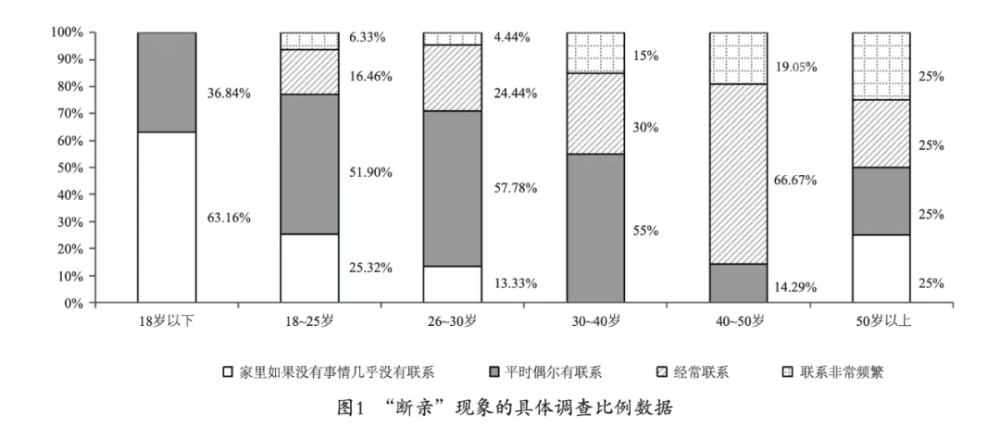
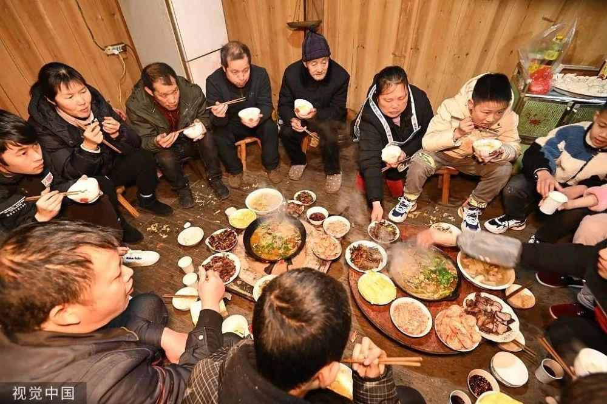

# 请讨厌的亲戚远离我的世界：重度抑郁女生被医生建议断亲

**文|** 殷盛琳

**编辑|** 王一然

拉黑、屏蔽、删除

对于91年女生小怪来说，30岁之后，选择断亲的决定性瞬间可能只是“到可承受的极限了”——2022年7月的某天，她拿起手机，平静地找出亲戚们的微信头像，挨个删除；再打开通讯录，将号码也拉黑。原来和亲人断绝联系只需要两三分钟，她说，名单包括3个堂哥，1个堂姐，姑姑，以及爸妈。

当时，小怪正经历重度抑郁，偶然看到一扇窗户，就有跳下去的冲动。上一秒还在喝水，很开心地听音乐，下一秒可能哭得撕心裂肺。医生建议她，可以先和家庭做物理隔绝，那是刺激她的诱因。

把亲人的联系方式都删除后，小怪觉得“世界都安静了”。在这之前，她经历了一场漫长、残酷的亲情崩塌。

起因是一场重病。去年，小怪在苏州一家互联网公司工作，突然接到通知，她被辞退了。正式离职前，领导请她喝了散伙酒。第二天早上，她就晕了过去，被诊断为脑梗中风，医生下发了病危通知书，如果恶化，可能随时会瘫痪。她躺在床上，失去了行动能力，连上厕所都不能自理。

小怪打电话通知的第一个家人是姑姑。8岁时，小怪的父母分开，各自成立了新家庭。她是在奶奶和姑姑照看下长大的，很长时间里，姑姑替代了“母亲”的角色，是她最亲近的人。

按照医生的说法，小怪后续至少需要养护一年，除了不能喝酒、不能吃高油高盐食物之外，还要定期去医院开药，这需要一笔医药费。她向最亲近的姑姑开了口，但姑姑说，小怪的父母健在，她不方便承担。

小怪思考了很久，终于下定决心向父亲求助，问他能不能在养护期间，每个月借自己两三千块钱，等上班后再还给他。父亲果断拒绝了，他能提供的支持，仅限于为小怪缴纳住院期间的费用。她又给妈妈打电话，对方没有任何反应，她明白妈妈也不想出这个钱，“她从头到尾没有出现。”

小怪第一次认识到，在人生关口，没有任何人愿意托住她。

“我父母的收入是有能力的。”小怪自嘲说，以前老人都说血缘大于一切，在她的父母这里似乎不成立。她最后是向大学时的闺蜜借了这笔钱，撑了过去。

拉黑所有亲人后，小怪连过年也没有回家。冷静下来后，她说服自己将亲人看作一种和领导、同事一样的社会关系，只要对他们不抱有期待，就不会有痛苦。

事实上，像小怪这样与亲戚不再来往的行为已经成为广泛的社会现实，被称为“断亲”，意思是懒于、疏于同二代以内的亲戚互动和交往的现象。去年春节，南京大学社会学系教授胡小武在返乡的同学里发起一项问卷调查，最后回收1200份有效样本，覆盖不同的年龄组，想要探究青年群体中“断亲”现象发生的比例。

他敏锐地感受到，断亲似乎正在年轻群体里成为普遍现象，他想知道这个判断准不准确，也想探究和自己70后这代人相比，孩子们与亲戚交往的行为方式为什么发生了变化？断亲背后，又展现了什么样的时代氛围？

调查结果完全印证了他的想法。18岁以下群组里，“和家里如果没有事情几乎没有联系”的比例高达63.1%，26岁～30岁的“90后”年轻人大多数只是“偶尔与亲戚有联系”，50岁以上的被调查者，有50%的人与亲戚“经常联系”，“这说明青年断亲现象确实已经成为一种社会常态”。

_●胡小武“断亲”论文调查数据_

从2021年起，就有一些媒体碎片化的报道出现，提及断亲，但并没有形成系统讨论。在豆瓣，还有专门的“不想回家/不想过节联盟”小组，已经有接近2万名成员。他们讨厌一切“团圆”的节日，“说好听点是过节，说难听点就是渡劫”。

去年，基于调查结果，胡小武发表了一篇关于青年断亲现象的论文，迅速引起了大量讨论。记者、研究同行纷纷找到他，想跟他进一步讨论相关话题。热度一直持续到现在，微博热搜榜上隔一段时间就会有相关词条出现。

胡小武经常翻看报道留言区或者社交平台话题里的讨论，发现了很多有意思的互动，“把我之前没有做的问卷相当于又补充完整了。”

在之前的论文中，他将断亲现象与城乡流动、互联网生活方式等建立起解释关系：城镇化发展造成了普遍的人口流动，亲人之间因为空间、距离的遥远而导致了情感的疏离；城市化也解构了以往相邻居住的形态，加速了“断亲”。

另外，市场经济提升了小家庭抗风险能力，经济独立带来的安全感，冲淡了亲人之间的心理需要。“00后”更享受互联网的虚拟社会关系，而非走亲访友——宏大的社会变迁下，“断亲”的产生似乎有迹可循。

但网友们向他提供了更隐秘、复杂的理由。胡教授记得，有网友提到，自己跟亲戚交往中有很多负面体验，对衡量、比较无法容忍。他感知到一种更强烈的社会情绪：年轻人在日常紧张的生活里，每天都过得很疲惫，根本无暇顾及所谓的亲缘网络。

亲手为父母写下离婚协议书

用已经工作的陈玉的话说，每年春节的家族聚会像是乌烟瘴气的“集中营”：大家默契表演一场舞台剧，哪怕私下暗流涌动，表面上也要维持“虚假的热闹”。

陈玉说，从高中开始，年夜饭她随便吃两口就走人，懒得表演。但爸爸和叔叔们还要将场面撑下去，“在我爸眼里形式大于一切，约等于老祖宗的规矩不能改。”唯一享受其中的，可能是婶婶，陈玉猜测，因为他们家有钱，在人前最有面子。“可能在她眼里，这是她的战场。”

一般在这样的场合里，陈玉要扮演乖巧懂事的工具人。她在小辈里成绩突出，是小家庭在家族聚餐上最大的谈资。当然，小辈的比较只是舞台剧的小插曲，主角还是出去打工一整年回来炫耀的男性长辈。他们需要这个“舞台”作为宣泄口——多年后再回忆这些画面，陈玉带着怜悯的语气。

她成长在一个山东传统农村家庭，爷爷奶奶重男轻女，极重面子。陈玉的妈妈是河北人，爸爸年轻时在邯郸打工，双方经过介绍认识。陈玉读幼儿园前都在河北，和姥姥一家关系亲近。但爷爷不同意他们在外定居，觉得家里长子不回老家还要倒插门，脸面上不光彩。

最后一家人只好回老家生活。爸爸变成符号一样的存在，大部分时间在外打工，妈妈独自应付一切。作为村庄的外来者，妈妈语言不通，也不会用炉子做饭，陈玉至今记得，婶婶骂过妈妈是“笨猪”，什么都不会。

之后这些年，这个家庭始终陷在漩涡中。陈玉选择断亲，与其说是对社会关系的筛选，更像是自我救赎的路径。

她初一时，爸爸铺地下管道遇到塌方，身上断了好多骨头，在床上躺了一年多。亲戚们几乎是沉默的。“当家里发生变故时，感觉每年的状态都变得特别快。”陈玉说，经历变故后，爸爸的脾气也越来越暴躁，父母之间吵架越来越频繁。

陈玉高二那年，弟弟从幼儿园升入小学，妈妈终于受够了婆家的打压、日复一日的争吵，选择了离开。当时走得仓促，她连招呼都没打，陈玉从寄宿学校放假回家时，妈妈已经不在了。

陈玉心底接受妈妈的选择，没有真正恨过她，“她在家里待得很难受，想换个环境，去外面打工也好。”但对一个16岁的女孩来说，这意味着被迫开始窥见亲情里的现实、算计与虚伪。

在山东农村，一个大家族里的亲缘关系，也分亲疏层级。陈玉家经济实力最差，妈妈远嫁是“外人”，自己作为孙辈又是女孩，在爷爷奶奶那里不受待见，连着弟弟也不被重视。

陈玉记得，妈妈走后没多久，弟弟生病发高烧，眼睛烧得通红，老人不管，她周六回家时带弟弟去打点滴。在乡镇诊所外面，她蹲在墙角哭着给妈妈打电话，结局是意料中的沉默。“她其实也难过，但她完全没想过回来。”

有时，她觉得弟弟更可怜。她起码在学校住宿，可以获得暂时的喘息，但弟弟不能。在农村，冬天取暖要烧煤球炉子，有次弟弟自己去点炉子，手上烫了好几个水泡；家里已经下大雪，弟弟还在穿很薄的运动鞋，陈玉说，她看到鞋子已经开裂，露出脚趾。

她绝望地打给爸爸，一个正在全国各个城市流转做焊工的农民，得到的回应是和妈妈相似的沉默。

离开半年左右，妈妈回来过一次；还有一次是陈玉生病，高烧，连带支气管炎，医生建议做扁桃体切除手术，陈玉记得，住院期间，爸妈无时无刻不在吵架，妈妈还是想走，爸爸痛斥妈妈心思不在孩子身上，怀疑她出轨，但没有证据。

陈玉坐在病床上，像局外人旁观一场闹剧，觉得悲凉，“没人在乎我的死活，我手术后几天不能吃东西，全靠喝水，我妈手机不撒手地聊天，我爸又是冷嘲热讽的态度。”

陈玉一开始坚定地相信，妈妈离开是难以忍受，但后来，她也怀疑妈妈背叛了这个家。她没告诉过任何人，自己在家里的台式电脑里看到过妈妈的网聊记录。

大一假期，妈妈回家正式提出了离婚。陈玉原本没想帮任何一方，但爸爸反应激烈，去厨房找了一把生锈的刀，往自己肚子上捅，说如果要离婚就死在这里。陈玉气极了，也举着一把菜刀过去，“我当时的心理状态就是，要不我送你一程，这个事情咱们就了结。”

她已经没法通过抽离的方式自我保护，再假装一位旁观者。爸妈互相宣泄情绪吵架时，毫不避讳她。用怪异、讽刺的语言攻击对方：妈妈吵着就要脱衣服，自扇耳光，朝爸爸丢东西；爸爸嚷嚷着让妈妈掏钱，去医院给他做全套检查。

这成了“父亲、母亲两个角色之于我的崩塌”。陈玉说，之前还能欺骗自己，觉得爸妈的矛盾仅限于夫妻关系，但现在，她发现自己的感受并不被在意。她帮妈妈找了律师，亲手写了他们的离婚协议书。

做自己的“父母”

陈玉说，最无助时，她靠自我暗示撑了过去。她紧紧握住学习这条路径自救，成功保研，然后供自己到广州读书，重新养育自己，做自己的“父母”。

事实上，从大一下学期开始，她就基本不再问家里要钱了。学校的贫困助学金，再加上国家励志奖学金，差不多9000块，基本能覆盖生活费。她也会去做高中生家教赚零花钱。

后来，她连过年都不回家。陈玉记得，2021年春节赶上疫情，和朋友两个人一起出门吃了顿火锅，在外面的街道上溜达，她告诉朋友，这是她最开心的一次新年。自由自在，不必担心随时可能出现的问题。“大一大二时都是在吵架和哭里过的，已经完全不想再经历了”，陈玉说。

去年7月，陈玉研究生毕业到北京工作，这是她完整意义上的独立生活。她明白完全从原生家庭的阴影中释怀不大可能，那将是漫长的人生课题。

她更担心弟弟的处境。比她小6岁的弟弟始终裹挟其中。“他站的距离更近，不像我有认知和调节能力。”

去年春节，陈玉最后一次见到弟弟。他的个头已经窜到了1米7多，对人态度疏离，变得更不愿意沟通，社交平台也屏蔽了她。有天，共同的朋友截图给她看，弟弟在QQ空间发了动态，大意自嘲是没妈的孩子。

她不知道该怎么将弟弟从泥沼里拉起来，“我把自己拽出来都废老鼻子劲了。”

朋友是她非常重要的情绪支撑。特别难熬时，她会给好朋友打电话，或者约出来喝杯酒。有次她遇到了难事，跟一个好朋友说，死亡是最解脱的方式。朋友说，“如果你真的活得这么痛苦，虽然我特别舍不得你，但也尊重你的选择”。

陈玉很受触动，“我很早就没有亲情维系，朋友起了一个代偿（作用）。”

从离开小镇到远方读书开始，亲戚也从陈玉的世界里“消失”了：有撕破脸大吵一架明确断交的，也有彼此默契互不打扰的。她不想和任何人有联系。

去年过年，陈玉只在家里待了三天，初三一早就匆匆赶回北京。她还保留着几个人的微信没拉黑，“怕哪天万一我爸爸出什么意外，没人联系得上我。”

小怪和陈玉对春节的感受差不多，她从小在爷爷奶奶家长大，讨厌春节和亲戚们的饭局，好几次，她宁愿待在奶奶家的阁楼上吃泡面，也不愿意去饭店吃年夜饭。

上大学之后，她很少回家，觉得自己是外人。“你的房间永远随时有人进出，永远不能锁门，放在房间里的东西都会被亲戚拿走。”老家的自建房没有客厅的概念，小怪觉得自己的房间承载了客厅功能，很多人都能到她房间坐坐。

把亲戚们都拉黑后，小怪的爷爷去世了，葬礼上，她又见到了那些熟悉的脸。她劝自己，这些人都不重要，都是过客。一起吃饭时，有亲戚谴责她，说怎么把他们都拉黑了，他们对你这么好。

小怪默默听着，没有讲话，迅速离席了。“辩解什么都没有必要。”

事实上，当下年轻人在亲缘关系上面临的困境与选择，在日本社会早已提前上演过。

断亲的风潮与社会经济环境的变化密不可分。第二次婴儿潮一代（1971年-1974年出生的人）在大学毕业时，碰上了经济崩盘。尤其是1997年，亚洲金融危机之后，日本失业的年轻人数量剧增，许多人被迫留在父母身边，躲在家里蛰居，不结婚，不与外界往来，更不会和其他亲人打交道，日本人口学家山田昌弘称呼他们为“中年单身寄生族”。

他们实现了“放弃家庭的自由”。放弃婚姻、社交，也放弃亲缘关系。根据2010年的日本国势调查，30-35岁的男性未婚率为47.3%，女性为34.5%，据预测，20-29岁的这一代年轻人终身不婚率将高达25%。

在日本，比起将友谊作为亲情的代偿，他们将这种对亲密感的需求转移到更遥远的事物上。

根据山田昌弘的观察，近二十年，日本有越来越多的人将饲养的猫狗等宠物视为家人。有人咨询能否让宠物继承自己的财产而非有血缘关系的儿子。他们为宠物庆祝生日、买漂亮的衣物，为宠物举办葬礼，将它们视为最重要的存在。

何以为家

陈玉目前在北京独居，下班回家后，她习惯逛社交平台，看小说和综艺。她恐惧电话，习惯调成免打扰模式。她祈祷生活永远如此平静，大家相隔千里，同时相安无事。

在这座新的城市里，她希望自己是全新的人。

陈玉对异性没什么信任，完全没有结婚的想法。她解释，想让男生真的认识到女性的处境，并承认女性面临的结构性不平等太难了。陈玉是坚定的女性主义者，如果在这一点无法达成共识，她无法和对方进入下一步亲密关系。

她对“家庭”不再抱有期待，只希望过好自己的人生。

小怪的病情好转，目前也已经正常工作。如果父母老了，或者需要自己时，她觉得自己大概会像对待无关人一样，能帮还是会帮一下。“比如家里有多余的猫粮、狗粮，看到路边的流浪猫狗，也是会帮助的。”

作为研究者，胡小武还在思考断亲背后更复杂的原因。最新的判断是，他认为断亲是现在年轻人生活越来越“窄化”的一个表现。

他最近在教城市社会学课程，在1830年代，就有学者提出过，城市社会里，人们越来越个体化、原子化的概念。放在中国社会来看，当年隐居终南山，或者去鹤岗避世的年轻人，以及选择断亲的年轻人，本质上来讲，都是一种自我“窄化”。

日本NHK录制组所著的纪实书籍《三十不立》里，提到过相似群体——经济下行时期滑落社会底层的“三十代”（30岁-40岁之间的人）。调查记者们记录了一位孤独死的39岁男性，他在便签纸条上写下最后的三个字是：“帮帮我”。2009年4月，他死于饥饿，房门外，正是樱花盛开的春天。他至死都未向亲戚或朋友坦白自己走投无路的处境。

节目在2009年7月播出，而日本当时的失业人口达到了359万人。

阶层的滑落，或者说贫富差距的出现，或许是断亲现象出现的重要原因。作为70后，胡小武在江西农村长大，亲戚之间住得不远，他和同辈的堂表兄弟同吃同睡，干农活在一起，放牛也在一起。“那会儿的乡土都是同质化的社会，没什么攀比现象。”他说，那时也不会有强烈的边界感，听家长们聊起小孩的成绩，不会觉得被冒犯。

各个家庭之间的贫富差距不大，大家都是农民，或者国营工厂的工人，日常生活方式也类似。“我想那是传统中国的最后一个周期了”，他说，1990年代之后，中国的社会结构发生巨变，城市化将差距拉大，也加速了居民流动，他童年所感受到的那种“传统”基本上解体了。

在他们家，只有胡小武和妹妹走出来了，其他同辈亲戚几乎都在老家生活，很多人已经做了爷爷奶奶，而他通过教育这条路径，留在南京，结婚很晚，孩子是10后。现在，他们每年过年才回去一趟，自己的小孩也成了“断亲”一族。胡小武说，跟孩子更亲密的，反而是同学和朋友们。

作为父亲，他有时会替自己的孩子觉得惋惜，他从未体验过自己曾感受的，来自故乡与家族的亲密感、连接感。

比起在互联网上大诉苦水的年轻人，和胡小武同龄或更年长一些的家长似乎是失语的。他们的声音被淹没在最热闹的信息渠道之外——热门社交平台离他们很遥远，你需要到门户网站上，点开文章评论区，才能在乱码一样的账户名里辨识出他们——一样的灰色原始头像，他们在下面留言：“自私自利的独生一代们”，“我是70后，感觉现在社会全变了，懒散冷漠之风蔓延，特别是智能手机，游戏，不良信息重创了年轻人”，“断亲的主要原因是教育出了问题，西方文化入侵”。

不过，胡小武对年轻人的亲缘观念仍抱有乐观的期待。他相信，这一代年轻人会以自己的方式，重新找回亲缘关系。他说，人都会向往所谓的安全感，家庭文化是最小单位，当年轻人无法从更宏大的世界得到安全感时，或许会“寻求一种更加确定的，以家庭或血液为纽带的安全感”，血缘是最淳朴的连接。

“这也是当代人的一种乡愁”，胡小武说。

（文中陈玉、小怪为化名）

版权声明：本文所有内容著作权归属极昼工作室，未经书面许可，不得转载、摘编或以其他形式使用，另有声明除外。

