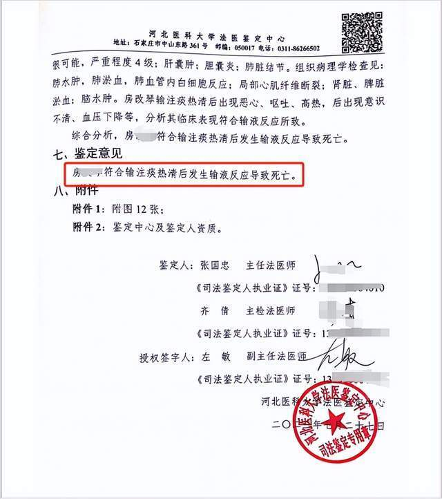

# 55岁患者住院十余天后输液死亡？法医：系输入痰热清后发生反应

近日，山西霍州55岁的房琴（化名）在太原市第三人民医院治疗肝功能异常时，因输注痰热清注射液后发生输液反应导致死亡。家属质疑，在她肝功能异常、存在过敏史的情况下，医生违规用药导致死亡。

因此，家属认为这是一起医疗事故，希望和医院进行调解。但医院则对鉴定结果表示怀疑，并认为房琴确实有痰热清使用的症状。目前，当地卫健部门已经介入调查。

有专家表示，房琴输液时，或因多重不利因素凑在了一起，才导致了死亡。

**住院十余天后输液死亡？**

55岁的房琴是山西霍州一名小学老师。2023年3月，她因为“荨麻疹”在当地就诊，口服中草药一段时间后，出现乏力、肤黄、食欲不振等症状。5月5日，房琴在当地医院检查，化验肝功能明显异常，3天后，她到太原市第三人民医院入院诊治。

公开资料显示，太原市第三人民医院是一所集医疗、教学、科研、预防、康复于一体的三级甲等传染病专科医院，是“山西省公共卫生临床中心”、“山西医科大学附属传染病医院”、山西省医师协会肝病医师分会会长单位、山西省护理学会传染病专业委员会主任委员单位等。

经过太原市第三人民医院初步诊断，房琴的“肝功能异常原因待查：病毒性肝炎（病因待定）急性黄疸型？药物性肝炎”。她的既往病史中，还有“荨麻疹”病史2年，平时对“尘螨、户螨”过敏，间断发作。

房琴的妹妹房雪（化名）告诉中国新闻周刊，经过一周多的保肝治疗，姐姐的身体状态趋于平稳，精神状态和食欲都比以往好了很多，肝功能的各项指标都逐渐趋稳，这一结果让所有亲戚都松了口气。

房琴自己也想着尽早出院，“因为第2周就要参加她女儿的婚礼了。”

但谁也没想到，5月20日，即住进医院的第12天，房琴在输液后出现意外状况。尽管医生采取了相应的急救措施，但她还是于次日离世。

_5月20日晚，房琴输液后体温升高、出现呕吐等症状 图/受访者提供_

“医院为我姐姐输的是痰热清注射液”，房雪回忆，5月18日前后，姐姐因为受凉出现了发烧、打喷嚏等感冒症状，医生开了布洛芬缓释胶囊和能量液进行对症治疗。由于一直不见好，还出现了“轻度咳嗽、少量白痰”的症状，为此，20日当天，医生加用了痰热清注射液治疗。

“输液前，住院医师还告诉我母亲痰热清为新加的液体，此前没有输过”，房琴的儿子小梁负责陪床，他回忆，输液袋约500毫升，为棕色透明液体，输液的时间大概在当日18:30左右。

小梁回忆称，输液前期，母亲房琴谈吐流利自如，声音洪亮，状态一直不错，但半个小时后便出现了恶心、不适。晚上8点多，她恶心难忍开始呕吐，整个过程持续约30分钟。

随着多次呕吐，房琴出现意识模糊、呼吸困难、发声不清，体温升高等症状，“最高体温达到了41.5度”，房雪回忆，中途家属曾找来护士查看，叮嘱服用了布洛芬缓释胶囊，“一直到晚上10点，同病房病友喊叫不应，才出去把医生护士喊过来。这已经过去了3个多小时。”

_房琴的病历 图/受访者提供_

病例报告显示，5月20日晚上22:10左右，房琴意识不清、面色苍白，呼之不应，压眶反应消失……目前休克情况不明，即刻助推地塞米松注射液……

小梁回忆，当天晚上11点多，他听到医生和护士交流了母亲的情况，“说房琴以后不敢输这个液了，可能是过敏性休克。”

房雪则提到，凌晨零点多，姐姐虽然睁开了眼睛，但目光呆滞，没有任何意识，这种状态一直持续到凌晨3点多，她又闭上了眼睛，“当时我问什么情况，护士还说是她累了睡着了，别打扰休息。”

5月21日凌晨5时，房雪被告知姐姐陷入深度昏迷，没有了自主呼吸，上午9:25被转入ICU，后予以重型肝炎常规护理，重症监护，一级护理等。

该院当日10:56的会诊记录显示，房琴目前被诊断为感染性休克、低血容量性休克、肠道感染、新冠感染病毒、急性肝功能衰竭、药物性肝损伤可能、胆道感染、胆囊炎。

会诊后，医生和家属商量，由于房琴已无自主呼吸，只能依靠仪器维持生命，“一旦撤掉这些仪器，什么生命体征都没有了，你们是外地的，晚了就出不了太原市了”。

最后，家属决定联系救护车将其送回老家。

**法医鉴定：系输入痰热清后发生输液反应**

房雪回忆，亲属们将房琴送回老家殡仪馆后，原本打算直接安葬，但考虑到对死因保持怀疑，他们要求封存病历，并找到太原市卫健委，要求对死因进行鉴定。

由太原市卫健委委托的河北医科大学法医鉴定中心出具的鉴定意见书显示，房琴符合输注痰热清后发生输液反应导致死亡。鉴定书中还提到，房琴存在肝脏损伤，结合临床肝功能损害指标减轻，不支持肝脏疾病导致死亡；心脏、脑、肺脏等肝脏以外脏器未见明显致死性疾病改变，不支持自身疾病导致死亡。

_法医鉴定意见书 图/受访者提供_

国家药品监督管理局官网显示，痰热清注射液由上海凯宝药业股份有限公司生产。该药品的说明书中明确，过敏体质者或严重不良反应病史者禁用；肝功能衰竭者禁用；有表寒证者忌用等。

说明书中还提到，2014年1月-2015年5月间，采用队列研究结合病例-
对照研究的设计方案和药物源性前瞻性医院集中监测的形式，对93家医院共计30322例连续入组的住院、急诊留观患者的痰热清注射液安全性进行了评价，总体药品不良反应发生率为0.27%，未发生严重不良反应。

不良反应包括：个别患者出现头晕、胸闷等；罕见心悸、寒战、呼吸困难；极其罕见过敏性休克等。

收到鉴定报告后，房琴的家属寻求和太原市第三人民医院调解，他们认为，房琴的死亡属于医疗事故。房雪对中国新闻周刊解释说，痰热清注射液中对禁用患者群体有明确的说明，然而，她的姐姐本就因为肝功能异常住院，而且存在过敏史，“当时也说了是受凉感冒，为什么还要给输痰热清？”

此外，家属还对医院的救治情况表示质疑，“晚上7点过就出现了异常，一直到了10点医生才来处置。凌晨5点没了自主呼吸，5个小时后才给上呼吸机，为什么要拖这么久？”

然而，对于这份意见书，太原市第三人民医院并不认可。房雪提到，事发后他们曾到山西省人民调解委员会进行调解，但到目前依然未能调解，“医院说谈判的条件之一是患者家属认可医院用药正确，但我们不接受。”

**专家：或是多个因素导致意外发生**

房琴事件被报道后，有关中成药注射液的话题也再次引发关注。值得关注的是，就在今年6月，河南商丘一名4岁女孩也因输液死亡，其中便包括痰热清注射液。

武汉大学中南医院临床医师胡洪涛曾在其个人微博提到，痰热清注射液是中成药，是2003年经国家药品监督管理局批准的，进行了 IV 期 2066
例临床试验后符合药品上市的。一个药品的上市，安全性排在第一，其次才讲疗效。该药也存在不良反应，其中最严重的过敏性休克（说明书上写极其罕见）。“商丘女童不排除是出现了药品的过敏反应，过敏性休克，但这需要详细了解事发当时的情况。”

关于痰热清注射液的使用，某地三级甲等综合医院临床医生姜乐（化名）告诉中国新闻周刊，痰热清注射液说明书中明确规定了用药禁忌，实际上，每个患者存在个体差异，但对于绝大部分人来说，痰热清注射液不会出现致命死亡，“如果没有基础疾病，不是易过敏体质，其实风热风寒打这个最多是有效和无效的问题，本身不存在问题。”

姜乐说，对于房琴来说，其存在肝功能异常，其血清总胆红素、谷氨酰胺酶等数值异常，且精神状态欠佳、乏力等，小便为浓茶水样、巩膜重度黄染，“按照正常道理来讲，出现这些高指标，后续又出现发烧，作为主治医生，应该对症治疗，发烧就降温，哪怕口服抗病毒或抗生素药物都行，为什么要打痰热清呢？其实这个问题和痰热清的关系不大了。”

姜乐表示，他不是很理解主治医生为何要使用痰热清注射液。目前已经无从考证患者的过敏具体情况，以及到底是风寒还是风热感冒，然而，患者在肝功能各项指标异常的情况下，首先是要降温、复查指标，如果出现病毒感染或细菌感染，应该对症处理，而不是只针对表征问题。“但医生一看发热、有痰的症状，就直接打了痰热清，但是好巧不巧，患者肝功能不好，又是过敏性体质，多重不利因素凑在一起，可能才导致了死亡。这是集合了所有不利因素所产生的死亡后果。”

“总体的感觉是，医生在合理用药上存在一些瑕疵”，姜乐说，但最终还需要了解患者当时的具体情况。

值得关注的是，《2022年国家医保药品目录》规定，痰热清注射液这一中成药注射液仅限二级及以上医疗机构重症患者使用。

据新京报报道，太原市第三人民医院副院长周宏表示，经过专家论证，房琴确实有痰热清使用的症状，医院对鉴定结果表示怀疑。“房琴从我们这走的时候是具有生命体征的，家属是签字放弃治疗后走的。”

对于房琴的诊疗情况，太原卫健委表示，相关科室已经介入调查。

作者：王春晓

