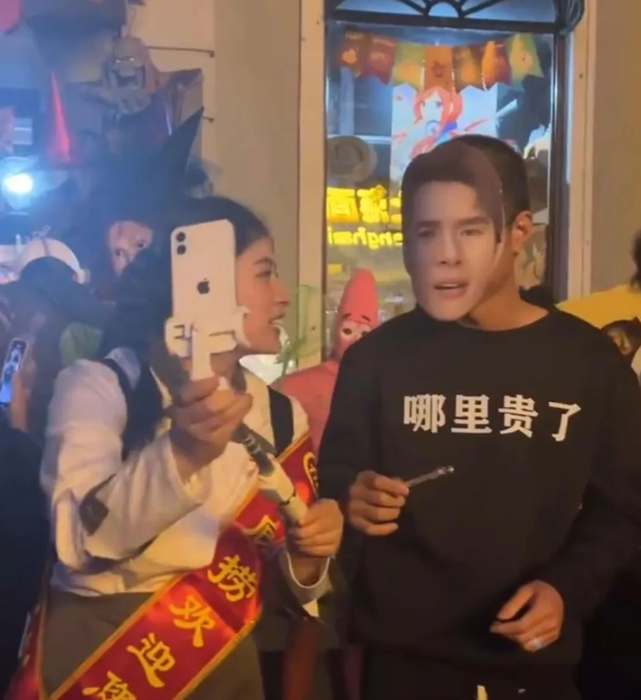
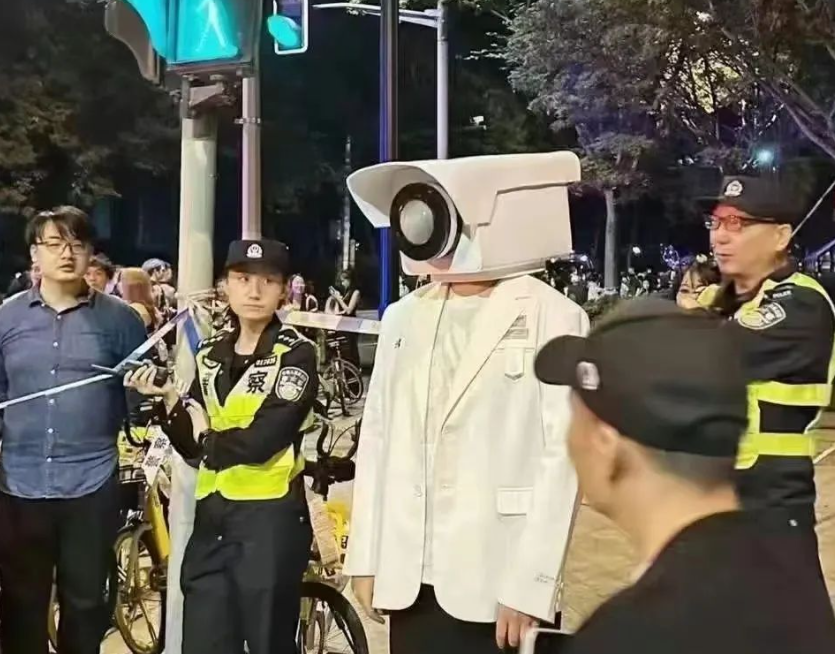
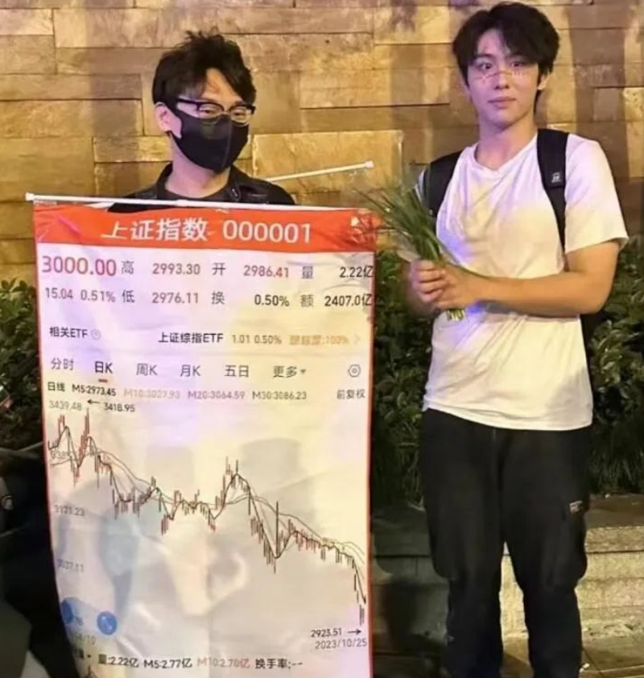
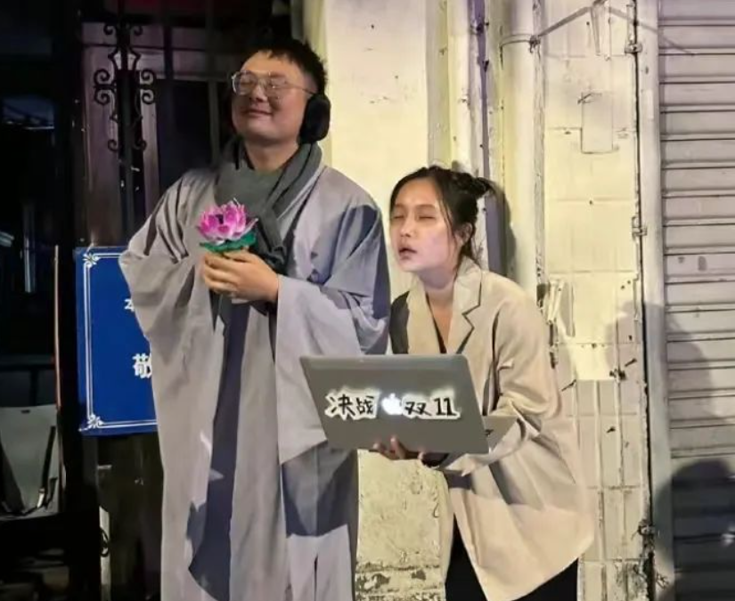
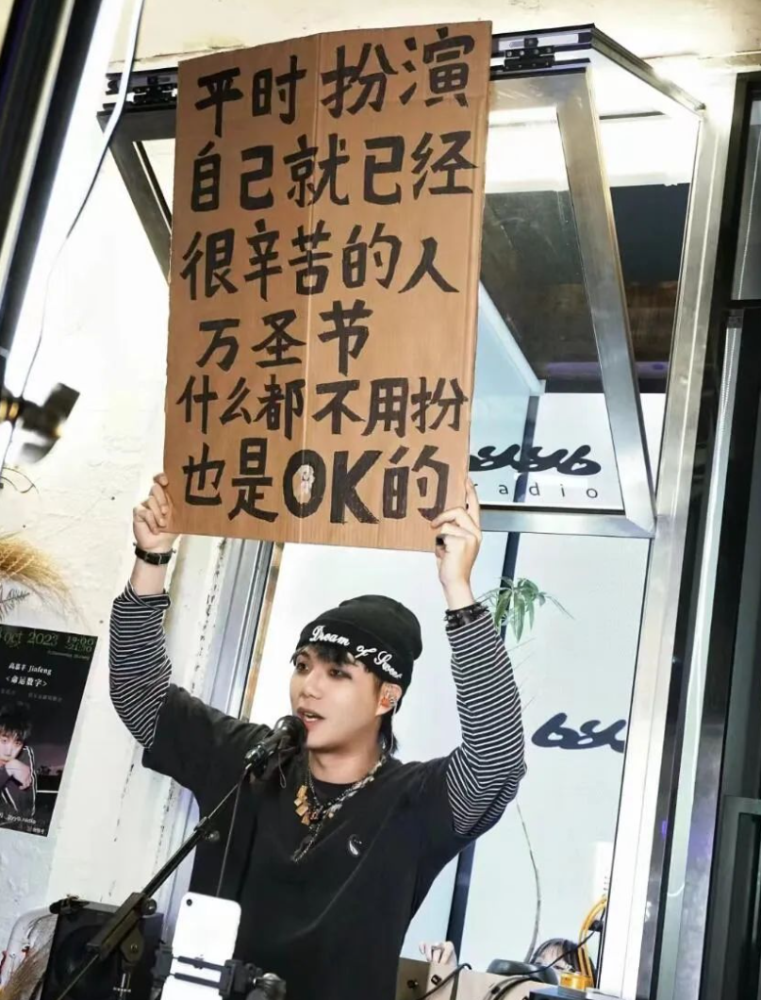

# 上海万圣之夜，年轻人治愈了所有人

在这一刻，他们不是在新闻标题抽象定义的“80后”“90后”“00后”，他们就是一个人，也是一群人，他们在展现自我的同时也发现了真实的自己。

**撰文丨青柳**

这几天，上海及国内好几个城市的夜晚人山人海亦幻亦真，在10月31晚达到高潮。无人机拍的视频简直不能更壮观，路上的行人密密麻麻，这种盛大的场面已经很多年没见到了。

随后现场的视频开始流出，创意之丰富、网络梗之密集，直接让这个万圣节被称为了“万梗节”。 **不少人都笑到流眼泪，那种欢快的氛围都要溢出屏幕。**

可以预想的是，今年的万圣之夜（又或许可以称为“万梗之夜”），将会以一种非常意外的方式定格在文化史上。相信在多少年之后，这几个夜晚依然会被反复提及，并被赋予种种意象和解读。

01

在每年的万圣节到来之际，几乎总免不了一种势如洪钟又声嘶力竭地指责：“这是洋节，这是文化入侵！”

确实， **今年的上海万圣节确实像文化入侵，不过是反向的。**

在这里能看到安陵容坐着花车出场，旁边配着一个泡发的宝娟；三步五步，就能遇到一个如来佛祖和观音菩萨；有“那英”和“王菲”在那合唱《相约98》；有“关晓彤”那首著名鬼畜《你叉叉》；还有面容憔悴的“乙方”，一脸不悦的“陶华碧”，甚至还有“李佳琦”，身上那件映着“哪里贵了”的T恤，实在是让人绷不住了……

_图/网络_

文字都是苍白的，实在无法描述现场的精彩。那种对神态的捕捉，与人物灵魂深处的共鸣，真的是太过动人，一个短短几秒的视频，就可以吸引人来回看上十几遍。

再说，国外万圣节只热闹一夜，上海万圣节从10月29日起，足足热闹了三夜。

我想对洋节指控最热情的人，这时候都找不到词了，“这这这……像什么样子！”确实，“文化入侵”这种说辞，在这种盛大、热烈与释放面前太苍白了，它找不到合适的论据，这满街满巷的热搜梗，是什么呢？

不夸张地说，原本的万圣节在这一刻已经消失了，想想那个万圣节必不可少的意象——南瓜，在现场哪儿还看得到？取而代之的，是这一刻上海人尤其是年轻人的重新创造，
**他们创造了属于自己的节日，一场目前甚至难以定义的狂欢。**

_图/网络_

其实这也很正常，在这种狂欢面前，任何沉重且扫兴的说辞都会显得木讷且迟钝，人们只是单纯的释放，又和那些宏大词汇有什么干系呢？

我也想到了明清之际张岱写的一篇《西湖七月半》，他说在“西湖七月半，一无可看，止可看看七月半之人”，看什么呢？“楼船箫鼓，峨冠盛筵，灯火优傒，声光相乱”，“名妓闲僧，浅斟低唱，弱管轻丝，竹肉相发”，那一幅热闹景象，和最近几晚的上海是不是有几分相似？

但“七月半”是什么呢，是道教的中元节，是佛教的盂兰盆节，是祭祖、放河灯、祀亡魂、的传统节日。但“七月半”那天出现在西湖畔的人，谁还记得，或者说谁还在乎这些呢？

这就是狂欢，它本身就是意义，不再需要牵扯其他。

02

上海的“万梗之夜”，毫不夸张地说，甚至更像一场“文艺复兴”。

肯定会有人说，这有点夸张。但文艺复兴的本质是什么呢？是发现，是串联，是将君士坦丁堡那些深埋的希腊罗马文献，重新置入视野，进入一种新的体系再评估。

这场发生在上海的盛大PARTY，也有这种特征。在这，你能看到“A股”，也能看到“鲁迅”；能看到影视作品，也能看到新闻事件。
**所有这些原本彼此绝缘的意象，彼此跨度可以超过上百年，在这一刻进入同一片时空，组成了拼盘，构成了对当代中国人精神世界的整体扫描。**

_图/网络_

相信在未来，当还有人想理解今天年轻人的想法，10月31日前后的这几个上海之夜可以是一个非常优质的样本。所有的要素都全了，所有的要去也都同框了。

这种同框是有意义的，它是一次年轻人对自我的定义。年轻人不是只关注娱乐，他们有态度，也有思考。在这一刻，他们不是在新闻标题抽象定义的“80后”“90后”“00后”，他们就是一个人，也是一群人，他们在展现自我的同时也发现了真实的自己。

**这不就是文艺复兴么？这一切，都是为了发现“人”。**

这些，不知道参与的人有没有意识到，他们其实在模仿任何他们记忆中的事物，在这场模仿中，他们用自己的大脑去重现这些事物，他们夺回了对客观世界的主动，他们感受到了自己。

这大概也是他们快乐的原因，做自己，永远是最快乐的。

03

在不少留言里，能看到很多类似的评论，“想流泪”，“想哭是怎么回事”。这大概就是喜极而泣，所有的狂欢，都有深沉的一面。

这些年轻人，他们平时真的是“太难了”。他们的扮装就是线索，你分明能看到“乙方”“程序员”“学建筑”，这大概就是他们日常的身份。他们是社畜、是打工人、是996，他们在公共舆论里的叙事，总带着某种悲情与苦闷。

_图/网络_

但这一刻，他们终于释放了，他们用自己非同一般的创意，震惊了所有人。原来他们的头脑里不是一片灰色与枯寂，
**一个特殊的夜晚，就如春雨过境，所有的灵动、自如、舒展，在这一刻重新迸发。**

这大概是有些人看了之后想流泪的原因。他们看到了一种活力的回归。包裹在正装之下，在行色匆匆之际，其实还是有一腔难以浇灭的热烈，他们在等待某个时机。

_图/网络_

显然，年轻人的这种快乐不会只属于自己。屏幕前每一位，哪怕早已腰酸背痛，早早地喝上了枸杞、洗脚上床睡觉，他们依然会被感动。
**这是属于生命的力量，也是内心的温暖，让很多人感受到了一种振奋与美好。**

这样的夜晚不知道会不会再来，人们当然有一种美好的期待。但无论未来如何，2023年万圣节这几个晚上的景观终究有了被铭记的价值，它会成为记忆里一场难以落幕的典礼，标记出当代年轻人精神世界的某个刻度。

